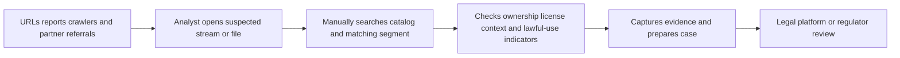
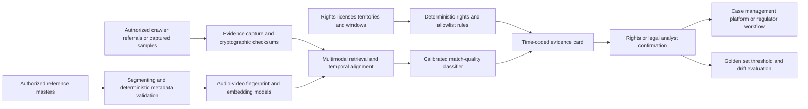

# MEDIA-001 AI-assisted audiovisual rights monitoring and evidence triage

## Classification

- **Segment:** Media, entertainment, sports, and creative industries
- **Primary market / jurisdiction:** Brazil
- **Evidence reference date:** 2026-07-19; Brazilian regulatory sources updated through 2026-07-03.
- **Index summary:** Brazilian audiovisual rights holders can detect likely unauthorized copies and retransmissions, assemble time-coded evidence, and prioritize expert review using robust media fingerprints and multimodal similarity models without automating legal conclusions or blocking.
- **Company profile / size:** Broadcasters, streaming services, sports-rights owners, studios, distributors, collecting or anti-piracy organizations, and medium or large audiovisual catalogs.
- **Opportunity type:** security
- **Status:** hypothesis
- **Confidence:** medium
- **Complexity:** large
- **Horizon:** medium
- **Risk:** regulated
- **Solution evidence level:** production
- **Operational maturity:** early
- **Azure fit:** high
- **AI dependency:** core
- **Primary AI role:** multimodal
- **Intelligent capability:** Transformation-robust video and audio fingerprint matching, multimodal similarity ranking, and evidence-quality classification
- **Repository alignment:** new-solution

## Problem

Audiovisual rights teams receive URLs, platform notices, viewer reports, crawler findings, and partner referrals concerning possible unauthorized films, series, channels, sports events, and clips. Analysts must determine whether the material is protected, identify the matching work and segment, distinguish infringement from trailers, licensed excerpts, criticism, quotation, or unrelated similarity, preserve evidence, identify the intermediary, and decide whether a representation or other action is justified.

Simple hashes fail after cropping, re-encoding, overlays, speed changes, mirrored frames, inserted borders, dubbed audio, or short excerpts. Manual review does not scale across live and archived content, while an incorrect match can create wrongful notices, reputational harm, or suppression of lawful use.

## Brazil applicability and current context

ANCINE's Instrução Normativa nº 174, effective since April 2026, establishes electronic presentation and processing of representations involving unauthorized audiovisual content and permits agency action of its own initiative. It also requires proportionality, motivation, adversarial process, and transparency reporting.

ANCINE reported that 2025 pilot actions identified and blocked 30 illegal services covering about 7,700 targets. The agency's updated operating framework confirms a current Brazilian need for scalable identification, evidence preparation, prioritization, and auditable case handling.

The proposed solution does not determine infringement under Brazilian law and does not automatically request removal or blocking. It produces candidate matches and technical evidence for rights, legal, compliance, platform, or regulator review.

## Evidence

### Confirmed problem evidence

- ANCINE's 2026 regulation formalizes the receipt and processing of representations concerning unauthorized protected audiovisual content in digital environments.
- ANCINE reported 2025 anti-piracy pilots covering sites, applications, lists, TV-box content, approximately 7,700 targets, and 30 illegal services.
- A March 2026 Federal Police operation described a coordinated illegal IPTV network involving more than 250 people or legal entities and financial movement above R$4.2 million.

### Favorable solution evidence

- Production media platforms use automated speech, OCR, scene, object, face, and moment indexing to make large video archives searchable and to surface exact time-coded segments.
- Perceptual and learned fingerprints can match transformed media where cryptographic hashes fail, supporting candidate detection after compression, cropping, overlays, or excerpts.
- Current media-archive deployments use multimodal indexing and automated moment detection to accelerate discovery and review of live and archived video.

### Counter-evidence and limitations

- Perceptual-hash thresholds trade missed transformed copies against collisions and false matches; public evaluations show materially different behavior across algorithms and transformations.
- Commentary, criticism, licensed syndication, trailers, public-domain material, and platform-authorized excerpts cannot be classified legally from similarity alone.
- Watermarks and fingerprints can be removed, obscured, adversarially modified, or absent from newly acquired catalogs.
- Face recognition is unnecessary for core rights matching and creates additional privacy and governance risk; the prototype excludes it.
- Automated blocking amplifies false matches. The prototype therefore stops at evidence-ranked human review.

### Inference

- A rights holder can test incremental value without a national-scale crawler by replaying a bounded set of owned works, known infringements, licensed uses, and difficult negatives.
- The strongest initial value is reducing time to locate and document the exact matching segment, not autonomous enforcement.

### Unknowns

- Availability and quality of reference masters, rights windows, territorial licenses, cue sheets, watermarks, and historical case outcomes.
- Recall under live restreaming, camera capture, logos, mirrored frames, speed changes, dubbing, and very short clips.
- Reviewer capacity, acceptable false-positive burden, evidence-retention policy, platform integration, and cost per monitored hour.
- Legal sufficiency of generated evidence for each enforcement channel or regulator workflow.

### Sources

- [ANCINE publishes IN 174 and expands online audiovisual anti-piracy](https://www.gov.br/ancine/pt-br/assuntos/noticias/ancine-publica-instrucao-normativa-e-amplia-combate-a-pirataria-audiovisual-na-internet/) — Brazil; published 2026-04-10; modified 2026-07-03; regulatory and operating problem context.
- [Instrução Normativa ANCINE nº 174](https://www.gov.br/ancine/pt-br/acesso-a-informacao/legislacao/instrucoes-normativas/instrucao-normativa-174) — Brazil; effective 2026-04-10; current procedures, electronic submissions, proportionality, motivation, and transparency.
- [ANCINE 2025 balance](https://www.gov.br/ancine/pt-br/assuntos/noticias/balanco-2025-regulacao-com-dados-inovacao-e-transparencia) — Brazil; published 2026; anti-piracy pilot scale and reported outcomes.
- [Federal Police Operation Bucaneiros](https://www.gov.br/pf/pt-br/assuntos/noticias/2026/03/pf-combate-esquema-de-tv-pirata-que-movimentou-mais-de-r-4-2-milhoes/) — Brazil; published 2026-03-10; current illegal-IPTV operating evidence.
- [Azure AI Video Indexer insights](https://learn.microsoft.com/en-us/azure/azure-video-indexer/insights-overview) — current Microsoft technical capability for time-coded multimodal media indexing.
- [Azure AI video processing guide](https://learn.microsoft.com/en-gb/azure/architecture/data-guide/ai-services/image-video-processing) — current architecture and archive-search patterns.
- [Hamming distributions of perceptual hashing techniques](https://arxiv.org/abs/2212.08035) — technical limitation evidence on perceptual-hash behavior and transformations.
- [DinoHash provenance detection](https://arxiv.org/abs/2503.11195) — recent learned perceptual-hashing research supporting transformation robustness while retaining measurable false-positive trade-offs.

## Current process

## Baseline without AI

- **Current baseline:** Manual review, cryptographic hashes, exact watermark lookups, keyword searches, URL lists, platform reports, and analyst judgment.
- **Strongest realistic non-AI alternative:** Maintain authoritative rights metadata, exact-file hashes, watermarks, known-domain lists, deterministic capture tooling, case templates, and workflow queues.
- **Baseline strengths:** Precise for exact copies and known services; simple to audit; low model risk.
- **Baseline limitations:** Weak against transformed, partial, dubbed, overlaid, mirrored, or live-restreamed content; expensive manual segment search.
- **Context where intelligence may add incremental value:** Large catalogs, high referral volume, transformed copies, short excerpts, live or near-live monitoring, and cases where analysts spend substantial time locating the matching source segment.
- **Condition where the non-AI baseline should be preferred:** Small catalogs, low case volume, exact-file distribution, reliable watermark coverage, or when model review cost exceeds saved analyst effort.

## Proposed solution

Build a rights-monitoring and evidence-triage layer that indexes authorized reference masters and selected live feeds, accepts suspicious URLs or captured samples, and returns ranked candidate works and matching time ranges. It combines deterministic metadata and rights checks with transformation-robust visual and audio fingerprints and a multimodal similarity model.

For each candidate, the system creates an evidence card containing source and suspect timestamps, similarity signals, detected transformations, capture metadata, rights records, known-license status, and reasons for abstention. Analysts confirm or reject the match and decide whether to escalate. No legal conclusion, notice, takedown, or block is executed automatically.

## Where AI enters

### AI role map

| Process stage | AI component | AI type / model family | What it does | Runtime mode | Output | Human or deterministic control |
| --- | --- | --- | --- | --- | --- | --- |
| Reference preparation | Audio-video fingerprint encoder | Deep learning and perceptual hashing | Produces transformation-robust signatures for reference segments | Offline batch | Segment fingerprints and embeddings | Catalog ownership, rights windows, checksums, and ingestion approval are deterministic |
| Candidate matching | Approximate segment matcher | Embedding retrieval plus audio/video similarity | Retrieves likely works and aligned time ranges despite common transformations | Asynchronous or near-real-time | Ranked candidate segments with similarity | Thresholds, minimum duration, cross-modal agreement, allowlists, and abstention |
| Evidence triage | Match-quality classifier | Supervised classical ML or gradient boosting | Estimates whether a technical match is sufficiently coherent for analyst review | Asynchronous | Calibrated review priority and reason codes | Analyst confirms identity, rights, lawful-use context, and escalation |

### Required distinctions

- **Primary AI role:** multimodal recognition and ranking.
- **Model family:** learned video/audio embeddings, perceptual fingerprints, approximate-nearest-neighbor retrieval, and a calibrated classical classifier.
- **Training requirement:** pretrained encoders plus optional supervised calibration on owned positive and difficult-negative pairs; no generative training.
- **Training location and cadence:** offline initial calibration, then periodic retraining only after reviewer labels and drift analysis justify it.
- **Inference location:** cloud batch and optional near-real-time service for selected live feeds.
- **Agent role:** Agent: not used.
- **LLM role:** LLM: not used.
- **Non-LLM intelligence:** audio and video fingerprinting, multimodal embedding retrieval, alignment, and calibrated match-quality classification.
- **Not AI:** crawling authorization, media capture, cryptographic hashing, rights records, territorial and license rules, evidence retention, case workflow, approvals, notices, and legal decisions.

## Intelligent capability details

- **Technique / model family:** Audio fingerprinting, video perceptual hashing, multimodal embeddings, temporal alignment, approximate retrieval, and calibrated classification.
- **Why it is necessary:** Exact hashes and metadata cannot reliably locate transformed or partial copies across large catalogs.
- **Inputs:** Authorized reference media, suspect media samples, audio tracks, frames, timestamps, transformation metadata, rights records, licenses, and reviewer outcomes.
- **Outputs:** Candidate work, aligned source and suspect intervals, similarity by modality, confidence, detected transformation indicators, abstention, and review priority.
- **Training / grounding / optimization assumptions:** Begin with pretrained encoders and deterministic fingerprints; calibrate thresholds and classifier on a rights-holder-specific golden set.
- **Evaluation:** Recall at fixed false-positive rates, segment alignment error, mean reciprocal rank, calibration, analyst acceptance, time to confirmed match, and incremental value over exact hashes and manual search.
- **Fallback and controls:** Exact-hash and watermark workflow, confidence thresholds, cross-modal agreement, minimum matched duration, abstention, analyst review, and no automatic enforcement.

## Data and integration assumptions

- **Data owners and access path:** Rights management, media asset management, broadcast operations, distribution, legal, anti-piracy, and platform partnerships.
- **Expected volume, history, frequency, and coverage:** Hundreds to tens of thousands of works; fingerprints generated once per master and queries from samples or selected live feeds.
- **Labels, outcomes, feedback, or simulation available:** Confirmed owned matches, licensed uses, rejected referrals, trailers, criticism, public-domain or unrelated hard negatives, and synthetic transformations.
- **Known quality, imbalance, missingness, and leakage risks:** Duplicate masters, alternate cuts, dubbed versions, poor audio, missing rights windows, positive-heavy historical cases, and transformations copied between train and test.
- **Brazilian or local-context representativeness:** Include Portuguese speech, Brazilian programming, sports overlays, local distribution versions, broadcaster logos, and real platform transformations.
- **Privacy, retention, consent, surveillance, or sharing constraints:** Monitor only authorized sources; minimize user identifiers; define lawful capture, retention, and evidence access; exclude face recognition.
- **Integration and synchronization assumptions:** Media asset management, rights database, crawler or referral intake, evidence store, and case-management workflow.
- **Drift and change sources:** New codecs, platform layouts, overlays, adversarial transformations, watermark changes, and catalog growth.
- **Minimum viable data for a prototype:** 50-100 owned works, 500-1,000 positive transformed samples, an equivalent or larger difficult-negative set, rights metadata, and reviewer labels.

## Prototype validation plan

- **Prototype scope / process slice:** One catalog or sports competition and one referral channel; historical replay before limited shadow monitoring.
- **Users, sites, assets, documents, events, or simulated cases:** Two to five rights analysts, 50-100 works, known infringements, licensed excerpts, trailers, commentary, and synthetic transformation variants.
- **Baseline or comparison:** Exact hashes, watermarks where available, keyword search, and normal manual catalog search.
- **Required data and integrations:** Reference masters, rights metadata, sample capture, fingerprint index, evidence store, and review queue.
- **Model-quality metrics:** Recall at bounded false-positive rate, top-1/top-5 retrieval, temporal alignment error, calibration, abstention, and performance by transformation type.
- **Business or workflow metrics:** Analyst minutes per confirmed case, cases processed per reviewer hour, duplicate-review rate, and cost per evaluated media hour.
- **Human acceptance, correction, or override metrics:** Confirmed-match rate, rejected-match reasons, escalation rate, and reviewer trust by evidence type.
- **Safety and compliance boundaries:** No autonomous crawling outside authorized scope, legal classification, notice, removal, blocking, or face recognition.
- **Failure or redesign criteria:** Stop or narrow when false matches create unacceptable review burden, recall under target transformations is not better than baseline, rights metadata is unreliable, or cost exceeds manual review savings.
- **Evidence required before a pilot or broader implementation:** Stable performance on unseen works and transformations, auditable captures, approved retention policy, legal review, and repeatable analyst-effort reduction.

## Macro architecture

## Capabilities and possible technologies

- Application and workflow capabilities: Referral intake, time-coded evidence cards, review queues, case export, and audit history.
- Data capabilities: Media object storage, segment metadata, vector and fingerprint indexes, rights metadata, and immutable evidence records.
- Integration capabilities: Media asset management, rights systems, authorized crawlers, live capture, and case-management APIs.
- Required AI / ML capabilities: Audio-video fingerprinting, multimodal embedding retrieval, temporal alignment, and calibrated classification.
- Training, grounding, recognition, or optimization capabilities: Pretrained inference, synthetic transformation generation, golden-set calibration, and periodic supervised retraining.
- Agent and tool-use capabilities, or `not used`: not used.
- LLM / foundation-model capabilities, or `not used`: not used.
- Evaluation and model-operations capabilities: Transformation-stratified evaluation, calibration, threshold management, drift monitoring, and reviewer feedback.
- Security and governance capabilities: Authorized-source controls, encryption, least privilege, evidence immutability, retention, and full audit logs.
- Azure services that may fit: Azure Blob Storage, Azure AI Video Indexer, Azure Machine Learning, Azure AI Search vector search, Azure Functions or Container Apps, Azure Event Hubs for selected live feeds, Azure Monitor, Key Vault, and Microsoft Purview.
- Non-Azure or open-source alternatives worth considering: FFmpeg, Chromaprint, PDQ/TMK-style fingerprints, OpenCV, PyTorch, FAISS, OpenSearch, PostgreSQL with pgvector, Kafka, and MLflow.

## Possible gains

- Faster identification of the matching work and exact source interval.
- Greater coverage of transformed, partial, dubbed, overlaid, or restreamed copies.
- More consistent and auditable technical evidence for expert review.
- Reduced duplicate analysis and better prioritization of high-confidence cases.
- Reusable media-intelligence components for archive search and rights operations.

## Metrics for validation

### Business and operational metrics

- Median analyst time from referral to confirmed or rejected match.
- Cases evaluated per reviewer hour and backlog age.
- Duplicate case rate and evidence-completeness rate.
- Cost per monitored or evaluated media hour.

### Intelligent-capability metrics

- Recall at fixed false-positive rates and by transformation type.
- Top-k retrieval, temporal alignment error, calibration error, and abstention rate.
- Analyst acceptance, correction, and rejection reasons.
- Incremental performance and effort reduction versus exact hashes and manual search.

## Risks, limits, and controls

- Privacy and sensitive data: Restrict capture to authorized sources, minimize identifiers, exclude face recognition, and control evidence retention.
- Brazilian regulatory or policy constraints: Preserve proportionality, motivation, adversarial process, rights-holder authority, and legal review under current Brazilian procedures.
- Human decision boundaries: Analysts and counsel retain match confirmation, legal interpretation, notice, representation, removal, and blocking decisions.
- Model or policy failure modes: False matches, missed transformations, short-clip ambiguity, alternate cuts, soundtrack reuse, and adversarial evasion.
- Agent or tool-execution failure modes, when applicable: not applicable; no agent.
- LLM hallucination, grounding, or prompt-injection risks, when applicable: not applicable; no LLM.
- Comparable failures and applicable lessons: Fingerprint algorithms vary significantly by transformation and threshold; evaluate on unseen local hard negatives and require cross-modal evidence.
- Bias, drift, weak labels, or insufficient feedback: Historical enforcement cases overrepresent obvious positives; maintain lawful-use and unrelated difficult negatives.
- Integration and data risks: Incomplete rights records or alternate masters can dominate model error.
- Adoption and change-management risks: Evidence must reduce analyst effort rather than create a second opaque review queue.
- Prototype cost or operational assumptions: Media decoding, storage, live capture, and indexing frequency are principal cost drivers.

## Fit score

| Dimension | Score | Rationale |
| --- | ---: | --- |
| Problem evidence and relevance | 19/20 | Current ANCINE regulation, pilot activity, and law-enforcement cases establish a specific Brazilian operational problem. |
| Business or operational value | 18/20 | Match discovery, evidence preparation, backlog, and analyst effort are measurable and directly connected to rights operations. |
| Technical feasibility | 17/20 | Mature fingerprinting and media-indexing components support a bounded replay prototype; transformed live streams, lawful-use context, and rights-data quality remain major unknowns. |
| Reuse potential | 18/20 | Pattern applies across film, television, streaming, sports, music-video, archive, broadcaster, and platform operations. |
| Strategic differentiation | 18/20 | Transformation-robust multimodal matching materially extends exact hashes and manual catalog search while preserving human enforcement decisions. |
| **Total** | **90/100** | Strong prototype candidate with regulated decision boundaries and substantial local-validation requirements. |

## Repository relationship

- Existing references that may be reused: Video indexing, event-driven ingestion, vector search, model evaluation, observability, identity, storage, and governance blocks where present.
- Missing capabilities exposed by this opportunity: Robust media fingerprints, temporal segment matching, rights-aware evidence cards, transformation test corpus, and immutable media-evidence workflow.
- Potential building blocks: Media fingerprint service, segment alignment evaluator, rights metadata contract, evidence-capture service, and calibrated review queue.
- Potential composed solution: Audiovisual rights-monitoring and evidence-triage reference solution.
- Reasons to keep it outside the current kit, when applicable: Crawling agreements, legal workflows, platform-specific notice mechanisms, and rights taxonomies are solution-level concerns.

## Duplicate control

- **Problem keys:** audiovisual-piracy, unauthorized-restreaming, rights-evidence, transformed-copy-detection, analyst-triage
- **Capability keys:** audio-fingerprinting, video-perceptual-hashing, multimodal-retrieval, temporal-alignment, match-quality-classification
- **Research queries used:** Brazil audiovisual piracy ANCINE 2025 2026; illegal IPTV Brazil 2026; audiovisual rights detection fingerprinting false positives; video archive indexing production; perceptual hash transformed video limitations.
- **Related opportunities:** RETAIL-001 also uses multimodal recognition but addresses physical shelf and inventory operations; PUBLIC-001 and PROF-001 address evidence-grounded document review in unrelated processes.
- **Uniqueness statement:** This opportunity identifies transformed copies of owned audiovisual works and assembles technical rights evidence; it does not duplicate generic archive search, content moderation, retail vision, or document assurance.

## Next decision

- shortlist for review.

The recommendation approves only a bounded prototype hypothesis, not implementation or automated enforcement.