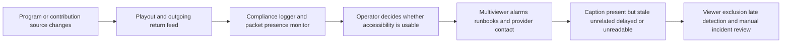
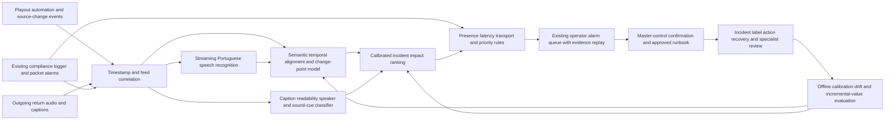

# MEDIA-002 AI-assisted live-caption semantic continuity assurance

## Classification

- **Segment:** media-entertainment
- **Primary market / jurisdiction:** Brazil
- **Evidence reference date:** 2026-07-20
- **Index summary:** Brazilian regional broadcasters can compare outgoing captions with program audio, video cues, rundowns, and source changes to detect semantically unusable live accessibility before operators receive viewer complaints.
- **Organization archetype / size:** regional public or commercial television network operating 1–8 linear and streaming channels with a small master-control and accessibility team
- **Primary actor:** master-control or broadcast-operations operator responsible for on-air continuity, with escalation to captioning and accessibility specialists
- **Simulated process:** supervise live and scheduled programming so closed captions remain present, synchronized, intelligible, and aligned with the actual transmitted program
- **Opportunity type:** integration
- **Status:** hypothesis
- **Confidence:** medium
- **Complexity:** medium
- **Horizon:** medium
- **Risk:** regulated
- **Solution evidence level:** conceptual
- **Operational maturity:** unvalidated
- **Existing-solution disposition:** integrate
- **Azure fit:** medium
- **AI dependency:** core
- **Primary AI role:** anomaly-detection
- **Intelligent capability:** real-time Portuguese speech-to-caption semantic alignment, timing and readability anomaly detection, non-speech accessibility-cue classification, and incident-priority ranking
- **Repository alignment:** extend-kit

## Operational simulation

### Operating archetype

- **Organization type and approximate size:** a regional broadcaster carrying local news, network feeds, live interviews, public-service programming, sports, and prerecorded content; tens to hundreds of employees and a small overnight control team.
- **Primary actor and authority:** the master-control operator may switch sources, activate a fallback caption source, contact the caption provider, delay a secondary feed, or escalate. The operator does not rewrite editorial content or certify regulatory compliance alone.
- **Process trigger:** a scheduled program starts, a remote contribution feed is taken live, breaking news interrupts the rundown, or the playout system switches between local and network sources.
- **Actor objective and completion condition:** keep audio, video, captions, and declared accessibility tracks continuously usable through the program and record evidence of incidents and corrections.
- **Inputs, systems, documents, devices, or physical context:** outgoing return feed, contribution feeds, caption packets, audio channels, playout automation, rundown, source identifiers, encoder alarms, multiviewer, compliance logger, provider status, operator notes, and viewer complaints.
- **Rules, deadlines, safety, cost, and compliance constraints:** intervention must occur within seconds or minutes; false alerts cannot overload a small control room; caption text may contain sensitive live speech; automated actions must not interrupt programming without an approved rule.
- **Upstream and downstream handoffs:** production control and external caption provider upstream; transmission, streaming, accessibility team, engineering, compliance, and audience support downstream.

### Assumptions

- **Known operating facts already available:** Brazilian television accessibility includes Portuguese closed captions and audiodescription; live government television uses Libras; current commercial monitoring products detect missing captions and transport-stream faults; current captioning products generate low-latency captions.
- **Simulation assumptions requiring validation:** regional broadcasters often monitor caption presence but do not continuously score whether the transmitted caption still matches the actual program after source changes; incident labels and operator corrections are available in usable volume.
- **Synthetic events or cases introduced:** a breaking-news source switch leaves captions attached to the previous feed; an interview contains regional names and overlapping speech; a peak evening shift has one operator supervising multiple outputs; network delay causes captions to arrive several seconds late while packets remain technically present.

### Workflow simulation

| Stage | Trigger / available information | Actor and system action | Decision or uncertainty | Current handling | Friction, risk, or missed outcome | Feedback signal |
| --- | --- | --- | --- | --- | --- | --- |
| Pre-air setup | Schedule, rundown, caption-source assignment, provider status | Operator verifies declared caption source and alarms | Whether the configured source matches the actual program path | Checklist and presence test | A correct configuration can become wrong after a later switch | Pre-air correction and successful source lock |
| Program start | Outgoing audio/video and caption packets | Logger checks packet presence; operator watches multiviewer | Whether present captions are timely and semantically related | Visual spot check | Captions may be technically present but stale, delayed, duplicated, or from another feed | Operator incident marker and corrected source |
| Live source change | New contribution feed, changed audio mix, altered rundown | Director or automation switches program source | Whether captioning also changed and recovered correctly | Provider call, manual source switch, waiting | Short mismatch may persist unnoticed because no packet-loss alarm fires | Time to detect, fallback activation, restored alignment |
| Exception handling | Overlapping speakers, names, low-quality audio, non-speech events | Captioner or ASR emits uncertain text | Whether errors are tolerable or accessibility is materially degraded | Human observation and later complaint review | Word-error alone misses timing, readability, speaker, and relevant-sound failures | Specialist review labels and viewer feedback |
| Incident recovery | Alarm, complaint, or operator observation | Operator confirms return feed, contacts provider, switches fallback, records event | Which action is safest and highest priority across channels | Runbook plus judgment | Multiple simultaneous alarms create prioritization delay | Accepted action, recovery time, false-alert disposition |
| Post-air review | Recording, captions, logs, complaints | Accessibility or engineering staff samples incidents | Root cause and whether provider/process change is needed | Manual replay | Small teams review only reported or obvious failures | Confirmed incident category, corrective action, recurrence |

### Scenario variants

#### Normal flow

A prerecorded program starts with a known caption file. Packet-presence and encoder alarms remain green. The operator spot-checks the return feed. Semantic alignment is stable, so the proposed model remains silent and records healthy baseline windows.

#### Exception flow

Breaking news replaces the scheduled program. Audio and video switch immediately, but the caption stream continues carrying text from the previous program for 40 seconds. Existing monitoring sees valid caption packets. A speech-to-caption alignment model detects strong semantic divergence, confirms that the audio source identifier changed, and raises a high-confidence incident with evidence. The operator chooses the approved fallback or contacts the live caption provider.

#### Peak or degraded flow

One operator supervises six outputs during an election-night volume spike. Two feeds have brief packet alarms, one has low audio, and another has captions delayed by seven seconds but still semantically correct. The system suppresses duplicate transport alarms, distinguishes delay from total mismatch, and ranks the stale-caption incident above lower-impact events. The operator remains responsible for switching or escalating.

### Opportunity points derived from the simulation

| Decision, exception, or uncertainty | Strongest deterministic response | Remaining gap | Candidate intelligent role | Expected incremental outcome | Main risk |
| --- | --- | --- | --- | --- | --- |
| Caption packets are present after a source switch | Validate source IDs, packet presence, and explicit switch events | Valid packets may contain stale or unrelated text | Online semantic alignment and change-point anomaly detection | Reduce time to detect materially wrong captions | False alarms during music, silence, or intentional delay |
| Captions are delayed or hard to follow | Fixed latency thresholds and line-length rules | Acceptable latency varies; text accuracy alone misses segmentation and reading burden | Timing/readability quality classification | Prioritize viewer-impacting quality failures | Metric may not match deaf viewer experience |
| Multiple accessibility alarms compete | Severity rules by channel and alarm type | Rules cannot estimate semantic impact or recurrence context | Calibrated incident ranking | Faster attention to the most harmful incident | Automation bias and neglected low-score incidents |
| Missing sound cues or speaker attribution | Require provider configuration and periodic audit | Live output may omit relevant non-speech events or confuse speakers | Non-speech event and speaker-change consistency checks | Better specialist review targeting | Incorrect inference of editorially relevant sounds |
| Routine missing-caption alarm | Packet-presence and transport-stream monitor | No material intelligent gap when absence alone is the problem | None; adopt existing monitoring | Avoid duplicate product | Unnecessary custom build |

The selected candidate excludes caption generation, transport-stream analysis, and generic compliance logging. Those capabilities should be adopted from existing platforms.

## Selected problem and opportunity hypothesis

The bounded problem is the master-control decision that follows a live source or program change: captions can remain technically present while becoming stale, semantically unrelated, excessively delayed, or operationally unusable. Existing packet and metadata alarms are strong for absence and transport faults, but the simulation exposes a separate uncertainty: whether the accessibility service that viewers actually receive still corresponds to the transmitted content.

The hypothesis is an integration layer that observes the outgoing return feed, caption stream, rundown, and source-change events, detects high-confidence semantic continuity failures, and ranks incidents for operator confirmation. It is an opportunity only where a broadcaster already has baseline monitoring and still lacks semantic quality detection. It must not replace professional captioning, specialist quality review, or established compliance logging.

## Brazil applicability and current context

Brazilian official guidance defines accessible captions as synchronized text that includes relevant speech and sounds, and explicitly instructs teams to review errors in automatic captions. The Enap accessibility guidance was current when reviewed on 2026-07-20 and states that live content should use simultaneous captions and that captions must be synchronized and revised. The federal service page updated on 2026-07-03 confirms that live public television currently provides Libras for news, interviews, and official statements.

The current Brazilian relevance is also supported by 2025 research on television accessibility involving deaf participants and local journalists, and by 2025 Brazilian reception research showing that accessible subtitling requires choices about sound effects, speaker information, timing, segmentation, and readability rather than speech transcription alone. Current legislative activity in 2025–2026 further shows continuing public attention to descriptive captions and audiovisual accessibility.

The simulation assumption that semantic quality matters was confirmed. The assumption that regional broadcasters lack this capability remains unverified and must be tested with customer discovery. Foreign product evidence is used only to map current capabilities and prototype feasibility, not to define Brazilian legal obligations.

## Existing solutions and differentiation

### Existing solutions reviewed

| Solution / platform | Owner or vendor | Current capabilities | Evidence date | Coverage overlap |
| --- | --- | --- | --- | --- |
| Actus Alert Center and TS Analysis | Actus Digital | Real-time detection of audio/video faults, missing closed captions or subtitles, transport-stream violations, dashboards, and notifications | current page reviewed 2026-07-20 | Strong overlap for presence, transport, alerting, and compliance logging; public page does not establish semantic alignment of caption text to outgoing content |
| Sentry | Telestream | High-density monitoring of content, captions, ads, delivery, standards compliance, alerts, historical metrics, and caption QoE scoring | current page reviewed 2026-07-20 | Strong overlap for end-to-end monitoring and caption quality scoring; exact semantic mismatch coverage and Brazilian Portuguese evaluation require vendor validation |
| enCaption and DoCaption | ENCO | Low-latency automated caption generation, regional vocabulary, speaker identification, encoding, insertion, and monitoring | current page reviewed 2026-07-20; 2026 product update listed | Solves caption creation and encoding; not evidence of an independent outgoing-feed semantic assurance layer |
| Existing broadcaster compliance logger and multiviewer | broadcaster stack | Recording, packet presence, visual inspection, alerts, and post-air evidence | simulated baseline | Remains the system of record and primary operational interface |
| Human captioner and accessibility specialist | service/process | Contextual caption creation and expert review | current operating alternative | Best authority for language and accessibility quality, but cannot continuously inspect every outgoing feed alone |

### Gap and disposition

- **What is already solved:** caption generation, caption encoding, packet-presence checks, transport-stream analysis, compliance recording, multiviewers, and generic alerts.
- **Overlap with the simulated candidate:** existing products ingest broadcast feeds, detect caption faults, calculate quality indicators, and route alarms.
- **Material uncovered gap:** independently verified, Portuguese-specific, outgoing-feed semantic continuity across source changes, with evidence that distinguishes stale/unrelated captions from delay, absence, and ordinary recognition errors.
- **Underserved actor, scenario, exception, integration, decision, or outcome:** small regional master-control teams supervising several outputs during live source changes and degraded operations.
- **Disposition:** integrate
- **Why changing vendor, cloud, model, UI, or architecture is insufficient:** differentiation depends on proving a semantic continuity signal that materially improves operator detection beyond existing caption QoE and presence alarms.
- **Differentiation statement:** this is not another caption generator or broadcast monitor; it is a bounded semantic-assurance integration that compares what viewers hear and see with the actual outgoing accessibility stream and only survives validation if it adds measurable incident detection beyond current products.

## Evidence map

### Simulated observations

- Simulated: valid caption packets can continue after audio/video source changes.
- Simulated: a small operator team may prioritize several simultaneous alarms under time pressure.
- Simulated: post-air corrections, provider incidents, and accepted alerts could become supervised labels.

### Confirmed problem evidence

- Brazilian public guidance requires synchronized captions, relevant sound information, and review of automatic-caption errors.
- Current Brazilian public television actively provides live Libras services, confirming live accessibility as an operating service rather than a theoretical requirement.
- Brazilian 2025 research treats television accessibility and accessible subtitling quality as an active communication problem involving more than literal transcription.

### Existing-solution evidence

- Actus detects missing captions and broadcast transport faults in real time.
- Telestream Sentry monitors captions at scale and advertises caption QoE scoring.
- ENCO produces, encodes, and monitors automated live captions with vocabulary and speaker features.

### Favorable evidence for the uncovered gap

- Subtitle-quality research shows that timing, segmentation, and presentation add value beyond transcript word accuracy.
- Live-caption user research reports weak correlation between common accuracy metrics and perceived caption quality, supporting multi-signal evaluation and human-centered prototype metrics.
- Online speech recognition, text alignment, voice activity, speaker-change detection, and event classification are individually testable on recorded return feeds before live deployment.

### Counter-evidence and limitations

- Current products may already implement semantic or perceptual caption scoring not exposed on public pages; vendor discovery could collapse the opportunity to configuration or adoption.
- A second ASR model can repeat the same acoustic errors as the caption generator and falsely certify bad captions.
- Viewer experience is not captured by word-error rate alone; specialist and deaf-user evaluation is required.
- High alert volume can worsen control-room performance; shadow mode, calibration, suppression, and strict alert budgets are required.

### Inference

- Combining source-change events, independent audio recognition, caption timing, semantic similarity, and known-program context should identify stale-caption incidents more reliably than packet-presence checks alone.

### Unknowns

- Actual frequency and duration of semantic continuity incidents in Brazilian regional broadcasters.
- Existing vendor semantic-QoE depth, APIs, licensing, and extension points.
- Availability and retention of outgoing captions, clean return audio, source identifiers, rundowns, incident logs, and reviewer labels.
- Acceptable false-alert rate and detection delay for operators.

### Sources

- [Multimídia Acessível – Legendas, Transcrições e Libras](https://www.enap.gov.br/educacao-e-capacitacao/rotas/capsulas/multim%C3%ADdia-acess%C3%ADvel-legendas-transcri%C3%A7%C3%B5es-e-libras/) — Brazil; current page reviewed 2026-07-20; problem and operating guidance.
- [Acessar conteúdos informativos e culturais em Libras pela TV aberta](https://www.gov.br/pt-br/servicos/acessar-conteudos-informativos-e-culturais-em-libras-pela-tv-aberta) — Brazil; updated 2026-07-03; current live-service context.
- [Acessibilidade em comunicação na televisão](https://informacoes.anatel.gov.br/legislacao/index.php/component/content/article?id=442) — Brazil; current regulatory reference reviewed 2026-07-20.
- [Acessibilidade linguística na televisão para pessoas surdas](https://periodicos.unicesumar.edu.br/index.php/saudpesq/article/view/13291) — Brazil; 2025; current qualitative problem context.
- [Onomatopeias e efeitos sonoros não literais na legendagem para surdos e ensurdecidos](https://www.scielo.br/j/tla/a/rNKf7BvRxFqczMsy7yY87FJ/) — Brazil; 2025; caption-quality complexity and reception evidence.
- [Actus real-time broadcast analysis and alerts](https://actusdigital.com/ts-recording-and-technical-alerts/) — international product; current capabilities reviewed 2026-07-20.
- [Telestream Sentry](https://www.telestream.com/sentry/) — international product; current capabilities reviewed 2026-07-20.
- [ENCO enCaption](https://www.enco.com/products/encaption) — international product; current capabilities and 2026 update reviewed 2026-07-20.
- [How Users Experience Closed Captions on Live Television](https://arxiv.org/abs/2404.10153) — international research; 2024; counter-evidence on quality metrics.
- [SubER: A Metric for Automatic Evaluation of Subtitle Quality](https://arxiv.org/abs/2205.05805) — international research; 2022; technical plausibility for timing and segmentation evaluation.

## Current process and remaining gap

## Baselines

- **Current manual or system baseline:** operator multiviewer checks, provider communication, compliance recording, packet alarms, and post-air complaint review.
- **Existing product or platform baseline:** Actus or Telestream-class monitoring plus ENCO or human caption production.
- **Strongest realistic non-AI alternative:** deterministic source-change correlation, caption-presence checks, latency thresholds, line-length rules, scheduled spot checks, and explicit caption-source handshakes.
- **Baseline strengths:** mature, explainable, low-latency, and suitable for known transport or configuration failures.
- **Baseline limitations:** cannot reliably determine whether valid caption text still corresponds to the actual outgoing program.
- **Exact simulated condition where intelligence may add incremental value:** live source change or degraded operation where captions remain present but semantic alignment is lost or materially delayed.
- **Condition where adoption, process redesign, or deterministic automation should be preferred:** if existing caption QoE products detect the same incidents with acceptable accuracy, or if source identifiers and deterministic switching controls prevent them entirely.

## Proposed solution or extension

Integrate with the existing compliance logger and operator workflow. A read-only service consumes outgoing audio, caption text and timing, source-change events, and optional rundown terms. It computes semantic alignment, timing and readability features, and incident confidence. Existing deterministic alarms remain authoritative for missing packets and transport faults. High-confidence semantic incidents appear in the current operations console with a short evidence window and recommended runbook category. Operators confirm, suppress, or escalate; no program switch occurs automatically during the prototype.

## Where AI enters

### AI role map

| Process stage | AI component | Primary role and model family | Inputs | What it does | Training / grounding | Runtime | Output | Deterministic or human control |
| --- | --- | --- | --- | --- | --- | --- | --- | --- |
| Outgoing-feed observation | Independent Portuguese speech recognizer | recognition; streaming ASR | return-feed audio | Produces time-aligned reference tokens and confidence | pretrained model; optional domain vocabulary updated per program | streaming, near real time | timestamped reference transcript | voice-activity gate; discard low-confidence windows |
| Caption continuity check | Semantic and temporal alignment detector | anomaly detection; embeddings plus sequence alignment and change-point model | reference tokens, outgoing captions, timing, source-change events | Detects stale, unrelated, duplicated, or materially delayed caption windows | supervised calibration from confirmed incidents and synthetic source-switch cases; quarterly review | online sliding windows | anomaly class, score, evidence interval | deterministic presence and latency features; abstention thresholds |
| Accessibility-quality triage | Readability and relevant-sound classifier | classification; text and audio-event models | caption lines, timing, speaker changes, non-speech audio events | Flags likely segmentation, speaker, and important-sound omissions for later specialist review | initial rules plus supervised specialist labels; periodic retraining | asynchronous or low-priority online | review findings and confidence | never blocks broadcast; specialist confirmation required |
| Incident queue | Impact ranker | ranking; calibrated gradient-boosted or learning-to-rank model | anomaly scores, channel, program type, duration, recurrence, concurrent alarms | Orders incidents for operator attention | supervised from operator priority and outcome; monthly calibration | online | ranked incident list | hard priority rules for total caption loss; operator authority |

### Required distinctions

- **Primary AI role:** semantic and temporal anomaly detection.
- **Model family:** streaming ASR, multilingual or Portuguese text embeddings, sequence alignment, change-point detection, audio-event classification, and calibrated ranking.
- **Training requirement and cadence:** pretrained inference initially; supervised calibration with synthetic source-switch cases and confirmed incidents; periodic review when providers, vocabulary, or workflows change.
- **Inference location and runtime:** on-premises or private cloud near the return feed, streaming with short windows; post-air quality analysis may run asynchronously.
- **Agent role:** not used.
- **LLM role:** not used in the prototype. An LLM is unnecessary for detection and would add latency and hallucination risk.
- **Non-LLM intelligence:** ASR, embeddings, alignment, anomaly detection, audio-event classification, and incident ranking.
- **Not AI:** feed capture, packet parsing, source identifiers, APIs, thresholds, alarm deduplication, workflow, dashboard, queue, audit log, runbooks, approvals, and operator actions.

## Intelligent capability details

- **Why it is necessary for the selected simulation gap:** deterministic systems can prove caption presence and timing metadata but cannot robustly determine whether caption meaning corresponds to live program speech after unplanned source changes.
- **Inputs:** outgoing audio, caption text and timestamps, caption packet status, source-change events, channel/program metadata, optional rundown vocabulary, and operator incident labels.
- **Outputs:** semantic mismatch probability, delay estimate, anomaly category, evidence window, confidence, and ranked operator incident.
- **Training, grounding, simulation, or optimization assumptions:** initial synthetic mismatches can be created by shifting, swapping, duplicating, or truncating caption streams; real incidents are required for calibration and production claims.
- **Evaluation against existing-product and non-AI baselines:** compare with packet alarms, fixed latency thresholds, source-change rules, current product QoE alarms, and operator-only detection.
- **Fallback, abstention, rollback, and human controls:** silent shadow mode, abstain on poor audio, no autonomous switching, alert budgets, easy suppression, incident replay, and immediate disablement without affecting broadcast.

## Data, feedback, and integration assumptions

- **Data owners and access path:** broadcaster engineering and accessibility teams; read-only capture from compliance logger, caption decoder, playout events, and return feed.
- **Expected volume, history, frequency, and coverage:** continuous streams but sparse severe incidents; historical recordings should include captions and operator logs.
- **Labels, outcomes, reviewer corrections, rewards, or simulation available:** confirmed mismatch type, operator action, specialist validity, recovery time, viewer complaint linkage, and synthetic fault injection.
- **Quality, imbalance, missingness, and leakage risks:** severe class imbalance, missing incident notes, common ASR errors, leakage from synthetic transformations, and inconsistent source timestamps.
- **Brazilian or local-context representativeness:** regional accents, names, code-switching, live sports, local place names, and Brazilian caption conventions require local evaluation.
- **Privacy, retention, consent, surveillance, or sharing constraints:** minimize audio retention, restrict transcript access, encrypt recordings, use broadcaster retention policy, and avoid repurposing speech for unrelated analytics.
- **Existing platform APIs, exports, extension points, and limits:** validate Actus, Telestream, ENCO, playout, and caption-decoder APIs before architecture commitment.
- **Integration and synchronization assumptions:** common time base or measurable offsets across audio, captions, and source events.
- **Drift and change sources:** new caption provider, acoustic mix, codec, program genre, vocabulary, distribution delay, and workflow changes.
- **Minimum viable data, observation, or simulation for a prototype:** 50–100 hours across normal and live programming, at least 100 synthetic semantic faults, and specialist review of all alerts plus a sample of non-alert windows.

## Prototype validation plan

- **Prototype scope and simulated process slice:** one channel, outgoing return feed, Portuguese closed captions, and source-change incidents; no Libras or audiodescription semantic evaluation in the first prototype.
- **Users, sites, assets, documents, events, or synthetic cases:** 2–5 operators, one accessibility specialist, recorded live news and interviews, planned source switches, and injected stale/delayed/duplicated caption cases.
- **Normal, exception, and degraded scenarios included:** stable prerecorded output; breaking-news source mismatch; delayed captions; overlapping speakers; low audio; six-channel alarm replay.
- **Existing-solution baseline:** current compliance logger and caption QoE alarms.
- **Non-AI baseline:** packet presence, fixed delay limits, source-change rules, text-rate and line-length checks.
- **Required data, observation, simulation, and integrations:** timestamped audio/captions, source events, alarm exports, operator decisions, and synthetic fault injector.
- **Model-quality metrics:** event recall, false alarms per channel-hour, time-to-detect, class precision, calibration error, abstention rate, and delay-estimation error.
- **Incremental-value metrics beyond the existing solution:** additional valid semantic incidents detected, earlier detection than baseline, and lower duplicate/no-action alert burden.
- **Business or workflow metrics:** median time to operator awareness, time to accessibility recovery, review minutes per program hour, and unresolved incident duration.
- **Human acceptance, correction, or override metrics:** operator confirmation rate, suppression rate, reason-coded overrides, specialist agreement, and perceived alert usefulness.
- **Safety and compliance boundaries:** read-only operation; no autonomous program, caption-source, or provider switch; audit every alert and operator action.
- **Failure or redesign criteria:** no material recall improvement over existing QoE; more than an agreed alert budget; systematic failures on accents or genres; inability to synchronize streams; or operators cannot act on alerts.
- **Scale criteria:** stable shadow-mode performance across at least three program genres and peak replay, acceptable operator workload, and confirmed API/infrastructure cost.
- **Evidence required before pilot or broader implementation:** broadcaster observation validating incident frequency, vendor capability comparison, deaf-user and specialist evaluation, privacy review, and measured incremental detection.

## Macro architecture

## Capabilities and possible technologies

- Existing platform capabilities reused: compliance recording, return-feed capture, caption decoding, transport alarms, dashboards, and notifications.
- Application and workflow capabilities: evidence clips, incident queue, deduplication, suppression, operator disposition, specialist review, and audit.
- Data, feedback, and simulation capabilities: synchronized stream windows, fault injection, label store, replay evaluation, and drift analysis.
- Integration and extension capabilities: playout events, caption-provider status, compliance logger APIs, identity, and operator alerting.
- Required AI / ML capabilities: streaming Portuguese ASR, semantic embeddings, sequence alignment, change-point detection, audio-event classification, and calibrated ranking.
- Training, grounding, recognition, optimization, or RL capabilities: supervised calibration and synthetic fault generation; reinforcement learning is not used.
- Agent and tool-use capabilities, or `not used`: not used.
- LLM / foundation-model capabilities, or `not used`: not used in the bounded prototype.
- Evaluation and model-operations capabilities: offline replay, per-genre slices, calibration, alert-rate monitoring, drift, and champion/challenger comparison.
- Security and governance capabilities: least-privilege read access, private networking, encrypted media, retention controls, model registry, and immutable audit.
- Azure services that may fit: Azure AI Speech, Azure Machine Learning, Event Hubs, Stream Analytics or Functions, Container Apps or AKS, Blob Storage, Azure Monitor, and Key Vault.
- Non-Azure or open-source alternatives: Whisper-family ASR, wav2vec2, sentence-transformers, PyTorch, River, Kafka, FFmpeg, Prometheus, and Grafana.

## Possible gains

- Detect caption-source mismatches that current packet-presence checks cannot see.
- Reduce time between a live accessibility failure and operator intervention without adding autonomous switching risk.
- Focus post-air specialist review on evidence windows with likely viewer impact.

## Metrics for validation

### Business and operational metrics

- Median detection and recovery time compared with current alarms and operator-only review.
- Valid semantic incidents found per reviewed hour, duplicate alert rate, and operator workload.

### Intelligent-capability metrics

- Event-level precision/recall, false alarms per channel-hour, calibration, detection delay, and abstention.
- Operator confirmation, specialist agreement, override reasons, and performance by accent, genre, and source type.

## Risks, limits, and controls

- Simulation assumption risk: incident frequency or label availability may be too low; validate through observation before build.
- Existing-solution overlap and roadmap risk: Telestream or Actus may already provide adequate semantic caption QoE; prefer adoption or vendor extension if confirmed.
- Privacy and sensitive data: live speech and transcripts require minimized retention and restricted access.
- Brazilian regulatory or policy constraints: legal and accessibility specialists must interpret current obligations; the model does not certify compliance.
- Human decision boundaries: operators control every operational action; specialists control quality conclusions.
- Model or policy failure modes: shared ASR errors, false semantic divergence, missed short incidents, alert flooding, and genre bias.
- Agent or tool-execution failure modes, when applicable: not applicable; no agent is used.
- LLM hallucination, grounding, or prompt-injection risks, when applicable: not applicable in the prototype.
- Comparable failures and lessons: caption accuracy metrics correlate weakly with viewer experience; evaluate with specialist and deaf-user feedback, not WER alone.
- Bias, drift, weak labels, or insufficient feedback: stratify by accent and genre, use abstention, and preserve human-reviewed golden incident sets.
- Integration and vendor/platform dependency risks: timestamp incompatibility, restricted APIs, proprietary caption QoE, and licensing cost.
- Adoption and change-management risks: operators may ignore noisy alerts; use shadow mode, alert budgets, evidence replay, and co-designed severity rules.
- Prototype cost or operational assumptions: continuous media processing can be expensive; downsample features, scope one channel, and compare on-premises inference.

## Fit score

| Dimension | Score | Rationale |
| --- | ---: | --- |
| Process-opportunity fit | 18/20 | Simulation identifies a precise live exception where captions remain present but cease matching program content. |
| Business or operational value | 16/20 | Faster detection can reduce accessibility outage duration, but incident frequency and cost remain unknown. |
| Technical feasibility | 16/20 | Components are testable in replay and shadow mode; synchronization and sparse labels are material risks. |
| Reuse potential | 17/20 | Pattern applies across regional broadcasters, public channels, live streams, and contribution workflows. |
| Strategic differentiation | 15/20 | Differentiated only if semantic continuity adds measurable value beyond current caption QoE products. |
| **Total** | **82/100** | Publishable medium-confidence integration hypothesis with a strict adopt-or-extend fallback. |

## Repository relationship

- Existing references that may be reused: streaming ingestion, speech recognition, event processing, monitoring, evaluation, and human-review building blocks.
- Missing capabilities exposed by the differentiated gap: timestamped multimodal stream alignment, synthetic caption-fault injection, semantic continuity evaluation, and alert-budget replay.
- Potential building blocks: media stream decoder, Azure AI Speech adapter, alignment evaluator, incident ranking, evidence clipper, and reviewer workflow.
- Potential composed solution or extension: broadcast accessibility semantic-assurance extension integrated with an existing compliance logger.
- Reasons to keep it outside the current kit: vendor API availability and real broadcaster data must be validated first.

## Duplicate control

- **Problem keys:** live-caption-continuity, broadcast-accessibility-failure, stale-caption-after-source-switch, semantic-caption-monitoring
- **Capability keys:** streaming-asr, semantic-alignment, change-point-detection, caption-quality-classification, incident-ranking
- **Existing solutions reviewed:** Actus Alert Center, Telestream Sentry, ENCO enCaption and DoCaption, compliance loggers, human captioning and review
- **Research queries used:** `2025 Brasil qualidade legenda oculta televisão atraso erros pessoas surdas`; `site:gov.br 2026 acessibilidade radiodifusão televisão legenda`; `broadcast accessibility monitoring captions audio description quality assurance product live television`; `Actus Digital official closed caption monitoring`; `Telestream official caption monitoring quality control`; `ENCO enCaption official real-time captioning`; `live television caption quality metrics limitations`
- **Related repository opportunities:** EDU-002 addresses accessible educational materials before publication; MEDIA-001 addresses audiovisual rights monitoring. Neither covers live outgoing-caption continuity.
- **External overlap statement:** current products strongly cover caption generation, presence, transport, compliance logging, and some QoE scoring; vendor validation is a mandatory prototype gate.
- **Uniqueness statement:** the opportunity is limited to independent outgoing-feed semantic continuity during source changes and degraded operations, not generic captions, transcription, accessibility content generation, or broadcast monitoring.

## Next decision

Prototype candidate, conditional on broadcaster observation and vendor capability validation. Reclassify to `adopt existing solution` or `extend existing platform` if current caption QoE products already detect the defined semantic incidents with acceptable Brazilian Portuguese performance.

Implementation approval remains an explicit human decision.
