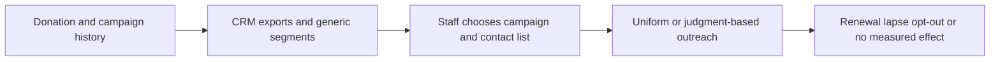
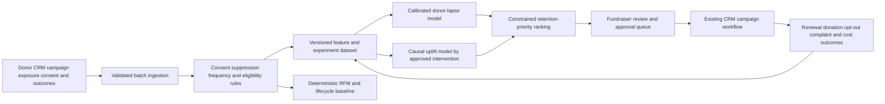

# NONPROFIT-001 AI-assisted donor-retention uplift and outreach orchestration

## Classification

- **Segment:** nonprofit
- **Primary market / jurisdiction:** Brazil
- **Evidence reference date:** 2026-07-19; Brazilian evidence published from 2025-05 through 2026-07
- **Index summary:** Brazilian OSCs can estimate which donors are likely to lapse and which bounded outreach may causally improve retention, prioritizing human-approved campaigns without inferring sensitive traits or automating solicitation.
- **Company profile / size:** Medium and larger Brazilian OSCs with a donor CRM, recurring or repeated individual donations, and enough campaign history for controlled evaluation
- **Opportunity type:** optimization
- **Status:** hypothesis
- **Confidence:** medium
- **Complexity:** medium
- **Horizon:** medium
- **Risk:** medium
- **Solution evidence level:** prototype
- **Operational maturity:** unvalidated
- **Azure fit:** high
- **AI dependency:** core
- **Primary AI role:** prediction
- **Intelligent capability:** Donor-lapse prediction and causal uplift ranking for bounded retention interventions
- **Repository alignment:** new-solution

## Problem

Brazilian OSC fundraising teams commonly manage donor relationships through CRM exports, generic segments, campaign calendars, and staff judgment. Financial sustainability is currently the sector's most urgent challenge, while small teams often accumulate fundraising with other responsibilities. Generic outreach can spend scarce staff capacity on donors who would renew anyway, contact people unlikely to respond, or apply an intervention that has no incremental effect.

The specific actor is the fundraising or donor-relations manager. The process is deciding which existing donors need attention, what approved intervention to use, and which cases deserve personal follow-up before a likely lapse.

## Brazil applicability and current context

- A March 4, 2026 ABCR summary of the Panorama das ONGs reported that 81% of 170 Brazilian organizations placed financial sustainability among their three most urgent challenges.
- The June 30, 2026 Censo ABCR reported that 35% of respondents receive no specific compensation for fundraising; in smaller organizations the share reaches 44%, showing constrained specialist capacity.
- Reporting published July 8, 2026 on the Retrato da Solidariedade indicated that financial donations to OSCs fell in 2025 and that the proportion of adults donating money also declined.
- IDIS reported on June 3, 2026 that community belonging and trust in organizations are strongly associated with giving, so an optimization system must preserve relational quality rather than maximize contact pressure.
- The prototype must comply with the LGPD and use only donor data collected for compatible, documented purposes. Sensitive-trait inference and purchased enrichment are excluded.

## Evidence

### Confirmed problem evidence

- Financial sustainability is the leading urgent challenge reported by Brazilian OSCs in the 2025 survey summarized by ABCR in 2026.
- Current Brazilian fundraising work is frequently accumulated by directors, advisers, and volunteers, reducing capacity for manual donor analysis.
- Current national research indicates weakening financial donation volume and participation during 2025.

### Favorable solution evidence

- Causal machine-learning research in fundraising shows that randomized campaign data can support targeting based on expected incremental donation rather than simple response propensity.
- Uplift modeling provides a suitable technical pattern because it estimates the difference between treatment and control outcomes, matching the decision of whether a specific outreach is likely to help.
- Donor CRM histories normally contain donations, campaign exposure, consent, channel, recurrence, and response outcomes needed for a bounded prototype when tracking quality is adequate.

### Counter-evidence and limitations

- A large field experiment involving roughly 500,000 new donors found no retention effect from standard thank-you calls despite strong expert expectations. The lesson is that plausible fundraising practice is not proof of causal impact.
- Propensity models can prioritize donors who would renew without intervention. The prototype therefore requires randomized holdouts and uplift evaluation, not only churn accuracy.
- AI-personalized solicitation can undermine trust or feel invasive. The system must limit features, frequency, and approved intervention types, and must not generate individualized emotional pressure.
- Small OSCs may lack enough treatment/control history. For them, deterministic segmentation or pooled experimentation may remain preferable.

### Inference

- A governed uplift-ranking workflow may help resource-constrained teams concentrate manual effort where a tested intervention has plausible incremental value, while reducing unnecessary contact.

### Unknowns

- Whether each OSC has reliable campaign-exposure, opt-out, recurrence, and outcome history.
- Whether treatment effects are stable across cause, channel, donor tenure, economic cycle, and campaign type.
- Whether the operational gain exceeds experimentation, data engineering, and model-governance cost.
- Which interventions preserve donor trust in the Brazilian context.

### Sources

- [ABCR: Relatório aponta financiamento como principal desafio das organizações brasileiras](https://captadores.org.br/captamos/relatorio-aponta-financiamento-como-principal-desafio-das-organizacoes-brasileiras/) — Brazil; 2026-03-04; current problem evidence based on 170 organizations surveyed in 2025.
- [ABCR: Novo Censo ABCR revela amadurecimento da captação de recursos](https://captadores.org.br/abcr/censo-abcr-2025-revela-amadurecimento-da-captacao-de-recursos-35-dos-profissionais-tem-mais-de-10-anos-de-atuacao/) — Brazil; 2026-06-30; workforce and capacity evidence.
- [UOL Ecoa: Doações para organizações sociais caem 15% no Brasil](https://www.uol.com.br/ecoa/ultimas-noticias/2026/07/08/doacoes-para-organizacoes-sociais-caem-15-no-brasil-diz-pesquisa.amp.htm) — Brazil; 2026-07-08; current donation trend reporting based on Retrato da Solidariedade.
- [IDIS: Ranking global de solidariedade revela fatores que impulsionam doações](https://www.idis.org.br/ranking-global-de-solidariedade-revela-fatores-que-impulsionam-doacoes-em-diferentes-paises/) — Brazil applicability; 2026-06-03; trust and belonging context.
- [Optimal Targeting in Fundraising: A Causal Machine-Learning Approach](https://arxiv.org/abs/2103.10251) — international technical evidence; 2021; causal targeting pattern.
- [Boosting algorithms for uplift modeling](https://arxiv.org/abs/1807.07909) — international technical evidence; 2018; uplift-modeling method.
- [Do Thank-You Calls Increase Charitable Giving?](https://pubs.aeaweb.org/doi/10.1257/app.20210068) — international field experiment; 2023; counter-evidence showing a standard intervention had null retention effect.
- [Fundraising Regulator: Guidance for using artificial intelligence in fundraising](https://www.fundraisingregulator.org.uk/about-fundraising/resources/guidance-using-artificial-intelligence-fundraising) — foreign governance comparison; updated 2025-12-08; accountability, privacy, and human-control lessons only, not Brazilian law.

## Current process

## Baseline without AI

- **Current baseline:** CRM recency-frequency-value segments, recurring-payment alerts, campaign calendars, and fundraiser judgment.
- **Strongest realistic non-AI alternative:** deterministic donor lifecycle segments plus randomized A/B tests, contact-frequency caps, and dashboards by channel and cohort.
- **Baseline strengths:** transparent, inexpensive, auditable, and viable with limited data.
- **Baseline limitations:** cannot estimate heterogeneous incremental treatment effect or rank scarce manual outreach across many combinations.
- **Context where intelligence may add incremental value:** OSCs with repeated donors, several approved outreach treatments, reliable exposure/outcome logs, and enough volume for holdouts.
- **Condition where the non-AI baseline should be preferred:** small or sparse donor bases, unstable tracking, missing consent records, or no capacity to run controlled experiments.

## Proposed solution

Create a donor-retention decision-support workflow that first validates consent, suppression, contact limits, and campaign eligibility deterministically. A calibrated lapse model estimates near-term renewal risk. Once randomized treatment history exists, an uplift model estimates the incremental effect of each bounded intervention, such as a service message, impact update, renewal reminder, or staff call. The system ranks cases by expected incremental retention subject to workload and frequency constraints.

Fundraisers approve campaign definitions and personal-contact queues. The system never sends messages, chooses donation amounts, infers sensitive attributes, or makes autonomous relationship decisions in the prototype.

## Where AI enters

### AI role map

| Process stage | AI component | AI type / model family | What it does | Runtime mode | Output | Human or deterministic control |
| --- | --- | --- | --- | --- | --- | --- |
| Retention monitoring | Donor-lapse model | Classical ML: calibrated logistic regression or gradient-boosted trees | Predicts probability of lapse in a defined horizon from consented CRM and engagement history | Weekly batch | Calibrated lapse probability and reason factors | Eligibility rules, feature allowlist, calibration threshold, abstention, fundraiser review |
| Intervention selection | Causal uplift ranker | Causal forest, doubly robust learner, or uplift boosting | Estimates incremental effect of each approved intervention relative to no contact | Weekly batch after controlled data exists | Expected uplift, uncertainty, and ranked intervention candidates | Randomized holdout, minimum support, uncertainty threshold, workload and frequency constraints, human approval |

### Required distinctions

- **Primary AI role:** prediction and ranking/recommendation.
- **Model family:** classical supervised ML plus causal uplift modeling.
- **Training requirement:** supervised training for lapse prediction; randomized treatment/control data for uplift estimation.
- **Training location and cadence:** offline per organization, initially after data-quality approval; quarterly or drift-triggered retraining.
- **Inference location:** private cloud batch pipeline.
- **Agent role:** Agent: not used.
- **LLM role:** LLM: not used.
- **Non-LLM intelligence:** calibrated risk prediction and causal treatment-effect ranking.
- **Not AI:** CRM ingestion, consent and suppression rules, frequency caps, experiment assignment, workflow, dashboards, queue limits, message templates, sending systems, approvals, and audit logs.

## Intelligent capability details

- **Technique / model family:** calibrated binary classification and heterogeneous treatment-effect estimation.
- **Why it is necessary:** propensity alone does not distinguish donors helped by outreach from those who renew anyway or could react negatively.
- **Inputs:** donation dates and values, recurrence status, campaign exposures, channel, consent, opt-outs, interactions, campaign type, service events, and non-sensitive donor tenure features.
- **Outputs:** lapse probability, expected uplift by approved treatment, uncertainty, abstention, and ranked review queue.
- **Training / grounding / optimization assumptions:** reliable exposure and outcome logging; randomized holdout; no sensitive-trait inference; sufficient sample support per treatment.
- **Evaluation:** calibration, PR-AUC, uplift/Qini metrics, policy value on holdout, incremental retention and net contribution in randomized tests, opt-out and complaint rates.
- **Fallback and controls:** deterministic segmentation, no-contact control, human approval, feature allowlist, contact caps, abstention, and rollback to manual campaign lists.

## Data and integration assumptions

- **Data owners and access path:** fundraising, finance, CRM, and data-protection owners through approved extracts or APIs.
- **Expected volume, history, frequency, and coverage:** preferably two or more years and thousands of repeated donor-campaign observations; weekly refresh.
- **Labels, outcomes, feedback, or simulation available:** renewal/lapse, donation, opt-out, complaint, contact cost, fundraiser disposition, and randomized treatment assignment.
- **Known quality, imbalance, missingness, and leakage risks:** duplicate donors, channel identity mismatch, delayed donations, campaign-selection bias, missing exposure logs, and leakage from post-outcome events.
- **Brazilian or local-context representativeness:** train and validate on the OSC's own donor population; do not transfer foreign response assumptions directly.
- **Privacy, retention, consent, surveillance, or sharing constraints:** LGPD purpose limitation, minimization, access control, retention policy, deletion handling, and no third-party enrichment without explicit lawful review.
- **Integration and synchronization assumptions:** CRM IDs and campaign events can be reconciled with payment outcomes and suppression lists.
- **Drift and change sources:** economic conditions, emergencies, cause salience, channel policy, payment methods, campaign creative, and donor mix.
- **Minimum viable data for a prototype:** one well-tracked recurring-donor program, one approved treatment, a no-contact holdout, and reliable 60- to 120-day outcomes.

## Prototype validation plan

- **Prototype scope / process slice:** one recurring-donor renewal journey and one bounded, non-manipulative intervention.
- **Users, sites, assets, documents, events, or simulated cases:** one fundraising team and historical replay plus a prospective randomized shadow test.
- **Baseline or comparison:** RFM/lifecycle rules, fundraiser-selected list, and random eligible selection.
- **Required data and integrations:** CRM, campaign exposure, payment outcomes, consent/suppression, and staff disposition.
- **Model-quality metrics:** calibration error, PR-AUC, uplift/Qini, confidence coverage, and policy value on holdout.
- **Business or workflow metrics:** incremental renewal, net contribution after contact cost, staff minutes per retained donor, unnecessary contacts avoided, opt-outs, and complaints.
- **Human acceptance, correction, or override metrics:** queue acceptance, treatment override, exclusion, reason-code completion, and unsupported-recommendation rate.
- **Safety and compliance boundaries:** no autonomous contact, sensitive-feature inference, vulnerable-person targeting, emotional-pressure generation, or dynamic donation-amount personalization.
- **Failure or redesign criteria:** no positive randomized uplift; deterioration in opt-out, complaint, trust, or fairness measures; unstable uplift across folds; insufficient sample support; or deterministic segmentation performs equivalently at lower cost.
- **Evidence required before a pilot or broader implementation:** reproducible holdout performance, positive controlled incremental outcome, privacy review, staff acceptance, and operating-cost estimate.

## Macro architecture

## Capabilities and possible technologies

- Application and workflow capabilities: campaign review queue, experiment management, reason codes, and approval workflow.
- Data capabilities: donor identity reconciliation, feature snapshots, treatment/exposure logs, and outcome attribution.
- Integration capabilities: CRM, donation/payment platform, messaging platform, consent, and suppression APIs.
- Required AI / ML capabilities: calibrated classification and causal uplift ranking.
- Training, grounding, recognition, or optimization capabilities: temporal validation, randomized evaluation, calibration, drift monitoring, and policy-value estimation.
- Agent and tool-use capabilities, or `not used`: not used.
- LLM / foundation-model capabilities, or `not used`: not used.
- Evaluation and model-operations capabilities: experiment registry, model registry, batch monitoring, and reproducible holdout reports.
- Security and governance capabilities: encryption, least privilege, purpose-based feature allowlist, audit, retention, and deletion propagation.
- Azure services that may fit: Azure Data Factory or Functions, Azure SQL or Databricks, Azure Machine Learning, Azure Container Apps, Key Vault, Monitor, and Microsoft Purview.
- Non-Azure or open-source alternatives worth considering: PostgreSQL, dbt, Dagster, scikit-learn, EconML, causalml, MLflow, and Metabase.

## Possible gains

- Concentrate scarce fundraiser time on donors for whom a bounded intervention is more likely to have incremental value.
- Reduce unnecessary or repetitive outreach.
- Replace intuition-only treatment selection with controlled evidence.
- Improve auditability of consent, contact frequency, experiments, and intervention outcomes.
- Transfer learning about effective retention practices across campaigns within the same organization without assuming universal effects.

## Metrics for validation

### Business and operational metrics

- Incremental renewal and net contribution against randomized holdout and deterministic baseline.
- Cost and staff minutes per incremental retained donor.
- Contact volume, opt-out, complaint, and suppression violations.
- Queue acceptance, completion, and outcome-attribution coverage.

### Intelligent-capability metrics

- Lapse calibration, PR-AUC, recall at review capacity, uplift/Qini, policy value, uncertainty coverage, and temporal stability.
- Acceptance, override, correction, abstention, and unsupported-recommendation rates.

## Risks, limits, and controls

- Privacy and sensitive data: minimize donor data; forbid sensitive inference and uncontrolled enrichment.
- Brazilian regulatory or policy constraints: conduct LGPD lawful-basis, purpose, transparency, retention, and data-subject-rights review.
- Human decision boundaries: fundraisers define treatments, approve lists, and retain relationship responsibility.
- Model or policy failure modes: propensity/uplift confusion, selection bias, treatment leakage, unstable effects, poor calibration, and over-contact.
- Agent or tool-execution failure modes, when applicable: not applicable; no agent.
- LLM hallucination, grounding, or prompt-injection risks, when applicable: not applicable; no LLM.
- Comparable failures and applicable lessons: expert-believed interventions may have null causal effects; require holdouts and stop rules.
- Bias, drift, weak labels, or insufficient feedback: compare performance and treatment exposure by relevant non-sensitive operational cohorts; abstain where support is weak.
- Integration and data risks: campaign exposure and donor identity quality may dominate model effort.
- Adoption and change-management risks: staff may distrust ranking or over-trust scores; expose uncertainty and preserve manual queues.
- Prototype cost or operational assumptions: causal estimation is unjustified without sufficient randomized observations; start with one treatment and one journey.

## Fit score

| Dimension | Score | Rationale |
| --- | ---: | --- |
| Problem evidence and relevance | 18/20 | Current Brazilian sector evidence shows financial sustainability pressure and constrained fundraising capacity. |
| Business or operational value | 18/20 | Donor retention and efficient staff allocation directly affect mission funding, while outcomes are measurable. |
| Technical feasibility | 16/20 | A bounded prototype is feasible with a mature CRM and controlled experiment; many OSCs will lack sufficient tracking or sample size. |
| Reuse potential | 18/20 | The pattern applies across recurring giving, memberships, associations, cultural institutions, and social-impact organizations. |
| Strategic differentiation | 17/20 | Causal uplift ranking can add value beyond RFM and propensity models, but only when randomized evidence exists. |
| **Total** | **87/100** | Strong testable hypothesis for data-mature OSCs, with explicit privacy, trust, and experiment prerequisites. |

## Repository relationship

- Existing references that may be reused: data ingestion, model evaluation, observability, governed workflow, and Azure ML building blocks where present.
- Missing capabilities exposed by this opportunity: causal-uplift evaluation, treatment/holdout registry, consent-aware feature policy, and constrained campaign ranking.
- Potential building blocks: experiment-assignment service, causal-evaluation report, calibrated batch scoring, and human-review queue.
- Potential composed solution: nonprofit donor-retention decision-support reference solution.
- Reasons to keep it outside the current kit, when applicable: CRM-specific adapters and fundraising treatment libraries should remain solution-level integrations.

## Duplicate control

- **Problem keys:** nonprofit-financial-sustainability, donor-lapse, donor-retention, fundraising-capacity, unnecessary-outreach
- **Capability keys:** lapse-prediction, causal-uplift-modeling, treatment-effect-ranking, constrained-outreach-prioritization
- **Research queries used:** Brasil organizações da sociedade civil 2025 2026 financiamento desafios; Brasil captação recursos 2025 2026 retenção doadores; donor retention prediction nonprofit uplift modeling randomized trial; nonprofit fundraising AI privacy bias limitations.
- **Related opportunities:** HOSP-001 uses forecasting for operational capacity; EDU-001 uses risk prediction for support triage. Neither targets causal donor-intervention selection or fundraising relationship constraints.
- **Uniqueness statement:** This opportunity targets causal retention-intervention prioritization for existing nonprofit donors, not generic churn scoring, marketing generation, or beneficiary-program prediction.

## Next decision

- shortlist for review.

The shortlist recommendation approves further prototype review only. It does not approve donor deployment, autonomous solicitation, or implementation.