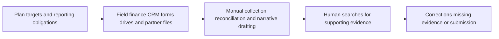
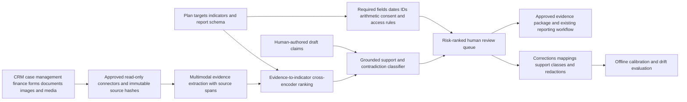

# NONPROFIT-002 AI-assisted program evidence-chain assurance

## Classification

- **Segment:** nonprofit
- **Primary market / jurisdiction:** Brazil
- **Evidence reference date:** 2026-07-20
- **Index summary:** Brazilian OSCs can connect plans, activities, beneficiary records, expenses, and field evidence to funder-specific outcomes, using multimodal extraction and contradiction detection to flag unsupported claims before human-approved reporting.
- **Company profile / size:** Small and medium Brazilian OSCs managing public or institutional grants with fragmented spreadsheets, documents, media, and beneficiary records
- **Opportunity type:** integration
- **Status:** hypothesis
- **Confidence:** medium
- **Complexity:** medium
- **Horizon:** short
- **Risk:** regulated
- **Solution evidence level:** conceptual
- **Operational maturity:** unvalidated
- **Existing-solution disposition:** integrate
- **Azure fit:** high
- **AI dependency:** core
- **Primary AI role:** extraction
- **Intelligent capability:** Multimodal evidence extraction, indicator mapping, cross-document contradiction detection, and unsupported-claim review ranking
- **Repository alignment:** extend-kit

## Problem

An OSC program manager must demonstrate that activities, expenditures, beneficiary service, targets, and reported results correspond to the approved plan. Evidence commonly arrives as spreadsheets, attendance lists, forms, invoices, photos, videos, testimonials, and partner reports. The difficult work is not formatting the final report; it is determining which evidence supports each target, whether the period and population match, what remains missing, and which narrative claims exceed the underlying records.

## Operational simulation

**Simulation status:** the workflows below are synthetic process models used to generate hypotheses. They are not claims about a specific OSC.

- **Organization archetype:** Brazilian OSC with 25 employees, three active programs, two public partnerships, and several private grants.
- **Actor:** program manager, with finance, field coordinator, data-protection officer, and executive director as reviewers.
- **Trigger:** monthly monitoring or approaching annual/final reporting deadline.
- **Objective:** produce a defensible evidence package showing execution of the object, targets, outcomes, expenditures, exceptions, and beneficiary safeguards.
- **Completion condition:** every material statement is linked to reviewed evidence or explicitly marked as unsupported, estimated, incomplete, or requiring explanation.
- **Inputs:** plan of work, target matrix, attendance sheets, case-management exports, surveys, invoices, bank reconciliation, photos, videos, testimonials, partner reports, consent records, and prior submissions.
- **Constraints:** deadlines, LGPD, beneficiary vulnerability, purpose limitation, retention rules, funder-specific templates, public transparency, and human accountability.

### Scenario variants

| Scenario | Simulated flow | Decisions and uncertainty | Failure consequences | Potential feedback |
| --- | --- | --- | --- | --- |
| Normal | Field teams upload structured attendance and monthly outputs; finance reconciles expenses; manager maps records to targets. | Whether repeated records are duplicates, whether an activity belongs to the reporting period, and whether output supports the stated indicator. | Manual reconciliation, duplicated counts, weak traceability. | Accepted links, corrected mappings, rejected duplicates, final indicator values. |
| Exception | A partner spreadsheet conflicts with attendance forms; photos lack date/location; a testimonial contains sensitive data; a claimed outcome is supported only by activity counts. | Which source is authoritative, whether evidence is admissible, whether the claim must be narrowed, and whether beneficiary data must be redacted. | Unsupported claims, privacy exposure, rework, qualification or rejection of evidence. | Reviewer decisions, redaction corrections, source precedence, accepted claim wording. |
| Peak/degraded | Several grants close simultaneously after staff turnover; files are scattered across email and drives; one system export is delayed. | Which missing evidence is material, what can be reconstructed, which report should be prioritized, and when to disclose incompleteness. | Deadline miss, inconsistent reports, duplicated effort, loss of institutional memory. | Escalation outcomes, missing-evidence resolution, deadline impact, review effort. |

### Opportunity points derived from simulation

| Operational point | Deterministic response first | Remaining intelligent gap |
| --- | --- | --- |
| Required artifacts and deadlines | Checklist, template, workflow, reminders | None; remain deterministic. |
| Exact joins across IDs and periods | Schema validation, keys, date rules, reconciliation | None when identifiers are reliable. |
| Evidence hidden in heterogeneous documents and media | Required naming and structured upload forms | Extracting entities, dates, activities, quantities, locations, and consent indicators from legacy and third-party material. |
| Mapping evidence to differently worded targets and indicators | Controlled taxonomy and explicit mappings | Ranking plausible evidence-indicator links when language and granularity differ, with abstention. |
| Detecting claims that exceed evidence | Required source links and arithmetic checks | Semantic contradiction and support classification across narrative, targets, counts, surveys, and media metadata. |
| Prioritizing review | Static severity rules | Ranking uncertain or high-consequence evidence gaps for scarce human review. |

## Brazil applicability and current context

The 2025 federal Manual MROSC details procedures from planning through monitoring, evaluation, and prestação de contas for partnerships under Law 13.019/2014. Its official annexes include a model report for execution of the object and technical monitoring/evaluation artifacts. Current Brazilian rules emphasize demonstrating actions, achievement of targets and expected results, and supporting records such as attendance lists, photos, testimonials, videos, satisfaction evidence, financial records, and other proof. The Mapa das OSCs remains a national transparency platform and its project and financial datasets were updated in November 2025.

The prototype is not a legal opinion or automated approval mechanism. Applicable partnership instruments, sector rules, local decrees, grant terms, and LGPD review remain authoritative.

## Existing solutions and differentiation

### Existing solutions reviewed

| Solution / platform | Owner or vendor | Current capabilities | Evidence date | Coverage overlap |
| --- | --- | --- | --- | --- |
| Transferegov.br and Manual MROSC artifacts | Brazilian Federal Government | Partnership procedures, official templates, monitoring, evaluation, and accountability workflow | 2025-2026 | Defines required process and artifacts; does not infer evidence links across an OSC's fragmented operational sources. |
| Mapa das OSCs | Ipea / Federal Government | Public transparency and OSC, project, and financial data | 2025-2026 | Publication and sector data, not internal evidence reconciliation. |
| Sopact | Sopact | Program evaluation, qualitative coding, participant linkage, outcomes, and funder reporting | 2026-07-04 | Significant overlap in outcome data and reporting. |
| Outcome | Outcome | Connects program, partner, financial, evaluation, and decision records into an impact-proof layer | current 2026 | Strong overlap in evidence-chain and impact-proof positioning. |
| Outcome Proof | Outcome Proof | Goals, deadlines, evidence capture, outcome tracking, and report export | current 2026 | Covers lightweight evidence capture and reporting. |
| Impactable | Impactable | Shared knowledge library and AI-grounded grant/report drafting | current 2026 | Covers document grounding and drafting, but not Brazilian MROSC-specific claim-to-evidence assurance. |

### Gap and disposition

- **What is already solved:** grant workflow, evidence capture, outcome tracking, report generation, and broad impact-proof platforms exist.
- **Material uncovered gap:** a Brazil-specific integration layer that maps heterogeneous operational evidence to the exact plan, target, period, beneficiary safeguards, and MROSC/funder reporting fields, while flagging unsupported claims and preserving source-level auditability.
- **Underserved context:** smaller OSCs that cannot replace their existing CRM, accounting, forms, and drives with a large impact-management platform.
- **Disposition:** integrate.
- **Why vendor, cloud, model, UI, or architecture changes are insufficient:** differentiation is the governed Brazilian evidence-to-obligation mapping and unsupported-claim control, not generic RAG or report drafting.
- **Differentiation statement:** the candidate does not replace Transferegov, accounting, CRM, or impact platforms; it verifies the evidence chain between existing records and a specific reporting obligation before a human signs the report.

## Evidence

### Confirmed problem evidence

- The current federal MROSC manual provides detailed procedures and official models for planning, monitoring, evaluation, execution reporting, and final accountability.
- Current Brazilian partnership rules require demonstration of actions, target and result achievement, and supporting operational and financial evidence.
- The Mapa das OSCs provides national transparency and updated project and financial datasets, demonstrating the scale and public-accountability context of OSC activity.

### Existing-solution evidence

- Current nonprofit platforms already cover evidence capture, outcome measurement, qualitative analysis, impact reporting, and grounded drafting.
- Therefore, a generic impact platform or AI report writer would be duplicative.

### Favorable evidence for the uncovered gap

- Multimodal document extraction, entity linking, semantic similarity, natural-language inference, and calibrated review ranking can be tested on a bounded collection without automating approval.
- Human corrections provide direct labels for evidence mapping, contradiction categories, admissibility, redaction, and abstention.

### Counter-evidence and limitations

- Source documents may be incomplete, manipulated, duplicated, or semantically ambiguous; model confidence cannot establish legal sufficiency.
- Existing impact-management platforms may cover the gap through configuration or product roadmap, eliminating a separate solution.
- Structured forms, mandatory IDs, and disciplined document management may outperform AI for organizations with simple programs.
- Generated narratives can hide uncertainty; the prototype must produce evidence links and issue findings, not an authoritative final claim.

### Inference

- A lightweight assurance layer may reduce review effort and unsupported reporting while allowing OSCs to retain existing systems.

### Unknowns

- Real frequency and cost of unsupported claims, duplicate evidence, and cross-source reconciliation.
- Availability of representative, permissioned historical reports and reviewer corrections.
- Degree of overlap with configurable features in current Brazilian grant-management deployments.
- Whether model-assisted review outperforms structured checklist and deterministic reconciliation at acceptable cost.

### Sources

- [Portaria Interministerial SG/MGI/AGU nº 197, de 11 de agosto de 2025](https://www.gov.br/transferegov/pt-br/legislacao/portarias/portaria-interministerial-sg-mgi-agu-no-197-de-11-de-agosto-de-2025) — Brazil; 2025-08-12; current federal MROSC procedural authority.
- [Manual MROSC: Do Planejamento à Prestação de Contas](https://www.gov.br/funarte/pt-br/acesso-a-informacao-lai/convenios-e-transparencias/convenios-e-instrumentos-congeneres/transferencias-voluntarias/manual-mrosc-do-planejamento-a-prestacao-de-contas-1) — Brazil; 2025-08-22; official manual and reporting annexes.
- [Ministério da Cultura: Manual MROSC](https://www.gov.br/cultura/pt-br/centrais-de-conteudo/publicacoes/manual-mrosc-do-planejamento-a-prestacao-de-contas/manual-mrosc-do-planejamento-a-prestacao-de-contas-1) — Brazil; 2026-01-29; current sector adoption.
- [Mapa das OSCs](https://mapaosc.ipea.gov.br/) — Brazil; datasets updated 2025-11-01; transparency, project, and financial-data context.
- [Outcome for Non-Profits](https://outcome.com/solutions/non-profits) — current commercial solution evidence.
- [Outcome Proof](https://www.outcomeproof.com/) — current commercial solution evidence.
- [Sopact nonprofit program evaluation](https://www.sopact.com/use-case/nonprofit-evaluation) — updated 2026-07-04; current AI-enabled evaluation platform.
- [Impactable](https://www.impactable.ai/) — current AI-enabled nonprofit knowledge and reporting platform.

## Current process and current solution

## Baseline

- **Current manual or system baseline:** spreadsheet target matrix, document folders, accounting reconciliation, checklists, and reviewer judgment.
- **Existing product or platform baseline:** impact-management or grant-reporting platform configured with outcomes, deadlines, evidence capture, and exports.
- **Strongest realistic non-AI alternative:** mandatory structured evidence IDs, controlled forms, document taxonomy, deterministic joins, deadline workflow, and sampling-based review.
- **Baseline strengths:** transparent, inexpensive, and legally understandable.
- **Baseline limitations:** weak for legacy, partner, qualitative, and multimodal evidence; does not identify semantic overclaiming.
- **Exact context where intelligence adds incremental value:** heterogeneous legacy evidence, multiple funder vocabularies, qualitative records, and high manual review burden.
- **Condition where adoption or baseline should be preferred:** existing platform already provides source-level mapping and contradiction controls, or records can be standardized cheaply.

## Proposed solution or extension

Integrate existing storage, CRM, case-management, accounting, and grant systems. Deterministic controls first validate deadlines, required fields, IDs, periods, arithmetic, duplicates, consent, retention, and permissions. Model-based components extract candidate facts from approved files, rank evidence-to-target links, detect likely contradictions or unsupported claims, and create a review queue. The final report remains authored and approved by accountable staff.

## Where AI enters

### AI role map

| Process stage | AI component | AI type / model family | Inputs | What it does | Runtime mode | Output | Human or deterministic control |
| --- | --- | --- | --- | --- | --- | --- | --- |
| Evidence intake | Multimodal evidence extractor | document recognition, vision-language model, speech recognition, entity extraction | approved documents, images, audio/video transcripts, metadata | extracts activities, dates, quantities, locations, participant references, consent indicators, and source spans | asynchronous batch | structured candidate facts with provenance and confidence | file allowlist, malware scan, schema checks, redaction, human correction |
| Evidence mapping | Indicator-link ranker | embeddings plus cross-encoder or learning-to-rank | candidate facts, plan, targets, indicators, period, funder schema | ranks candidate support links and abstains when scope or period conflicts | batch | evidence-target candidates and uncertainty | exact-ID/date rules, minimum confidence, reviewer approval |
| Claim assurance | Support and contradiction classifier | natural-language inference and evidence-grounded classification | draft claim, linked evidence, target definition, aggregate calculations | classifies supported, partially supported, contradicted, or insufficient | batch/on demand | finding, cited spans, confidence, missing-evidence reason | deterministic arithmetic, no automatic acceptance, mandatory reviewer disposition |
| Review prioritization | Risk ranker | calibrated classification or ranking | uncertainty, claim materiality, privacy flags, missing artifacts, reviewer history | ranks cases requiring scarce specialist attention | batch | review priority and reason factors | severity rules, caps, audit, human queue control |

### Required distinctions

- **Primary AI role:** extraction, classification, and ranking.
- **Model family:** OCR/document models, vision-language and speech models when needed, embeddings/cross-encoder, natural-language inference, calibrated ranking.
- **Training requirement:** pretrained inference and grounding initially; supervised calibration from reviewed mappings and findings if sufficient data exists.
- **Training location and cadence:** private approved environment; quarterly or drift-triggered calibration only after label review.
- **Inference location:** private cloud batch pipeline; optional local preprocessing for sensitive media.
- **Agent role:** Agent: not used.
- **LLM role:** used only for bounded structured extraction or evidence-grounded claim classification where smaller models are inadequate; never for autonomous submission or legal conclusion.
- **Non-LLM intelligence:** OCR, embeddings, cross-encoder ranking, calibrated classifiers, duplicate detection.
- **Not AI:** permissions, retention, required-artifact rules, dates, arithmetic, reconciliation, queues, dashboards, exports, approvals, and submission.

## Intelligent capability details

- **Why it is necessary for the uncovered gap:** deterministic joins cannot interpret heterogeneous qualitative and multimodal records or determine semantic support across differently worded targets and claims.
- **Inputs:** approved program plans, indicator definitions, operational evidence, metadata, draft claims, reviewer decisions.
- **Outputs:** structured facts with source spans, candidate evidence links, contradiction/support findings, missing-evidence reasons, and ranked review queue.
- **Training / grounding / optimization assumptions:** authoritative plan and reporting schema, source-level provenance, representative reviewer corrections, and strict abstention.
- **Evaluation against baselines:** compare with checklist-only review, exact-match mapping, and configured existing platform.
- **Fallback and controls:** structured manual workflow, no generated facts without source spans, abstention, reviewer approval, redaction, and export-only mode.

## Data and integration assumptions

- **Data owners and access path:** program, finance, legal/compliance, DPO, and partner data owners through approved connectors or exports.
- **Expected volume, history, frequency, and coverage:** one to three completed reporting cycles; hundreds to thousands of evidence items per program.
- **Labels, outcomes, feedback, or simulation:** accepted/rejected mappings, correction reason, duplicate status, admissibility, support class, redaction, final indicator values.
- **Quality, imbalance, missingness, and leakage risks:** weak scans, missing metadata, duplicated beneficiaries, inconsistent IDs, retrospective edits, and final-report leakage into model inputs.
- **Brazilian or local-context representativeness:** Portuguese terminology, local partnership instruments, regional program language, and funder-specific schemas require local evaluation.
- **Privacy, retention, consent, surveillance, or sharing constraints:** LGPD minimization, purpose limitation, role-based access, beneficiary pseudonymization, consent/legal-basis review, retention and deletion enforcement.
- **Existing platform APIs, exports, extension points, and limits:** document storage, CRM, case management, accounting, forms, Transferegov exports, and grant-platform APIs where available.
- **Integration and synchronization assumptions:** immutable source hashes and versioned snapshots are available or can be added.
- **Drift and change sources:** new funder templates, revised plans, staff practices, OCR quality, program vocabulary, and partnership rules.
- **Minimum viable data for a prototype:** one completed grant, one plan/indicator matrix, 100-300 evidence artifacts, final reviewed report, and reviewer correction set.

## Prototype validation plan

- **Prototype scope / process slice:** one completed public or institutional grant; assurance of five to ten material indicators and their narrative claims.
- **Users, sites, assets, documents, events, or simulated cases:** one OSC team, historical replay, plus synthetic missing, duplicate, conflicting, and privacy-sensitive evidence cases.
- **Existing solution baseline:** current grant/impact platform configuration or manual reporting tool.
- **Non-AI baseline:** structured target matrix, required evidence IDs, deterministic validation, keyword search, and reviewer checklist.
- **Required data and integrations:** read-only exports from plan, storage, CRM/case records, finance, surveys, and final report.
- **Model-quality metrics:** extraction F1 by field, evidence-link precision@k and recall, support-class macro-F1, calibration error, abstention coverage, provenance completeness.
- **Incremental-value metrics beyond existing solution:** additional unsupported claims found, material missing evidence found, reviewer time saved without reducing detection, and false findings per report.
- **Business or workflow metrics:** report preparation/review time, rework cycles, late submissions, unresolved evidence gaps, and audit retrieval time.
- **Human acceptance, correction, or override metrics:** accepted links, corrected extraction, overridden support class, unresolved findings, reviewer agreement.
- **Safety and compliance boundaries:** no autonomous submission, legal sufficiency decision, beneficiary eligibility decision, outcome invention, or unrestricted sensitive-data exposure.
- **Failure or redesign criteria:** precision below reviewer-usable threshold; material unsupported claims missed; privacy leakage; reviewers spend more time correcting than baseline; existing product configuration performs equivalently; or structured process redesign removes the gap.
- **Evidence required before pilot or broader implementation:** reproducible historical replay, privacy review, source-level traceability, acceptable false-finding burden, and user acceptance.

## Macro architecture

## Capabilities and possible technologies

- Existing platform capabilities reused: CRM, case management, accounting, document storage, grant management, forms, and reporting submission.
- Application and workflow capabilities: target matrix, evidence viewer, source-span review, issue disposition, report export.
- Data capabilities: immutable hashes, versioned snapshots, identity reconciliation, evidence graph, lineage.
- Integration and extension capabilities: APIs, read-only exports, event ingestion, document connectors.
- Required AI / ML capabilities: multimodal extraction, semantic mapping, contradiction/support classification, calibrated ranking.
- Training, grounding, recognition, or optimization capabilities: Portuguese evaluation set, reviewer labels, temporal/version validation, calibration and drift monitoring.
- Agent and tool-use capabilities, or `not used`: not used.
- LLM / foundation-model capabilities, or `not used`: bounded grounded extraction/classification only; optional.
- Evaluation and model-operations capabilities: dataset/version registry, audit traces, abstention analysis, subgroup and document-type metrics.
- Security and governance capabilities: RBAC, encryption, private networking, data minimization, retention, redaction, source provenance, audit.
- Azure services that may fit: Azure AI Document Intelligence, Azure AI Search, Azure Machine Learning, Azure AI Foundry models, Azure Blob Storage, Functions, Service Bus, PostgreSQL, Key Vault, Monitor.
- Non-Azure or open-source alternatives: Tesseract/PaddleOCR, Docling, sentence-transformers, rerankers, PostgreSQL/pgvector, MinIO, MLflow, Airflow/Prefect.

## Possible gains

- Reduce time spent locating and reconciling evidence while retaining source-level review.
- Detect unsupported, contradictory, duplicated, out-of-period, or privacy-sensitive evidence before submission.
- Preserve institutional knowledge across staff transitions without replacing accountable judgment.

## Metrics for validation

### Business and operational metrics

- Preparation and review time against the existing process.
- Material evidence gaps and unsupported claims detected before submission.
- Rework cycles, late submissions, reviewer burden, and audit retrieval time.

### Intelligent-capability metrics

- Extraction F1, link precision/recall, support-class macro-F1, calibration, abstention, and provenance completeness.
- Human acceptance, correction, override, and false-finding rates.

## Risks, limits, and controls

- Existing-solution overlap and roadmap risk: current impact platforms may add equivalent controls; reassess before prototype.
- Privacy and sensitive data: beneficiary records require minimization, pseudonymization, purpose controls, and strict access.
- Brazilian regulatory or policy constraints: partnership instrument and current official guidance prevail.
- Human decision boundaries: staff own claims, evidence admissibility, report approval, and submission.
- Model or policy failure modes: hallucinated extraction, wrong-period mapping, semantic overreach, missed contradiction, duplicate beneficiary count.
- Agent or tool-execution failure modes: not applicable; no agent.
- LLM hallucination, grounding, or prompt-injection risks: untrusted documents may contain instructions; canonicalize content, isolate extraction schemas, require source spans, and ignore embedded instructions.
- Comparable failures and lessons: automated narrative generation can create fluent but unsupported claims; findings must be evidence-first.
- Bias, drift, weak labels, or insufficient feedback: reviewer disagreement and heterogeneous funder language require abstention and per-schema evaluation.
- Integration and vendor/platform dependency risks: connector limits, export instability, proprietary formats, and product roadmap overlap.
- Adoption and change-management risks: staff may see assurance as surveillance or extra work; use read-only replay and transparent findings.
- Prototype cost or operational assumptions: document/media processing cost and human labeling must be measured.

## Fit score

| Dimension | Score | Rationale |
| --- | ---: | --- |
| Problem evidence and relevance | 18/20 | Current Brazilian MROSC guidance makes evidence, targets, results, and accountability concrete. |
| Business or operational value | 16/20 | Potentially reduces reconciliation and unsupported reporting, but local burden must be measured. |
| Technical feasibility | 16/20 | Bounded historical replay is feasible; heterogeneous media and legal sufficiency remain difficult. |
| Reuse potential | 17/20 | Pattern applies across public, philanthropic, and institutional grants while schemas vary. |
| Strategic differentiation | 14/20 | Broad impact-proof products exist; differentiation depends on Brazil-specific obligation mapping and assurance. |
| **Total** | **81/100** | Publishable integration hypothesis with meaningful product-overlap risk. |

## Repository relationship

- Existing references that may be reused: document extraction, grounded retrieval, evaluation, workflow, security, and model-monitoring patterns.
- Missing capabilities exposed by the differentiated gap: evidence graph, claim-support classifier, provenance-first review UI, reporting-obligation schema.
- Potential building blocks: document intelligence, semantic ranking, contradiction classification, human review queue, immutable evidence storage.
- Potential composed solution or extension: nonprofit grant evidence-assurance integration.
- Reasons to keep it outside the current kit: none at discovery stage; implementation requires explicit approval.

## Duplicate control

- **Problem keys:** nonprofit-grant-reporting; mrosc-prestacao-contas; program-evidence-reconciliation; unsupported-impact-claims; beneficiary-data-protection
- **Capability keys:** multimodal-evidence-extraction; evidence-indicator-linking; contradiction-detection; claim-support-classification; review-ranking
- **Existing solutions reviewed:** Transferegov/Manual MROSC, Mapa das OSCs, Sopact, Outcome, Outcome Proof, Impactable
- **Research queries used:** `Manual MROSC prestação de contas resultados 2025`; `relatório de execução do objeto OSC 2025`; `software nonprofit program outcome evidence grant reporting AI platform official`; `nonprofit impact reporting AI contradiction evidence platform`; `grant reporting AI false claims privacy limitations`
- **Related repository opportunities:** PUBLIC-001 uses document assurance but targets public procurement before publication; NONPROFIT-001 targets donor-retention interventions.
- **External overlap statement:** existing platforms cover substantial evidence capture, evaluation, and reporting; the hypothesis survives only as a governed integration and claim-assurance layer for Brazilian reporting obligations.
- **Uniqueness statement:** this opportunity focuses on source-level proof that a reported program claim is supported by the correct period, target, beneficiary-safe evidence, and reporting obligation, not on generic grant writing or impact dashboards.

## Next decision

Prototype candidate: run a read-only historical replay against one completed grant and reject the hypothesis if deterministic controls or an existing configured product deliver equivalent assurance at lower cost.

Implementation approval remains an explicit human decision.