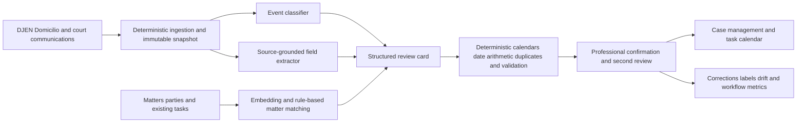

# PROF-001 AI-assisted process-communication and deadline assurance

## Classification

- **Segment:** Professional services
- **Primary market / jurisdiction:** Brazil
- **Evidence reference date:** 2026-07-19; Brazilian sources published or updated through 2026-06-15.
- **Index summary:** Brazilian law firms can extract obligations, parties, procedural events, and candidate deadlines from official communications, then reconcile them with deterministic calendar rules and human confirmation before task assignment.
- **Company profile / size:** Small, medium, and large Brazilian law firms and legal departments handling material volumes of litigation communications across courts and clients.
- **Opportunity type:** operations
- **Status:** hypothesis
- **Confidence:** medium
- **Complexity:** medium
- **Horizon:** short
- **Risk:** regulated
- **Solution evidence level:** prototype
- **Operational maturity:** unvalidated
- **Azure fit:** high
- **AI dependency:** core
- **Primary AI role:** extraction
- **Intelligent capability:** Source-grounded legal communication classification and structured obligation extraction with confidence-ranked deadline review
- **Repository alignment:** new-solution

## Problem

Litigation teams receive publications, citations, notices, orders, and procedural communications through national and court systems. Staff must identify the represented party, matter, procedural event, required response, responsible professional, and applicable deadline, then register and independently verify the task.

The process is repetitive but high consequence. Wording, attachments, linked decisions, local procedural context, duplicate communications, and ambiguous event types make pure keyword rules brittle. A missed, duplicated, or incorrectly interpreted deadline can harm the client and creates professional-liability and rework risk.

## Brazil applicability and current context

On 11 March 2026, the CNJ announced that Jus.br had unified DJEN publications and Domicílio Judicial Eletrônico communications for consultation and direct responses by the legal profession. This improves the official access path but does not remove the internal work of classifying each communication, associating it with the correct matter, interpreting the required action, and controlling the deadline.

The CNJ's Domicílio Judicial Eletrônico guidance describes a national, fully digital location for citations, notices, and other judicial communications, including specific deadline guidance. In parallel, the CNJ reported on 25 June 2026 that 40.9 million new judicial cases entered in 2025, indicating a high-volume operating environment for litigation services.

The OAB launched a national AI-in-advocacy integration plan in June 2026 centered on governance, good practices, professional training, modernization, and protection of professional prerogatives. Any prototype must therefore preserve confidentiality, traceability, professional judgment, and source verification.

## Evidence

### Confirmed problem evidence

- Jus.br now centralizes DJEN and Domicílio Judicial Eletrônico communications and supports responses linked to the originating communication, confirming a current national digital workflow that legal teams must operationalize.
- The Domicílio Judicial Eletrônico centralizes citations, notices, and other communications and maintains dedicated deadline guidance, confirming that communication receipt and deadline control are distinct but linked operational responsibilities.
- Justiça em Números 2026 reported 40.9 million new cases in 2025, supporting the continuing scale of procedural information handled by Brazilian legal professionals.
- The OAB's June 2026 national plan recognizes that AI already affects legal practice and explicitly prioritizes governance, safe use, professional responsibility, and training.

### Favorable solution evidence

- A 2026 expert audit of a multi-stage extraction pipeline over 100 Brazilian court decisions reported high precision and found that the dominant residual error was incorrect granularity or missing qualifiers rather than fabricated content. This supports bounded structured extraction while showing why expert review must inspect qualifiers.
- Mature document-classification and information-extraction patterns can classify long legal documents and extract source-linked fields without asking a model to calculate the final legal deadline or draft autonomous legal advice.
- National communications increasingly have structured identifiers and official source links, enabling deterministic reconciliation, duplicate detection, matter matching, and audit trails around the model output.

### Counter-evidence and limitations

- Legal language models and legal research products can hallucinate, omit qualifiers, or express unjustified confidence. Retrieval does not eliminate these risks.
- A communication may not contain every fact needed to calculate a deadline; linked decisions, service dates, suspension calendars, procedural rules, and matter-specific circumstances may be required.
- Automatic deadline calculation can create false assurance. The initial system therefore produces a candidate event and candidate due date, never a final uncontested legal conclusion.
- Existing docketing tools, official portals, templates, and dual-review procedures are strong conventional alternatives and may outperform AI for standardized communication types.

### Inference

- The defensible first use is not autonomous legal reasoning. It is evidence-linked extraction and prioritization that reduces reading and registration work while retaining deterministic calendar logic and explicit professional confirmation.
- The capability is most likely to add value on heterogeneous, high-volume communications where keyword templates generate excessive manual review or fail to capture contextual obligations.

### Unknowns

- Availability and licensing of official communication feeds, attachments, event timestamps, and stable identifiers.
- Distribution of document formats and communication types across the firm's courts and practice areas.
- Frequency and operational cost of ambiguous, duplicate, amended, or incomplete communications.
- Incremental value over the firm's current docketing rules, vendor platform, and double-check process.

### Sources

- [Jus.br unifica comunicações processuais e permite resposta direta da advocacia](https://www.cnj.jus.br/jus-br-unifica-comunicacoes-processuais-e-permite-resposta-direta-da-advocacia/) — Brazil; 2026-03-11; current official communication workflow.
- [Domicílio Judicial Eletrônico](https://www.cnj.jus.br/tecnologia-da-informacao-e-comunicacao/justica-4-0/domicilio-judicial-eletronico/) — Brazil; current page reviewed 2026-07-19; official operating and deadline context.
- [Justiça em Números 2026](https://www.cnj.jus.br/justica-em-numeros-2026-estoque-de-processos-cai-em-ano-de-maior-demanda-da-serie-historica/) — Brazil; 2026-06-25; 2025 judicial demand and stock.
- [CFOAB lança plano nacional para orientar uso da IA](https://www.oab.org.br/noticia/64289/cfoab-lanca-plano-nacional-para-orientar-uso-da-ia-e-ampliar-oportunidades-para-a-advocacia) — Brazil; 2026-06-15; current professional governance context.
- [Not Hallucination but Granularity](https://papers.ssrn.com/sol3/papers.cfm?abstract_id=6496861) — Brazilian court-decision corpus; 2026-04-21; favorable extraction evidence and qualifier limitation.
- [Hallucination-Free? Assessing the Reliability of Leading AI Legal Research Tools](https://onlinelibrary.wiley.com/doi/10.1111/jels.12413) — international; 2025; counter-evidence on hallucination in legal AI.

## Current process

## Baseline without AI

- **Current baseline:** Official portal access, inbox monitoring, keyword filters, docketing software, standardized event templates, manual reading, calendar calculation, and dual review.
- **Strongest realistic non-AI alternative:** Improve structured ingestion, court and matter identifiers, duplicate controls, deterministic event templates, procedural calendars, and mandatory second-person confirmation.
- **Baseline strengths:** Auditable, predictable, and highly reliable for known communication patterns.
- **Baseline limitations:** Requires substantial reading and registration effort for heterogeneous language, attachments, and contextual obligations.
- **Context where intelligence may add incremental value:** Classifying unfamiliar or variable communications, extracting source-linked fields and qualifiers, and ranking ambiguous items for urgent review.
- **Condition where the non-AI baseline should be preferred:** Standardized communication types already captured accurately by official structured fields and deterministic templates.

## Proposed solution

Create a read-only assurance layer that ingests official communications and attachments, associates them with a candidate matter, classifies the procedural event, extracts the represented party, action requested, source passages, relevant dates, and deadline qualifiers, and presents a structured review card.

A deterministic rules service applies jurisdiction, calendar, suspension, counting, and organization rules only after the professional confirms the event type and required inputs. The system compares the candidate result with existing tasks, flags duplicates or conflicts, and requires explicit approval before creating or changing a deadline task.

## Where AI enters

### AI role map

| Process stage | AI component | AI type / model family | What it does | Runtime mode | Output | Human or deterministic control |
| --- | --- | --- | --- | --- | --- | --- |
| Intake | Communication classifier | Fine-tuned text classifier or embedding classifier | Classifies communication and likely procedural event | Asynchronous batch or near-real-time | Event class and confidence | Known templates bypass the model; low confidence abstains |
| Reading | Grounded field extractor | Document model plus constrained LLM extraction | Extracts party, matter clues, requested action, dates, qualifiers, and exact supporting passages | Asynchronous private-cloud inference | Structured JSON with source spans | Schema validation; every field must link to source text |
| Review | Ambiguity and urgency ranker | Classical ML or learning-to-rank | Prioritizes items likely to require urgent or specialist review | Batch queue ranking | Review priority and contributing factors | Rules preserve statutory urgency floors; users can override |

### Required distinctions

- **Primary AI role:** Classification and source-grounded extraction; ranking is supporting.
- **Model family:** Text/embedding classifier, document extraction model, constrained LLM for structured extraction, and optional classical ranking model.
- **Training requirement:** Start with pretrained inference and prompt/schema grounding; train the classifier and ranker on expert-reviewed local examples only after a representative set exists.
- **Training location and cadence:** Offline initial evaluation; periodic retraining after controlled label review, not continuous self-training.
- **Inference location:** Private cloud asynchronous service; no public consumer chatbot.
- **Agent role:** Agent: not used. The workflow does not plan or execute autonomous legal actions.
- **LLM role:** Extracts structured facts and qualifiers from supplied source documents; it does not calculate the authoritative deadline, invent legal authorities, or draft a filing.
- **Non-LLM intelligence:** Event classification, ambiguity ranking, duplicate similarity, and matter matching may use classical ML or embeddings.
- **Not AI:** Source ingestion, APIs, identity matching rules, procedural calendars, date arithmetic, duplicate blocking, workflow, task creation, approvals, audit logs, and final professional decisions.

## Intelligent capability details

- **Technique / model family:** Legal-domain document classification, constrained structured extraction, embeddings for matter/duplicate matching, and calibrated ambiguity ranking.
- **Why it is necessary:** Variable legal language and contextual qualifiers are costly to encode comprehensively as templates; removing extraction and classification leaves only another manual docketing interface.
- **Inputs:** Official communication text, metadata, attachments, linked decision excerpts, matter registry, client/party data, event taxonomy, and existing tasks.
- **Outputs:** Candidate event, structured fields, exact evidence spans, confidence, ambiguity flags, candidate matter, duplicate candidates, and review priority.
- **Training / grounding / optimization assumptions:** Ground all extracted fields in the received documents; build a stratified expert-reviewed golden set by court and event type; avoid post-review leakage.
- **Evaluation:** Field-level precision/recall, event-class macro F1, source-span accuracy, qualifier omission rate, matter-match precision, calibration, abstention, and incremental time/error performance versus templates.
- **Fallback and controls:** Abstention, schema validation, source-required fields, deterministic date engine, dual confirmation, immutable source snapshot, and full fallback to existing manual docketing.

## Data and integration assumptions

- **Data owners and access path:** Litigation operations, records, information security, case-management administrators, and authorized court-communication accounts.
- **Expected volume, history, frequency, and coverage:** Several months of communications and reviewed tasks for selected courts or practice groups.
- **Labels, outcomes, feedback, or simulation available:** Historical event types, corrected fields, accepted deadlines, duplicate resolution, reviewer overrides, and late corrections.
- **Known quality, imbalance, missingness, and leakage risks:** OCR errors, missing attachments, rare event classes, copied boilerplate, amended notices, and final manually calculated deadlines leaking into model evaluation.
- **Brazilian or local-context representativeness:** Evaluation must reflect Brazilian terminology, courts, procedural event taxonomy, calendars, and the firm's actual practice areas.
- **Privacy, retention, consent, surveillance, or sharing constraints:** Legal privilege, client confidentiality, LGPD purpose limitation, restricted access, encryption, retention controls, and no provider training on client content.
- **Integration and synchronization assumptions:** Stable source identifiers, matter registry access, task/calendar API, versioned calendars, and immutable source snapshots.
- **Drift and change sources:** Portal changes, court formats, procedural rules, calendars, event taxonomy, and firm workflow changes.
- **Minimum viable data for a prototype:** 1,000-3,000 communications from a bounded practice area, with at least 300 expert-reviewed examples stratified by event type and ambiguity.

## Prototype validation plan

- **Prototype scope / process slice:** One litigation team, selected courts, read-only shadow mode, and no autonomous task creation.
- **Users, sites, assets, documents, events, or simulated cases:** Recent historical communications plus four weeks of incoming shadow traffic.
- **Baseline or comparison:** Current templates, docketing platform, manual reading, and dual-review process.
- **Required data and integrations:** Communication export, matter registry, existing task outcomes, event taxonomy, and procedural-calendar service.
- **Model-quality metrics:** Event macro F1, critical-field precision/recall, qualifier omission rate, source-span accuracy, calibration, and abstention.
- **Business or workflow metrics:** Median review time, duplicate registrations, corrections before approval, workload by communication type, and unresolved items at cutoff.
- **Human acceptance, correction, or override metrics:** Card acceptance, field correction, reclassification, override reasons, and perceived review effort.
- **Safety and compliance boundaries:** No final deadline without professional confirmation; no filing, client communication, or legal advice generation; confidential private processing only.
- **Failure or redesign criteria:** Any missed critical qualifier above the agreed threshold, unjustified high confidence, worse performance than templates on standardized events, increased total review time, or unreliable source linkage.
- **Evidence required before a pilot or broader implementation:** Stable performance on a later time period and second court group, acceptable abstention burden, and demonstrated incremental value over deterministic ingestion.

## Macro architecture

## Capabilities and possible technologies

- Application and workflow capabilities: Evidence-linked review cards, dual approval, conflict alerts, immutable audit, and shadow comparison.
- Data capabilities: Document snapshots, structured event schema, matter registry, reviewed labels, and versioned procedural calendars.
- Integration capabilities: Authorized communication ingestion, document storage, case management, task/calendar, and identity/RBAC.
- Required AI / ML capabilities: Text classification, structured document extraction, embeddings, calibrated ranking, and abstention.
- Training, grounding, recognition, or optimization capabilities: Golden-set management, source-span grounding, offline evaluation, and periodic controlled retraining.
- Agent and tool-use capabilities, or `not used`: not used.
- LLM / foundation-model capabilities, or `not used`: Constrained schema extraction over provided documents only.
- Evaluation and model-operations capabilities: Versioned datasets, slice metrics by court/event, calibration, drift monitoring, and reviewer-feedback audit.
- Security and governance capabilities: Private endpoints, managed identity, customer-managed retention, encryption, least privilege, prompt-injection controls, and immutable logs.
- Azure services that may fit: Azure AI Document Intelligence, Azure OpenAI or Azure AI Foundry model endpoint, Azure AI Search, Azure Machine Learning, Azure Functions or Container Apps, Azure Service Bus, Azure SQL or PostgreSQL, Blob Storage, Key Vault, Monitor, and Purview.
- Non-Azure or open-source alternatives worth considering: Docling, Unstructured, Tesseract, sentence-transformers, spaCy, scikit-learn, PostgreSQL/pgvector, OpenSearch, MLflow, and Temporal.

## Possible gains

- Less manual reading and registration effort for heterogeneous communications.
- Earlier escalation of ambiguous or urgent items.
- Fewer duplicate, inconsistent, or unsupported deadline records.
- Better auditability through source-linked fields and explicit reviewer corrections.
- More reusable operational labels for continuous quality improvement.

## Metrics for validation

### Business and operational metrics

- Review time per communication versus the current process.
- Duplicate, corrected, conflicting, and late-identified task rates.
- Queue age and unresolved items at operational cutoff.
- Professional workload and review effort by event type.

### Intelligent-capability metrics

- Event classification macro F1 and calibration.
- Critical-field and qualifier precision/recall.
- Source-span exactness and unsupported-field rate.
- Matter-match precision and duplicate-ranking quality.
- Abstention, acceptance, correction, and override rates.

## Risks, limits, and controls

- Privacy and sensitive data: Privileged and personal data require private processing, strict tenancy, access logging, and retention controls.
- Brazilian regulatory or policy constraints: Preserve professional responsibility, confidentiality, court rules, official source authority, and OAB ethical governance.
- Human decision boundaries: Professionals approve event interpretation, deadline inputs, final due date, assignment, and response strategy.
- Model or policy failure modes: Wrong event class, omitted qualifier, wrong matter, stale context, and overconfident extraction.
- Agent or tool-execution failure modes, when applicable: Not applicable; no agent executes actions.
- LLM hallucination, grounding, or prompt-injection risks, when applicable: Reject unsupported fields, isolate document instructions from system policy, require source spans, and never accept generated legal authorities.
- Comparable failures and applicable lessons: Legal AI hallucination studies show that retrieval and specialization reduce but do not eliminate error; the prototype measures qualifier omissions and unsupported claims directly.
- Bias, drift, weak labels, or insufficient feedback: Slice by court, event, document format, practice group, and ambiguity; maintain expert-reviewed evaluation sets.
- Integration and data risks: Portal changes, missing attachments, calendar versioning, and incorrect matter identifiers may dominate effort.
- Adoption and change-management risks: The card must reduce—not add—review effort; shadow mode and explanation-first design are mandatory.
- Prototype cost or operational assumptions: OCR, private inference, expert labeling, integration, and double-review time are principal cost drivers.

## Fit score

| Dimension | Score | Rationale |
| --- | ---: | --- |
| Problem evidence and relevance | 18/20 | Current CNJ communication consolidation, current judicial volume, and OAB governance establish a specific Brazilian operating context. |
| Business or operational value | 18/20 | Reading, registration, correction, duplicate control, and review time are measurable without inventing ROI. |
| Technical feasibility | 17/20 | A bounded read-only extraction prototype is testable with historical communications; qualifier accuracy and integrations remain significant risks. |
| Reuse potential | 17/20 | The evidence-linked event-extraction pattern applies to accounting notices, audits, compliance obligations, insurance, and regulatory casework. |
| Strategic differentiation | 17/20 | Source-grounded classification and ambiguity ranking add value beyond calendars and templates while preserving deterministic deadline calculation. |
| **Total** | **87/100** | Strong prototype candidate with regulated-risk controls and explicit uncertainty. |

## Repository relationship

- Existing references that may be reused: Document ingestion, extraction, retrieval, model evaluation, workflow, and governance patterns.
- Missing capabilities exposed by this opportunity: Source-span-required structured extraction, deadline-rule versioning, dual-review evidence cards, and qualifier-omission evaluation.
- Potential building blocks: Immutable document snapshot, grounded extraction contract, calibrated classifier, deterministic calendar engine, review workflow, and replay evaluator.
- Potential composed solution: Legal communication assurance reference solution integrating official intake, extraction, classification, rules, case systems, and professional review.
- Reasons to keep it outside the current kit, when applicable: Court connectors, procedural calendars, and legal event taxonomies are domain-specific integrations.

## Duplicate control

- **Problem keys:** legal-communications, procedural-deadlines, docketing-assurance, deadline-registration, litigation-operations
- **Capability keys:** legal-event-classification, grounded-field-extraction, qualifier-detection, matter-matching, ambiguity-ranking
- **Research queries used:** Brazil professional services legal communications deadlines 2026; Jus.br unified communications advocacy; OAB AI advocacy governance 2026; accounting reform obligations 2026; consulting knowledge-work evidence; legal extraction hallucination qualifier errors.
- **Related opportunities:** PUBLIC-001 reviews public-procurement drafts before publication; it does not process external court communications or control litigation deadlines.
- **Uniqueness statement:** This opportunity targets law-firm receipt-to-calendar assurance for procedural communications using source-linked extraction and deterministic deadline controls, not generic legal research, drafting, or procurement-document review.

## Next decision

- shortlist for review.

Implementation approval remains an explicit human decision.