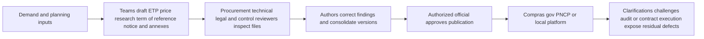
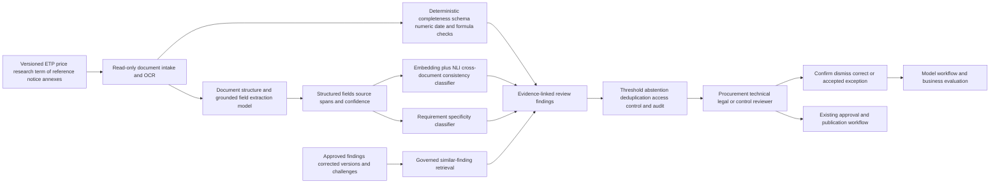

# PUBLIC-001 AI-assisted public-procurement document assurance before publication

## Classification

- **Segment:** Public sector and citizen services
- **Primary market / jurisdiction:** Brazil
- **Evidence reference date:** 2026-07-19; Brazilian procurement evidence and operating guidance reviewed through 2026-07-19, including TCU findings published 2026-05-08 and federal guidance updated 2026-07-03.
- **Index summary:** Brazilian public buyers can inspect draft ETPs, terms of reference, price research, and notices for missing evidence, inconsistent quantities, vague requirements, and cross-document contradictions before human approval and PNCP publication.
- **Company profile / size:** Federal, state, municipal, and para-state procurement units with recurring purchases, multidisciplinary review, and document publication through Compras.gov.br, PNCP, or integrated procurement platforms.
- **Opportunity type:** industry-solution
- **Status:** hypothesis
- **Confidence:** medium
- **Complexity:** medium
- **Horizon:** short
- **Risk:** regulated
- **Solution evidence level:** production
- **Operational maturity:** early
- **Azure fit:** high
- **AI dependency:** core
- **Primary AI role:** extraction
- **Intelligent capability:** Evidence-grounded procurement-document extraction, cross-document contradiction detection, requirement-specificity classification, and risk-ranked review findings
- **Repository alignment:** extend-kit

New opportunities normally start as `hypothesis`. The production evidence is from Brazilian external-control monitoring, not proof that this pre-publication assistant will achieve the same outcomes inside a buying organization.

## Problem

Public procurement teams prepare a connected package of documents such as the demand formalization, preliminary technical study, risk analysis, price research, term of reference, notice, qualification requirements, quantities, schedules, and annexes. Different authors, templates, spreadsheets, copied clauses, revisions, and legal or technical reviews can introduce omissions and contradictions.

The recurring process is document-heavy and time-constrained. Reviewers must verify whether the need, scope, quantities, pricing basis, obligations, acceptance criteria, deadlines, and qualification conditions remain consistent across files. Weak descriptions reduce market comparability; contradictory quantities or requirements can generate clarification requests, challenges, rework, delay, weak competition, unreliable estimates, and external-control findings.

## Brazil applicability and current context

Brazilian procurement planning is governed by Lei 14.133/2021. Its preparatory phase requires planning and consideration of technical, market, and management factors, beginning with a justified description of the public need. Federal guidance defines the Estudo Técnico Preliminar as the first planning stage that characterizes the public interest and supports the later term of reference or project.

On 8 May 2026, the Tribunal de Contas da União reported results from continuous monitoring of federal and para-state acquisitions conducted between June 2025 and March 2026. The TCU found weaknesses in procurement planning and price research, low-quality purchasing data, generic or imprecise descriptions that obstruct market-price comparison, and contradictions within notices, including requirements or quantities inconsistent with other document content.

The PNCP currently exposes procurement planning and contracting information for federal, state, and municipal entities, provides open data and APIs, and supports platform integration. This creates both a large document surface for comparison and a practical integration path, while responsibility for legality, procurement judgment, and publication remains with public officials.

Material local differences include federal versus subnational procedures, organization-specific templates, legal opinions, sector regulations, local price sources, Portuguese legal language, varying document maturity, and differing system access. The prototype must validate its checks against the target entity's applicable rules and document set rather than treating one federal template as universal.

## Evidence

### Confirmed problem evidence

- TCU monitoring published on 2026-05-08 found planning weaknesses, deficient price research, low-quality procurement data, generic descriptions that impede price comparison, and contradictions between requirements or quantities and the rest of procurement documents.
- Acórdão 1145/2026 records deficiencies in procurement planning and in data inserted into official systems, while recommending coordination of technology used for systematic monitoring.
- Lei 14.133/2021 makes planning central to the preparatory phase and requires a documented public need, while IN SEGES 58 defines the ETP as the foundation for subsequent procurement documents.
- Current PNCP services provide procurement documents, planning data, open data, and APIs across Brazilian government levels, supporting comparison and integration.

### Favorable solution evidence

- TCU reports that Alice 360 has operated since October 2025 and uses artificial intelligence and statistical methods to identify procurement risks, including when source data are imprecise.
- The 2025/2026 TCU continuous audit used PNCP, Compras.gov.br, and Diário Oficial data and detected document-quality and consistency problems at scale, showing that machine-assisted screening of Brazilian procurement records is operationally plausible.
- Structured document extraction, semantic similarity, natural-language-inference classification, anomaly scoring, and deterministic rule checks are mature enough for a bounded retrospective prototype over approved and challenged procurement packages.
- PNCP open data, APIs, published documents, standardized templates, and organizational process records provide possible grounding, comparison, and evaluation sources without requiring autonomous legal decision-making.

### Counter-evidence and limitations

- TCU's Alice 360 is an external-control system operating over broad public data. Its production status does not prove that the same models, labels, thresholds, or workflows will work for pre-publication quality assurance inside a purchasing organization.
- Low-quality source data are themselves a major finding. Missing annexes, scanned PDFs, inconsistent versioning, spreadsheet formulas, and organization-specific terminology can reduce extraction and contradiction accuracy.
- Procurement requirements may differ legitimately across files because one document summarizes another, later revisions supersede earlier text, or an exception is documented elsewhere. Naive contradiction detection can generate a burdensome false-positive queue.
- LLMs can produce plausible unsupported statements. The solution must not generate legal conclusions, invented obligations, or replacement clauses; every finding must point to exact source excerpts and abstain when evidence is insufficient.
- Strong template governance, mandatory fields, cross-reference identifiers, version control, deterministic validation, and disciplined human review may solve many common failures more cheaply.
- These limitations narrow the first prototype to evidence-linked review findings on a small set of document relationships, measured against a strengthened deterministic baseline.

### Inference

- A pre-publication assistant can complement, rather than duplicate, Alice 360 by moving selected quality checks earlier in the lifecycle, when procurement teams can still correct the package before publication.
- The most defensible initial value is reducing reviewer search effort and finding high-confidence cross-document inconsistencies, not determining legality or predicting corruption.
- Entity-specific labels can be created from reviewer findings, clarification requests, challenges, suspended notices, audit observations, and corrected document versions, but label quality must be tested.

### Unknowns

- Access to draft documents, revision history, spreadsheets, reviewer comments, legal opinions, and final approved packages.
- The proportion of historical issues that deterministic templates and rules already detect.
- Whether external-control findings can be linked reliably to the exact source passages and document versions that caused them.
- Acceptable false-positive burden for procurement, technical, legal, and control reviewers.
- Variation in document structure, terminology, and applicable rules across entity, procurement category, and modality.
- Integration effort with SEI, Compras.gov.br, internal workflow platforms, document repositories, and PNCP-connected systems.

### Sources

- [Fiscalização do TCU acompanha compras públicas federais entre 2025 e 2026](https://portal.tcu.gov.br/imprensa/noticias/fiscalizacao-do-tcu-acompanha-compras-publicas-federais-entre-2025-e-2026) — Brazil; published 2026-05-08; current problem evidence, detected document defects, and operational AI monitoring context.
- [Acórdão 1145/2026 - Plenário](https://pesquisa.apps.tcu.gov.br/resultado/todas-bases/intelig%25C3%25AAncia%2520artificial?pb=noticia) — Brazil; session 2026-05-06; official continuous-procurement-monitoring finding and coordination direction.
- [IA reforça controle de compras públicas no TCU com o Alice 360](https://ia.tcu.gov.br/noticia.html?slug=alice-360-reforca-controle-compras-publicas) — Brazil; published 2026-04-14; production solution plausibility, operational since October 2025.
- [Lei 14.133/2021](https://www.planalto.gov.br/ccivil_03/_ato2019-2022/2021/lei/l14133.htm) — Brazil; current law; preparatory-phase planning and procurement-document obligations.
- [IN SEGES 58/2022](https://www.gov.br/compras/pt-br/acesso-a-informacao/legislacao/instrucoes-normativas/instrucao-normativa-seges-no-58-de-8-de-agosto-de-2022) — Brazil; current federal guidance; ETP role and scope.
- [Orientação sobre estimativa preliminar do Plano de Contratações Anual](https://www.gov.br/compras/pt-br/agente-publico/orientacoes-e-procedimentos/35-orientacao-sobre-procedimento-simplificado-para-estimar-o-valor-preliminar-da-contratacao-para-plano-de-contratacoes-anual) — Brazil; updated 2026-07-03; current price-estimation operating guidance.
- [Portal Nacional de Contratações Públicas](https://www.gov.br/pncp/pt-br) — Brazil; current through 2026-07-19; document, open-data, API, and integration context.
- [Evaluating large language models for accuracy incentivizes hallucinations](https://www.nature.com/articles/s41586-026-10549-w) — international; published 2026-04-22; limitation evidence requiring abstention, grounding, and human verification.

## Current process

## Baseline without AI

- **Current baseline:** Templates, checklists, mandatory workflow stages, spreadsheet review, legal and technical review, peer review, procurement-system validations, and official accountability.
- **Strongest realistic non-AI alternative:** Enforce version-controlled templates, structured fields, cross-document identifiers, mandatory traceability, schema validation, deterministic consistency rules, and a unified reviewer checklist before introducing models.
- **Baseline strengths:** Transparent, legally understandable, inexpensive for known rules, straightforward to audit, and reliable for required fields and exact numerical equality.
- **Baseline limitations:** Cannot economically encode every paraphrase, implicit dependency, vague requirement, semantic mismatch, copied clause, or contextual contradiction across long heterogeneous documents.
- **Context where intelligence may add incremental value:** Ranking evidence-linked semantic inconsistencies, incomplete reasoning, vague requirements, and similar historical findings that deterministic checks miss.
- **Condition where the non-AI baseline should be preferred:** When documents are highly structured, rules cover nearly all material defects, extraction quality is weak, or model findings create more review work than they save.

The prototype must measure incremental findings and reviewer effort after the deterministic baseline is strengthened.

## Proposed solution

Add a read-only quality-assurance step before final procurement approval. The service ingests a bounded package of draft documents and identifies document type, sections, tables, entities, quantities, dates, obligations, acceptance criteria, price evidence, and cross-references. Deterministic checks validate required files, identifiers, exact values, date order, formulas, and known organizational rules.

Models then compare semantically related fields and passages across the ETP, price research, term of reference, notice, and annexes. They classify likely contradictions, vague or non-measurable requirements, unsupported claims, stale copied text, and missing traceability. Each finding includes source excerpts, document versions, confidence, check type, and a reviewer action such as confirm, dismiss, correct, or mark as an accepted exception.

The system does not approve procurement, determine legality, rewrite the official package, calculate the final price, publish to PNCP, or execute any procurement-system action. Authorized procurement, technical, legal, and control personnel remain responsible for interpretation, correction, approval, and publication.

## Where AI enters

### AI role map

| Process stage | AI component | AI type / model family | What it does | Runtime mode | Output | Human or deterministic control |
| --- | --- | --- | --- | --- | --- | --- |
| Document intake | Procurement structure extractor | Document intelligence model plus constrained LLM/foundation-model extraction | Identifies document type, sections, tables, entities, quantities, dates, obligations, criteria, and cited evidence from Portuguese procurement files | Asynchronous batch, pre-publication | Structured fields with source spans and extraction confidence | Schema validation, required-field rules, source-span requirement, abstention, reviewer correction |
| Cross-document review | Semantic consistency classifier | Embeddings plus natural-language-inference or cross-encoder classification | Compares related passages and classifies likely agreement, contradiction, unsupported dependency, or insufficient evidence | Asynchronous batch | Ranked finding with paired excerpts, relation class, and confidence | Exact-value checks run first; confidence threshold; reviewer confirms or dismisses |
| Requirement review | Specificity and measurability classifier | Supervised text classifier or fine-tuned language encoder | Flags vague descriptions, unmeasurable acceptance criteria, copied text, and requirements lacking traceable justification | Asynchronous batch | Risk label, rationale category, and evidence excerpt | Approved taxonomy, human review, no automatic text replacement |
| Historical comparison | Similar-finding retrieval | Embeddings and governed retrieval | Retrieves similar corrected packages, clarification questions, challenges, and audit findings from approved organizational history | Interactive review | Similar cases and exact source references | Access control, metadata filters, source allowlist, reviewer interpretation |

### Required distinctions

- **Primary AI role:** Extraction, classification, and ranking/recommendation of review findings.
- **Model family:** Document intelligence model; embeddings and retrieval; natural-language-inference or cross-encoder classifier; supervised language encoder; constrained LLM/foundation model only for evidence-bound structured extraction when simpler extraction is insufficient.
- **Training requirement:** Begin with pretrained extraction, embeddings, and zero/few-shot classification; create a reviewer-labeled evaluation set; fine-tune classifiers only if the bounded prototype shows enough consistent labels.
- **Training location and cadence:** Offline initial calibration per entity and document family; periodic retraining after approved reviewer feedback and drift review; no online self-training from unverified feedback.
- **Inference location:** Cloud or private batch pipeline inside the entity's controlled environment before publication; no public model endpoint receives confidential drafts without an approved data boundary.
- **Agent role:** Agent not used. The solution has no autonomous planning loop, tool selection, document editing, approval, or publication action.
- **LLM role:** Used only when needed for source-grounded structured extraction or relation classification. It does not draft legal conclusions, invent requirements, or decide compliance.
- **Non-LLM intelligence:** Document layout recognition, embeddings, retrieval, cross-encoder or NLI classification, supervised specificity classification, and anomaly/risk ranking.
- **Not AI:** File completeness rules, schema validation, exact numerical checks, formula verification, date ordering, workflow orchestration, access control, audit logs, dashboards, reviewer decisions, approval, and PNCP publication.

## Intelligent capability details

- **Technique / model family:** Document layout and table extraction; constrained structured extraction; embeddings and governed retrieval; NLI/cross-encoder contradiction classification; supervised requirement-specificity classification; calibrated ranking.
- **Why it is necessary:** Rules handle known exact requirements but cannot economically compare paraphrased obligations, implicit dependencies, vague descriptions, and semantic contradictions across heterogeneous long documents.
- **Inputs:** Draft ETP, demand document, risk analysis, price research, term of reference, notice, annexes, spreadsheets, templates, applicable checklists, historical corrected packages, clarification requests, challenges, and audit findings.
- **Outputs:** Structured procurement fields; source-linked missing-evidence alerts; paired contradiction candidates; vague-requirement findings; similar historical cases; confidence; abstention; and reviewer disposition.
- **Training / grounding / optimization assumptions:** Ground every finding in exact source spans; bootstrap with deterministic weak labels and expert-labeled historical issues; stratify by procurement category and document family; prevent post-outcome leakage; calibrate thresholds to reviewer capacity.
- **Evaluation:** Extraction field accuracy, table-cell accuracy, contradiction precision/recall, specificity-classification precision, source-grounding accuracy, calibration, abstention, incremental findings over deterministic rules, reviewer minutes, and correction acceptance.
- **Fallback and controls:** Rule-only checklist, source-span requirement, no unsupported generated text, confidence thresholds, abstention, read-only operation, human disposition, version pinning, audit trail, and immediate fallback to the existing approval process.

## Data and integration assumptions

- **Data owners and access path:** Procurement, requesting business unit, technical team, legal counsel, internal control, records management, and IT; access through document repositories, SEI or equivalent process systems, procurement workflow, and approved exports.
- **Expected volume, history, frequency, and coverage:** Hundreds to thousands of document packages per year depending on entity size; prototype may use 100-300 historical packages from one procurement family plus 30-50 expert-reviewed packages.
- **Labels, outcomes, feedback, or simulation available:** Reviewer findings, corrected versions, clarification requests, challenges, suspensions, audit findings, accepted exceptions, and final publication status; expert relabeling is required.
- **Known quality, imbalance, missingness, and leakage risks:** Scanned PDFs, missing annexes, broken tables, copied clauses, inconsistent versions, few confirmed material defects, reviewer disagreement, post-publication findings leaking into training, and heterogeneous templates.
- **Brazilian or local-context representativeness:** Portuguese procurement terminology, Lei 14.133 context, applicable entity rules, local templates, procurement modalities, categories, and price sources must be represented.
- **Privacy, retention, consent, surveillance, or sharing constraints:** Drafts may contain confidential estimates, personal data, commercial information, security requirements, or privileged legal analysis; enforce LGPD, access control, retention, encryption, and model-provider data boundaries.
- **Integration and synchronization assumptions:** Versioned document package, stable process identifier, source-system timestamps, approved template/checklist registry, and reviewer feedback API or export.
- **Drift and change sources:** Legal and regulatory updates, template revisions, procurement-system changes, new categories, organization restructuring, terminology changes, and reviewer policy changes.
- **Minimum viable data for a prototype:** One organization, one or two procurement categories, 100-300 versioned historical packages, deterministic checklist, 30-50 expert-reviewed packages, and a labeled set of at least 150-300 candidate findings across normal, contradictory, vague, and insufficient-evidence classes.

## Prototype validation plan

- **Prototype scope / process slice:** Read-only pre-publication review of ETP, price research, term of reference, notice, and one structured annex for one procurement category.
- **Users, sites, assets, documents, events, or simulated cases:** One procurement unit; 5-10 procurement, technical, legal, and control reviewers; historical replay plus 4-6 weeks of shadow review.
- **Baseline or comparison:** Strengthened templates, required fields, exact-value and date checks, structured checklist, and normal human review.
- **Required data and integrations:** Versioned document export, checklist/template registry, selected historical findings, reviewer feedback capture, and optional PNCP retrieval for comparable published packages.
- **Model-quality metrics:** Field extraction F1, table accuracy, contradiction precision/recall, requirement-specificity precision, source-grounding accuracy, calibration error, abstention rate, and performance by document type.
- **Business or workflow metrics:** Reviewer minutes per package, accepted material findings, defects found before publication, repeated correction cycles, clarification or challenge causes detected retrospectively, and cost per reviewed package.
- **Human acceptance, correction, or override metrics:** Finding acceptance, dismissal, correction, accepted-exception, duplicate-finding, unsupported-rationale, and reviewer disagreement rates.
- **Safety and compliance boundaries:** Read-only; no legal conclusion; no automated procurement approval, rejection, scoring of suppliers, document replacement, system submission, or PNCP publication.
- **Failure or redesign criteria:** Stop or narrow when extraction cannot preserve source traceability, high-severity finding precision is below the agreed reviewer threshold, the queue increases total review time, findings merely duplicate deterministic rules, or performance varies unacceptably across categories.
- **Evidence required before a pilot or broader implementation:** Repeatable incremental findings over the deterministic baseline, acceptable false-positive burden, reviewer time benefit, stable source grounding, legal and privacy approval, and successful replay on a second period or procurement family.

Do not claim avoided loss or reduced procurement time until measured against the local baseline.

## Macro architecture

No agent node exists. The models extract, compare, classify, retrieve, and rank; deterministic workflow and authorized officials retain all actions and decisions.

## Capabilities and possible technologies

- Application and workflow capabilities: Versioned package intake, evidence-linked review cards, reviewer disposition, shadow comparison, audit history, and controlled export.
- Data capabilities: OCR and table extraction, document segmentation, structured procurement schema, version history, labeled findings, retrieval index, and evaluation dataset.
- Integration capabilities: SEI or equivalent document-process export, procurement platform APIs, file repositories, spreadsheet parsing, PNCP open data, and reviewer workflow.
- Required AI / ML capabilities: Document extraction, semantic relation classification, requirement-specificity classification, similar-case retrieval, calibrated risk ranking, and abstention.
- Training, grounding, recognition, or optimization capabilities: Source-span grounding, weak-label bootstrapping, expert golden set, per-document-family evaluation, periodic fine-tuning, calibration, and drift monitoring.
- Agent and tool-use capabilities, or `not used`: Not used.
- LLM / foundation-model capabilities, or `not used`: Optional constrained structured extraction and relation classification over supplied documents; no autonomous drafting or legal judgment.
- Evaluation and model-operations capabilities: Dataset versioning, offline replay, shadow mode, threshold analysis, error taxonomy, subgroup analysis by document type, model registry, and rollback.
- Security and governance capabilities: Private networking, managed identity, least privilege, confidential-document controls, encryption, Purview classification, audit logs, retention, and model-provider data governance.
- Azure services that may fit: Azure AI Document Intelligence, Azure AI Search, Azure Machine Learning or Azure Databricks, Azure OpenAI with structured outputs where approved, Azure Functions or Container Apps, Azure Storage, Azure SQL or PostgreSQL, Microsoft Purview, Azure Monitor, and Microsoft Entra ID.
- Non-Azure or open-source alternatives worth considering: Tesseract or PaddleOCR, Docling, Apache Tika, Unstructured, sentence-transformers, cross-encoders, PostgreSQL with pgvector, OpenSearch, MLflow, FastAPI, and object storage.

## Possible gains

- Earlier correction of material document inconsistencies before publication.
- Reduced reviewer search effort across long and heterogeneous procurement packages.
- More consistent application of organizational checklists and historical lessons.
- Better traceability between findings, source passages, corrections, and accepted exceptions.
- Reusable quality signals for procurement training, templates, and process improvement.
- Lower dependence on a few reviewers remembering every prior clarification, challenge, or audit issue.

## Metrics for validation

### Business and operational metrics

- Reviewer minutes per document package compared with the strengthened non-AI baseline.
- Accepted material findings per package and incremental findings not produced by deterministic checks.
- Number of correction cycles before approval.
- Retrospective coverage of clarification requests, challenges, suspensions, and audit findings.
- Packages processed, queue age, reviewer workload, and cost per reviewed package.

### Intelligent-capability metrics

- Extraction precision, recall, and table-cell accuracy with exact source-span grounding.
- Contradiction and insufficient-evidence precision/recall by document relationship.
- Requirement-specificity classification precision and false-positive burden.
- Ranking quality, calibration error, abstention rate, and duplicate-finding rate.
- Reviewer acceptance, dismissal, correction, accepted-exception, and unsupported-rationale rates.
- Incremental performance and effort change versus rules plus manual review.

## Risks, limits, and controls

- Privacy and sensitive data: Procurement drafts may contain confidential estimates, personal data, privileged analysis, security requirements, and commercial information; use controlled processing and least privilege.
- Brazilian regulatory or policy constraints: The tool must reflect the applicable entity, modality, category, Lei 14.133 rules, and current federal or subnational guidance without claiming universal legal interpretation.
- Human decision boundaries: Authorized officials retain technical judgment, legal analysis, corrections, approval, supplier decisions, and publication.
- Model or policy failure modes: OCR errors, table misalignment, missed annexes, false contradictions, failure to recognize superseded versions, category drift, and overconfident requirement classification.
- Agent or tool-execution failure modes, when applicable: Not applicable; no agent or autonomous tool execution is used.
- LLM hallucination, grounding, or prompt-injection risks, when applicable: Require source spans and structured outputs, isolate document instructions from system controls, prohibit unsupported citations and legal conclusions, and abstain when evidence is incomplete.
- Comparable failures and applicable lessons: External-control production evidence does not establish internal pre-publication performance; measure local incremental value and do not attribute broader audit outcomes to one model.
- Bias, drift, weak labels, or insufficient feedback: Reviewer practices vary; maintain an adjudicated evaluation set and measure by document type, category, modality, and reviewer group.
- Integration and data risks: Version identity, annex completeness, spreadsheet formulas, scanned files, and access to reviewer outcomes may dominate prototype effort.
- Adoption and change-management risks: A large low-value queue will be ignored; begin with a few high-confidence finding types and evidence-first review cards.
- Prototype cost or operational assumptions: Main drivers are OCR, document parsing, expert labeling, integration, secure inference, retrieval indexing, evaluation, and reviewer time.

## Fit score

Technical feasibility means whether a bounded prototype can be built and meaningfully tested, not whether production success is already proven.

| Dimension | Score | Rationale |
| --- | ---: | --- |
| Problem evidence and relevance | 19/20 | Current TCU monitoring identifies concrete planning, pricing, data-quality, description, and contradiction defects in Brazilian procurement documents. |
| Business or operational value | 18/20 | Earlier evidence-linked correction can reduce reviewer search and avoid rework, while outcomes are measurable before and after publication. |
| Technical feasibility | 17/20 | Brazilian operational AI monitoring, PNCP data, mature extraction and semantic-classification patterns, and a bounded replay path support testing; local labels and document quality remain material unknowns. |
| Reuse potential | 18/20 | The pattern applies to federal, state, municipal, para-state, grant, regulatory, and other governed document-review workflows. |
| Strategic differentiation | 17/20 | Semantic consistency, vague-requirement classification, and historical-finding retrieval add value beyond exact rules when grounded in source excerpts. |
| **Total** | **89/100** | Strong prototype candidate with regulated human accountability and explicit false-positive, grounding, and data-quality controls. |

## Repository relationship

- Existing references that may be reused: Document AI portal, OCR/document extraction, RAG/search, structured outputs, workflow integration, evaluation, identity, and governance examples where present.
- Missing capabilities exposed by this opportunity: Cross-document relation evaluation, evidence-span review cards, contradiction golden set, reviewer disposition capture, and pre-publication shadow evaluator.
- Potential building blocks: Versioned document-package contract, grounded field extractor, deterministic procurement-check framework, semantic consistency classifier, evidence-linked finding schema, and reviewer-feedback component.
- Potential composed solution: Public-procurement document-assurance reference solution combining document intelligence, rules, semantic classifiers, retrieval, evaluation, and governed human review.
- Reasons to keep it outside the current kit, when applicable: Entity-specific legal rules, procurement templates, SEI integrations, and official approval workflows should remain solution-level adapters rather than generic core modules.

## Duplicate control

- **Problem keys:** public-procurement-planning, tender-document-quality, cross-document-contradictions, vague-requirements, price-research-evidence, pre-publication-review
- **Capability keys:** procurement-document-extraction, semantic-consistency-classification, requirement-specificity-classification, evidence-grounded-findings, similar-finding-retrieval
- **Research queries used:** site:gov.br 2025 2026 TCU compras públicas irregularidades contratos fiscalização inteligência artificial; site:gov.br compras públicas Lei 14.133 planejamento estudo técnico preliminar pesquisa de preços PNCP 2026; site:tcu.gov.br Alice 360 inteligência artificial compras públicas funcionamento limitações 2026; public procurement document quality AI contradiction detection tender documents research false positives; LLM legal document review hallucination procurement documents human review research 2025 2026.
- **Related opportunities:** CROSS-001 also reconciles evidence across systems, but it addresses employee offboarding and access residues. This opportunity addresses regulated procurement planning packages before publication.
- **Uniqueness statement:** PUBLIC-001 targets evidence-linked quality assurance across ETPs, price research, terms of reference, notices, and annexes before procurement approval; it is not a generic legal copilot, supplier-scoring system, corruption detector, or post-publication external-audit platform.

## Next decision

- shortlist for review.

The shortlist recommendation authorizes no implementation. It means the problem is current, the intelligent capability is material, and a bounded read-only prototype can test incremental value against strengthened deterministic controls and normal human review.