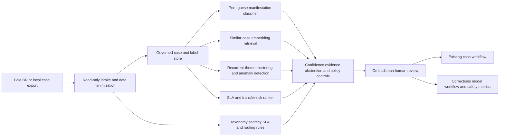

# PUBLIC-002 AI-assisted ombudsman triage and service-failure assurance

## Classification

- **Segment:** public-sector
- **Primary market / jurisdiction:** Brazil
- **Evidence reference date:** 2026-07-20; Brazilian official sources updated from 2025-12-15 through 2026-05-27
- **Index summary:** Brazilian public bodies can classify, cluster, and rank ombudsman manifestations to detect recurrent service failures and SLA risk while civil servants retain routing, response, investigation, and remedy authority.
- **Company profile / size:** Federal, state, and municipal bodies operating citizen-service or ombudsman channels
- **Opportunity type:** operations
- **Status:** hypothesis
- **Confidence:** medium
- **Complexity:** medium
- **Horizon:** short
- **Risk:** regulated
- **Solution evidence level:** prototype
- **Operational maturity:** unvalidated
- **Azure fit:** high
- **AI dependency:** core
- **Primary AI role:** classification
- **Intelligent capability:** Portuguese-language manifestation classification, semantic clustering, recurrent-failure detection, and SLA-risk ranking with source-grounded evidence
- **Repository alignment:** new-solution

## Problem

Public-sector ombudsman teams receive complaints, requests, reports, suggestions, compliments, and simplification proposals through channels such as Fala.BR. Staff must classify each manifestation, identify the responsible unit, detect duplicates or related cases, protect sensitive content, monitor deadlines, and find recurrent service failures. Manual triage and fragmented dashboards can delay routing, obscure systemic patterns, and consume specialist time that should be used for investigation and service improvement.

## Brazil applicability and current context

Brazil has a formal nationwide ombudsman operating model. The Fala.BR service, updated on 15 December 2025, supports receipt, routing, and response for multiple manifestation types. The CGU service page, modified on 14 May 2026, confirms categories including denunciation, complaint, suggestion, compliment, request, and simplification. A Codevasf page updated on 27 May 2026 describes the operational responsibilities to receive, investigate, respond, forward, and monitor these cases. In March 2026, the Ministry of Communications reported more than two thousand manifestations during 2025 handled by nine staff across three teams, illustrating a concrete workload and specialization pattern.

The opportunity is not an automated decision or citizen-facing answer generator. It is an internal assurance layer that proposes classification, related-case groups, recurrent-service-failure signals, and deadline-risk priorities for civil-servant review. Brazilian legal, access-control, secrecy, personal-data, archival, and response obligations remain deterministic and institutionally governed.

## Evidence

### Confirmed problem evidence

- Fala.BR supports receipt, processing, and response for complaints, reports, requests, suggestions, compliments, and simplification proposals across federal public bodies.
- Current ombudsman responsibilities include receiving, examining, forwarding, investigating, responding, and monitoring manifestations.
- The Ministry of Communications reported over two thousand manifestations in 2025 handled by nine staff divided across access-to-information, reports, and other manifestation workflows.
- Serpro described persistent public-service pain involving long queues, fragmented contact points, inconsistent responses, and overloaded civil servants in October 2025.

### Favorable solution evidence

- Text classification can propose manifestation type and responsible-unit routing from historical reviewed cases.
- Embeddings and constrained clustering can identify semantically related complaints that use different wording, supporting recurrent-failure analysis.
- Calibrated prediction can rank cases at risk of deadline breach using queue age, routing history, topic, unit workload, and prior transfers.
- The existing Brazilian Dialoga platform demonstrates current local institutional interest in integrated, AI-assisted public-service interaction, although this opportunity targets internal ombudsman assurance rather than conversational self-service.

### Counter-evidence and limitations

- Semantic similarity does not prove that cases share a cause, responsible unit, legal treatment, or remedy.
- Human oversight alone can create automation bias; reviewers may accept plausible classifications without examining the original manifestation.
- Sensitive reports, vulnerable citizens, anonymity, protected identities, and small cohorts create privacy and re-identification risks.
- Historical routing can encode organizational mistakes and inconsistent taxonomies, causing the model to reproduce poor practice.
- Therefore the prototype must expose source excerpts, confidence, alternatives, and abstention; prohibit automatic closure or response; and evaluate reviewers' correction behavior rather than assuming nominal human approval is effective.

### Inference

- A bounded internal triage assistant may create incremental value where free-text volume, transfers, topic drift, and recurrent failures exceed the capacity of deterministic keyword rules.
- The strongest early value is likely fewer avoidable transfers and earlier recognition of repeated service failures, not autonomous citizen communication.

### Unknowns

- Local volume, class balance, taxonomy stability, transfer frequency, deadline-breach rate, and availability of adjudicated outcomes.
- Whether related-case clustering produces actionable service improvements rather than visually compelling but operationally weak themes.
- Integration effort with Fala.BR exports, local case-management systems, identity controls, and institutional records policies.

### Sources

- [Registrar Manifestações de Ouvidoria na Plataforma Fala.BR](https://www.gov.br/pt-br/servicos/registrar-denuncias-reclamacoes-sugestoes-elogios-ou-solicitacoes-a-orgaos-publicos-federais) — Brazil; updated 2025-12-15; current operating process.
- [Registrar manifestação de ouvidoria junto à CGU](https://www.gov.br/pt-br/servicos/registrar-manifestacao-no-sistema-de-ouvidorias-do-poder-executivo-federal) — Brazil; modified 2026-05-14; official manifestation categories.
- [Ouvidoria — Codevasf](https://www.gov.br/codevasf/pt-br/acesso-a-informacao/participacao-social/ouvidoria) — Brazil; modified 2026-05-27; responsibilities and channels.
- [Ouvidoria é a ponte entre o cidadão e as instituições públicas](https://www.gov.br/mcom/pt-br/noticias/2026/marco/ouvidoria-e-a-ponte-entre-o-cidadao-e-as-instituicoes-publicas-um-canal-de-escuta-ativa-para-aprimorar-os-servicos-oferecidos-pelo-estado) — Brazil; 2026-03; current workload and staffing example.
- [Atendimento público: como reduzir filas, agilizar respostas e fortalecer a confiança do cidadão?](https://www7.serpro.gov.br/menu/noticias/noticias-2025/serpro-dialoga) — Brazil; 2025-10-08; local problem and solution plausibility.
- [The Flaws of Policies Requiring Human Oversight of Government Algorithms](https://arxiv.org/abs/2109.05067) — international research; limitation concerning ineffective nominal oversight.
- [Human-AI Interactions in Public Sector Decision-Making](https://arxiv.org/abs/2103.02381) — international research; automation-bias and selective-adherence limitation.

## Current process

## Baseline without AI

- **Current baseline:** Manual reading, category selection, unit routing, deadline queues, and spreadsheet or BI reporting.
- **Strongest realistic non-AI alternative:** Controlled taxonomy, mandatory structured fields, deterministic keyword and entity rules, duplicate hashes, routing tables, SLA alerts, and conventional dashboards.
- **Baseline strengths:** Transparent, inexpensive, easy to audit, and reliable for stable categories and exact identifiers.
- **Baseline limitations:** Weak on paraphrases, multi-topic narratives, emerging themes, implicit service failures, and noisy historical routing.
- **Context where intelligence may add incremental value:** High free-text volume, repeated transfers, changing vocabulary, many service units, and a need to find recurrent cross-case patterns.
- **Condition where the non-AI baseline should be preferred:** Low-volume workflows, stable categories, exact forms, or insufficient reviewed history.

## Proposed solution

Add an internal read-only assurance service after intake. Deterministic controls validate metadata, secrecy markers, identity scope, deadlines, and permitted routing destinations. A Portuguese-language classifier proposes manifestation type and responsible units; an embedding model retrieves similar reviewed cases; clustering and anomaly components identify recurrent or emerging service-failure themes; and a calibrated ranking model prioritizes deadline and transfer risk. Reviewers see the original text, highlighted evidence, confidence, alternatives, and policy constraints before accepting or correcting a proposal.

The service never sends a citizen response, closes a case, determines whether an allegation is true, reveals protected identities, or applies a remedy. Human corrections become governed feedback only after quality review.

## Where AI enters

### AI role map

| Process stage | AI component | AI type / model family | What it does | Runtime mode | Output | Human or deterministic control |
| --- | --- | --- | --- | --- | --- | --- |
| Intake triage | Manifestation classifier | Supervised classical ML or fine-tuned Portuguese text encoder | Proposes manifestation type and responsible-unit candidates | Asynchronous online | Ranked labels with confidence and evidence spans | Allowed labels, confidence threshold, abstention, reviewer confirmation |
| Case comparison | Similar-case retrieval | Embeddings/retrieval | Finds semantically related reviewed manifestations | Online retrieval | Ranked related cases | Access filters, time window, secrecy boundary, reviewer inspection |
| Service-failure learning | Recurrent-theme detector | Embedding clustering and anomaly detection | Groups repeated complaints and flags emerging themes | Daily batch | Candidate clusters and trend signals | Minimum cohort size, deterministic counts, analyst validation |
| Queue assurance | SLA and transfer-risk ranker | Gradient boosting or calibrated learning-to-rank | Prioritizes cases likely to breach deadlines or bounce between units | Hourly batch | Review-priority score and factors | SLA rules, protected-case policies, queue manager override |

### Required distinctions

- **Primary AI role:** classification, retrieval, anomaly detection, and ranking/recommendation.
- **Model family:** supervised text classification, Portuguese embeddings/retrieval, clustering or anomaly detection, and gradient boosting or learning-to-rank.
- **Training requirement:** supervised training for classification and ranking; pretrained embeddings with local evaluation; clustering without outcome labels.
- **Training location and cadence:** initial offline training on reviewed local cases; quarterly or drift-triggered retraining after adjudication.
- **Inference location:** private cloud or controlled batch pipeline.
- **Agent role:** not used.
- **LLM role:** not used in the initial prototype.
- **Non-LLM intelligence:** text classification, embeddings, clustering, anomaly detection, calibrated prediction, and ranking.
- **Not AI:** Fala.BR or case APIs, databases, identity and access, secrecy rules, taxonomy, SLA calculations, routing allowlists, queues, dashboards, notifications, audit logs, and all official decisions.

## Intelligent capability details

- **Technique / model family:** Portuguese text encoder or TF-IDF/linear baseline, sentence embeddings, density-based clustering, gradient boosting, and calibrated ranking.
- **Why it is necessary:** Exact keyword rules cannot reliably connect paraphrased manifestations, implicit failures, and multi-topic narratives across organizational units.
- **Inputs:** Manifestation text, reviewed category, routing history, timestamps, unit, transfers, service identifiers, permitted metadata, and final disposition codes.
- **Outputs:** Ranked categories and units, related cases, candidate recurrent themes, SLA-risk score, confidence, evidence spans, and abstention reason.
- **Training / grounding / optimization assumptions:** Reviewed historical cases exist; taxonomies can be versioned; sensitive fields can be minimized; labels receive quality sampling.
- **Evaluation:** Macro-F1, per-class recall, calibration error, retrieval precision@k, cluster purity and analyst usefulness, NDCG for queue ranking, and comparison with rules plus manual triage.
- **Fallback and controls:** Rule-only routing, manual queue, abstention, access filtering, original-text display, correction logging, rollback to prior model, and periodic independent sampling.

## Data and integration assumptions

- **Data owners and access path:** Ombudsman authority and each participating public body through approved exports or APIs.
- **Expected volume, history, frequency, and coverage:** At least several thousand reviewed manifestations across 12 months for the first bounded institution; daily intake.
- **Labels, outcomes, feedback, or simulation available:** Categories, responsible units, transfers, timestamps, deadline outcomes, reviewer corrections, and case closure codes.
- **Known quality, imbalance, missingness, and leakage risks:** Rare reports, inconsistent routing, taxonomy changes, copied boilerplate, post-outcome notes leaking final disposition, and multiple valid units.
- **Brazilian or local-context representativeness:** Models require Brazilian Portuguese and institution-specific service taxonomy; cross-body transfer is not assumed.
- **Privacy, retention, consent, surveillance, or sharing constraints:** Data minimization, strict purpose limitation, secrecy and anonymity controls, small-cohort suppression, private processing, and auditable access.
- **Integration and synchronization assumptions:** Read-only prototype through exported case records; no production write-back initially.
- **Drift and change sources:** New services, organizational restructuring, campaigns, emergencies, policy changes, seasonal demand, and evolving citizen vocabulary.
- **Minimum viable data for a prototype:** 3,000 reviewed cases with text, category, unit, timestamps, transfers, and deadline outcome, or a smaller stratified golden set plus shadow evaluation.

## Prototype validation plan

- **Prototype scope / process slice:** One public body's complaint and request categories; read-only triage and recurrent-theme dashboard.
- **Users, sites, assets, documents, events, or simulated cases:** 4–8 ombudsman reviewers and 3,000–10,000 historical cases.
- **Baseline or comparison:** Manual triage plus taxonomy, keyword rules, routing table, and deterministic SLA queue.
- **Required data and integrations:** Sanitized historical export and daily read-only batch; no citizen-facing integration.
- **Model-quality metrics:** Macro-F1, worst-class recall, calibration error, precision@5 for related cases, cluster usefulness, NDCG, false-priority rate, and abstention rate.
- **Business or workflow metrics:** Median triage time, avoidable transfer rate, deadline-breach rate, age of unreviewed cases, and time to confirm recurrent service failures.
- **Human acceptance, correction, or override metrics:** Acceptance with evidence review, correction rate, reviewer disagreement, ignored-source rate, and automation-bias audit samples.
- **Safety and compliance boundaries:** No automatic response, closure, allegation validation, sanction, eligibility decision, identity disclosure, or remedy.
- **Failure or redesign criteria:** No improvement over rules; material degradation in rare or protected categories; low cluster usefulness; systematic subgroup or unit errors; reviewers accepting outputs without inspecting evidence; or operational burden exceeding saved effort.
- **Evidence required before a pilot or broader implementation:** Stable performance across time splits, privacy and security review, taxonomy governance, successful shadow operation, documented rollback, and measured workflow improvement.

## Macro architecture

## Capabilities and possible technologies

- Application and workflow capabilities: Review queue, evidence display, corrections, audit, and read-only dashboards.
- Data capabilities: Governed operational store, taxonomy versions, label lineage, and de-identification.
- Integration capabilities: Fala.BR or institutional export/API, identity provider, and BI integration.
- Required AI / ML capabilities: Text classification, embedding retrieval, clustering, anomaly detection, calibrated prediction, and ranking.
- Training, grounding, recognition, or optimization capabilities: Offline supervised training, local golden set, temporal evaluation, and drift monitoring.
- Agent and tool-use capabilities, or `not used`: not used.
- LLM / foundation-model capabilities, or `not used`: not used initially.
- Evaluation and model-operations capabilities: Azure Machine Learning or MLflow, model registry, batch evaluation, calibration, and monitoring.
- Security and governance capabilities: Managed identity, private endpoints, Key Vault, RBAC, encryption, audit logs, and data-retention controls.
- Azure services that may fit: Azure Machine Learning, Azure AI Search, Azure Functions or Container Apps, Azure SQL or PostgreSQL, Blob Storage, Entra ID, Key Vault, Monitor, and Power BI.
- Non-Azure or open-source alternatives worth considering: scikit-learn, sentence-transformers, PostgreSQL/pgvector, MLflow, FastAPI, and Apache Superset.

## Possible gains

- Reduce avoidable manual transfers and repeated reading without automating official decisions.
- Surface recurrent service failures earlier across differently worded manifestations.
- Focus reviewer attention on deadline and routing risk while preserving deterministic obligations.
- Produce measurable feedback about taxonomy quality and organizational bottlenecks.

## Metrics for validation

### Business and operational metrics

- Triage time and avoidable transfer rate versus the deterministic baseline.
- Deadline-breach rate, backlog age, recurrent-theme confirmation time, and analyst effort per confirmed issue.

### Intelligent-capability metrics

- Macro-F1, worst-class recall, calibration, precision@k, cluster purity/usefulness, NDCG, abstention, and false-priority rate.
- Human acceptance, correction, override, evidence-inspection, and reviewer-disagreement rates.

## Risks, limits, and controls

- Privacy and sensitive data: Minimize text and metadata; preserve anonymity and secrecy; suppress small groups; prohibit unrestricted semantic search.
- Brazilian regulatory or policy constraints: Institution-specific legal review, records policy, LGPD controls, access-to-information rules, and official ombudsman procedures remain authoritative.
- Human decision boundaries: Humans own classification, routing, investigation, response, closure, service remedy, and any adverse consequence.
- Model or policy failure modes: Misclassification, historically biased routing, topic collapse, unstable clusters, over-prioritization, and poor calibration.
- Agent or tool-execution failure modes, when applicable: Agent not used.
- LLM hallucination, grounding, or prompt-injection risks, when applicable: LLM not used initially.
- Comparable failures and applicable lessons: Nominal human review can fail through automation bias; require source inspection, alternatives, sampling, and institutional oversight.
- Bias, drift, weak labels, or insufficient feedback: Evaluate protected and rare categories, taxonomy versions, temporal drift, and reviewer disagreement.
- Integration and data risks: Export incompleteness, duplicate cases, inconsistent timestamps, cross-system identifiers, and delayed outcomes.
- Adoption and change-management risks: Reviewers may distrust the system or over-trust confident outputs; train on correction and abstention behavior.
- Prototype cost or operational assumptions: Main cost drivers are data preparation, secure text processing, labeling, retrieval indexing, and reviewer evaluation.

## Fit score

| Dimension | Score | Rationale |
| --- | ---: | --- |
| Problem evidence and relevance | 18/20 | Current official Brazilian operating sources establish structured ombudsman duties, multi-category free-text intake, concrete staffing, and public-service queue pressure. |
| Business or operational value | 17/20 | Faster routing, fewer transfers, earlier failure detection, and better deadline attention are plausible and measurable. |
| Technical feasibility | 18/20 | A read-only prototype is testable with historical reviewed cases, standard NLP components, strong deterministic fallback, and no autonomous decisions. |
| Reuse potential | 18/20 | Classification, semantic case retrieval, theme detection, and deadline ranking generalize across public-service case-management workflows. |
| Strategic differentiation | 17/20 | The material value comes from cross-case semantic learning and risk ranking beyond forms, keywords, and dashboards. |
| **Total** | **88/100** | Strong bounded prototype hypothesis with material privacy, label-quality, and human-factors unknowns. |

## Repository relationship

- Existing references that may be reused: Document extraction, retrieval, model evaluation, workflow, identity, and observability building blocks.
- Missing capabilities exposed by this opportunity: Governed case similarity, taxonomy-aware text classification, recurrent-theme evaluation, and human-oversight quality metrics.
- Potential building blocks: `case-text-classifier`, `governed-similar-case-retrieval`, `theme-drift-detector`, and `human-review-evaluation`.
- Potential composed solution: `public-service-ombudsman-assurance`.
- Reasons to keep it outside the current kit, when applicable: Institution-specific legal and integration requirements should remain adapters, not generic core behavior.

## Duplicate control

- **Problem keys:** public ombudsman, citizen manifestations, routing transfers, service-failure detection, SLA risk
- **Capability keys:** Portuguese text classification, semantic case retrieval, clustering, anomaly detection, calibrated ranking
- **Research queries used:** `site:gov.br 2025 filas atendimento serviços públicos cidadãos ouvidoria reclamações Brasil digitalização`; `site:gov.br 2025 fraude falsa central governo gov.br golpe benefício documento`; `site:gov.br 2025 análise processos benefícios documentos inteligência artificial administração pública Brasil`; `Brazil public sector case management AI human review false positives 2025`
- **Related opportunities:** PUBLIC-001 procurement-document assurance; CROSS-002 supplier payment-change assurance; EDU-001 student support triage
- **Uniqueness statement:** This opportunity concerns internal handling of citizen manifestations and recurrent public-service failure detection, not procurement drafting, supplier changes, eligibility, fraud findings, or autonomous service decisions.

## Next decision

- prototype candidate

Implementation approval remains an explicit human decision.
