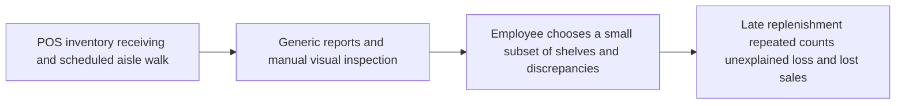
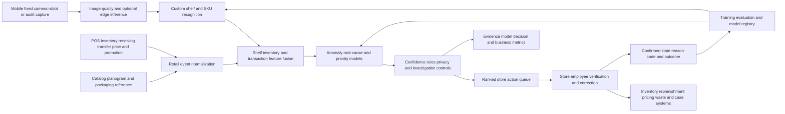

# RETAIL-001 AI-assisted shelf-availability and retail-loss orchestration

## Classification

- **Segment:** retail-ecommerce
- **Primary market / jurisdiction:** Brazil
- **Evidence reference date:** watcher execution on 2026-07-18; principal Brazilian evidence published on 2026-06-15 with 2025 loss data, 2025-12-03 with October 2025 rupture data, and 2026-01 with retail-loss and rupture analysis.
- **Index summary:** Brazilian retailers can combine shelf images, inventory, sales, replenishment, and loss events to detect operational rupture and shrinkage anomalies, rank corrective store tasks, and verify execution under human control.
- **Company profile / size:** supermarket, pharmacy, home-improvement, electronics, fashion, and general-merchandise chains with multiple stores, SKU-level inventory, POS data, and recurring shelf-execution or loss-prevention routines
- **Opportunity type:** operations
- **Status:** researched
- **Confidence:** high
- **Complexity:** large
- **Horizon:** medium
- **Risk:** medium
- **Azure fit:** high
- **AI dependency:** core
- **Intelligent capability:** multimodal shelf-state recognition with inventory-loss anomaly detection and intervention ranking
- **Repository alignment:** new-solution

## Problem

Store managers, replenishment teams, category managers, and loss-prevention analysts repeatedly reconcile POS sales, declared inventory, receiving, transfers, waste, price changes, planograms, and physical shelf conditions. The systems may say an item is available while the shelf is empty, misplaced, incorrectly priced, blocked in the backroom, damaged, unrecorded, or affected by theft or process failure.

The current process commonly depends on periodic manual aisle walks, broad reports, spreadsheet investigations, and employee judgment. Because a large store contains many SKUs and conditions change throughout the day, teams cannot inspect every possible exception with equal frequency. High-value issues may remain hidden while employees spend time checking low-impact discrepancies.

The affected actor is the store-operations or loss-prevention lead who must decide which aisle, SKU, receiving event, stock movement, or transaction pattern deserves immediate verification. The measurable consequences include lost sales, excess safety stock, inaccurate replenishment, waste, unexplained inventory loss, repeated manual counts, weak root-cause evidence, and inconsistent execution across stores.

## Brazil applicability and current context

The 9th Abrappe Brazilian Retail Loss Survey, disclosed on 2026-06-15 with data for 2025, reported R$ 42.1 billion in retail losses and an average loss index of 1.65%, up from 1.51% in 2024. Abrappe attributes losses to operational failures, theft, fraud, rupture, logistics problems, and other events, supporting a cross-functional rather than theft-only process.

Neogrid reported on 2025-12-03 that shelf rupture for essential supermarket items reached 11% in October 2025, even though this was the lowest level of that year. KPMG's January 2026 analysis of the Abrappe research also distinguished commercial rupture from operational rupture, including cases in which merchandise exists in inventory but is not available on the shelf.

The proposal is therefore grounded in current Brazilian store operations. It does not import a foreign legal obligation or retail-liability model. Brazilian consumer, labor, privacy, surveillance, and sector rules still apply, but the core opportunity is operational rather than dependent on a foreign regulatory regime.

Local validation remains necessary for camera placement, employee and customer privacy, store layouts, SKU packaging variation, POS and ERP quality, theft-label scarcity, regional assortment, and the economics of instrumenting smaller stores.

## Evidence

### Confirmed

- Abrappe reported on 2026-06-15 that Brazilian retail losses reached R$ 42.1 billion in 2025, with the average loss index rising to 1.65%; the association linked the total to operational failures, theft, fraud, rupture, logistics problems, and other occurrences.
- Neogrid reported on 2025-12-03 that its Brazilian supermarket shelf-rupture indicator was 11% in October 2025, demonstrating persistent product unavailability even at the year's lowest observed level.
- KPMG's January 2026 analysis of Abrappe data described operational rupture as inventory that exists but is absent from the shelf, directly supporting reconciliation between system stock and physical execution.
- Microsoft Learn documentation updated on 2026-03-05 describes deploying custom image-classification models to edge devices, allowing image or video inference without sending all visual data to the cloud.
- Microsoft Learn documentation updated on 2026-01-27 describes production model monitoring for data drift, prediction drift, data quality, feature-attribution drift, and model performance.

### Inference

- Combining shelf-state recognition with inventory and transaction signals can distinguish likely replenishment delay, phantom stock, planogram deviation, receiving discrepancy, waste, and possible shrinkage better than any single data source.
- Ranking exceptions by expected lost sales, loss exposure, confidence, item criticality, and staff availability can make store walks more targeted without automatically accusing employees or customers.
- Task-completion images, corrected stock states, recounts, confirmed root causes, and manager dispositions can become feedback labels for model evaluation and retraining.
- Edge inference is attractive where bandwidth, latency, privacy, or camera volume makes continuous cloud video transfer undesirable, but a batch mobile-photo workflow can provide a lower-cost starting point.

### Sources

- [Pesquisa Abrappe revela que perdas no varejo brasileiro ultrapassam R$ 42 bilhões](https://prod.abrappe.com.br/noticia?id=pesquisa-abrappe-revela-que-perdas-no-varejo-brasileiro-ultrapassam-r--42-bilhoes) — Brazil; published 2026-06-15; data period 2025; current loss magnitude and causes across Brazilian retail.
- [Ruptura de itens básicos cai em supermercados e indicador atinge o menor índice de 2025](https://neogrid.com/noticias/ruptura-outubro-2025/) — Brazil; published 2025-12-03; data period October 2025; current evidence of persistent shelf unavailability.
- [Pesquisa Abrappe de Perdas no Varejo Brasileiro 2025](https://kpmg.com/br/pt/insights/2026/01/pesquisa-abrappe.html) — Brazil; published January 2026; analyzes commercial and operational rupture and the broader loss-management model.
- [Tutorial: Perform image classification at the edge with Custom Vision Service](https://learn.microsoft.com/en-us/azure/iot-edge/tutorial-deploy-custom-vision) — global technical source; updated 2026-03-05; supports edge image-model deployment feasibility.
- [Azure Machine Learning model monitoring](https://learn.microsoft.com/en-us/azure/machine-learning/concept-model-monitoring?view=azureml-api-2) — global technical source; updated 2026-01-27; supports production model and data-quality monitoring.
- [Object detection using Image Analysis 4.0](https://learn.microsoft.com/en-us/azure/ai-services/computer-vision/concept-object-detection-40) — global technical source; updated 2026-02-25; documents object-detection outputs and limitations, including poor differentiation of closely arranged branded products, reinforcing the need for custom retail models.

## Current process

## Proposed solution

Create a store-execution control plane that continuously reconciles shelf observations with SKU inventory, POS sales, receiving, transfers, replenishment tasks, price and promotion data, planograms, waste, and confirmed loss events.

Shelf observations may come from employee mobile captures, fixed cameras, robots, or periodic third-party audits. A recognition model identifies product facings, empty spaces, misplaced items, price-label mismatches, planogram deviations, and image-quality uncertainty. A second model combines those observations with inventory and event history to estimate the likely exception type and rank the cases worth checking.

The workflow creates explainable tasks such as replenish from backroom, recount stock, validate receiving, correct placement, inspect repeated waste, verify price label, or escalate a suspected loss pattern. Employees confirm the physical state and choose a reason code before inventory or financial records are changed.

Deterministic rules remain authoritative for inventory adjustments, segregation of duties, thresholds for high-value products, evidence retention, task ownership, and any investigation involving employees or customers. Model outputs prioritize inspection and propose likely causes; they do not autonomously accuse a person, write off stock, change price, or impose disciplinary action.

Removing the intelligent capability would leave a conventional dashboard and task system unable to interpret large volumes of shelf imagery or prioritize ambiguous cross-system discrepancies. Recognition, anomaly detection, and ranking are therefore core to the operational value.

## Intelligent capability

- **Technique / model family:** custom object detection or image classification for SKU and shelf-state recognition; temporal and tabular anomaly detection for inventory-event inconsistencies; supervised learning-to-rank or calibrated classification for intervention priority and likely root cause.
- **Why it is necessary:** physical shelf condition, declared inventory, sales velocity, and operational events conflict in ways that cannot be fully enumerated with static rules across thousands of SKUs and changing store layouts. Models convert visual evidence into structured state and rank the most valuable uncertain exceptions.
- **Inputs:** timestamped shelf images or video frames; store, aisle, fixture, and planogram context; SKU catalog and packaging images; POS sales; on-hand inventory; receiving and transfer events; replenishment tasks; prices and promotions; waste and adjustment records; historical counts; confirmed incident and reason-code labels; employee feedback.
- **Outputs:** detected SKU facings and empty spaces; shelf-state classifications; confidence and abstention; ranked exceptions; predicted likely cause; expected operational impact band; recommended verification task; contributing signals.
- **Training / grounding / optimization:** begin with store-approved labeled shelf images across layouts, lighting, packaging, and regions; use active learning from low-confidence captures; train anomaly models on reconciled inventory-event histories; use time- and store-based holdouts; compare against rule-only and sales-velocity baselines; retrain only after label and drift review.
- **Evaluation:** SKU and empty-space precision/recall; mean average precision for detection; shelf-state confusion matrix; calibration and abstention; precision at available task capacity; root-cause classification quality; incremental confirmed exceptions versus rules alone; latency; performance by store format, lighting, category, packaging, and camera source.
- **Fallback and controls:** confidence thresholds; explicit unknown class; poor-image rejection; deterministic high-value and regulated-item rules; employee confirmation before stock changes; manual aisle walk; no facial recognition requirement; no autonomous accusation or disciplinary action; model disable switch; immutable decision and evidence log.

## Macro architecture

## Capabilities and possible technologies

- Application and workflow capabilities: store task queue, aisle and SKU prioritization, mobile evidence capture, reason codes, recount and replenishment workflows, escalation, audit trail, and performance dashboard.
- Data capabilities: retail event schema, SKU and packaging catalog, planogram representation, image metadata, inventory ledger, feature store, labels, predictions, interventions, outcomes, and retention controls.
- Integration capabilities: POS, ERP, WMS, order management, electronic shelf labels, pricing, promotion, receiving, workforce task management, cameras, mobile devices, and identity systems.
- Required AI / ML capabilities: custom shelf recognition, image-quality assessment, inventory anomaly detection, root-cause classification, calibrated ranking, confidence and abstention, active learning, and drift monitoring.
- Training, fine-tuning, grounding, recognition, or optimization capabilities: labeled image curation, store-based holdouts, edge-compatible model packaging, tabular model training, feature pipelines, model registry, champion/challenger comparison, and feedback-label governance.
- Evaluation and model-operations capabilities: offline detection and ranking tests, shadow deployment, task-outcome evaluation, segmented performance, production drift, image-distribution monitoring, rollback, and cost/latency telemetry.
- Security and governance capabilities: privacy-by-design capture zones, image minimization, short raw-image retention where possible, encryption, managed identity, least privilege, employee-access controls, immutable audit, and investigation separation.
- Azure services that may fit: Azure IoT Edge, Azure AI Custom Vision or custom vision models hosted through Azure Machine Learning, Azure Machine Learning, Azure Functions, Azure Event Hubs, Azure Service Bus, Azure Blob Storage or Data Lake Storage, Azure SQL or Cosmos DB, Microsoft Fabric where justified, Azure Monitor, Application Insights, Microsoft Entra ID, and Key Vault.
- Non-Azure or open-source alternatives worth considering: ONNX Runtime, OpenCV, YOLO-family models, PyTorch, TensorFlow, MLflow, Feast, Kafka, PostgreSQL, MinIO, Temporal, Camunda, and vendor-neutral POS or WMS adapters.

## Possible gains

- Earlier detection of operational rupture, phantom stock, misplaced products, and unexplained inventory discrepancies.
- More targeted store walks and recounts based on predicted impact and confidence.
- Faster replenishment of items that exist in the backroom but are absent from the shelf.
- Better separation of operational failure, data error, logistics issue, waste, and suspected shrinkage.
- Stronger evidence for category, supply-chain, and loss-prevention root-cause analysis.
- More consistent execution across stores without removing local manager judgment.
- Reusable visual and event-intelligence patterns for pharmacies, supermarkets, electronics, fashion, and other physical retail formats.

## Metrics for validation

### Business and operational metrics

- Shelf-availability rate and duration of confirmed out-of-shelf events by category and store.
- Time from detected exception to employee verification and correction.
- Confirmed operational rupture, phantom-stock, receiving, placement, pricing, waste, and shrinkage cases per reviewed task.
- Lost-sales proxy, inventory-adjustment value, recount frequency, task backlog age, replenishment completion, and repeated-exception rate.
- Employee minutes per confirmed issue and percentage of model-created tasks accepted, corrected, or dismissed.

### Intelligent-capability metrics

- SKU, facing, empty-space, and shelf-state precision, recall, mean average precision, and calibration.
- Poor-image rejection, unknown-class, abstention, and false-alert rates.
- Precision at daily store-review capacity and normalized discounted cumulative gain for task ranking.
- Root-cause classification accuracy and confusion by category, store format, lighting, packaging, and capture device.
- Incremental confirmed high-impact exceptions versus rule-only, sales-velocity, and scheduled-walk baselines.
- Data, feature, image, prediction, and label drift; human correction and override rates.

## Risks, limits, and controls

- Privacy and sensitive data: cameras may capture customers or employees. Prefer shelf-focused framing, edge cropping, masking, minimized retention, access controls, signage and legal review; facial recognition is not required.
- Brazilian regulatory or policy constraints: LGPD purpose, necessity, transparency, security, retention, employee-monitoring, collective-agreement, consumer, and sector requirements must be assessed for each deployment.
- Human decision boundaries: people approve inventory adjustments, investigations, accusations, disciplinary action, write-offs, and high-value exceptions. Model output is operational evidence and prioritization, not proof of misconduct.
- Model, retrieval, recognition, or policy failure modes: packaging changes, occlusion, dense shelves, reflections, promotional displays, camera movement, and similar products can cause false detections or misses.
- Bias, drift, weak labels, or insufficient feedback: high-volume stores and well-instrumented categories may dominate training data. Results must be segmented by format, region, category, device, and lighting.
- Integration and data availability risks: stale inventory, delayed POS events, weak planograms, inconsistent SKU identifiers, undocumented stock movements, and incomplete task outcomes can produce misleading anomalies.
- Adoption and change-management risks: employees may ignore noisy tasks or perceive the system as surveillance. Start with bounded categories, disclose purpose, measure usefulness, allow correction, and avoid individual productivity scoring from model output.

## Fit score

| Dimension | Score | Rationale |
| --- | ---: | --- |
| Problem evidence and relevance | 19/20 | Current Brazilian Abrappe and Neogrid evidence demonstrates material losses and persistent shelf rupture, with operational causes directly aligned to the proposed process. |
| Business or operational value | 19/20 | The solution targets lost sales, inventory accuracy, staff inspection effort, replenishment delay, waste, and loss investigation across repeated daily store operations. |
| Technical feasibility | 16/20 | Vision, anomaly detection, ranking, edge inference, and monitoring are mature, but SKU density, packaging drift, image capture, labels, privacy, and heterogeneous retail integrations remain difficult. |
| Reuse potential | 18/20 | The event, image, task, model, evidence, and feedback patterns apply across many physical retail categories and store formats. |
| Strategic differentiation | 17/20 | Multimodal reconciliation and ranked intervention go beyond static inventory dashboards and scheduled aisle walks, although value depends strongly on data and capture quality. |
| **Total** | **89/100** | Strong Brazilian evidence and broad operational value support publication; deployment complexity, privacy, image variability, and ground-truth quality remain material constraints. |

## Repository relationship

- Existing references that may be reused: event-driven integration, secure APIs, storage, observability, model deployment, workflow, identity, and audit patterns already represented in the kit where applicable.
- Missing capabilities exposed by this opportunity: retail event contract, shelf-image intake, image-labeling and evaluation reference, edge vision packaging, multimodal feature fusion, ranked store-task workflow, and human-confirmed outcome loop.
- Potential building blocks: shelf-capture contract, retail event normalizer, image-quality gate, custom detector training pipeline, anomaly feature pipeline, intervention ranker, task/evidence ledger, and model-monitoring reference.
- Potential composed solution: intelligent shelf-availability and retail-loss operations platform.
- Reasons to keep it outside the current kit, when applicable: production SKU recognition, camera fleet management, planogram services, and POS/WMS connector breadth may require a dedicated product rather than a small reference solution.

## Duplicate control

- **Problem keys:** shelf-rupture, operational-rupture, phantom-stock, inventory-inaccuracy, retail-loss, store-execution, replenishment-delay, planogram-deviation, shrinkage-investigation
- **Capability keys:** custom-sku-recognition, shelf-state-computer-vision, multimodal-feature-fusion, inventory-anomaly-detection, root-cause-classification, intervention-ranking, edge-inference, active-learning, model-drift-monitoring
- **Research queries used:** `site:abras.com.br 2025 varejo ruptura estoque perdas pesquisa Brasil`; `site:abrappe.com.br 2025 perdas varejo Brasil pesquisa`; `site:gov.br varejo comércio eletrônico devoluções fraude 2025 Brasil`; `Brasil 2025 varejo ruptura gôndola estoque associação pesquisa`; `site:learn.microsoft.com Azure AI Vision image analysis object detection retail shelf official`; `site:learn.microsoft.com Azure Machine Learning model monitoring official 2026`; `site:learn.microsoft.com Azure IoT Edge computer vision retail official`
- **Related opportunities:** none; CROSS-001 also uses anomaly-based human review, but addresses identity lifecycle rather than physical store execution and inventory loss.
- **Uniqueness statement:** This opportunity focuses on reconciling physical shelf state with inventory and retail events to prioritize store intervention; it is materially different from identity, workforce-skills, payment-fraud, and healthcare-queue opportunities already indexed.

## Next decision

- continue research;
