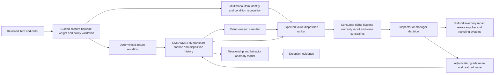

# RETAIL-002 AI-assisted return inspection and value-recovery routing

## Classification

- **Segment:** retail-ecommerce
- **Primary market / jurisdiction:** Brazil
- **Evidence reference date:** 2026-07-19; main Brazilian sources published 2026-01-28, 2026-05-06, and 2026-06-15, covering 2025-2026 operating conditions.
- **Index summary:** Brazilian omnichannel retailers can inspect returned products with multimodal models and rank resale, refurbishment, supplier-return, or disposal routes while preserving deterministic consumer-rights rules and human disposition authority.
- **Company profile / size:** medium and large omnichannel retailers, marketplaces, and reverse-logistics operators handling repeated returns across fashion, electronics, appliances, beauty, or general merchandise.
- **Opportunity type:** operations
- **Status:** hypothesis
- **Confidence:** medium
- **Complexity:** large
- **Horizon:** medium
- **Risk:** medium
- **Solution evidence level:** pilot
- **Operational maturity:** unvalidated
- **Azure fit:** high
- **AI dependency:** core
- **Primary AI role:** multimodal
- **Intelligent capability:** multimodal item-condition recognition, return-reason classification, anomaly detection, and expected-value disposition ranking
- **Repository alignment:** new-solution

## Problem

Return-center inspectors must reconcile the expected SKU and order with the physical item, assess condition, identify missing accessories or damage, classify the reason, estimate recoverable value, and choose a route such as restock, refurbishment, supplier return, liquidation, recycling, or disposal. Decisions are often manual, inconsistent, slow, and weakly connected to catalog, order, inventory, warranty, transport, and resale data.

The pain is not limited to fraud. A legitimate return can lose value while waiting for inspection, be routed to the wrong facility, receive inconsistent grading, or be discarded when refurbishment or secondary-market recovery was viable.

## Brazil applicability and current context

Brazilian retailers face material losses from fraud, operational failures, logistics, rupture, and omnichannel complexity. Abrappe reported on 15 June 2026 that retail losses reached R$ 42.1 billion in 2025, up faster than sector revenue. Abrappe also described reverse logistics on 6 May 2026 as a strategic control and value-recovery process covering damaged goods, returns, exchanges, recalls, and waste. ABOL reported on 28 January 2026 that delivery and returns had become central to e-commerce competitiveness and customer retention.

The prototype must preserve Brazilian consumer-rights and refund rules as deterministic policy. The intelligent layer may support inspection and operational routing but cannot remove statutory return rights, delay mandatory refunds, or independently accuse a consumer of fraud.

## Evidence

### Confirmed problem evidence

- Abrappe reported R$ 42.1 billion in Brazilian retail losses during 2025, including operational failures, fraud, rupture, and logistics problems, with losses growing faster than revenue.
- Abrappe states that returns, exchanges, damaged products, recalls, and waste create hidden costs and that integrated reverse logistics can recover value and mitigate losses.
- ABOL reports that delivery and return capabilities materially affect conversion, loyalty, and retailer competitiveness.

### Favorable solution evidence

- A 2025-2026 UPS/Happy Returns deployment uses return timing, account links, purchase history, and item images to flag difficult mismatches for human audit, demonstrating a bounded production pattern for model-assisted inspection.
- Current reverse-logistics practice increasingly combines return prediction, item inspection, routing, and secondary-market recovery rather than applying one uniform path.
- Product images, order records, catalog attributes, inspection outcomes, refurbishment cost, resale proceeds, and final disposition create a plausible supervised-learning and optimization dataset.

### Counter-evidence and limitations

- Reuters reported mixed results across retailers using AI for return fraud, and the cited system did not detect all abuse types such as wardrobing.
- Image recognition can fail under poor lighting, packaging, occlusion, visually similar variants, missing catalog imagery, or damage that is internal rather than visible.
- A strong rules-and-checklist baseline may be preferable for low-volume, low-value, homogeneous merchandise.
- These limits require guided image capture, calibrated abstention, human inspection, category-specific models, and a prototype focused on operational grading and value recovery rather than autonomous fraud decisions.

### Inference

- Combining condition recognition with expected-value routing may create more value than a fraud-only score because the system can improve disposition even for legitimate returns.
- Category-specific routing is likely necessary because value decay, hygiene restrictions, repairability, and secondary-market demand differ materially.

### Unknowns

- Local return volume, image quality, category mix, disposition labels, grading consistency, resale outcomes, and refurbishment costs.
- Whether model-assisted routing beats disciplined checklists and deterministic value thresholds after inference and review costs.
- Consumer, worker, privacy, and labor impacts of capture and review workflows.

### Sources

- [Pesquisa Abrappe revela que perdas no varejo brasileiro ultrapassam R$ 42 bilhões](https://prod.abrappe.com.br/noticia?id=pesquisa-abrappe-revela-que-perdas-no-varejo-brasileiro-ultrapassam-r--42-bilhoes) — Brazil; 2026-06-15; 2025 loss data and current problem evidence.
- [Logística reversa e seus impactos estratégicos para o varejo](https://abrappe.com.br/noticia?id=logistica-reversa-e-seus-impactos-estrategicos-para-o-varejo) — Brazil; 2026-05-06; operational problem and value-recovery context.
- [Entrega, devolução e custo: por que a logística virou o fator crítico do e-commerce](https://abolbrasil.org.br/noticias/noticias/entrega-devolucao-e-custo-por-que-a-logistica-virou-o-fator-critico-do-e-commerce) — Brazil; 2026-01-28; e-commerce operating context.
- [Devoluções podem custar 30% acima do valor reembolsado](https://www.ecommercebrasil.com.br/noticias/devolucoes-podem-custar-30-acima-do-valor-reembolsado-aponta-estudo) — Brazil publication; 2026-02-26; global 2025 transaction analysis supporting cost structure.
- [UPS company deploys AI to spot fakes amid surge in holiday returns](https://www.reuters.com/business/retail-consumer/ups-company-deploys-ai-spot-fakes-amid-surge-holiday-returns-2025-12-18/) — United States; 2025-12-18; comparable deployment and limitations.
- [Sustainable reverse logistics in e-commerce](https://www.sciencedirect.com/science/article/pii/S235214652500955X) — international; 2025; systematic design context and sustainability limitations.

## Current process

## Baseline without AI

- **Current baseline:** manual inspection, fixed reason codes, spreadsheets, warehouse-management rules, and supervisor exceptions.
- **Strongest realistic non-AI alternative:** guided capture checklist, barcode and serial matching, deterministic category rules, value thresholds, repair-cost tables, and standardized grading with quality sampling.
- **Baseline strengths:** transparent, inexpensive, predictable, and easier to audit.
- **Baseline limitations:** inconsistent visual grading, limited use of historical outcomes, weak handling of many SKU variants, and one-size-fits-all routing.
- **Context where intelligence may add incremental value:** high-volume categories with repeatable imagery, condition labels, several viable disposition routes, and meaningful value decay.
- **Condition where the non-AI baseline should be preferred:** low-volume or low-value items, categories with poor visual observability, or insufficient labeled outcomes.

## Proposed solution

At intake, deterministic software validates the order, return window, SKU, serial number, customer entitlement, refund status, and required accessories. A guided station captures standardized images or short video plus weight and barcode evidence.

Multimodal models compare the received item with catalog and shipment evidence, recognize visible condition and missing components, and classify the stated and observed return reasons. A calibrated ranking model estimates the expected recoverable value and confidence for allowed routes. Deterministic policy removes illegal or impossible routes and applies hygiene, warranty, hazardous-material, recall, and consumer-rights constraints.

Inspectors receive evidence, confidence, comparable historical cases, and a recommended route. They confirm or override the grade and disposition. Low-confidence, high-value, disputed, or adverse cases abstain to specialist review.

## Where AI enters

### AI role map

| Process stage | AI component | AI type / model family | What it does | Runtime mode | Output | Human or deterministic control |
| --- | --- | --- | --- | --- | --- | --- |
| Intake inspection | Item identity and condition recognizer | computer vision and multimodal model | Compares captured evidence with expected SKU, variant, accessories, and visible condition | asynchronous or near-real-time cloud service | matched item, condition attributes, missing components, confidence | barcode and serial rules, guided capture, thresholds, abstention, inspector confirmation |
| Reason reconciliation | Return-reason classifier | embeddings plus classical text and multimodal classification | Reconciles customer reason, inspection notes, images, transport events, and catalog attributes | asynchronous | normalized reason codes and evidence links | controlled taxonomy, source display, human correction |
| Exception detection | Return-pattern anomaly model | gradient boosting and graph-derived features | Finds unusual item, order, account, carrier, store, or supplier relationships for additional review | batch plus online scoring | anomaly indicators and review priority | no automatic fraud finding; human investigation only |
| Disposition planning | Expected-value route ranker | supervised learning-to-rank or gradient boosting with constrained optimization | Ranks allowed routes using expected resale value, processing cost, time decay, demand, repairability, and confidence | asynchronous | ranked routes with expected-value bands and uncertainty | deterministic policy constraints, minimum margins, manager approval, fallback tables |

### Required distinctions

- **Primary AI role:** multimodal recognition and ranking/recommendation.
- **Model family:** computer vision or multimodal foundation model, embeddings, gradient boosting, graph features, and learning-to-rank; an optimization solver may apply deterministic constraints.
- **Training requirement:** pretrained visual inference plus supervised local calibration and training on adjudicated inspection and disposition outcomes.
- **Training location and cadence:** offline initial training; monthly or drift-triggered retraining by category after label-quality review.
- **Inference location:** private cloud service or batch pipeline connected to return centers; edge preprocessing is optional.
- **Agent role:** not used.
- **LLM role:** not used in the initial prototype. A later bounded text classifier would require source-grounded outputs and separate evaluation.
- **Non-LLM intelligence:** visual recognition, classification, anomaly detection, value prediction, and route ranking.
- **Not AI:** order and return-policy validation, barcode APIs, databases, refund rules, category constraints, orchestration, queues, dashboards, approvals, and financial posting.

## Intelligent capability details

- **Technique / model family:** multimodal condition recognition plus calibrated disposition learning-to-rank.
- **Why it is necessary:** deterministic rules cannot reliably interpret varied physical condition and historical combinations of recoverable value, demand, cost, and time decay across many SKUs.
- **Inputs:** standardized images/video, barcode/serial, catalog images and attributes, order and shipment events, return reason, inspection notes, weight, accessory checklist, repair estimates, inventory demand, resale outcomes, and disposition history.
- **Outputs:** identity confidence, condition attributes, missing components, normalized reason, anomaly indicators, ranked allowed routes, uncertainty, and evidence references.
- **Training / grounding / optimization assumptions:** category-specific golden set; adjudicated grades and final financial outcomes; temporal split; cost-aware calibration; synthetic visual transformations only for robustness tests.
- **Evaluation:** macro-F1 and per-class recall for condition attributes, top-k route accuracy, NDCG, calibration error, abstention rate, recovered-value regret versus realized best route, and performance against the deterministic baseline.
- **Fallback and controls:** rules-only routing, human review, high-value thresholds, abstention, random quality audits, rollback by model version, and no automatic fraud or refund denial.

## Data and integration assumptions

- **Data owners and access path:** e-commerce, OMS, WMS, catalog/PIM, transport, finance, customer service, repair partners, and reverse-logistics operations.
- **Expected volume, history, frequency, and coverage:** at least several thousand adjudicated returns in one category, including repeated grades and final outcomes.
- **Labels, outcomes, feedback, or simulation available:** inspector grade, override, route, repair result, resale value, time to disposition, supplier credit, and discard reason.
- **Known quality, imbalance, missingness, and leakage risks:** inconsistent grades, missing photos, route policies changing over time, selection bias, rare damage types, and using post-disposition information during training.
- **Brazilian or local-context representativeness:** local SKU mix, packaging, logistics, taxes, consumer rules, repair network, resale channels, and regional transport costs must be represented.
- **Privacy, retention, consent, surveillance, or sharing constraints:** avoid unnecessary faces, documents, addresses, and background capture; restrict employee-performance use; define retention and partner sharing.
- **Integration and synchronization assumptions:** stable order and SKU identifiers, catalog images, disposition events, and financial outcome reconciliation.
- **Drift and change sources:** seasonality, new SKUs, packaging, camera stations, return policies, promotions, resale demand, supplier contracts, and fraud adaptation.
- **Minimum viable data for a prototype:** one product category, two return centers, standardized capture, 2,000-5,000 historical or prospectively adjudicated returns, and complete final-route outcomes.

## Prototype validation plan

- **Prototype scope / process slice:** one category such as small electronics or footwear; recommend condition grade and one of three or four allowed routes without automating refund decisions.
- **Users, sites, assets, documents, events, or simulated cases:** two return centers, trained inspectors, historical replay followed by shadow mode.
- **Baseline or comparison:** standardized checklist plus deterministic value and category rules.
- **Required data and integrations:** order, SKU, catalog imagery, guided capture, inspection result, route, processing cost, and realized recovery.
- **Model-quality metrics:** identity precision/recall, condition macro-F1, calibration, top-k route accuracy, NDCG, abstention, and subgroup/category error.
- **Business or workflow metrics:** inspection cycle time, reinspection rate, time to resale, realized recovery after cost, avoidable discard, and inventory-posting errors.
- **Human acceptance, correction, or override metrics:** acceptance by confidence band, override reason, disagreement rate, inter-rater agreement, and inspector-reported usefulness.
- **Safety and compliance boundaries:** no automatic refund denial, fraud accusation, customer sanction, employee sanction, or disposal of high-value items.
- **Failure or redesign criteria:** no improvement over checklist baseline; poor calibration; unacceptable false mismatch rate; value-ranking regret after costs; category-specific instability; or excessive capture burden.
- **Evidence required before a pilot or broader implementation:** stable prospective shadow results, audited label agreement, proven incremental recovery net of review and inference cost, and legal/privacy approval.

## Macro architecture

## Capabilities and possible technologies

- Application and workflow capabilities: guided capture, case queue, evidence viewer, grading, override, audit, and route workflow.
- Data capabilities: lakehouse or warehouse, catalog and order joins, feature pipelines, disposition outcome ledger, and data-quality monitoring.
- Integration capabilities: OMS, WMS, PIM, ERP, transport, repair, resale, refund, and supplier APIs.
- Required AI / ML capabilities: multimodal recognition, classification, anomaly detection, value prediction, ranking, calibration, and drift monitoring.
- Training, grounding, recognition, or optimization capabilities: category-specific labeling, temporal evaluation, constrained routing, and cost-sensitive metrics.
- Agent and tool-use capabilities, or `not used`: not used.
- LLM / foundation-model capabilities, or `not used`: not used initially; multimodal visual models may be foundation models but do not act as agents.
- Evaluation and model-operations capabilities: model registry, shadow deployment, confidence monitoring, slice evaluation, rollback, and human-feedback review.
- Security and governance capabilities: RBAC, encryption, private endpoints, retention controls, immutable audit, and model/version traceability.
- Azure services that may fit: Azure AI Vision or Azure Machine Learning endpoints, Azure Machine Learning, Azure Functions or Container Apps, Service Bus, Blob Storage, Data Lake, Databricks or Fabric, API Management, Key Vault, Monitor, and Entra ID.
- Non-Azure or open-source alternatives worth considering: PyTorch, OpenCV, Hugging Face vision models, MLflow, LightGBM, XGBoost, PostgreSQL, MinIO, Kafka, and OR-Tools.

## Possible gains

- More consistent condition grading and faster return-center throughput.
- Higher recovery through earlier and better-matched restock, repair, resale, supplier-return, or recycling routes.
- Better evidence for supplier, carrier, catalog, packaging, and product-quality root-cause improvement.
- Lower unnecessary disposal without weakening consumer rights or human review.

## Metrics for validation

### Business and operational metrics

- Net recovered value per returned item compared with the deterministic baseline.
- Inspection time, reinspection, inventory latency, avoidable discard, route completion time, and processing cost.

### Intelligent-capability metrics

- Condition macro-F1, mismatch precision/recall, route NDCG, calibration, abstention, realized-value regret, and drift by category.
- Human acceptance, override, correction, escalation, and inter-rater agreement.

## Risks, limits, and controls

- Privacy and sensitive data: crop capture areas, redact personal documents, minimize customer and employee data, and restrict secondary uses.
- Brazilian regulatory or policy constraints: consumer rights and mandatory refund rules remain deterministic and legally reviewed.
- Human decision boundaries: inspectors and managers retain grade, disposition, dispute, refund, and investigation authority.
- Model or policy failure modes: visually similar SKUs, hidden defects, poor capture, rare damage, policy drift, and biased historical routes.
- Agent or tool-execution failure modes, when applicable: not applicable; no agent is used.
- LLM hallucination, grounding, or prompt-injection risks, when applicable: not applicable in the initial prototype.
- Comparable failures and applicable lessons: mixed fraud-model results and incomplete coverage require bounded tasks, category-specific evaluation, abstention, and human audit.
- Bias, drift, weak labels, or insufficient feedback: grading disagreement and historically suboptimal routing can train the model to reproduce errors.
- Integration and data risks: incomplete final-value reconciliation can make ranking labels misleading.
- Adoption and change-management risks: capture burden, perceived worker surveillance, and opaque recommendations can reduce use.
- Prototype cost or operational assumptions: cameras, stations, labeling, storage, inference, integration, and quality review must be included in net-value comparison.

## Fit score

| Dimension | Score | Rationale |
| --- | ---: | --- |
| Problem evidence and relevance | 18/20 | Current Brazilian industry evidence shows large retail losses and explicitly identifies reverse logistics as a value-recovery and loss-control process. |
| Business or operational value | 18/20 | Better inspection and routing may protect margin, accelerate resale, and reduce avoidable disposal across legitimate returns. |
| Technical feasibility | 17/20 | A bounded category prototype is buildable with guided images and adjudicated outcomes, but grading quality, hidden defects, and outcome reconciliation are material unknowns. |
| Reuse potential | 18/20 | The pattern can apply across categories, retailers, marketplaces, logistics operators, repair networks, and circular-commerce flows with category adaptation. |
| Strategic differentiation | 18/20 | Multimodal condition interpretation and expected-value ranking materially extend deterministic policies and checklists. |
| **Total** | **89/100** | Strong prototype opportunity with medium confidence and explicit human, policy, and abstention controls. |

## Repository relationship

- Existing references that may be reused: document/image intake, event orchestration, model evaluation, human-review workflows, and audit patterns.
- Missing capabilities exposed by this opportunity: guided multimodal capture, condition-recognition evaluation, expected-value route ranking, disposition feedback, and cost-aware model validation.
- Potential building blocks: return-evidence capture, product identity matcher, condition classifier, constrained route ranker, human-review queue, and realized-value evaluator.
- Potential composed solution: omnichannel reverse-logistics inspection and value-recovery assurance.
- Reasons to keep it outside the current kit, when applicable: customer-specific catalog, policy, repair, resale, and tax integrations should remain adapters rather than generic core behavior.

## Duplicate control

- **Problem keys:** retail returns, reverse logistics, product inspection, condition grading, disposition routing, value recovery, circular commerce
- **Capability keys:** multimodal product matching, condition recognition, return-reason classification, anomaly detection, expected-value learning-to-rank, constrained routing
- **Research queries used:** `Brasil 2025 varejo devoluções e-commerce logística reversa fraude relatório`; `site:abrappe.com.br Logística reversa e seus impactos estratégicos para o varejo 2026`; `Brasil 2026 logística reversa varejo devoluções e-commerce custo operação`; `Brazil e-commerce returns reverse logistics 2025 report`; `retail returns disposition computer vision research false positives human inspection`; `Brazil retail returns fraud AI 2025 research limitations`.
- **Related opportunities:** RETAIL-001, FIN-002, CROSS-002
- **Uniqueness statement:** RETAIL-002 focuses on physical return inspection and economically constrained disposition across legitimate and exceptional returns; it does not duplicate shelf availability, insurance claim assessment, or supplier payment-change assurance.

## Next decision

- prototype candidate

Implementation approval remains an explicit human decision.
