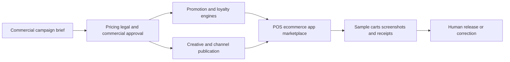
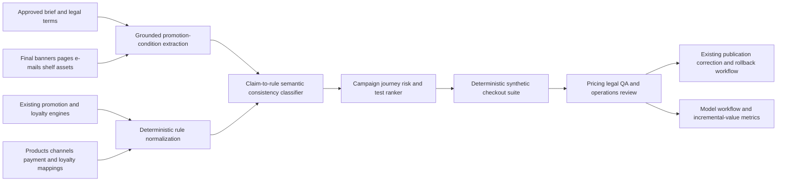

# RETAIL-003 AI-assisted promotion terms and execution assurance

## Classification

- **Segment:** retail-ecommerce
- **Primary market / jurisdiction:** Brazil
- **Evidence reference date:** 2026-07-20
- **Index summary:** Brazilian omnichannel retailers can compare promotional communication with approved offer rules and executed checkout outcomes to detect unsupported, contradictory, or unreachable conditions before consumers encounter them.
- **Company profile / size:** Medium and large omnichannel retailers, supermarket groups, pharmacy chains, marketplaces, and franchise networks
- **Opportunity type:** operations
- **Status:** hypothesis
- **Confidence:** medium
- **Complexity:** medium
- **Horizon:** short
- **Risk:** regulated
- **Solution evidence level:** conceptual
- **Operational maturity:** unvalidated
- **Existing-solution disposition:** integrate
- **Azure fit:** high
- **AI dependency:** core
- **Primary AI role:** extraction
- **Intelligent capability:** Grounded extraction and semantic consistency checking between promotion communications, approved rule definitions, channel eligibility, and observed checkout outcomes
- **Repository alignment:** extend-kit

## Operational simulation

The following operational scenarios are synthetic discovery simulations. They identify plausible decision and exception points; they are not claims about a specific retailer.

### Organization and actor

- **Organization archetype:** Brazilian omnichannel retail chain with 120 stores, e-commerce, mobile app, loyalty program, marketplaces, and multiple payment partners.
- **Primary actor:** Promotion-operations analyst responsible for confirming that an approved campaign is correctly represented and executable across channels.
- **Decision authority:** Commercial leadership approves the campaign; pricing and legal teams approve conditions; technology teams publish rule configuration; store and digital operations correct execution failures.
- **Trigger:** A campaign is approved or materially changed.
- **Objective:** Make every published promotion understandable, reachable, and consistent with the offer actually evaluated at checkout.
- **Completion condition:** Approved rules, customer communication, eligible products, channels, payment constraints, validity windows, and checkout outcomes are reconciled and signed off.
- **Inputs and systems:** Campaign brief, artwork, banners, product feeds, promotion engine, loyalty platform, POS, e-commerce checkout, marketplace feeds, payment-method rules, store-price files, tickets, screenshots, receipts, and synthetic carts.
- **Constraints:** Consumer-protection rules, publication deadlines, regional prices, channel differences, loyalty eligibility, payment-method restrictions, stock, offer stacking, data privacy, and rollback windows.
- **Handoffs:** Commercial -> pricing/legal -> creative agency -> promotion platform -> channel teams -> stores/support -> post-campaign analysis.

### Scenario 1 — normal flow

1. Commercial defines a campaign: selected SKUs, 20% discount, loyalty members, valid Friday through Sunday.
2. Pricing configures the promotion engine and exports the eligible SKU list.
3. Creative publishes app banners, e-mail, site landing page, shelf material, and store guidance.
4. QA executes predefined carts on web, app, and POS.
5. Promotion operations checks sampled screenshots and receipts and releases the campaign.

**Decision points:** whether wording accurately expresses membership, quantity, product, region, channel, stacking, and validity conditions.

**Potential feedback:** accepted mappings, corrected terms, test-cart outcomes, channel-specific exceptions, and confirmed incidents.

### Scenario 2 — exception flow

A banner says "20% em toda a linha" while the rule excludes one package size, applies only after loyalty identification, and cannot stack with a payment-partner discount. The product feed contains a recently introduced SKU not present in the rule list. The checkout rule is technically valid, but the communication is broader than the executable offer.

**Uncertainty:** The same commercial phrase may be intentionally simplified or materially misleading depending on exclusions and disclosure placement.

**Consequences:** Customer complaint, manual price adjustment, support escalation, abandoned cart, regulatory exposure, and costly emergency correction across channels.

**Useful labels:** material contradiction, acceptable simplification, missing disclosure, unreachable offer, wrong SKU mapping, and reviewer rationale.

### Scenario 3 — peak or degraded flow

During a major promotional event, several campaigns are changed hours before launch. The creative agency updates the site artwork, but marketplace feeds and some stores retain an earlier validity window. A payment-partner API is delayed, store downloads are incomplete, and QA can test only a small sample.

**Queues and handoffs:** campaign corrections compete for legal, pricing, technology, store, and support attention.

**Failure pattern:** each individual system appears healthy, while the combined customer journey is inconsistent.

**Potential feedback:** incident severity, affected channels and SKUs, time to correction, false alerts, customer contacts, checkout rejections, overrides, and rollback outcome.

### Opportunity points derived from simulation

| Operational point | Deterministic or conventional response | Remaining intelligent gap |
| --- | --- | --- |
| Promotion configuration | Schema validation, rule engine tests, allowed values, date and SKU checks | Understand natural-language and visual claims and map them to formal conditions |
| Channel publication | Source-of-truth distribution, checksums, version IDs, API monitoring | Detect semantically broader, narrower, contradictory, or missing disclosures |
| Checkout validation | Synthetic carts and deterministic assertions | Generate and rank high-value combinations from ambiguous campaign language and complex eligibility |
| Incident triage | Logs, dashboards, ticket rules, channel ownership | Connect customer evidence to the likely campaign condition or publication mismatch |

Process redesign and stronger promotion-master governance should be implemented first. Intelligence is retained only for semantic interpretation, cross-representation consistency, and risk-ranked test generation that deterministic schemas cannot fully cover.

## Problem

Promotion execution crosses commercial briefs, legal wording, creative assets, product catalogs, loyalty conditions, payment restrictions, channel feeds, POS rules, and checkout behavior. A promotion may be correctly configured in one system yet communicated too broadly, incompletely, or inconsistently elsewhere. Manual sampling is especially weak when many SKUs, stores, channels, payment methods, customer segments, and overlapping offers create a large combination space.

## Brazil applicability and current context

Brazilian consumer authorities continue to identify misleading or unclear promotions and price information. In July 2025, Procon-ES found promotional labels and displayed prices that were inconsistent or misleading. In November 2025, the same authority reiterated that advertised prices must be honored and that the lower value prevails when shelf and checkout differ. In June 2026, Procon-PR coordinated retail inspections after finding that many suppliers did not adequately inform the actual price consumers would pay. These sources establish that offer and price execution remain current operational and compliance concerns in Brazilian retail.

The opportunity is not to determine legal compliance autonomously. It supplies traceable candidate inconsistencies for pricing, legal, commercial, and operations review.

## Existing solutions and differentiation

### Existing solutions reviewed

| Solution / platform | Owner or vendor | Current capabilities | Evidence date | Coverage overlap |
| --- | --- | --- | --- | --- |
| Linx Promo | Linx | Omnichannel promotion distribution, conflict rules, loyalty, approval workflow, and campaign simulation | current page reviewed 2026-07-20 | Strong overlap in rule creation and omnichannel execution |
| SAP Customer Loyalty Management | SAP | Promotion lifecycle, targeting, budgets, issuance, eligibility, and checkout reward application | current documentation reviewed 2026-07-20 | Strong overlap in formal promotion and loyalty management |
| Retail Pro Prism promotions | Retail Pro | Validation and reward rules evaluated at POS | documentation updated 2026-07-16 | Strong overlap in deterministic rule validation |
| Vusion Store Operational Excellence | Vusion | Connected pricing and promotion execution with verification across stores | current page reviewed 2026-07-20 | Strong overlap in price synchronization and physical-store execution |
| Vision Group Execution.AI / FORM / ShelfWatch | multiple vendors | Computer-vision verification of shelf price, display, and promotion execution | current pages reviewed 2026-07-20 | Strong overlap in visual shelf and merchandising compliance |
| Google Merchant promotion policies | Google | Structured eligibility, disclosure, product mapping, and checkout redemption requirements | current policy reviewed 2026-07-20 | Strong overlap in channel-specific promotion quality controls |

### Gap and disposition

- **What is already solved:** Promotion engines, eligibility rules, conflict handling, omnichannel publishing, shelf auditing, price synchronization, deterministic checkout tests, and visual merchandising compliance.
- **Material uncovered gap:** Traceable semantic reconciliation between what an approved campaign and published creative actually claim and what formal rules and observed checkout behavior permit across channels.
- **Underserved context:** Retailers with several promotion, creative, loyalty, payment, marketplace, POS, and e-commerce systems that cannot be replaced by one shared platform.
- **Disposition:** integrate
- **Why changing vendor, cloud, model, UI, or architecture is insufficient:** The value depends on comparing independent representations and execution evidence, not on replacing an existing promotion engine.
- **Differentiation statement:** This is an assurance layer that tests communication-to-rule-to-checkout consistency; it does not optimize promotions, synchronize prices, manage loyalty, or inspect only shelf execution.

## Evidence

### Confirmed problem evidence

- Procon-ES reported misleading promotional labels, missing prices, and divergent displayed values during a July 2025 inspection.
- Procon-ES stated in December 2025 that advertised prices must be honored and that the lower value applies when checkout and displayed prices differ.
- Procon-PR launched coordinated price-information inspections in June 2026 after observing inadequate disclosure of the real price consumers would pay.

### Existing-solution evidence

- Linx Promo already covers omnichannel promotions, rule coexistence, loyalty, simulation, and approvals.
- SAP and Retail Pro provide formal promotion eligibility and checkout-rule evaluation.
- Vusion and retail-execution computer-vision products verify price, display, and promotion execution in stores.

### Favorable evidence for the uncovered gap

- Promotion platforms expose structured conditions and checkout behavior that can serve as deterministic truth sources.
- Document, visual-language, and natural-language inference models can extract candidate conditions from campaign briefs and creative assets.
- Synthetic carts provide a safe way to evaluate whether extracted claims are reachable without changing production orders.

### Counter-evidence and limitations

- A unified promotion platform and disciplined source-of-truth process may solve much of the problem without AI.
- Natural-language inference can incorrectly label an intentional summary as a contradiction.
- Visual assets may omit conditions that are legitimately available through adjacent terms, links, or store signage.
- The prototype must display source regions, distinguish missing evidence from contradiction, abstain on ambiguous material, and compare against deterministic governance improvements.

### Inference

- The strongest value is likely before launch and immediately after campaign changes, where one material mismatch can affect many customer journeys.
- Cross-channel semantic assurance is more defensible than another price-sync or promotion-optimization product.

### Unknowns

- Frequency and cost of communication-to-rule mismatches by retailer.
- Availability and versioning quality of creative, promotion-rule, product, and checkout evidence.
- Whether reviewers agree consistently on acceptable simplification versus material omission.
- Incremental value beyond improved source-of-truth governance and synthetic deterministic tests.

### Sources

- [Procon-ES identifies irregularities in clothing store](https://procon.es.gov.br/Not%C3%ADcia/procon-es-identifica-irregularidades-em-loja-de-roupas-durante-fiscalizacao) — Brazil; 2025-07-25; current problem evidence.
- [Procon-ES safe Christmas shopping guidance](https://procon.es.gov.br/Not%C3%ADcia/procon-es-orienta-consumidores-sobre-compras-seguras-no-periodo-de-natal) — Brazil; 2025-12; operating and consumer-rights context.
- [Procon-PR coordinated retail price inspections](https://www.justica.pr.gov.br/Noticia/Procon-PR-e-Procons-municipais-realizam-fiscalizacao-sobre-precos-em-lojas-no-Parana) — Brazil; 2026-06-01; current enforcement evidence.
- [Linx Promo](https://www.linx.com.br/linx-promo/) — Brazil/vendor; current solution evidence.
- [SAP Customer Loyalty Management promotions](https://help.sap.com/docs/Customer_Loyalty_Management/032db0157855499eb0afe0c9c459a722/1d10294ca6a8436d96e2d6231c42c8d3.html) — international vendor; current solution evidence.
- [Retail Pro promotion validation rules](https://my.retailpro.com/documentation/?bookid=1&chapterid=15&documentid=169&p=4) — international vendor; updated 2026-07-16; current solution evidence.
- [Vusion store operational excellence](https://www.vusion.com/solutions/store-operational-excellence/) — international vendor; current solution evidence.
- [Google Merchant promotions policies](https://support.google.com/merchants/answer/2877565) — international platform; current policy and structured-condition evidence.

## Current process and current solution

## Baseline

- **Current manual or system baseline:** Campaign checklist, owner approvals, sampled screenshots, sampled carts, and incident response.
- **Existing product or platform baseline:** Linx Promo, SAP or equivalent promotion engine plus connected POS/e-commerce and retail-execution tools.
- **Strongest realistic non-AI alternative:** One promotion source of truth; versioned condition schema; mandatory structured creative fields; deterministic channel checks; exhaustive pairwise test generation; checksums; synthetic cart suite; and release gates.
- **Baseline strengths:** Explainable, stable, inexpensive, and authoritative for structured conditions.
- **Baseline limitations:** Cannot reliably interpret natural-language, visual, or mixed creative claims and compare their meaning with formal rules.
- **Exact context where intelligence adds incremental value:** Campaigns expressed across heterogeneous assets and systems, especially with membership, payment, quantity, geographic, stacking, and product-family conditions.
- **Condition where adoption or baseline should be preferred:** A retailer already uses a unified promotion platform with structured communication templates and comprehensive automated checkout tests.

## Proposed solution or extension

Add a read-only assurance pipeline around existing campaign approval and release. It ingests approved campaign briefs, final creative assets, structured promotion rules, product and channel mappings, and synthetic checkout outcomes. Models extract claimed conditions with source evidence. Deterministic adapters normalize rule-engine conditions. A semantic consistency model identifies candidate contradictions, omissions, unsupported expansions, and unreachable offers. A risk ranker selects high-value synthetic carts and routes findings to human reviewers before release or during campaign change windows.

The system never publishes campaigns, changes prices, accepts legal interpretations, or applies customer remedies automatically.

## Where AI enters

### AI role map

| Process stage | AI component | AI type / model family | Inputs | What it does | Runtime mode | Output | Human or deterministic control |
| --- | --- | --- | --- | --- | --- | --- | --- |
| Communication interpretation | Promotion-condition extractor | Document intelligence, OCR, vision-language model, constrained LLM extraction | Briefs, banners, landing pages, e-mails, shelf artwork, terms | Extracts products, discount, audience, channel, dates, quantity, payment, stacking, and exclusions with source spans | asynchronous batch | Structured candidate claims and confidence | Schema validation, source evidence, abstention, reviewer correction |
| Cross-representation assurance | Claim-to-rule consistency classifier | Cross-encoder and natural-language inference | Extracted claims, normalized formal rules, product and channel mappings | Flags contradiction, omission, unsupported broadening, or uncertain equivalence | asynchronous batch | Finding type, confidence, compared evidence | Deterministic mappings, thresholds, human decision |
| Test selection | Promotion journey risk ranker | Gradient boosting or learning-to-rank | Rule complexity, changes, channels, SKUs, previous incidents, extracted claims | Prioritizes synthetic carts and channel checks | pre-release batch and change-triggered | Ranked test cases and rationale | Required minimum deterministic suite, reviewer override |
| Incident support | Evidence-to-condition retrieval | Embeddings and cross-encoder retrieval | Complaint, screenshot, receipt, campaign versions, rules, logs | Finds likely promotion condition and version involved | asynchronous | Ranked evidence bundle | Access control, no automatic remedy, support validation |

### Required distinctions

- **Primary AI role:** grounded extraction, semantic classification, retrieval, and ranking.
- **Model family:** document intelligence/OCR, vision-language model, constrained LLM, embeddings, cross-encoder, natural-language inference, and gradient boosting or learning-to-rank.
- **Training requirement:** pretrained extraction and language models with prompt/schema grounding initially; supervised calibration only after reviewed findings exist.
- **Training location and cadence:** offline evaluation per retailer and periodic retraining after material taxonomy or campaign-language drift.
- **Inference location:** private cloud batch pipeline triggered before launch and after campaign changes.
- **Agent role:** not used.
- **LLM role:** constrained structured extraction from campaign text and visual assets with source citations; no autonomous legal interpretation or publication.
- **Non-LLM intelligence:** OCR, vision-language recognition, embeddings, cross-encoder classification, NLI, and risk ranking.
- **Not AI:** rule-engine evaluation, product mappings, dates, calculations, schemas, APIs, synthetic cart execution, queues, audit, approvals, publication, rollback, and customer remedies.

## Intelligent capability details

- **Why it is necessary for the uncovered gap:** Formal rule tests cannot determine whether human-facing communication means the same thing as configured eligibility and rewards.
- **Inputs:** Versioned briefs, approved terms, creative assets, product feeds, promotion rules, loyalty/payment conditions, channel mappings, synthetic carts, checkout results, incidents, and reviewer decisions.
- **Outputs:** Structured claims, evidence spans, candidate inconsistencies, ranked tests, affected channels/SKUs, confidence, and abstention reason.
- **Training / grounding / optimization assumptions:** Formal rules can be normalized; creative versions are retrievable; reviewers can adjudicate material findings; no production write access is needed.
- **Evaluation against existing product and non-AI baselines:** Compare with source-of-truth governance, structured templates, pairwise deterministic testing, and current platform alerts.
- **Fallback and controls:** Rule-only QA, mandatory test suite, abstention, source inspection, manual release, version rollback, and disablement of model-generated tests.

## Data and integration assumptions

- **Data owners and access path:** Commercial, pricing, legal, marketing, loyalty, e-commerce, store operations, and technology teams.
- **Expected volume, history, frequency, and coverage:** Hundreds to thousands of campaign assets and rule versions per year; event-driven processing around launches and changes.
- **Labels, outcomes, feedback, or simulation:** Reviewer findings, campaign corrections, synthetic cart results, complaints, manual overrides, and confirmed incidents.
- **Quality, imbalance, missingness, and leakage risks:** Missing versions, undocumented verbal changes, image-only terms, inconsistent SKU identifiers, rare severe incidents, and post-incident notes leaking labels.
- **Brazilian or local-context representativeness:** Portuguese promotion language, local payment methods, loyalty practices, channel mix, and consumer-law review are required.
- **Privacy, retention, consent, surveillance, or sharing constraints:** Minimize customer data; use synthetic customers and carts; restrict complaint and receipt evidence; enforce retention and access controls.
- **Existing platform APIs, exports, extension points, and limits:** Promotion engine exports/API, product catalog, POS/e-commerce sandbox, creative repository, and ticketing integration; platform write access is unnecessary for the prototype.
- **Integration and synchronization assumptions:** Every artifact and rule has a stable campaign/version identifier or can be reconciled through governed metadata.
- **Drift and change sources:** New promotion types, loyalty tiers, payment partners, marketplace constraints, creative language, product taxonomy, and regulation.
- **Minimum viable data for a prototype:** 50–100 historical campaigns, their final assets and formal rules, synthetic checkout capability, and at least 20 adjudicated mismatch or hard-negative cases supplemented with synthetic mutations.

## Prototype validation plan

- **Prototype scope / process slice:** One retail banner, one promotion engine, web/app checkout, and two campaign types: percentage discount and quantity bundle.
- **Users, sites, assets, documents, events, or simulated cases:** 4–8 promotion, pricing, legal, QA, and operations reviewers; 50–100 historical campaigns; synthetic normal and fault-injected variants.
- **Existing solution baseline:** Current promotion engine validation and release workflow.
- **Non-AI baseline:** Structured templates, schema validation, deterministic rule diff, pairwise synthetic carts, and manual asset review.
- **Required data and integrations:** Read-only campaign/creative repository, normalized rule export, product mapping, and checkout sandbox.
- **Model-quality metrics:** Claim extraction F1, contradiction precision/recall, calibration, evidence-span accuracy, false-alert rate, abstention, and test-ranking precision@k.
- **Incremental-value metrics beyond the existing solution:** Additional material mismatches found beyond deterministic QA; severe false alerts; duplicated findings; and reviewer time per confirmed issue.
- **Business or workflow metrics:** Pre-release correction rate, campaign rollback rate, customer contacts caused by promotion mismatch, manual QA time, and time from change to assurance result.
- **Human acceptance, correction, or override metrics:** Finding acceptance, correction category, evidence-inspection rate, disagreement between pricing/legal/operations, and ignored alert rate.
- **Safety and compliance boundaries:** No autonomous legal conclusion, price change, campaign publication, offer denial, customer contact, or remedy.
- **Failure or redesign criteria:** Deterministic baseline finds the same issues; low precision creates review burden; missing version control prevents reliable comparison; extracted terms lack source evidence; or reviewers cannot consistently adjudicate materiality.
- **Evidence required before pilot or broader implementation:** Stable temporal evaluation, strong precision on high-risk findings, successful shadow release cycles, privacy/security review, rollback, and measured incremental value.

## Macro architecture

## Capabilities and possible technologies

- **Existing platform capabilities reused:** Promotion lifecycle, eligibility, checkout application, POS/e-commerce execution, loyalty, creative storage, and ticket workflow.
- **Application and workflow capabilities:** Read-only intake, version reconciliation, evidence viewer, findings queue, review and audit.
- **Data capabilities:** Campaign graph, version lineage, normalized rule schema, synthetic-case store, and reviewer labels.
- **Integration and extension capabilities:** Promotion-engine API/export, digital asset management, product catalog, checkout sandbox, ticketing, and BI.
- **Required AI / ML capabilities:** Document/visual extraction, semantic consistency classification, retrieval, and risk ranking.
- **Training, grounding, recognition, or optimization capabilities:** Schema-constrained extraction, synthetic contradiction generation, temporal evaluation, calibration, and drift monitoring.
- **Agent and tool-use capabilities, or `not used`:** not used.
- **LLM / foundation-model capabilities, or `not used`:** constrained grounded extraction only.
- **Evaluation and model-operations capabilities:** Dataset/version tracking, golden set, model registry, offline evaluation, shadow monitoring, and rollback.
- **Security and governance capabilities:** Entra ID, RBAC, managed identity, private networking, Key Vault, audit, encryption, and data minimization.
- **Azure services that may fit:** Azure AI Document Intelligence, Azure AI Content Understanding or multimodal model endpoint, Azure AI Search, Azure Machine Learning, Functions or Container Apps, Blob Storage, PostgreSQL, Entra ID, Key Vault, Monitor, and Power BI.
- **Non-Azure or open-source alternatives:** Tesseract/PaddleOCR, sentence-transformers, cross-encoders, Hugging Face NLI models, MLflow, FastAPI, PostgreSQL/pgvector, and Playwright for synthetic checkout tests.

## Possible gains

- Catch communication-to-rule inconsistencies before customers encounter them.
- Focus scarce QA effort on the highest-risk combinations during peak campaign changes.
- Reduce emergency campaign correction and repeated cross-team reconciliation.
- Produce an auditable evidence chain from approved terms to executed checkout outcomes.

## Metrics for validation

### Business and operational metrics

- Confirmed material mismatches beyond deterministic and existing-product baselines.
- Pre-release correction rate, correction lead time, customer-contact incidence, and QA effort per campaign.

### Intelligent-capability metrics

- Extraction F1, contradiction precision/recall, evidence accuracy, calibration, false-alert rate, abstention, precision@k, human correction, and reviewer disagreement.

## Risks, limits, and controls

- **Existing-solution overlap and roadmap risk:** Promotion platforms may add communication-assurance functions; review current roadmaps before implementation.
- **Privacy and sensitive data:** Prefer synthetic carts; minimize complaint, receipt, loyalty, and payment data.
- **Brazilian regulatory or policy constraints:** Consumer-law and offer interpretation remain with qualified human reviewers.
- **Human decision boundaries:** Humans approve campaign wording, configuration, publication, correction, and customer remedy.
- **Model or policy failure modes:** False contradiction, missed condition, incorrect SKU mapping, stale version, and over-ranking common campaigns.
- **Agent or tool-execution failure modes:** Agent not used.
- **LLM hallucination, grounding, or prompt-injection risks:** Treat creative and customer text as untrusted data; require schema, evidence spans, no tool authority, and abstention.
- **Comparable failures and lessons:** Connected pricing platforms show that synchronization and deterministic execution should be the primary baseline.
- **Bias, drift, weak labels, or insufficient feedback:** Review by campaign type, channel, payment method, product family, and new terminology.
- **Integration and vendor/platform dependency risks:** Incomplete exports and weak version identifiers may invalidate findings.
- **Adoption and change-management risks:** Teams may treat assurance as another approval gate; measure saved rework and keep findings concise.
- **Prototype cost or operational assumptions:** Main costs are integration, campaign-version cleanup, adjudication, and synthetic checkout coverage.

## Fit score

| Dimension | Score | Rationale |
| --- | ---: | --- |
| Problem evidence and relevance | 17/20 | Current Brazilian enforcement evidence confirms price and promotion disclosure/execution problems, though retailer-specific frequency is unknown. |
| Business or operational value | 17/20 | A confirmed mismatch can affect many journeys and trigger correction, complaint, and trust costs. |
| Technical feasibility | 17/20 | A read-only prototype is testable with formal rules, campaign assets, synthetic carts, and fault injection. |
| Reuse potential | 17/20 | The assurance pattern applies across retailers, channels, promotion engines, loyalty, and payment partners. |
| Strategic differentiation | 15/20 | Differentiated from promotion engines and shelf audits, but vendors may extend into semantic communication assurance. |
| **Total** | **83/100** | Credible integration hypothesis requiring proof of incremental value beyond governance and deterministic testing. |

## Repository relationship

- **Existing references that may be reused:** Document extraction, retrieval, evidence lineage, evaluation, Playwright/RPA, workflow, and Azure identity patterns.
- **Missing capabilities exposed by the differentiated gap:** Cross-representation semantic consistency, promotion-rule normalization, synthetic contradiction generation, and checkout-test ranking.
- **Potential building blocks:** `grounded-condition-extractor`, `claim-rule-consistency`, `campaign-version-lineage`, and `risk-ranked-synthetic-journeys`.
- **Potential composed solution or extension:** `promotion-terms-execution-assurance`.
- **Reasons to keep it outside the current kit:** Retail promotion-engine adapters and consumer-law interpretation must remain customer-specific.

## Duplicate control

- **Problem keys:** promotion communication mismatch, offer execution, checkout discrepancy, omnichannel campaign assurance, misleading or unreachable offer
- **Capability keys:** grounded promotion-condition extraction, claim-to-rule NLI, synthetic checkout ranking, campaign evidence retrieval
- **Existing solutions reviewed:** Linx Promo, SAP Customer Loyalty Management, Retail Pro Prism, Vusion, Vision Group Execution.AI, FORM, ShelfWatch, Google Merchant promotions
- **Research queries used:** `Brasil 2025 2026 divergência preço oferta checkout varejo Procon promoção preço diferente consumidor`; `software promotion terms validation advertised offer checkout loyalty payment conditions retail`; `AI promotion creative offer terms compare POS rules ecommerce checkout`; `promotion compliance monitoring retail shelf label ecommerce checkout software computer vision`
- **Related repository opportunities:** RETAIL-001 shelf availability/loss; RETAIL-002 return inspection/value recovery; CROSS-003 tax-reform configuration assurance
- **External overlap statement:** Existing platforms cover promotion creation, rule evaluation, channel synchronization, and shelf execution; none reviewed clearly centers on semantic reconciliation of published claims against formal rules and checkout evidence.
- **Uniqueness statement:** RETAIL-003 assures the meaning and reachability of customer-facing promotion claims across existing systems rather than managing promotions, optimizing prices, or inspecting shelves.

## Next decision

- prototype candidate

Implementation approval remains an explicit human decision.
