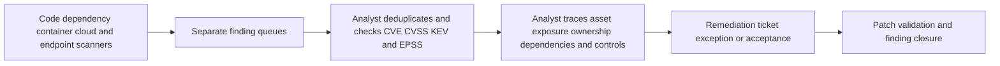
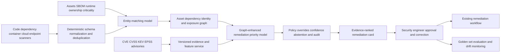

# TECH-001 AI-assisted context-aware vulnerability remediation prioritization

## Classification

- **Segment:** Technology, software, cloud, and digital platforms
- **Primary market / jurisdiction:** Brazil
- **Evidence reference date:** 2026-07-19; Brazilian sources checked through 2026-07-19; international technical evidence checked through 2026-07-19.
- **Index summary:** Brazilian software and platform teams can combine vulnerability intelligence with asset exposure, dependency, runtime, ownership, and business-impact signals to rank remediation work and produce auditable evidence under security-engineer control.
- **Company profile / size:** Medium and large Brazilian software companies, SaaS providers, digital platforms, managed-service providers, and internal platform teams operating heterogeneous cloud and application estates.
- **Opportunity type:** security
- **Status:** hypothesis
- **Confidence:** medium
- **Complexity:** large
- **Horizon:** medium
- **Risk:** high
- **Solution evidence level:** production
- **Operational maturity:** early
- **Azure fit:** high
- **AI dependency:** core
- **Primary AI role:** ranking-recommendation
- **Intelligent capability:** Context-aware vulnerability-to-asset matching, exploit-risk prediction, attack-path inference, and remediation-priority ranking
- **Repository alignment:** new-solution

## Problem

Software security teams receive vulnerability findings from source-code, dependency, container, cloud, endpoint, and infrastructure scanners. The same CVE may appear across many assets, scanners may disagree about affected versions, and severity scores do not represent whether a component is reachable, loaded at runtime, protected by compensating controls, or attached to a critical business path.

Teams therefore spend substantial specialist effort deduplicating findings, resolving ownership, checking exploit intelligence, tracing dependencies and exposure, and deciding what must be fixed first. Static severity queues create alert overload, while incorrect deprioritization can leave exploitable weaknesses exposed.

## Brazil applicability and current context

Brazilian organizations operate in an active vulnerability and incident environment. CERT.br maintains current statistics for incidents, potentially vulnerable services exposed on the Internet, and indicators of compromised devices. CTIR Gov continues to publish alerts for critical vulnerabilities affecting widely used enterprise software, including Windows, Oracle, Fortinet, Kibana, Chrome, and Citrix products.

This creates a current Brazilian operating need for faster, more defensible remediation prioritization. The local solution must reflect Brazilian organizations' actual cloud and on-premises estates, ownership structures, regulatory obligations, data residency, and operational capacity rather than importing foreign government patch deadlines.

The opportunity does not assume that a model can determine risk from a CVE alone. It combines global exploit evidence with local exposure, runtime, dependency, control, and business context.

## Evidence

### Confirmed problem evidence

- CERT.br continuously publishes statistics on reported incidents, exposed vulnerable services, and devices with signs of compromise in Brazilian networks.
- CTIR Gov's 2025 alert collection, materially updated in May and June 2026, lists multiple critical vulnerabilities in commonly deployed software and recommends defensive action.
- FIRST's EPSS dataset scored more than 349,000 CVEs in July 2026, illustrating the scale at which exploit-probability signals must be consumed and filtered.

### Favorable solution evidence

- CISA maintains the Known Exploited Vulnerabilities catalog specifically as an input to vulnerability-management prioritization.
- FIRST's EPSS is a machine-learning model that estimates the probability of exploitation in the next 30 days and publishes refreshed scores for CVEs.
- Current research supports context-aware matching and graph modeling to reduce false vulnerability-to-asset associations caused by inconsistent product identifiers and configuration data.
- Production security platforms already combine asset exposure, identities, controls, attack paths, and threat intelligence, supporting the feasibility of a bounded prioritization layer.

### Counter-evidence and limitations

- FIRST explicitly states that EPSS measures exploit probability, not complete risk, and does not account for local impact, environmental conditions, or compensating controls.
- Inconsistent CPE and asset metadata can create false matches and missed affected products; research reports substantial vendor-name inconsistency in public vulnerability data.
- Automated and AI-assisted security testing can miss critical flaws and generate findings that require architectural context and expert validation.
- A learned ranker may reproduce historic remediation bias: teams often fix what is easiest or most visible rather than what was truly most risky.
- Remediation outcomes are delayed and partially observable; absence of exploitation does not prove that deprioritization was correct.

These limitations require evidence-first ranking, abstention, deterministic overrides, shadow-mode evaluation, and security-engineer approval. The prototype does not autonomously patch or close findings.

### Inference

- The most defensible first value is reducing analyst effort and improving ordering consistency over a deterministic risk-based baseline, not claiming prevention of breaches.
- Local asset context can add material value beyond CVSS, EPSS, or KEV alone when version matching, reachability, runtime use, ownership, and business criticality are reliable.

### Unknowns

- Accuracy of software inventory, SBOMs, CPE/package mapping, runtime-loaded-component signals, and service ownership.
- Availability of validated historic decisions, exploitation evidence, incident links, exceptions, and remediation outcomes.
- Incremental value over the organization's existing vulnerability-management platform and deterministic policies.
- Analyst acceptance, ranking stability, false-deprioritization cost, data-integration effort, latency, and operating cost.

### Sources

- [CERT.br](https://cert.br/) — Brazil; current through July 2026; Brazilian incident, exposed-service, and compromise context.
- [Estatísticas de incidentes do CERT.br](https://stats.cert.br/incidentes/) — Brazil; updated in 2026; voluntarily reported incident context and limitations.
- [CTIR Gov Alertas 2025](https://www.gov.br/gsi/pt-br/assuntos/ctir/alertas/2025) — Brazil; materially updated 2026-06-03; critical enterprise-software vulnerability alerts.
- [CISA Known Exploited Vulnerabilities Catalog](https://www.cisa.gov/known-exploited-vulnerabilities-catalog) — United States/global; current catalog; confirmed-exploitation input for prioritization.
- [FIRST EPSS Data](https://www.first.org/epss/data_stats) — global; current 2026 daily data; exploit-probability model and scale.
- [FIRST EPSS FAQ](https://www.first.org/epss/faq) — global; current; limitations and correct interpretation of EPSS.
- [VulCPE: Context-Aware Cybersecurity Vulnerability Retrieval and Management](https://arxiv.org/abs/2505.13895) — international research; 2025; context-aware matching, graph modeling, and CPE inconsistency evidence.
- [A Survey on Vulnerability Prioritization](https://arxiv.org/abs/2502.11070) — international research; 2025; prioritization taxonomy and context gaps.

## Current process

## Baseline without AI

- **Current baseline:** Scanner severity, CVSS, vendor priority, KEV membership, EPSS thresholds, asset criticality tags, service-level rules, and manual analyst review.
- **Strongest realistic non-AI alternative:** A unified vulnerability inventory with deterministic deduplication, normalized package and asset identifiers, fixed risk matrix, KEV-first rules, EPSS bands, internet-exposure checks, ownership routing, and SLA enforcement.
- **Baseline strengths:** Transparent, auditable, easy to override, and effective for known high-risk conditions.
- **Baseline limitations:** Fixed rules struggle with interacting exposure paths, dependency graphs, changing exploit signals, inconsistent identifiers, and large queues with many similar findings.
- **Context where intelligence may add incremental value:** Ranking within large rule-equivalent queues, probabilistic product matching, attack-path inference, and learning which evidence combinations correlate with validated urgent remediation.
- **Condition where the non-AI baseline should be preferred:** When inventory, ownership, runtime, dependency, and outcome data are unreliable or deterministic policies already meet queue and risk targets at lower cost.

## Proposed solution

Build a read-only vulnerability-remediation prioritization layer over a bounded application and cloud estate. It normalizes findings, maps CVEs to actual components and assets, enriches them with KEV and EPSS, traces reachability and dependency paths, and ranks remediation candidates with an evidence card.

Deterministic rules always override the model for confirmed exploitation, mandated deadlines, prohibited exposure, critical asset classes, unsupported software, and organization-defined emergency conditions. Security engineers review rankings, correct mappings, approve priorities, and retain all authority over patching, exceptions, risk acceptance, and closure.

## Where AI enters

### AI role map

| Process stage | AI component | AI type / model family | What it does | Runtime mode | Output | Human or deterministic control |
| --- | --- | --- | --- | --- | --- | --- |
| Finding normalization | Vulnerability-to-component matcher | Embeddings plus supervised entity matching | Resolves scanner package, vendor, product, version, and CPE ambiguity | Asynchronous batch | Match candidates and confidence | Exact-version rules, schema validation, abstention, analyst correction |
| Exposure analysis | Attack-path and reachability ranker | Graph ML or graph-enhanced learning-to-rank | Scores whether a vulnerable component is plausibly reachable through identities, network paths, dependencies, and controls | Batch with event-triggered refresh | Ranked exposure paths | Deterministic topology constraints and engineer validation |
| Remediation triage | Contextual priority model | Gradient-boosted trees or calibrated learning-to-rank | Combines exploit probability, confirmed exploitation, exposure, runtime use, criticality, controls, age, and remediation history | Daily batch | Priority score, rank, confidence, contributing evidence | KEV and policy overrides, thresholds, abstention, human approval |

### Required distinctions

- **Primary AI role:** Ranking/recommendation, with supporting entity matching and graph inference.
- **Model family:** Embeddings and supervised entity matching; graph ML or graph-enhanced ranking; calibrated gradient-boosted trees or learning-to-rank.
- **Training requirement:** Begin with pretrained embeddings and supervised learning on an expert-reviewed golden set; use weak labels only for bootstrapping.
- **Training location and cadence:** Offline initial training in the organization's controlled environment; periodic retraining after drift and label-quality review, not continuous self-modification.
- **Inference location:** Private cloud batch pipeline with event-triggered refresh for critical threat-intelligence changes.
- **Agent role, when any:** Agent: not used.
- **LLM role, when any:** LLM: not used in the initial prototype. Evidence summaries use templates, not generated security conclusions.
- **Non-LLM intelligence:** Entity matching, graph inference, exploit-risk enrichment, calibrated ranking, and confidence estimation.
- **Not AI:** Scanner execution, CVE/KEV/EPSS ingestion, exact version comparison, policy rules, SLA calculation, ticket creation, dashboards, approvals, patch deployment, validation, and risk acceptance.

## Intelligent capability details

- **Technique / model family:** Supervised entity resolution, graph-enhanced exposure ranking, calibrated gradient boosting or learning-to-rank.
- **Why it is necessary:** Deterministic rules remain essential but cannot economically encode all ambiguous product mappings, interacting paths, runtime evidence, exploit signals, and local remediation outcomes across large heterogeneous estates.
- **Inputs:** Scanner findings, package manifests, SBOMs, asset inventory, cloud graph, network exposure, identities, runtime telemetry, service ownership, criticality, controls, CVE/CVSS, KEV, EPSS, incidents, exceptions, tickets, and validation outcomes.
- **Outputs:** Normalized finding clusters, component-match confidence, exposure paths, ranked remediation queue, contributing evidence, uncertainty, and abstention reason.
- **Training / grounding / optimization assumptions:** Expert-reviewed golden set; temporal splits; negative examples for false product matches; policy features separated from learned features; no post-remediation leakage.
- **Evaluation:** Mapping precision/recall, top-k urgent-finding recall, NDCG or mean reciprocal rank, calibration, ranking stability, analyst effort, and incremental value over the deterministic baseline.
- **Fallback and controls:** Rule-only queue, KEV and policy overrides, confidence thresholds, abstention, immutable evidence, human approval, and immediate rollback to existing workflow.

## Data and integration assumptions

- **Data owners and access path:** Application security, cloud security, infrastructure, platform engineering, CMDB/asset management, service owners, SOC, and risk teams.
- **Expected volume, history, frequency, and coverage:** Thousands to millions of findings; daily scanner and threat-intelligence updates; prototype limited to one product group or cloud subscription with several months of decisions and outcomes.
- **Labels, outcomes, feedback, or simulation available:** Analyst priority, confirmed applicability, remediation date, exception, false positive, incident relation, patch validation, and reopened finding; expert relabeling is required.
- **Known quality, imbalance, missingness, and leakage risks:** Stale assets, duplicate findings, package aliases, missing versions, incomplete SBOMs, weak ownership, sparse incidents, historic policy bias, and outcome fields that leak the final decision.
- **Brazilian or local-context representativeness:** Train and evaluate on the organization's technologies, hosting patterns, controls, teams, and risk policy; global exploit intelligence remains an external feature.
- **Privacy, retention, consent, surveillance, or sharing constraints:** Minimize personal identifiers in ownership and ticket data; restrict access to sensitive architecture, vulnerabilities, and exploit evidence; apply LGPD and security-retention controls.
- **Integration and synchronization assumptions:** Stable scanner exports or APIs, asset identifiers, dependency graph, ownership mapping, ticket linkage, and timestamp alignment.
- **Drift and change sources:** New technologies, scanner changes, EPSS model changes, new exploits, topology changes, acquisitions, product renaming, and remediation-policy changes.
- **Minimum viable data for a prototype:** One application portfolio; normalized findings and assets; KEV/EPSS history; exposure and ownership data; 500-1,000 expert-reviewed findings where available; several months of remediation outcomes.

## Prototype validation plan

- **Prototype scope / process slice:** One software product group, platform domain, or cloud subscription with an existing deterministic prioritization baseline.
- **Users, sites, assets, documents, events, or simulated cases:** Security engineers and service owners reviewing a historical replay followed by four to eight weeks of read-only shadow ranking.
- **Baseline or comparison:** Unified deterministic queue using CVSS, KEV, EPSS bands, internet exposure, criticality, and SLAs.
- **Required data and integrations:** Scanner exports, asset/SBOM data, cloud or dependency graph, ownership, threat intelligence, tickets, exceptions, and patch validation.
- **Model-quality metrics:** Component-match precision/recall; top-10 and top-20 urgent-finding recall; NDCG; calibration error; false-deprioritization rate; abstention rate.
- **Business or workflow metrics:** Median analyst triage time, findings reviewed per analyst hour, duplicate-ticket rate, time to accepted priority, and remediation SLA adherence.
- **Human acceptance, correction, or override metrics:** Rank acceptance, mapping correction, override reason, evidence usefulness, and analyst-reported effort.
- **Safety and compliance boundaries:** No autonomous patch, closure, suppression, exception, risk acceptance, or exploit execution.
- **Failure or redesign criteria:** Stop or redesign if mapping errors are material, urgent-finding recall falls below baseline, rankings are unstable, analysts spend more time, required context is unavailable, or recommendations cannot be audited.
- **Evidence required before a pilot or broader implementation:** Repeatable improvement over baseline across new periods and a second application domain; acceptable false-deprioritization and abstention; reliable ownership and inventory; approved governance and rollback.

## Macro architecture

## Capabilities and possible technologies

- Application and workflow capabilities: Ranked remediation queue, evidence cards, ownership routing, correction workflow, and shadow comparison.
- Data capabilities: Finding normalization, SBOM and asset linkage, threat-intelligence history, topology graph, and outcome store.
- Integration capabilities: Scanner, CMDB, cloud graph, repository, ticketing, endpoint, and SOC connectors.
- Required AI / ML capabilities: Entity resolution, graph-based exposure inference, calibrated ranking, uncertainty, and abstention.
- Training, grounding, recognition, or optimization capabilities: Golden-set management, weak-label bootstrapping, temporal evaluation, periodic retraining, and model comparison.
- Agent and tool-use capabilities, or `not used`: not used.
- LLM / foundation-model capabilities, or `not used`: not used in the initial prototype.
- Evaluation and model-operations capabilities: Feature lineage, calibration, ranking metrics, drift, shadow deployment, and rollback.
- Security and governance capabilities: Least privilege, sensitive-finding controls, immutable audit, segregation of duties, and policy overrides.
- Azure services that may fit: Microsoft Defender for Cloud, Microsoft Defender Vulnerability Management, Microsoft Security Exposure Management, Azure Resource Graph, Azure Data Explorer, Azure Machine Learning, Azure AI Search for evidence retrieval without generation, Azure Functions or Container Apps, Azure Monitor, and Microsoft Purview.
- Non-Azure or open-source alternatives worth considering: DefectDojo, Dependency-Track, Trivy, Grype, OpenVAS/Greenbone, OSV, OpenSearch, Neo4j, PostgreSQL/Apache AGE, MLflow, LightGBM, XGBoost, and Kubernetes.

## Possible gains

- Faster and more consistent vulnerability triage.
- Better focus on findings with confirmed exploitation, reachable paths, runtime relevance, and material business impact.
- Fewer duplicate or contextually inapplicable remediation tickets.
- Auditable explanations for prioritization and deprioritization.
- Better ownership routing and feedback quality for security and engineering teams.

## Metrics for validation

### Business and operational metrics

- Median time from finding ingestion to accepted remediation priority.
- Analyst minutes and interactions per validated finding.
- Duplicate, false-applicability, reopened, and overdue finding rates.
- Remediation SLA adherence by risk class and service.
- Incremental workflow improvement versus the deterministic baseline.

### Intelligent-capability metrics

- Product/component matching precision and recall.
- Top-k urgent-finding recall, NDCG, and mean reciprocal rank.
- Calibration, abstention, ranking stability, and false-deprioritization rate.
- Engineer acceptance, override, correction, and unsupported-recommendation rates.

## Risks, limits, and controls

- Privacy and sensitive data: Architecture, vulnerability, ownership, and incident data require strict access control and minimization.
- Brazilian regulatory or policy constraints: Map sector obligations locally; do not import foreign patch deadlines as Brazilian mandates.
- Human decision boundaries: Engineers retain remediation priority, patch, exception, risk acceptance, and closure authority.
- Model or policy failure modes: Incorrect product matching, stale topology, hidden exposure, overreliance on EPSS, biased historic labels, unstable ranking, and overconfidence.
- Agent or tool-execution failure modes, when applicable: not applicable; no agent executes tools.
- LLM hallucination, grounding, or prompt-injection risks, when applicable: not applicable in the initial prototype.
- Comparable failures and applicable lessons: Automated tools can miss critical flaws and generate false positives; hybrid expert review and evidence display are mandatory.
- Bias, drift, weak labels, or insufficient feedback: Evaluate by scanner, product, team, technology, exposure class, and finding age; maintain expert-reviewed evaluation sets.
- Integration and data risks: Inventory, version, ownership, dependency, and runtime quality may dominate prototype effort.
- Adoption and change-management risks: The system must reduce analyst effort and preserve existing tickets, policies, and emergency workflows.
- Prototype cost or operational assumptions: Bound initial scanners, assets, graph depth, feature refresh, and inference volume; measure cost per ranked finding.

## Fit score

| Dimension | Score | Rationale |
| --- | ---: | --- |
| Problem evidence and relevance | 18/20 | Current CERT.br and CTIR Gov evidence establishes a persistent Brazilian vulnerability and incident-management problem. |
| Business or operational value | 18/20 | Triage effort, urgent-finding recall, remediation time, duplicate work, and SLA outcomes are measurable. |
| Technical feasibility | 17/20 | Public threat data, mature scanners, graph techniques, and ranking models support a bounded shadow prototype; local inventory and labels remain major risks. |
| Reuse potential | 19/20 | The pattern applies across AppSec, cloud, endpoint, infrastructure, SaaS, managed services, and regulated environments. |
| Strategic differentiation | 17/20 | Contextual matching and exposure-aware ranking can materially improve fixed severity queues when tested against a strong deterministic baseline. |
| **Total** | **89/100** | Strong prototype candidate with high data-integration sensitivity and strict human control. |

## Repository relationship

- Existing references that may be reused: Security ingestion, observability, event processing, graph, search, model evaluation, and governed workflow building blocks where present.
- Missing capabilities exposed by this opportunity: Vulnerability normalization contract, SBOM-to-runtime linkage, exposure graph, contextual remediation ranking, and false-deprioritization evaluation.
- Potential building blocks: Scanner adapter contract, vulnerability evidence schema, asset-component resolver, exposure-path service, calibrated ranker, evidence card, and shadow evaluator.
- Potential composed solution: Context-aware vulnerability remediation reference solution integrating scanners, asset and dependency context, threat intelligence, graph analysis, ranking, policy controls, and human review.
- Reasons to keep it outside the current kit, when applicable: Vendor-specific scanner semantics and organization-specific risk policy should remain solution-level integrations.

## Duplicate control

- **Problem keys:** vulnerability-overload, remediation-prioritization, false-applicability, software-exposure, patch-triage
- **Capability keys:** vulnerability-entity-resolution, exploit-risk-enrichment, exposure-graph, attack-path-ranking, remediation-learning-to-rank
- **Research queries used:** Brazil CERT.br 2025 2026 vulnerable services incidents; CTIR Gov critical vulnerability alerts 2025 updated 2026; vulnerability prioritization exploitability runtime exposure; EPSS limitations environmental impact; AI vulnerability scanning false positives missed flaws; context-aware CPE matching graph.
- **Related opportunities:** TELCO-001 ranks network incident causes and dispatch decisions, while TECH-001 ranks software vulnerability remediation using software-component, exploit, exposure, and control evidence.
- **Uniqueness statement:** This opportunity targets vulnerability-to-component resolution and exposure-aware remediation ordering for software and platform teams; it does not duplicate NOC incident correlation, generic observability, or autonomous vulnerability discovery.

## Next decision

- shortlist for review.

The shortlist recommendation approves further prototype review only. It does not approve implementation, autonomous remediation, or claims of proven Brazilian production value.