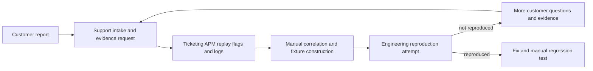

# TECH-002 Privacy-safe tenant incident reproduction assurance

## Classification

- **Segment:** technology-software
- **Primary market / jurisdiction:** Brazil
- **Evidence reference date:** 2026-07-20
- **Index summary:** Brazilian SaaS teams can reconstruct privacy-minimized tenant-specific failure states from support evidence and telemetry, then generate reviewable reproduction scripts and regression tests without copying unrestricted production data.
- **Company profile / size:** Brazilian B2B SaaS and digital-platform providers with roughly 30-500 engineers, multi-tenant systems, customer support, observability, feature flags, and staged test environments
- **Opportunity type:** integration
- **Status:** hypothesis
- **Confidence:** medium
- **Complexity:** large
- **Horizon:** medium
- **Risk:** high
- **Solution evidence level:** prototype
- **Operational maturity:** unvalidated
- **Existing-solution disposition:** integrate
- **Azure fit:** medium
- **AI dependency:** core
- **Primary AI role:** agent-tool-use
- **Intelligent capability:** evidence-grounded failure-state reconstruction, tenant-context minimization, reproduction-plan generation, sandbox execution, and regression-test synthesis
- **Repository alignment:** extend-kit

## Operational simulation

The following operational traces are synthetic discovery simulations. They are not claims that every Brazilian SaaS provider uses this exact process.

### Organization and actor

- **Organization archetype:** Brazilian B2B SaaS provider serving regulated and non-regulated customers through a multi-tenant web application and APIs.
- **Approximate size:** 150 employees, including 45 engineers, 12 support analysts, 5 SRE/platform engineers, and 4 QA engineers.
- **Primary actor:** tier-2 support engineer who can inspect customer-authorized support evidence, correlate telemetry, and escalate to engineering, but cannot export unrestricted production data or deploy code.
- **Decision authority:** support may request additional evidence and classify urgency; engineering decides whether a defect exists; QA approves a reproduction case; product or incident leadership approves remediation priority.

### Activity boundary

- **Trigger:** a customer reports incorrect behavior, intermittent failure, or an action that succeeds for most tenants but fails for one tenant.
- **Objective:** produce a sufficiently faithful, privacy-safe and reviewable reproduction package for engineering.
- **Completion condition:** the issue is reproduced in an isolated environment, rejected with documented evidence, or escalated with explicit missing evidence.
- **Inputs:** support conversation, screenshots or recording, browser metadata, request IDs, traces, logs, feature-flag state, release version, tenant configuration, schema version, integration responses, deployment history, known issues and prior incidents.
- **Systems:** ticketing, CRM, observability/APM, session replay when authorized, feature-flag platform, source control, CI, test-data factory, secrets manager and sandbox environment.
- **Constraints:** LGPD purpose limitation and data minimization; contractual confidentiality; production access segregation; no unrestricted customer-data cloning; auditability; reproducibility across changing dependencies; bounded compute and engineering time.
- **Handoffs:** customer or customer-success to support; support to SRE or engineering; engineering to QA; QA result back to support and product.

### Scenario 1 — normal flow

1. A customer reports a consistent error after a known action and supplies a request ID.
2. Support identifies the tenant, release, endpoint, browser and time window.
3. Observability exposes an error trace and a deterministic configuration mismatch.
4. Support attaches sanitized logs and exact steps to the engineering ticket.
5. Engineering reproduces the error with an existing fixture, corrects the defect and adds a regression test.

**Decisions:** whether evidence is complete, whether the issue is configuration or code, and whether existing fixtures cover the tenant state.

**Deterministic sufficiency:** structured intake, request-ID correlation, configuration diff and known-error rules are sufficient. AI adds little and should abstain.

### Scenario 2 — exception flow

1. The customer reports that a workflow occasionally produces the wrong outcome without an error message.
2. The behavior depends on a tenant-specific combination of feature flags, permissions, legacy schema version, integration response and prior entity state.
3. Logs and traces contain fragments but no single record describes the complete state transition.
4. Raw production records cannot be copied to test because they include personal and commercially sensitive data.
5. Support and engineering repeatedly ask for screenshots, exports and timing details; each handoff loses context.
6. A developer manually constructs several fixtures, but none reproduces the issue because a hidden ordering or historical-state dependency remains absent.

**Key uncertainty:** which minimum state, event order and dependency response are causally necessary.

**Consequences:** long time-to-reproduction, repeated customer contact, senior-engineer interruption, speculative fixes and regression risk.

**Potential labels:** confirmed reproduced or not reproduced; fields actually required; causal configuration or event; reviewer corrections; generated test accepted or rejected.

### Scenario 3 — peak or degraded flow

1. After a release, support receives dozens of differently worded reports from several tenants.
2. Observability shows multiple symptoms distributed across services; some reports are duplicates, others only resemble the dominant incident.
3. Support staffing is constrained and engineers are already restoring service.
4. Session evidence is incomplete because some customers disabled replay or redaction removed key values.
5. A broad rollback would affect unaffected tenants; a narrow feature-flag intervention requires confidence about the impacted state combinations.
6. Tickets are merged too aggressively or handled independently, causing missed variants and duplicated investigation.

**Key decision:** which reports share the same reproducible failure state and which require separate investigation.

**Consequences:** incorrect incident grouping, unnecessary rollback, delayed tenant-specific mitigation and weak post-incident regression coverage.

### Opportunity points derived from simulation

| Opportunity point | Deterministic baseline | Remaining intelligent gap |
| --- | --- | --- |
| Standardize evidence collection | Required fields, request IDs, SDK capture and redaction rules | No AI needed when the report is complete |
| Correlate tickets with telemetry | Time-window, tenant, release and error-signature joins | Semantically different reports and fragmented cross-service evidence may hide the same state transition |
| Build a test fixture | Templates, schema-aware factories and explicit configuration export | Infer the minimum causally relevant state while excluding unrelated or sensitive fields |
| Produce reproduction steps | Human-authored runbook and session timeline | Reconstruct missing intermediate actions from partial evidence with confidence and abstention |
| Validate in isolation | CI and sandbox scripts | Governed tool use can iteratively execute, compare outcomes and refine a bounded reproduction plan |
| Preserve learning | Manual regression test and incident record | Convert accepted reproduction evidence into a reviewable test while retaining provenance |

## Problem

Customer-reported software failures frequently arrive as incomplete natural-language descriptions while the relevant evidence is distributed across tickets, traces, logs, configuration, feature flags and tenant history. The difficult cases are not ordinary exceptions already visible in APM; they depend on a specific combination of state and sequence that engineers cannot safely clone from production.

The measurable operational outcome is reduced time from support escalation to a confirmed reproduction package, while lowering unnecessary production-data exposure and increasing the percentage of confirmed incidents that become regression tests.

## Brazil applicability and current context

Brazilian organizations continue to depend on digital systems whose technical instability can interrupt public-facing processes. In 2025, Anvisa reported that a Sicert instability caused errors in its petitioning flow; ANEEL reported intermittent errors in its Digital Protocol System and extended affected deadlines; ANS reported that a technical problem made all demand-registration channels unavailable. These cases do not prove the proposed mechanism, but they demonstrate current Brazilian consequences from software instability and recovery delays.

For systems processing personal data, reproduction workflows must respect the LGPD. The ANPD's 2025 sandbox guidance emphasizes privacy by design, risk mitigation and controlled testing, and its 2026 sandbox monitoring describes supervised testing focused on governance, security, transparency and protection of personal data. The opportunity therefore targets minimized synthetic reconstruction rather than copying unrestricted tenant data.

Local validation remains necessary for each provider's telemetry coverage, contracts, lawful basis, retention, redaction policy and test-data controls.

## Existing solutions and differentiation

### Existing solutions reviewed

| Solution / platform | Owner or vendor | Current capabilities | Evidence date | Coverage overlap |
| --- | --- | --- | --- | --- |
| Seer | Sentry | Uses issue details, traces, logs, profiles and source code for root-cause analysis, proposed fixes, code changes and PR generation | current documentation accessed 2026-07-20 | Strong overlap in telemetry-aware debugging and fix proposal |
| Bits AI SRE / Bits Investigation | Datadog | Investigates alerts using telemetry, architecture, organizational context and runbooks; provides root-cause and remediation support | 2025-12 to 2026-03 | Strong overlap in incident investigation and telemetry reasoning |
| Repro | repro.dev | Captures clicks, console errors, network requests, WebSockets, DOM state and exposes recordings to coding agents | current site accessed 2026-07-20 | Strong overlap in evidence-rich browser bug reporting |
| Relyv.ai automated bug reporting | Relyv.ai | Session replay, browser metadata, console and network logs, feature-flag state, generated reproduction steps and ticket integration | current site accessed 2026-07-20 | Strong overlap in support-ticket evidence packaging |
| TickState | TickState | Captures frontend and backend state, replays incidents locally and converts fixes into regression tests | current site accessed 2026-07-20 | Strong overlap in deterministic replay and regression-test creation |
| Existing support, APM, session replay and test-data tools | Multiple | Structured intake, traces, logs, recordings, redaction, fixtures and CI | current category | Covers most normal-flow cases without a new intelligent layer |

### Gap and disposition

- **What is already solved:** telemetry investigation, session capture, root-cause assistance, generated fixes, replay and automated ticket enrichment are established product categories.
- **Material uncovered gap:** reconstructing the minimum tenant-specific state needed to reproduce a failure when raw customer state cannot be copied and no complete replay exists.
- **Underserved context:** multi-tenant B2B systems with fragmented evidence, customer-specific configuration, privacy restrictions and incomplete capture.
- **Disposition:** integrate.
- **Why changing vendor, cloud, model, UI, or architecture is insufficient:** the value depends on a governed state-minimization and sandbox-validation workflow across existing support, telemetry, configuration and test-data systems.
- **Differentiation statement:** the candidate does not replace APM, session replay or coding agents. It integrates them to infer a privacy-minimized causal state package, validates that package through bounded sandbox execution and preserves accepted evidence as an auditable regression artifact.

## Evidence

### Confirmed problem evidence

- Current Brazilian public-sector notices in 2025 document software instability causing unavailable services, failed petitioning flows and deadline impact.
- A systematic mapping of 134 bug-reproduction and localization studies found that non-reproducible bugs remain a central challenge and that most approaches were evaluated experimentally rather than in active projects.
- A 2025 Brazilian developer study reported by Inforchannel states that debugging and bug correction remain a major area of developer work; this is secondary industry-reporting evidence and must not be treated as an official statistic.

### Existing-solution evidence

- Sentry Seer already performs telemetry- and code-aware root-cause analysis and can generate code changes and pull requests.
- Datadog Bits Investigation already reasons across telemetry and runbooks for incident diagnosis.
- Repro, Relyv and TickState already capture session evidence, generate reproduction context or support deterministic replay and regression tests.

### Favorable evidence for the uncovered gap

- Research on automated bug reproduction shows that structured context, app-specific knowledge, feedback loops and constrained agents can improve reproduction success.
- BugRepro combines retrieved examples with application-specific GUI knowledge; AEGIS uses concise context plus a finite-state feedback loop; ReCDroid+ reproduced 42 of 66 evaluated Android crashes.
- A layered-data replay patent explicitly addresses customer-specific configuration and data gaps where developers cannot access production systems, supporting technical plausibility but not proving market novelty or implementation freedom.

### Counter-evidence and limitations

- Existing products are rapidly expanding from capture into root cause, replay and test generation; the uncovered gap may narrow or disappear.
- Session capture may be unavailable, incomplete or intentionally redacted.
- Generated reproduction scripts can create false confidence when the sandbox differs from production or the test oracle is weak.
- AIOps research shows that manipulated telemetry can mislead LLM-driven operational agents; customer-controlled text and payloads must be treated as untrusted input.
- Deterministic capture and test-data engineering may outperform AI for high-volume, well-instrumented workflows.

### Inference

- A useful product boundary is not autonomous bug fixing. It is evidence minimization and reproduction assurance before engineers change code.
- The most defensible initial target is a provider that already has APM, feature flags, structured support intake and isolated test infrastructure.

### Unknowns

- Percentage of escalations that fail because of missing tenant state rather than weak engineering process.
- Whether causal-state minimization can outperform experienced engineers and deterministic fixture templates.
- Acceptable false-reproduction rate and reviewer effort.
- Provider-specific LGPD lawful basis, customer authorization and retention requirements.
- Cost of sandbox execution across complex integrations.

### Sources

- [Comunicado de indisponibilidade do Sicert](https://www.gov.br/anvisa/pt-br/assuntos/noticias-anvisa/2025/comunicado-de-indisponibilidade-do-sistema-sicert) — Brazil; 2025-04-29; problem context.
- [ANEEL comunica instabilidade do SPD](https://www.gov.br/aneel/pt-br/assuntos/noticias/2025/aneel-comunica-instabilidade-do-sistema-de-protocolo-digital-spd/) — Brazil; 2025-10-10; problem and operational consequence.
- [ANS informa que canais de atendimento estão indisponíveis](https://www.gov.br/ans/pt-br/assuntos/noticias/sobre-ans/ans-informa-que-canais-de-atendimento-estao-indisponiveis) — Brazil; 2025-08-27; problem context.
- [ANPD sandbox regulatory FAQ](https://www.gov.br/anpd/pt-br/assuntos/projetos-acoes-iniciativas/sandbox/edital-participacao-perguntas-frequentes) — Brazil; Edital 02/2025; privacy-by-design and controlled testing.
- [ANPD first sandbox monitoring results](https://www.gov.br/anpd/pt-br/assuntos/noticias/publicados-primeiros-resultados-do-sandbox-regulatorio-em-inteligencia-artificial) — Brazil; 2026-07-02; current governance context.
- [Sentry Seer documentation](https://docs.sentry.io/product/ai-in-sentry/seer) — current existing solution.
- [Sentry Seer Issue Fix API](https://docs.sentry.io/api/seer/start-seer-issue-fix/) — current existing capability.
- [Datadog Bits AI SRE](https://www.datadoghq.com/about/latest-news/press-releases/datadog-launches-bits-ai-sre-agent-to-resolve-incidents-faster/) — 2025-12-02; existing solution.
- [Datadog Bits Investigation](https://www.datadoghq.com/blog/bits-ai-sre-deeper-reasoning/) — 2026-03-05; current roadmap/capability.
- [Repro](https://repro.dev/) — current existing solution.
- [Relyv automated bug reporting](https://relyv.ai/features/automated-bug-reporting/) — current existing solution.
- [TickState](https://tickstate.com/) — current existing solution.
- [Systematic mapping of bug reproduction and localization](https://www.sciencedirect.com/science/article/pii/S0950584923001933) — 2024; limitation and research maturity.
- [BugRepro](https://arxiv.org/abs/2505.14528) — 2025; favorable technical evidence.
- [AEGIS](https://arxiv.org/abs/2411.18015) — 2024; favorable and control evidence.
- [ReCDroid+](https://doi.org/10.1145/3488244) — evaluated reproduction evidence.
- [When AIOps Become AI Oops](https://arxiv.org/abs/2508.06394) — 2025; counter-evidence and security risk.

## Current process and current solution

## Baseline

- **Current manual or system baseline:** support intake, request-ID lookup, trace and log inspection, configuration comparison, manual fixture creation and engineering reproduction.
- **Existing product or platform baseline:** Sentry or Datadog investigation plus session-replay evidence, issue tracker, feature-flag export and test-data factories.
- **Strongest realistic non-AI alternative:** enforce complete capture contracts, deterministic state export with field allowlists, versioned fixtures, correlation rules and mandatory regression-test templates.
- **Baseline strengths:** explainable, auditable and reliable when evidence is complete.
- **Baseline limitations:** brittle for fragmented evidence, hidden historical state and semantically different duplicate reports.
- **Exact context where proposed intelligence adds incremental value:** incomplete but correlatable evidence where a bounded subset of state and event order must be inferred and validated.
- **Condition where adoption or baseline should be preferred:** normal errors with complete replay, deterministic configuration mismatch, or supported existing-product autofix.

## Proposed solution or extension

Integrate existing support, observability, session-replay, configuration and test-data systems. A governed reproduction service builds an evidence graph, proposes a minimal causal-state package, generates a bounded reproduction plan, executes only approved read-only and sandbox tools, compares observed outcomes with the reported symptom, and emits a reviewable fixture and regression-test candidate.

The workflow never deploys a fix, exports unrestricted production records or declares root cause autonomously.

## Where AI enters

### AI role map

| Process stage | AI component | AI type / model family | Inputs | What it does | Runtime mode | Output | Human or deterministic control |
| --- | --- | --- | --- | --- | --- | --- | --- |
| Evidence normalization | Support-evidence extractor | grounded LLM plus structured extraction | ticket text, sanitized attachments, telemetry references | extracts actions, expected and observed outcomes, entities, versions and uncertainties | asynchronous | structured evidence claims with provenance | schema validation, source links, confidence and reviewer correction |
| Incident grouping | Failure-state similarity model | embeddings plus graph and sequence similarity | reports, traces, flags, releases and event sequences | ranks reports likely to share a failure state | batch or online | candidate clusters and distinguishing features | deterministic tenant/time/version constraints and analyst approval |
| State minimization | Causal-state candidate ranker | graph ML or learning-to-rank | evidence graph, schema, historical reproductions and accepted fixtures | ranks minimum fields, events and dependency responses likely required | asynchronous | proposed privacy-minimized state manifest | allowlists, sensitivity policy, no raw-value generation for protected fields |
| Reproduction | Governed reproduction agent | LLM agent with finite-state workflow and sandbox tools | approved manifest, code/test metadata, synthetic data factory and sandbox results | plans and iteratively refines a bounded reproduction script | asynchronous sandbox | executable script, fixture and evidence trace | tool allowlist, no production writes, step/time budget, human approval |
| Regression preservation | Test synthesizer | code model grounded in accepted reproduction | approved script, expected outcome and repository test conventions | drafts a regression test | asynchronous | reviewable test patch | CI, code review and rejection when oracle is weak |

### Required distinctions

- **Primary AI role:** governed tool use for reproduction-plan generation and validation.
- **Model family:** grounded LLM, embeddings, graph/sequence similarity and learning-to-rank.
- **Training requirement:** prompt and grounding initially; supervised ranking from accepted and rejected reproduction packages later.
- **Training location and cadence:** provider-controlled environment; periodic retraining only after sufficient reviewed outcomes.
- **Inference location:** private cloud service and isolated sandbox pipeline.
- **Agent role:** executes a finite-state reproduction workflow using only approved read-only metadata, synthetic-data and sandbox-test tools; it cannot access unrestricted production data, deploy, merge or remediate.
- **LLM role:** structured evidence extraction, uncertainty-aware reproduction planning and test drafting.
- **Non-LLM intelligence:** similarity, sequence alignment, graph features and state-field ranking.
- **Not AI:** ticket ingestion, APIs, access control, redaction, field allowlists, schema checks, sandbox provisioning, CI, audit logs, queues and approvals.

## Intelligent capability details

- **Why necessary:** deterministic workflows cannot reliably infer hidden causal state from incomplete cross-system evidence.
- **Inputs:** sanitized support evidence, telemetry pointers, release and feature-flag metadata, allowed configuration fields, schemas, prior reproductions and sandbox outcomes.
- **Outputs:** evidence graph, candidate incident cluster, minimized state manifest, reproduction script, confidence, missing-evidence request and regression-test draft.
- **Training / grounding assumptions:** repository and runbook grounding; reviewed historical incidents; synthetic faults; strict separation between customer text and trusted instructions.
- **Evaluation:** compare with structured-intake plus expert manual reproduction and existing APM/session-replay products.
- **Fallback:** abstain and return a precise missing-evidence request; revert to deterministic fixture workflow.

## Data and integration assumptions

- **Data owners and access path:** SaaS provider controls telemetry and configuration metadata; customer authorization and contracts govern support evidence.
- **Expected volume:** hundreds to thousands of support cases monthly, with a smaller reviewed set of difficult escalations.
- **Labels and feedback:** reproduced/not reproduced, accepted fields, causal event, analyst correction, test accepted, false grouping and incident outcome.
- **Quality risks:** inconsistent tracing, missing flag history, clock skew, redaction, schema drift and biased labels toward severe incidents.
- **Local representativeness:** Portuguese support language, Brazilian customer workflows and provider-specific tenancy models require local evaluation.
- **Privacy:** purpose limitation, minimization, pseudonymization, retention limits, tenant isolation and no unrestricted production cloning.
- **Integration:** ticketing, APM, replay, feature flags, source control, CI and test-data APIs.
- **Drift:** releases, schemas, instrumentation, support vocabulary and product workflows.
- **Minimum viable data:** 50-100 reviewed difficult incidents, schema/flag metadata, sanitized evidence pointers and an isolated test environment.

## Prototype validation plan

- **Scope:** one product workflow and one class of tenant-specific, non-destructive failures.
- **Cases:** 50 historical cases plus synthetic missing-state and ordering faults.
- **Existing solution baseline:** current APM/session replay and manual engineering process.
- **Non-AI baseline:** structured intake, deterministic correlation and versioned fixture templates.
- **Integrations:** read-only ticket, telemetry and flag metadata; synthetic-data factory; isolated CI sandbox.
- **Model metrics:** reproduction success, top-k state-field recall, cluster precision, abstention calibration and unsupported-claim rate.
- **Incremental-value metrics:** confirmed reproductions beyond baselines, reduction in reviewer steps, unnecessary sensitive fields excluded and accepted regression tests.
- **Workflow metrics:** time-to-reproduction, customer recontacts, engineering handoffs and unresolved cannot-reproduce cases.
- **Human metrics:** analyst correction, approval, rejection and override rates.
- **Safety boundaries:** no production write, no raw tenant cloning, no autonomous fix or merge, untrusted telemetry sanitization and complete audit trace.
- **Failure criteria:** no meaningful gain over deterministic baseline; material false reproduction; privacy policy violations; excessive reviewer burden; sandbox cost disproportionate to case value.
- **Evidence before pilot:** security and privacy review, replay study, accepted test oracle, tool-boundary test and customer-contract review.

## Macro architecture

```mermaid
flowchart LR
  Ticket[Support ticket and authorized evidence] --> Redact[Deterministic redaction and access policy]
  Telemetry[APM traces logs flags releases] --> Evidence[Evidence graph]
  Redact --> Evidence
  Evidence --> Similarity[Failure-state similarity and sequence model]
  Similarity --> Ranker[Causal-state field ranker]
  Ranker --> Policy[Field allowlist sensitivity and confidence rules]
  Policy --> Agent[Finite-state reproduction agent]
  Agent --> Sandbox[Isolated synthetic-data and test sandbox]
  Sandbox --> Compare[Deterministic symptom and oracle comparison]
  Compare --> Agent
  Compare --> Review[Support engineering and QA review]
  Review --> Test[Test synthesizer and CI review]
  Review --> Feedback[Accepted rejected and corrected evidence]
  Feedback --> Similarity
  Feedback --> Ranker
```

## Capabilities and possible technologies

- Existing platform capabilities reused: ticketing, APM, session replay, feature flags, repositories, CI and test-data factories.
- Application and workflow capabilities: evidence graph, state manifest, approvals, audit and regression-artifact lifecycle.
- Data capabilities: event normalization, schema registry, provenance and tenant-isolated retention.
- Integration capabilities: read-only connectors and sandbox execution APIs.
- Required AI / ML: extraction, similarity, sequence alignment, ranking, bounded planning and test synthesis.
- Agent and tool-use: finite-state reproduction only.
- LLM / foundation model: grounded extraction, planning and code drafting.
- Evaluation: replay harness, golden reproduction set, red-team telemetry manipulation and calibration.
- Security and governance: managed identity, tenant isolation, private networking, secrets boundaries and immutable audit.
- Azure services that may fit: Azure AI Foundry models/evaluation, Azure Machine Learning, Azure Container Apps Jobs or Azure Kubernetes Service sandbox workers, Azure Monitor/Application Insights, Azure Service Bus, Azure Key Vault, Azure SQL or Cosmos DB and Azure DevOps/GitHub integration.
- Non-Azure alternatives: self-hosted models, Kubernetes jobs, OpenTelemetry, PostgreSQL, Temporal and existing observability vendors.

## Possible gains

- Fewer unresolved tenant-specific defects and repeated customer evidence requests.
- Faster production of privacy-minimized reproduction packages.
- More confirmed incidents converted into regression coverage.
- Reduced need for unrestricted production-data access during debugging.

## Metrics for validation

### Business and operational metrics

- Median time from tier-2 escalation to confirmed reproduction versus existing process.
- Percentage of difficult escalations reproduced beyond deterministic and product baselines.
- Customer recontacts and senior-engineer interruptions per case.
- Accepted regression tests per confirmed incident.

### Intelligent-capability metrics

- Precision of incident grouping and recall of causally required state fields.
- Reproduction success rate and calibrated abstention.
- Unsupported evidence claims and false reproductions.
- Human acceptance, correction and override rates.

## Risks, limits, and controls

- **Existing-solution overlap:** vendors may add privacy-safe state reconstruction; review roadmaps before implementation.
- **Privacy:** state minimization itself can infer sensitive structure; enforce policy before model access.
- **Brazilian constraints:** LGPD, contracts and sector rules vary by tenant.
- **Human boundaries:** engineers and QA confirm reproduction, root cause, fix and regression test.
- **Model failures:** wrong clustering, omitted causal fields, invented steps and weak test oracles.
- **Agent failures:** excessive tool calls, unsafe commands or environment escape; use ephemeral isolated sandboxes and strict allowlists.
- **Prompt injection:** treat ticket text, logs and payloads as untrusted data, never instructions.
- **Comparable lessons:** experimental reproduction results may not transfer to distributed enterprise systems.
- **Bias and drift:** reviewed incidents overrepresent severe and reproducible failures.
- **Integration dependency:** value requires strong instrumentation and test-data capabilities.
- **Adoption:** support and engineers may distrust generated state packages unless provenance is explicit.
- **Cost:** sandbox execution and evidence retention may exceed value for low-severity cases.

## Fit score

| Dimension | Score | Rationale |
| --- | ---: | --- |
| Problem evidence and relevance | 16/20 | Current Brazilian outages show consequence, while direct local evidence on reproduction workload remains limited. |
| Business or operational value | 17/20 | Difficult tenant-specific defects consume support and engineering effort and can weaken reliability. |
| Technical feasibility | 16/20 | Components are plausible, but causal-state minimization and safe sandbox execution need prototype proof. |
| Reuse potential | 18/20 | Pattern applies across multi-tenant SaaS, APIs and digital platforms. |
| Strategic differentiation | 15/20 | Distinct privacy-minimized reconstruction gap remains, but adjacent vendors already cover substantial workflow. |
| **Total** | **82/100** | Publishable integration hypothesis with material overlap and explicit stop criteria. |

## Repository relationship

- Existing references that may be reused: agent governance, tool approval, observability, evaluation and sandbox patterns.
- Missing capabilities: privacy-safe evidence graph, causal-state minimization and reproduction-specific evaluation.
- Potential building blocks: connector contracts, redaction policy, finite-state agent, isolated runner and test-artifact schema.
- Potential composed solution: support-to-reproduction assurance pipeline.
- Reasons outside current kit: no production implementation should begin before novelty and prototype validation.

## Duplicate control

- **Problem keys:** tenant-specific-software-failure, cannot-reproduce, fragmented-support-evidence, privacy-restricted-test-data
- **Capability keys:** causal-state-minimization, evidence-graph, governed-bug-reproduction-agent, sandbox-validation, regression-test-synthesis
- **Existing solutions reviewed:** Sentry Seer, Datadog Bits AI, Repro, Relyv, TickState, APM, session replay and deterministic test-data tooling
- **Research queries used:** Brazil 2025 digital system instability; Brazilian developer debugging workload 2025; ANPD controlled AI testing privacy by design; Sentry Seer issue fix; Datadog Bits Investigation; session evidence bug reproduction products; automated bug reproduction research; AIOps telemetry manipulation
- **Related repository opportunities:** TECH-001 differs by vulnerability remediation rather than customer-reported failure reproduction.
- **External overlap statement:** substantial overlap exists in telemetry investigation, session replay and test generation; the opportunity is invalid if a reviewed product already performs governed privacy-minimized tenant-state reconstruction across backend and configuration evidence.
- **Uniqueness statement:** focuses on reconstructing and validating the minimum causal tenant state without unrestricted production-data cloning, not on generic root-cause analysis or autonomous code repair.

## Next decision

**Prototype candidate.** First run an offline replay against historical difficult escalations and the deterministic baseline. Implementation approval remains an explicit human decision.