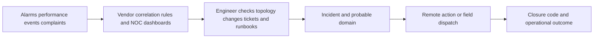
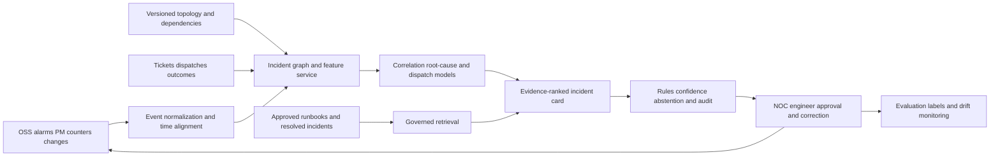

# TELCO-001 AI-assisted network incident correlation and dispatch triage

## Classification

- **Segment:** Telecommunications and network operations
- **Primary market / jurisdiction:** Brazil
- **Evidence reference date:** 2026-07-19; Brazilian regulatory and operating sources updated through 2026-06-24; comparable evidence reviewed through 2026-07-19.
- **Index summary:** Brazilian telecom NOCs can correlate alarms, topology, performance, tickets, and customer-impact signals to rank likely root causes, recommend safe runbooks, and avoid unnecessary field dispatches under engineer approval.
- **Company profile / size:** Medium and large mobile, fixed-broadband, wholesale, neutral-network, and managed-network operators with multi-vendor OSS/NOC operations.
- **Opportunity type:** operations
- **Status:** hypothesis
- **Confidence:** medium
- **Complexity:** large
- **Horizon:** medium
- **Risk:** high
- **Solution evidence level:** production
- **Operational maturity:** early
- **Azure fit:** high
- **AI dependency:** core
- **Intelligent capability:** Topology-aware alarm correlation, incident clustering, root-cause ranking, and dispatch-necessity prediction
- **Repository alignment:** new-solution

## Problem

Network operations centers receive alarms, performance counters, topology changes, trouble tickets, customer complaints, and field-work records from multiple vendors and domains. A single physical or configuration fault can create many downstream alarms, while separate incidents can appear similar.

Operators therefore spend specialist time grouping events, checking topology and recent changes, consulting runbooks, opening tickets, and deciding whether a remote action or field dispatch is required. Slow or incorrect triage increases mean time to restore, customer impact, duplicated tickets, and avoidable site visits.

## Brazil applicability and current context

Brazilian operators are measured under Anatel's Regulation of Quality of Telecommunications Services. Current quality rules include network and service indicators, municipal-level measurement, repair-time information, complaint handling, and availability. For regulatory measurement, qualifying interruptions include outages lasting at least ten minutes and affecting more than one subscriber; mobile interruption rules also use antenna-impact thresholds.

Anatel published the first quality seals in 2025 and continues to expose technical and consumer-quality indicators by operator, service, municipality, state, and country. This creates a current Brazilian operating incentive to detect, prioritize, and restore service-impacting incidents faster.

TIM Brasil and Nokia announced in March 2026 an expansion of AI-ready 5G modernization across fourteen additional states, covering approximately 42% of Brazil's population. This does not prove the proposed incident-correlation model's local performance, but it confirms current Brazilian network modernization, AI-enabled operational infrastructure, and a relevant target environment.

Material local differences include heterogeneous legacy OSS, multiple access technologies, vendor-specific alarm semantics, regional field logistics, and Anatel-specific quality definitions. These must be represented in prototype data and evaluation rather than imported from foreign operators.

## Evidence

### Confirmed problem evidence

- Anatel's current RQUAL operating material treats network availability, service performance, repair time, complaint resolution, and customer experience as measurable quality dimensions in Brazil.
- The Anatel quality system publishes operator and municipal indicators, creating an observable baseline for service availability and repair outcomes.
- TIM Brasil's 2026 network modernization expansion confirms continued growth in network scale, AI readiness, and operational complexity across multiple Brazilian regions.

### Favorable solution evidence

- AT&T reports an end-to-end incident-management platform combining alarms, logs, tickets, outage history, topology, machine-learning models, and later generative and agentic capabilities. The operator reported 3.1 million avoided dispatches and more than 12 million hours of reduced customer downtime over one year.
- Airtel reported production use of analytics and automation for alarm isolation, root-cause enrichment, and field-work reduction, including lower MTTR and network unavailability.
- Digital Nasional Berhad reported production alarm correlation and automated operational processes with increased uptime, reduced alarm volume, and faster complaint resolution.
- China Unicom reported knowledge-graph applications for alarm correlation and root-cause recommendation with improved analysis accuracy and processing time.
- Ericsson describes operational deployments and prototypes that combine alarm streams, topology, performance counters, historical incidents, runbooks, and human-approved remediation.

### Counter-evidence and failed comparables

- Vendor and operator case studies often combine process redesign, OSS modernization, automation, topology normalization, and AI, so model-only causal contribution is difficult to isolate.
- Multi-vendor alarm identifiers and topology are inconsistent; poor normalization can create false correlations and unstable root-cause rankings.
- Historical tickets can contain copied diagnoses, inconsistent closure codes, and labels that reflect the dispatched team's conclusion rather than the true initiating fault.
- Alarm storms, planned maintenance, cascading failures, topology changes, and novel software faults can cause distribution shift.
- Fully autonomous remediation can amplify an incorrect diagnosis. The initial prototype therefore recommends and ranks actions but does not execute network changes automatically.

### Inference

- A Brazilian operator does not need a locally proven production model before testing this capability. A bounded replay prototype can determine whether local alarm, topology, ticket, and dispatch data contain enough signal to outperform current correlation rules.
- The most defensible first value is better incident grouping and root-cause ranking for engineer review, followed by dispatch-necessity prediction only after diagnosis quality is acceptable.

### Unknowns

- Availability and consistency of topology, maintenance-window, configuration-change, ticket, and dispatch outcome data.
- Whether incident closure codes can support reliable training labels or require expert relabeling.
- Incremental value over the operator's existing vendor correlation rules and runbooks.
- False-positive cost, engineer acceptance, inference latency, and operational support cost in the local environment.

### Sources

- [Anatel Qualidade](https://www.gov.br/anatel/pt-br/dados/qualidade/qualidade-dos-servicos/anatel-qualidade) — Brazil; published 2025-07-11; modified 2026-06-24; current quality-indicator context.
- [Regulamento de Qualidade dos Serviços de Telecomunicações](https://www.gov.br/anatel/pt-br/dados/qualidade/qualidade-dos-servicos/regulamento/) — Brazil; published 2025-10-14; modified 2026-06-24; current RQUAL indicators and reference values.
- [Regras de qualidade e interrupções](https://www.gov.br/anatel/pt-br/dados/qualidade/qualidade-dos-servicos/regras/) — Brazil; published 2025-07-11; modified 2026-06-24; interruption definitions and preventive regulatory model.
- [Nokia expands partnership with TIM Brasil](https://www.nokia.com/newsroom/nokia-expands-partnership-with-tim-brasil-to-deliver-next-generation-ai-ready-5g-network-with-nvidia/) — Brazil; published 2026-03-02; current local AI-ready network modernization context, not proof of this solution's outcomes.
- [AT&T built an AI system to prevent network outages](https://www.businessinsider.com/att-telecom-ai-network-outage-prevention-2026-7) — United States; published 2026-07-16; production comparable and reported dispatch/downtime outcomes.
- [Airtel's data-driven transformation journey](https://inform.tmforum.org/research-and-analysis/case-studies/airtels-data-driven-transformation-journey) — foreign comparable; production alarm correlation, root-cause analysis, field-work and availability outcomes.
- [Digital Nasional Berhad intent-based operations](https://www.ericsson.com/en/cases/2024/digital-nasional-berhad-intent-based-operations) — Malaysia; production operational automation and alarm-correlation evidence.
- [China Unicom knowledge graphs for autonomous networks](https://inform.tmforum.org/research-and-analysis/case-studies/china-unicom-uses-ai-knowledge-graphs-in-move-towards-more-autonomous-networks) — China; production knowledge-graph alarm correlation and root-cause recommendation evidence.
- [Machine intelligence at the NOC](https://www.ericsson.com/en/blog/2018/6/machine-intelligence-at-the-noc) — international technical context; explains multi-vendor heterogeneity and cascading-alarm challenges.

## Current process

## Baseline without AI

- **Current baseline:** Vendor OSS alarm de-duplication, static thresholds, topology rules, maintenance suppression, manual dashboards, runbooks, and engineer judgment.
- **Stronger non-AI alternative:** Normalize alarms and topology, enforce incident taxonomy, improve deterministic correlation, and expose a unified timeline before adding models.
- **Baseline cost or effort drivers:** Rule maintenance, multi-vendor integration, specialist triage, duplicate tickets, and site dispatches.
- **Baseline quality and limitations:** Strong for known deterministic patterns but brittle for cross-domain cascades, evolving software faults, and combinations not encoded by experts.
- **Why intelligence should materially outperform it:** Models can learn event sequences, topology context, historical incident similarity, and dispatch outcomes that are difficult to maintain as explicit rules.
- **Condition under which the non-AI baseline should be preferred:** When normalized topology and reliable incident outcomes are unavailable, or when deterministic correlation already meets prototype targets at lower cost.

## Proposed solution

Build a read-only incident-assistance layer connected to a bounded OSS/NOC data slice. It groups related events into candidate incidents, ranks likely initiating entities and causes, retrieves matching historical incidents and approved runbooks, estimates whether remote handling is plausible, and presents an evidence card to an NOC engineer.

Deterministic controls suppress planned maintenance, enforce topology and time-window constraints, validate supported runbook actions, and prevent autonomous network changes. Engineers approve diagnoses, correct labels, and decide whether to dispatch. Their feedback becomes evaluation and retraining data.

## Intelligent capability

- **Technique / model family:** Temporal graph learning or graph-enhanced ranking for alarm correlation; supervised or learning-to-rank model for root cause; calibrated classifier for dispatch necessity; retrieval over approved runbooks and historical incidents.
- **Why it is necessary:** Static correlation rules cannot economically encode all cross-domain event sequences, historical similarities, and changing network relationships. Removing the model reduces the solution to another consolidated dashboard.
- **Inputs:** Alarm stream, timestamps, severity, affected resources, network topology, dependencies, performance counters, configuration changes, maintenance windows, tickets, closure codes, dispatch records, customer-impact indicators, and approved runbooks.
- **Outputs:** Incident clusters, ranked root-cause candidates, confidence, supporting events and topology paths, similar resolved incidents, recommended diagnostic steps, and dispatch-likelihood score.
- **Training / grounding / optimization:** Begin with historical replay and weak labels from incident/ticket outcomes; relabel a stratified expert-reviewed set; combine deterministic graph constraints with learned ranking; ground recommendations only in approved runbooks and resolved incidents.
- **Evaluation:** Incident-clustering precision/recall, top-1 and top-3 root-cause accuracy, calibration error, dispatch classification precision/recall, time-to-first-correct-diagnosis, and incremental value over current correlation rules.
- **Fallback and controls:** Read-only deployment, confidence threshold, abstention, evidence display, engineer approval, deterministic maintenance suppression, unsupported-action blocking, and immediate fallback to existing OSS workflow.

## Data readiness

- **Data owners and access path:** NOC/OSS, network engineering, field service, service assurance, and customer operations.
- **Volume, history, frequency, and coverage:** High-volume event streams are expected; the prototype needs several months of alarms plus linked incidents and outcomes for one domain or region.
- **Labels or outcome feedback available:** Ticket root cause, resolved resource, closure code, remote resolution, dispatch, repeat dispatch, and restoration timestamp; expert review is required because these labels may be noisy.
- **Known quality, missingness, imbalance, and leakage risks:** Duplicate alarms, inconsistent clocks, missing topology edges, copied closure text, rare major incidents, post-resolution fields leaking the answer, and vendor-specific semantics.
- **Brazilian or local-context representativeness:** Train and evaluate on the operator's local network, technologies, vendors, regions, and operational taxonomies.
- **Privacy, retention, consent, surveillance, or data-sharing constraints:** Minimize subscriber identifiers; separate customer-impact aggregates from personally identifiable data; apply LGPD retention and access controls.
- **Integration and synchronization risks:** Event-time alignment, topology versioning, ticket linkage, and change-management feeds are central risks.
- **Drift and change sources:** Software releases, topology expansion, new vendors, alarm-code changes, seasonal weather, and operational-policy changes.
- **Minimum viable dataset for a pilot:** One network domain or regional cluster, three to six months of normalized alarms, versioned topology, incident/ticket outcomes, dispatch records, maintenance windows, and 300-500 expert-reviewed incidents where available.

## Pilot, economics, and kill criteria

- **Pilot population / process slice:** One mobile-RAN region, fixed-access domain, or transport-network cluster with an existing deterministic correlation baseline.
- **Duration or event volume:** Historical replay plus four to eight weeks of read-only shadow operation.
- **Baseline or control group:** Existing vendor correlation rules and normal engineer triage on the same incidents.
- **Required integrations and human effort:** Read-only alarm/event export, topology snapshot, ticket and dispatch history, runbook repository, and scheduled expert label review.
- **Principal cost drivers:** Data normalization, topology integration, expert labeling, event storage, model inference, retrieval index, monitoring, and NOC review time.
- **Business success criteria:** Lower median triage time, fewer duplicate incidents, fewer engineer steps per incident, and credible avoided-dispatch candidates confirmed in shadow mode.
- **Model-quality success criteria:** Root cause appears in top three above the current baseline; calibrated confidence supports safe abstention; incident grouping does not merge unrelated customer-impacting events at an unacceptable rate.
- **Adoption and workflow success criteria:** Engineers inspect recommendations, provide corrections, and report reduced—not increased—diagnostic effort.
- **Safety or compliance stop conditions:** Any autonomous network change, exposure of subscriber-sensitive data, systematic suppression of critical alarms, or untraceable recommendation.
- **Kill criteria:** Stop or redesign when the model does not materially outperform deterministic correlation, requires unavailable topology or labels, creates excessive false grouping, increases median triage time, or cannot produce auditable evidence for recommendations.
- **Scale decision:** Expand only after repeatable performance across new periods, a second topology region or vendor, acceptable abstention and false-positive burden, and demonstrated operational value in shadow mode.

## Macro architecture

## Capabilities and possible technologies

- Application and workflow capabilities: Incident evidence cards, ranked queues, correction workflow, and shadow-mode comparison.
- Data capabilities: Event streaming, normalized alarm schema, topology graph, feature history, ticket and dispatch linkage.
- Integration capabilities: Read-only OSS adapters, ticketing integration, runbook access, and field-service outcomes.
- Required AI / ML capabilities: Temporal incident clustering, graph-based root-cause ranking, calibrated dispatch prediction, and governed retrieval.
- Training, fine-tuning, grounding, recognition, or optimization capabilities: Weak-label bootstrapping, expert-reviewed golden set, periodic retraining, and approved-runbook grounding.
- Evaluation and model-operations capabilities: Replay evaluation, shadow deployment, calibration, drift monitoring, per-vendor slices, feedback tracking, and rollback.
- Security and governance capabilities: Private networking, managed identity, least privilege, pseudonymization, immutable audit, and model/data lineage.
- Azure services that may fit: Azure Event Hubs, Azure Data Explorer, Azure Databricks or Azure Machine Learning, Azure Cosmos DB with graph-compatible modeling or a managed graph alternative, Azure AI Search, Azure Functions or Container Apps, Azure Monitor, and Microsoft Purview.
- Non-Azure or open-source alternatives worth considering: Kafka, Flink, ClickHouse, Neo4j, PostgreSQL/Apache AGE, OpenSearch, MLflow, Feast, and Kubernetes.

## Possible gains

- Faster and more consistent incident triage.
- Fewer duplicate tickets and avoidable field dispatches.
- Better transfer of expert diagnostic knowledge.
- Earlier recognition of cross-domain and cascading failures.
- Auditable evidence for why an incident was prioritized or a dispatch was recommended.

## Metrics for validation

### Business and operational metrics

- Median and percentile time from first alarm to accepted diagnosis.
- Mean time to restore for pilot incidents.
- Duplicate-ticket and repeat-dispatch rate.
- Engineer interactions and minutes per incident.
- Confirmed avoidable dispatch candidates and estimated cost per correctly avoided dispatch.

### Intelligent-capability metrics

- Incident-clustering precision, recall, and pairwise F1.
- Top-1/top-3 root-cause accuracy and mean reciprocal rank.
- Dispatch prediction precision, recall, calibration, and abstention rate.
- Engineer acceptance, override, correction, and unsupported-recommendation rates.
- Incremental performance and effort reduction versus deterministic correlation.

## Risks, limits, and controls

- Privacy and sensitive data: Minimize subscriber-level data and isolate customer-impact aggregates.
- Brazilian regulatory or policy constraints: Preserve RQUAL reporting logic and do not replace official measurement or operator accountability.
- Human decision boundaries: Engineers retain diagnosis acceptance, remediation approval, and dispatch authority.
- Model, retrieval, recognition, or policy failure modes: Incorrect grouping, causal confusion, stale topology, runbook mismatch, and overconfident ranking.
- Comparable deployment failures and applicability: Reported outcomes often include broader transformation; prototype measurement must isolate incremental value over the local baseline.
- Bias, drift, weak labels, or insufficient feedback: Measure by vendor, technology, region, incident class, and severity; maintain expert-reviewed evaluation sets.
- Integration and data availability risks: Topology versioning and ticket linkage may dominate prototype effort.
- Adoption and change-management risks: Evidence-first cards and shadow mode reduce disruption; recommendations must save engineer effort.
- Cost, latency, infrastructure, and operational-support risks: Limit initial event scope, precompute graph context, and measure cost per evaluated incident.

## Fit score

| Dimension | Score | Rationale |
| --- | ---: | --- |
| Problem evidence and relevance | 18/20 | Current Anatel quality and interruption rules establish a measurable Brazilian service-availability problem; TIM's 2026 modernization confirms a relevant operating environment. |
| Business or operational value | 18/20 | Triage time, duplicate tickets, restoration time, and dispatches are measurable against the current process. |
| Technical feasibility | 16/20 | Multiple foreign production comparables and mature techniques support a bounded replay/shadow prototype; local topology and label quality remain major unknowns. |
| Reuse potential | 18/20 | Pattern applies across mobile, fixed, transport, data-center, utility, and other event-heavy operations. |
| Strategic differentiation | 16/20 | Topology-aware learned correlation and evidence-ranked diagnosis add value beyond static rules when evaluated against them. |
| **Raw total** | **86/100** | Strong prototype candidate with honest local data and integration uncertainty. |
| **Applied cap** | **none** | No configured prototype-testability guardrail is triggered. |
| **Final total** | **86/100** | Publish as a medium-confidence hypothesis, not as proven Brazilian production value. |

## Repository relationship

- Existing references that may be reused: Event-driven ingestion, observability, RAG/search, model evaluation, and agent/tool-governance building blocks where present.
- Missing capabilities exposed by this opportunity: Versioned operational topology graph, temporal alarm clustering, shadow-mode decision evaluation, and operator-feedback capture.
- Potential building blocks: Event normalization contract, topology-aware feature service, ranked incident evidence card, calibrated abstention control, and replay evaluator.
- Potential composed solution: Telecom NOC incident-assistance reference solution integrating streaming events, topology, tickets, retrieval, ML ranking, controls, and human review.
- Reasons to keep it outside the current kit, when applicable: Vendor-specific OSS adapters and telecom alarm semantics should remain solution-level integrations rather than generic core modules.

## Duplicate control

- **Problem keys:** telecom-network-incidents, alarm-storms, root-cause-triage, avoidable-field-dispatch, service-availability
- **Capability keys:** temporal-alarm-correlation, topology-graph, root-cause-ranking, dispatch-prediction, governed-runbook-retrieval
- **Research queries used:** Brazil telecom quality interruptions Anatel 2025 2026; TIM Brasil Nokia AI network modernization 2026; telecom alarm correlation root cause production; network incident AI false positives integration cost; customer-premises fault isolation; fiber fault recovery; telecom energy optimization.
- **Related opportunities:** ENERGY-001 uses anomaly ranking and field verification but addresses hidden water leaks, different telemetry, actor, process, and outcome.
- **Uniqueness statement:** This opportunity targets telecom NOC incident formation, cross-domain root-cause ranking, and dispatch triage using network topology and event sequences; it does not duplicate asset-leak detection or generic observability assistance.

## Next decision

- shortlist for review.

The shortlist recommendation means the prototype hypothesis is specific and testable. It does not approve implementation or claim proven Brazilian production outcomes.
