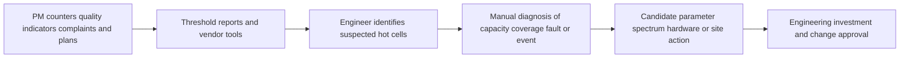
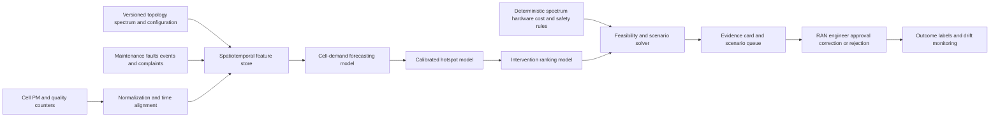

# TELCO-002 AI-assisted mobile capacity-hotspot assurance

## Classification

- **Segment:** Telecommunications and network operations
- **Primary market / jurisdiction:** Brazil
- **Evidence reference date:** 2026-07-20; Brazilian operating evidence published or updated through 2026-07-15.
- **Index summary:** Brazilian mobile operators can forecast cell-level demand and rank capacity interventions using traffic, quality, coverage, event, and topology signals while engineers retain authority over configuration and investment decisions.
- **Company profile / size:** Medium and large mobile operators, neutral-host providers, and managed RAN organizations.
- **Opportunity type:** optimization
- **Status:** hypothesis
- **Confidence:** medium
- **Complexity:** large
- **Horizon:** medium
- **Risk:** high
- **Solution evidence level:** prototype
- **Operational maturity:** unvalidated
- **Azure fit:** high
- **AI dependency:** core
- **Primary AI role:** prediction
- **Intelligent capability:** Spatiotemporal cell-demand forecasting, hotspot anomaly detection, and constrained capacity-intervention ranking
- **Repository alignment:** new-solution

## Problem

Radio-planning and performance teams continuously inspect cell utilization, throughput, latency, accessibility, retainability, coverage, spectrum, topology, planned events, complaints, and expansion commitments. Current workflows rely on thresholds, periodic reports, engineer experience, and vendor optimization tools.

Thresholds identify cells already under pressure but often react late, miss short-lived or spatially migrating demand, and create large review queues. Engineers must distinguish recurring capacity pressure from faults, interference, coverage gaps, planned maintenance, and event-driven bursts before recommending parameter changes, carrier additions, spectrum actions, small cells, or new sites.

## Brazil applicability and current context

Anatel reported on 15 July 2026 that Brazil had 276.4 million mobile accesses in the second quarter of 2026, with 5G representing 23.9% of the base, or 66.1 million lines. The 5G coverage schedule also requires, by 31 July 2026, service in municipalities with at least 200,000 inhabitants at a minimum density of one antenna per 15,000 inhabitants.

Anatel publishes municipal quality indicators, intramunicipal speed measurements, historical results, quality seals, and reports of non-compliance. Its 2025 connectivity index showed improvement in 4,614 municipalities but deterioration in 956, demonstrating that aggregate expansion coexists with local regressions.

The Brazilian prototype must reflect local spectrum holdings, dense and rural geographies, prepaid traffic patterns, infrastructure sharing, multi-vendor RAN, municipal licensing, and Anatel quality definitions. Foreign models cannot establish Brazilian capacity economics or acceptable operational risk.

## Evidence

### Confirmed problem evidence

- Anatel reported 66.1 million 5G accesses and 23.9% penetration in 2Q2026, confirming rapid traffic migration and a growing planning surface.
- Current 5G commitments require continuing antenna-density expansion through July 2026 and later stages, creating recurring prioritization decisions.
- Anatel's 2025 connectivity index found 956 municipalities with lower scores despite broad national improvement.
- Anatel exposes municipal and intramunicipal performance indicators, confirming that local congestion, speed, coverage, and quality variation are measurable operating concerns.

### Favorable solution evidence

- Published mobile-network research shows that recurrent and other time-series models can forecast short-term traffic and that performance varies across spatial cell clusters.
- Research combining traffic forecasting with constrained resource allocation demonstrates a technically plausible path for testing demand-aware recommendations.
- Operators already retain rich PM counters, configuration, topology, ticket, and intervention histories that can support replay evaluation without changing the live network.

### Counter-evidence and limitations

- Static thresholds, deterministic trend analysis, vendor SON features, and disciplined capacity planning may already perform well for stable cells.
- Traffic models degrade during holidays, concerts, disasters, promotions, new tariffs, topology changes, and technology migration.
- Forecast accuracy does not prove that a proposed intervention is safe, feasible, or economically preferable.
- Optimization and reinforcement-learning studies often use simplified simulators or foreign datasets; results may not transfer to Brazilian networks.
- Automated configuration can amplify a bad forecast. The prototype is read-only and ranks options; it never changes RAN parameters.

### Inference

- The first credible value is earlier and better-prioritized engineering review, not autonomous network control.
- A bounded historical replay can test whether learned forecasts materially improve hotspot lead time and ranking beyond current thresholds.

### Unknowns

- Availability and consistency of cell-level counters, topology versions, configuration changes, event calendars, complaints, and intervention outcomes.
- Whether historic investment and parameter-change records encode reliable outcome labels.
- Incremental value over vendor forecasting, SON, and engineering rules.
- False-alert burden, operator trust, inference cost, and transfer across vendors and regions.

### Sources

- [Anatel divulga Relatório de Monitoramento da Competição do segundo trimestre de 2026](https://www.gov.br/anatel/pt-br/assuntos/noticias/anatel-divulga-relatorio-de-monitoramento-da-competicao-do-segundo-trimestre-de-2026) — Brazil; 2026-07-15; current mobile and 5G access scale.
- [Compromissos de Abrangência do Leilão do 5G](https://www.gov.br/anatel/pt-br/regulado/universalizacao/compromissos-do-leilao-do-5g) — Brazil; current schedule includes 2026 obligations; regulatory deployment context.
- [Anatel divulga resultados mais recentes do Índice Brasileiro de Conectividade](https://www.gov.br/anatel/pt-br/assuntos/noticias/anatel-divulga-resultados-mais-recentes-do-indice-brasileiro-de-conectividade) — Brazil; 2026-04-24; municipal improvement and regression evidence.
- [Resultados de qualidade](https://www.gov.br/anatel/pt-br/dados/qualidade/qualidade-dos-servicos/resultados) — Brazil; modified 2025-12-02; municipal, historical, and intramunicipal quality data.
- [Predicting Short-term Mobile Internet Traffic using Recurrent Neural Networks](https://arxiv.org/abs/2010.05741) — international research; technical plausibility and cluster-dependent performance.
- [Mobile Traffic Offloading with Forecasting using Deep Reinforcement Learning](https://arxiv.org/abs/1911.07452) — international research; forecasting-plus-optimization plausibility, not Brazilian production proof.
- [Examining Machine Learning for 5G and Beyond through an Adversarial Lens](https://arxiv.org/abs/2009.02473) — international research; robustness and adversarial limitations.

## Current process

## Baseline without AI

- **Current baseline:** Utilization thresholds, rolling averages, busy-hour reports, deterministic alarms, vendor SON, coverage tools, and engineer review.
- **Strongest realistic non-AI alternative:** Unified time-series dashboard with deterministic trend extrapolation, event overlays, topology-aware rules, and an explicit intervention playbook.
- **Baseline strengths:** Transparent, inexpensive, auditable, and reliable for known stable patterns.
- **Baseline limitations:** Reactive thresholds, weak treatment of nonlinear spatial-temporal demand, and large queues during expansion or seasonal change.
- **Context where intelligence may add incremental value:** Cells with volatile demand, interacting neighbors, recurrent local events, technology migration, or many candidate interventions.
- **Condition where the non-AI baseline should be preferred:** Sparse history, unstable identifiers, major topology migration, or no measurable forecasting gain.

## Proposed solution

Create a read-only planning layer for one RAN region. It forecasts demand and quality distributions by cell and horizon, detects emerging hotspots, separates likely demand pressure from known maintenance or fault states, and ranks feasible intervention candidates with evidence and uncertainty.

Rules validate spectrum, topology, hardware, safety, licensing, maintenance, and change constraints. A deterministic solver may filter and order feasible scenarios using cost and capacity assumptions. Engineers approve all diagnosis, simulation, configuration, procurement, and deployment decisions.

## Where AI enters

### AI role map

| Process stage | AI component | AI type / model family | What it does | Runtime mode | Output | Human or deterministic control |
| --- | --- | --- | --- | --- | --- | --- |
| Demand assessment | Cell-demand forecaster | Time-series model or gradient boosting with spatial features | Forecasts utilization, throughput, and congestion probability by cell and horizon | Daily batch plus optional hourly refresh | Quantile forecasts and confidence | Data-quality gates, event overrides, abstention |
| Hotspot review | Emerging-hotspot detector | Anomaly detection and calibrated classification | Distinguishes unusual demand trajectories from normal seasonality | Batch | Ranked hotspot candidates and evidence | Maintenance and known-fault suppression |
| Planning support | Intervention ranker | Learning-to-rank with deterministic optimization solver | Ranks feasible review options using predicted demand and historical outcomes | Human-in-the-loop | Ranked scenarios, expected capacity effect, uncertainty | Feasibility rules and engineer approval |

### Required distinctions

- **Primary AI role:** prediction and ranking/recommendation.
- **Model family:** time-series forecasting, gradient boosting, anomaly detection, and learning-to-rank; deterministic optimization is not AI unless a learned policy is later tested.
- **Training requirement:** supervised training with historical counters and outcomes; self-supervised pretraining may be tested for sparse labels.
- **Training location and cadence:** offline initial training; monthly or drift-triggered retraining after engineering review.
- **Inference location:** private cloud batch pipeline, with optional near-real-time scoring for selected cells.
- **Agent role:** Agent: not used.
- **LLM role:** LLM: not used.
- **Not AI:** OSS ingestion, KPI calculations, topology, spectrum and hardware constraints, cost tables, scenario filtering, dashboards, approvals, and change management.

## Intelligent capability details

- **Technique / model family:** Hierarchical or graph-aware time-series forecasting, calibrated hotspot classifier, anomaly detection, and learning-to-rank.
- **Why it is necessary:** The value depends on learning nonlinear temporal and neighboring-cell patterns that are impractical to maintain only as rules.
- **Inputs:** Cell PM counters, busy-hour metrics, QoS indicators, topology and neighbors, spectrum, configuration, technology, weather, events, complaints, maintenance, faults, and completed interventions.
- **Outputs:** Quantile demand forecasts, hotspot probability, uncertainty, contributing signals, ranked feasible interventions, and abstention.
- **Training / grounding / optimization assumptions:** Versioned topology and counters; leakage-safe temporal splits; reviewed outcomes; event features; deterministic feasibility constraints.
- **Evaluation:** MAE or pinball loss by horizon, hotspot precision/recall, calibration, lead time, NDCG or top-k usefulness, and incremental performance over thresholds and trend extrapolation.
- **Fallback and controls:** Rule-only dashboard, confidence thresholds, abstention, shadow mode, human review, no autonomous configuration, and rollback to current planning workflow.

## Data and integration assumptions

- **Data owners and access path:** RAN performance, planning, NOC, optimization, field engineering, finance, and customer operations.
- **Expected volume, history, frequency, and coverage:** Fifteen-minute or hourly counters for one region over six to twelve months, plus topology and intervention history.
- **Labels, outcomes, feedback, or simulation available:** Sustained threshold breaches, engineer-confirmed hotspot, post-change capacity effect, complaint reduction, and deferred or rejected recommendation.
- **Known quality, imbalance, missingness, and leakage risks:** Counter gaps, clock drift, cell renaming, topology changes, rare severe hotspots, post-intervention leakage, and biased labels from historic investment choices.
- **Brazilian or local-context representativeness:** Evaluation must cover local spectrum, vendors, urban form, events, tariffs, and customer mix.
- **Privacy, retention, consent, surveillance, or sharing constraints:** Use aggregated cell-level traffic; exclude subscriber payload and minimize individual identifiers under LGPD.
- **Integration and synchronization assumptions:** Versioned OSS exports, topology snapshots, maintenance calendars, and intervention records can be joined by cell and event time.
- **Drift and change sources:** New spectrum, refarming, 5G adoption, tariff changes, events, new sites, vendor releases, and seasonal mobility.
- **Minimum viable data for a prototype:** One region, 300 or more cells where available, six months of counters, topology, known events, and a reviewed hotspot/intervention set.

## Prototype validation plan

- **Prototype scope / process slice:** One urban cluster and one constrained planning horizon; no live changes.
- **Users, sites, assets, documents, events, or simulated cases:** RAN planners and optimization engineers reviewing historical and shadow-mode cells.
- **Baseline or comparison:** Current thresholds, rolling trend extrapolation, vendor outputs, and engineer queue.
- **Required data and integrations:** Read-only PM, topology, maintenance, event, ticket, and intervention exports.
- **Model-quality metrics:** Forecast pinball loss, hotspot precision/recall, calibration, lead time, top-k ranking quality, and abstention rate.
- **Business or workflow metrics:** Review queue reduction, earlier confirmed hotspot detection, engineer time per case, and proportion of recommendations judged actionable.
- **Human acceptance, correction, or override metrics:** Inspection rate, acceptance, correction category, override reason, and trust by confidence band.
- **Safety and compliance boundaries:** No subscriber-content use, no automatic RAN change, no automated procurement, and full evidence traceability.
- **Failure or redesign criteria:** No material gain over deterministic trend rules, excessive false alerts, poor calibration, unstable transfer across time, or recommendations blocked by feasibility rules.
- **Evidence required before a pilot or broader implementation:** Repeatable temporal replay, acceptable shadow-mode burden, documented data governance, and engineering approval of the control model.

## Macro architecture

## Capabilities and possible technologies

- Application and workflow capabilities: Planning queue, evidence cards, scenario comparison, correction workflow, and shadow-mode reporting.
- Data capabilities: Time-series ingestion, topology versioning, feature store, historical intervention outcomes, and event calendar.
- Integration capabilities: Read-only OSS and performance-management adapters, ticketing, planning, GIS, and finance inputs.
- Required AI / ML capabilities: Forecasting, anomaly detection, calibrated classification, and ranking.
- Training, grounding, recognition, or optimization capabilities: Temporal validation, reviewed golden set, drift monitoring, and constrained scenario optimization.
- Agent and tool-use capabilities: not used.
- LLM / foundation-model capabilities: not used.
- Evaluation and model-operations capabilities: Azure Machine Learning or MLflow-compatible experiment tracking, registry, monitoring, and batch endpoints.
- Security and governance capabilities: Managed identity, private networking, RBAC, encryption, audit, and aggregate-only traffic features.
- Azure services that may fit: Azure Data Explorer, Event Hubs, Data Lake Storage, Azure Machine Learning, Functions or Container Apps, Managed Grafana, and Key Vault.
- Non-Azure or open-source alternatives worth considering: Kafka, TimescaleDB, ClickHouse, MLflow, LightGBM, PyTorch Forecasting, OR-Tools, and Grafana.

## Possible gains

- Earlier identification of persistent capacity pressure before customer impact becomes obvious.
- Smaller, better-prioritized engineering review queues.
- More consistent comparison of parameter, spectrum, hardware, and site options.
- Auditable separation of model forecasts, deterministic feasibility, and human decisions.

## Metrics for validation

### Business and operational metrics

- Lead time from first signal to engineer-confirmed hotspot.
- Review effort, actionable recommendation rate, and repeat hotspot rate after intervention.
- Quality-indicator and complaint trajectory for confirmed cases, without claiming causality before controlled evaluation.

### Intelligent-capability metrics

- Pinball loss or MAE by horizon and cell class; hotspot precision, recall, calibration, and top-k ranking quality.
- Abstention, engineer acceptance, correction, and override by region, vendor, and demand regime.

## Risks, limits, and controls

- Privacy and sensitive data: Aggregate by cell; exclude payload and minimize subscriber identifiers.
- Brazilian regulatory or policy constraints: Preserve Anatel measurement definitions and operator change governance.
- Human decision boundaries: Engineers own configuration, spectrum, investment, and deployment decisions.
- Model or policy failure modes: Event shocks, topology drift, misleading historical labels, and underprediction of rare peaks.
- Agent or tool-execution failure modes: not applicable; no agent is used.
- LLM hallucination, grounding, or prompt-injection risks: not applicable; no LLM is used.
- Comparable failures and applicable lessons: Offline accuracy can fail under live drift; optimization results depend on realistic constraints and simulation.
- Bias, drift, weak labels, or insufficient feedback: Monitor by geography, vendor, technology, and cell class; require reviewed outcomes.
- Integration and data risks: Cell identity, topology versions, counter semantics, and clock alignment are critical.
- Adoption and change-management risks: Recommendations must reduce analysis effort and show evidence, not create another alarm queue.
- Prototype cost or operational assumptions: Main costs are normalization, topology integration, expert review, time-series storage, and monitoring.

## Fit score

| Dimension | Score | Rationale |
| --- | ---: | --- |
| Problem evidence and relevance | 18/20 | Current Brazilian 5G scale, deployment obligations, and municipal quality variation support a specific planning problem. |
| Business or operational value | 18/20 | Earlier hotspot detection and prioritized intervention review can improve quality and capital discipline if validated. |
| Technical feasibility | 17/20 | A bounded replay is testable with standard operator data, but topology quality, labels, and drift are material unknowns. |
| Reuse potential | 17/20 | Forecasting, anomaly, ranking, and constrained planning blocks can transfer across mobile operators and other capacity domains. |
| Strategic differentiation | 17/20 | Learned spatiotemporal prediction adds material value beyond dashboards while preserving deterministic and human controls. |
| **Total** | **87/100** | Medium-confidence prototype hypothesis. |

## Repository relationship

- Existing references that may be reused: Data ingestion, model lifecycle, monitoring, identity, private networking, and governed workflow building blocks.
- Missing capabilities exposed by this opportunity: Topology-aware time-series features, calibrated hotspot scoring, scenario constraint service, and shadow-mode evaluation.
- Potential building blocks: `telecom-pm-normalizer`, `spatiotemporal-forecasting`, `capacity-scenario-ranker`, and `shadow-mode-evaluator`.
- Potential composed solution: Mobile capacity-hotspot assurance workspace.
- Reasons to keep it outside the current kit, when applicable: None; publication does not authorize implementation.

## Duplicate control

- **Problem keys:** mobile-capacity-planning, cell-congestion, 5g-growth, hotspot-prioritization
- **Capability keys:** spatiotemporal-forecasting, anomaly-detection, capacity-ranking, constrained-optimization
- **Research queries used:** Brazil telecom quality and complaints; Anatel 5G accesses and obligations; municipal connectivity regression; mobile capacity and energy themes; traffic forecasting limitations; telecom ML robustness.
- **Related opportunities:** TELCO-001 addresses active incident correlation and dispatch triage; TELCO-002 addresses prospective cell-demand and capacity planning.
- **Uniqueness statement:** This opportunity predicts and ranks future capacity pressure and planning options, rather than correlating alarms or diagnosing live incidents.

## Next decision

Prototype candidate. Implementation approval remains an explicit human decision.
