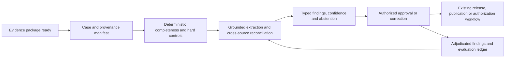

# FAMILY-001 Evidence-consistent human approval gate

## Classification

- **Status:** active
- **Primary architectural spine:** An asynchronous evidence package is normalized, checked by deterministic controls, reconciled by a grounded contradiction model, and held for an authorized human approval decision.
- **Primary intelligent mechanism:** Grounded cross-source entity, state, and requirement reconciliation with contradiction detection
- **Execution model:** asynchronous
- **Human authority:** The authorized reviewer approves, rejects, holds, or requests correction; model output never releases the governed process.
- **Applied cases:** 6

## Reusable outcome

Prevent incomplete, inconsistent, outdated, or unsupported evidence packages from reaching a governed approval, publication, release, or compliance decision.

## Suitable processes

- A bounded evidence package reaches a formal human approval gate.
- Multiple documents, images, structured records, requirements, or live-state references must agree.
- Hard rules can reject known-invalid cases while ambiguous contradictions require review.
- Reviewer dispositions can be recorded as adjudicated feedback.

## Unsuitable processes

- Continuous sensor prediction where the main job is forecasting future condition.
- Autonomous operational control or transaction blocking driven directly by model output.
- Open-ended content generation where reconciliation is secondary.
- Durable multi-step agents that write across systems before human approval.

## Architecture invariants

- A versioned case and evidence manifest preserve provenance, source, timestamp, schema, and governing requirement set.
- Deterministic completeness, identity, version, authorization, threshold, and mandatory-test controls run before model findings are considered.
- The intelligent layer extracts and aligns entities, states, claims, requirements, and supporting evidence across sources, then emits typed contradictions with confidence and citations.
- Low-confidence, missing-provenance, or conflicting cases abstain and remain held for an authorized human.
- Reviewer findings, corrections, overrides, and final outcomes are written to an auditable evaluation ledger.

## Variation points

| Variation point | Allowed adaptation | Derivation signal |
| --- | --- | --- |
| Evidence sources | Document, image, telemetry snapshot, topology, ERP, BIM, test-result, or case-record adapters | A different data lifecycle or trust boundary prevents one evidence manifest |
| Rules and regulation | Versioned deterministic rule packs and jurisdiction adapters | Rules require separate isolation or change the final authority |
| Model implementation | Document, vision, multimodal, or structured reconciliation models that preserve the same typed finding contract | The primary job becomes generation, prediction, or optimization |
| Runtime | Queue, batch, or request-driven review preparation | Continuous streaming changes latency, state, and failure handling |
| Approval workflow | Domain-specific reviewer roles, escalation, and correction channels | Model output is allowed to execute the governed release |

## Logical architecture

## Deterministic layer

- Case identity, evidence manifest, source provenance, schema and version validation.
- Mandatory-field, threshold, qualification, authorization, sequence, signature, test-result, and policy checks.
- Rule-pack selection by jurisdiction, effective date, product, facility, process, or document type.
- Immutable hold/release state transitions, segregation of duties, and approved exception recording.

## Intelligent layer

- **Primary mechanism:** Grounded cross-source entity, state, and requirement reconciliation with contradiction detection
- **Inputs:** Versioned documents, images, structured records, requirements, reference state, and deterministic validation results.
- **Outputs:** Typed missing-evidence, mismatch, contradiction, unsupported-claim, and ambiguity findings with source references, confidence, and abstention reason.
- **Training/grounding:** Ground every finding in supplied evidence and versioned requirements; evaluate with adjudicated findings and known-good/known-bad packages.
- **Inference:** Asynchronous case-level extraction and reconciliation before the approval queue is presented.
- **Abstention:** Missing provenance, unsupported source type, low extraction confidence, unresolved identity, incompatible versions, or contradictory authoritative sources.

## Optional extensions

- Configuration-impact mapping and regression-test candidate generation for regulatory change cases.
- Temporal reconstruction when event order and attributable intervals are material.
- Domain-specific vision recognition for physical line, site, or field evidence.

## Human and safety boundaries

- The model cannot approve publication, release work, certify compliance, authorize payment, attest a claim, or override a deterministic hard stop.
- Reviewers must see the source evidence, rule version, model confidence, and abstention reason.
- Corrections create a new evidence revision; prior evidence and decisions remain immutable.

## Data and integration contract

- Canonical entities: case, evidence_item, source, requirement, extracted_entity, observed_state, expected_state, deterministic_check, model_finding, review_decision, correction, and audit_event.
- Every evidence item carries source identity, acquisition time, content hash, schema/version, jurisdiction or rule context, and access classification.
- Adapters translate domain systems into the canonical manifest; family logic does not write directly to source systems.
- The output contract separates hard-stop checks, model findings, confidence, source references, and abstention.

## Evaluation contract

- **Model metrics:** Finding precision/recall by contradiction type, extraction accuracy, source-grounding rate, calibration, and abstention quality.
- **Incremental-value metrics:** Additional material findings over deterministic checks alone, measured on adjudicated packages.
- **Workflow metrics:** Reviewer time, rework cycles, escaped contradiction rate, evidence completeness, queue age, and decision turnaround.
- **Failure criteria:** Ungrounded findings, unacceptable missed hard contradictions, reviewer overload, unstable performance by evidence type, or any bypass of deterministic holds.

## Azure reference mapping

- Secure API or event intake, Blob Storage or equivalent evidence store, queue-backed Functions or Container Apps processing, and a relational case/audit store.
- Azure AI Document Intelligence, Azure AI Foundry models, Azure Machine Learning, or compatible vision/document models may implement extraction and reconciliation.
- Microsoft Purview, Entra ID, Key Vault, Private Link, Azure Monitor, and Application Insights may support governance and operations.
- Service choices remain replaceable as long as the canonical evidence, finding, approval, and audit contracts are preserved.

## Reusable building blocks

### Available

- Secure API, workflow, document-processing, audit, human-review, observability, and identity patterns already represented in the kit.

### Missing

- Canonical evidence manifest and provenance ledger.
- Typed contradiction/finding schema with source grounding.
- Versioned deterministic rule-pack runner.
- Human approval gate with immutable correction revisions.
- Adjudicated finding dataset and evaluation harness.

## Applied cases

| Opportunity | Actor/process | Disposition | Adapters | Extension | Validation delta | Derivation signal |
| --- | --- | --- | --- | --- | --- | --- |
| [`CROSS-003`](../segments/cross-industry/CROSS-003-tax-reform-configuration-assurance.md) | Tax, fiscal, ERP configuration, and release reviewer — Translate an official IBS/CBS change into reviewed ERP configuration and fiscal-document validation | `fit-with-extension` | Official Brazilian tax sources, effective-date rules, ERP tax configuration, fiscal-document schemas, product/jurisdiction mappings, and release pipeline connectors. | Regulatory-change impact mapping and risk-ranked regression-test candidate generation. | Evaluate the extension separately and prove incremental value over the base family pipeline. | none |
| [`MANUF-002`](../segments/manufacturing/MANUF-002-allergen-changeover-release-assurance.md) | Food quality, sanitation, production-release, or allergen-control reviewer — Verify allergen changeover evidence before releasing a line or batch | `direct-fit` | Recipe/BOM, allergen matrix, labels, cleaning records, line state, images, test results, equipment status, batch and quality systems. | Domain-specific line-clearance vision recognition. | Use the family metrics with domain-specific labels, thresholds, and workflow outcomes. | none |
| [`CONST-002`](../segments/construction-real-estate/CONST-002-ev-charging-fire-safety-evidence-assurance.md) | Property engineer, electrical reviewer, fire-safety consultant, or authority liaison — Review EV-charger retrofit evidence before engineering or authority acceptance | `fit-with-adapters` | Retrofit design, charger/electrical data, as-built evidence, tests, fire-safety requirements, site images, building records, and authority workflow. | Plan-to-site multimodal alignment. | Segment evaluation by source adapter, rule pack, operating context, and domain outcome. | none |
| [`ENERGY-003`](../segments/energy-utilities/ENERGY-003-field-work-isolation-evidence-assurance.md) | Electrical safety coordinator, switching authority, or field-work authorizer — Verify isolation and work-package evidence before authorizing field work | `fit-with-adapters` | Switching orders, live topology, crew qualifications, grounding records, job briefing, permits, field images, and work-management systems. | Live-topology and field-image reconciliation. | Segment evaluation by source adapter, rule pack, operating context, and domain outcome. | none |
| [`PUBLIC-001`](../segments/public-sector/PUBLIC-001-procurement-document-assurance.md) | Public buyer, procurement planner, legal/control reviewer, or approving authority — Review procurement planning and notice documents before approval and PNCP publication | `direct-fit` | ETP, term of reference, price research, notice, quantities, procurement rules, templates, approvals, and PNCP publication workflow. | Requirement-specificity classification. | Use the family metrics with domain-specific labels, thresholds, and workflow outcomes. | none |
| [`NONPROFIT-002`](../segments/nonprofit/NONPROFIT-002-program-evidence-chain-assurance.md) | Program manager, monitoring-and-evaluation analyst, finance reviewer, or report approver — Assemble and verify an evidence chain for funder reporting | `fit-with-adapters` | Program plans, activities, beneficiary records, expenses, field media, funder indicator definitions, consent/privacy, and reporting workflow. | Indicator mapping and unsupported-claim classification. | Segment evaluation by source adapter, rule pack, operating context, and domain outcome. | none |

## Closest families and boundary

Closest to FAMILY-007, but this family evaluates whether a bounded package is internally and externally consistent before a formal approval. FAMILY-007 reconstructs a chronology or obligation set as the primary output, even when no release package exists.

## Architecture derivation status

- **Current decision:** no derivation
- **Evidence:** All included cases preserve the same asynchronous evidence manifest, deterministic hard-stop layer, grounded reconciliation, abstention, and human approval boundary. Domain regulation, schemas, and vision adapters do not yet require a separate architecture.
