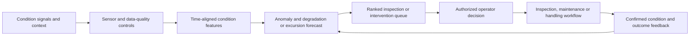

# FAMILY-002 Condition-risk monitoring and inspection prioritization

## Classification

- **Status:** active
- **Primary architectural spine:** Operational signals are quality-checked, transformed into condition features, scored for degradation or excursion risk, and ranked for human-confirmed inspection or intervention.
- **Primary intelligent mechanism:** Multivariate condition anomaly detection and near-term degradation or excursion forecasting
- **Execution model:** streaming
- **Human authority:** Operators approve inspection, maintenance, localization, aeration, handling, release, or disposal actions.
- **Applied cases:** 4

## Reusable outcome

Detect deteriorating physical or environmental conditions early enough to prioritize bounded human inspection and intervention before material loss, failure, or safety impact.

## Suitable processes

- Assets, environments, or stored goods emit repeated condition signals.
- The target is future deterioration, excursion, or hidden failure rather than document consistency.
- Deterministic thresholds remain useful but miss multivariate or contextual patterns.
- Human confirmation or inspection is required before consequential action.

## Unsuitable processes

- One-time image inspection with disposition routing.
- Demand and capacity planning where resource allocation is the primary outcome.
- Evidence-package approval or legal responsibility reconstruction.
- Automatic closed-loop control without human approval.

## Architecture invariants

- Time-aligned signal intake preserves asset, location, sensor, calibration, and operating context.
- Deterministic sensor-quality, range, stale-data, and safety-threshold controls run independently of the model.
- The intelligent layer estimates anomalous condition and near-term deterioration or excursion risk.
- Results are ranked against inspection or intervention capacity with explanations and abstention.
- Confirmed inspections, laboratory results, repairs, recovered loss, and false alarms become evaluation feedback.

## Variation points

| Variation point | Allowed adaptation | Derivation signal |
| --- | --- | --- |
| Signal modality | Telemetry, acoustic, hydraulic, weather, route, inventory, or maintenance adapters | A fundamentally different recognition task replaces condition modeling |
| Cadence | Streaming, micro-batch, or scheduled scoring | Latency requires autonomous edge control |
| Asset physics | Domain feature engineering and deterministic safety envelopes | A separate simulation/control loop is required |
| Intervention | Inspection, maintenance, aeration, route handling, or field localization | Model output directly actuates equipment |
| Confirmation | Technician, geophone, sample, laboratory, or quality-review evidence | No reliable ground-truth feedback can be obtained |

## Logical architecture

## Deterministic layer

- Sensor identity, calibration, range, freshness, duplication, clock alignment, and missing-data checks.
- Hard safety limits, regulatory thresholds, product or asset constraints, and mandatory confirmation steps.
- Intervention eligibility, cost, access, maintenance-window, and resource-capacity rules.
- Manual fallback and alarm routing when model inputs are insufficient.

## Intelligent layer

- **Primary mechanism:** Multivariate condition anomaly detection and near-term degradation or excursion forecasting
- **Inputs:** Time-series condition signals plus asset, route, weather, maintenance, production, inventory, and inspection context.
- **Outputs:** Condition anomaly, degradation or excursion probability, contributing signals, uncertainty, recommended review horizon, and priority.
- **Training/grounding:** Historical failures, excursions, confirmed leaks, inspections, samples, maintenance outcomes, and synthetic degradation scenarios where labels are sparse.
- **Inference:** Continuous or scheduled scoring with event creation only when risk and data-quality criteria are met.
- **Abstention:** Insufficient coverage, stale or drifting sensors, out-of-distribution operating state, unresolved asset identity, or uncertainty above the review threshold.

## Optional extensions

- Acoustic or image classifiers for domain-specific detection.
- Physics-informed features or simulation-based synthetic training.
- Constrained recommendation of a small set of approved interventions.

## Human and safety boundaries

- The model cannot release or dispose regulated product, shut down equipment, change control parameters, or certify asset safety.
- Operators retain authority over inspection, maintenance, localization, routing, and escalation.
- Hard alarms bypass model ranking and remain visible even when the model is disabled.

## Data and integration contract

- Canonical entities: monitored_object, sensor, observation, operating_context, quality_check, risk_score, alert_case, intervention_option, human_decision, confirmation, and outcome.
- Observations include event time, ingestion time, unit, calibration/version, quality flags, location, and provenance.
- Adapters normalize domain signals; model outputs never replace raw observations or hard-limit events.
- Feedback distinguishes confirmed deterioration, false alarm, prevented event, intervention performed, and unknown outcome.

## Evaluation contract

- **Model metrics:** Event recall, precision, lead time, calibration, false alarms per monitored object, and performance by operating regime.
- **Incremental-value metrics:** Confirmed material risks detected earlier or more accurately than deterministic thresholds and scheduled inspection alone.
- **Workflow metrics:** Inspection yield, intervention lead time, avoided excursions/failures, technician travel, downtime, waste, and queue age.
- **Failure criteria:** Missed high-severity events, excessive false alarms, poor calibration, unstable drift, unsafe suppression of hard alarms, or no usable confirmation loop.

## Azure reference mapping

- IoT Hub or compatible event intake, Event Hubs, Stream Analytics or Functions, a time-series/operational store, and a case/alert service.
- Azure Machine Learning or compatible model serving may host anomaly and forecasting models; Azure Data Explorer or Fabric may support feature preparation.
- Azure Monitor, Application Insights, managed identity, Key Vault, Private Link, and role-based review interfaces support operations and governance.
- Edge components are optional adapters unless autonomous edge control changes the family boundary.

## Reusable building blocks

### Available

- Event ingestion, anomaly-detection, monitoring, secure API, workflow, and human-review patterns.

### Missing

- Canonical condition-signal and sensor-quality contract.
- Time-series feature and label pipeline with event-level evaluation.
- Risk-to-inspection prioritization service.
- Confirmation and prevented-event feedback ledger.

## Applied cases

| Opportunity | Actor/process | Disposition | Adapters | Extension | Validation delta | Derivation signal |
| --- | --- | --- | --- | --- | --- | --- |
| [`MANUF-001`](../segments/manufacturing/MANUF-001-aging-equipment-condition-maintenance-prioritization.md) | Reliability engineer, maintenance planner, or condition-monitoring technician — Monitor aging equipment condition and prioritize inspection or maintenance review | `direct-fit` | Plant historian, sensors, CMMS, production context, asset hierarchy, maintenance records, operating regime, and inspection workflow. | None beyond asset-specific features and maintenance adapters. | Use the family metrics with domain-specific labels, thresholds, and workflow outcomes. | none |
| [`LOG-001`](../segments/logistics-transport/LOG-001-pharmaceutical-cold-chain-excursion-assurance.md) | Pharmaceutical logistics control-tower or quality reviewer — Monitor a shipment for thermal excursion risk and prioritize intervention or quality review | `fit-with-adapters` | Shipment, product constraints, route, weather, logger telemetry, refrigeration equipment, handling events, and quality-release workflow. | Sensor-quality anomaly detection and route-context features. | Segment evaluation by source adapter, rule pack, operating context, and domain outcome. | none |
| [`AGRI-001`](../segments/agriculture/AGRI-001-grain-storage-condition-assurance.md) | Grain-storage manager, quality technician, or aeration operator — Monitor stored grain condition and prioritize inspection or aeration action | `direct-fit` | Silo/bin inventory, temperature/humidity, aeration, weather, grain type, storage age, inspection, sampling, and laboratory systems. | None beyond grain-specific condition and aeration features. | Use the family metrics with domain-specific labels, thresholds, and workflow outcomes. | none |
| [`ENERGY-001`](../segments/energy-utilities/ENERGY-001-ai-assisted-water-leak-detection.md) | Water-loss analyst, network operator, or field-verification crew — Rank suspected hidden leaks and direct bounded field verification | `fit-with-adapters` | Acoustic sensors, hydraulic telemetry, network/geospatial data, work orders, geophone confirmation, repair cost and recovered-water measurement. | Acoustic leak classifier and human-confirmed localization. | Segment evaluation by source adapter, rule pack, operating context, and domain outcome. | none |

## Closest families and boundary

Closest to FAMILY-006, but this family predicts latent or future deterioration from repeated condition signals. FAMILY-006 compares an observed state with a known expected baseline and ranks visible deviations.

## Architecture derivation status

- **Current decision:** no derivation
- **Evidence:** Acoustic, hydraulic, thermal, grain, and equipment signals vary through adapters while the condition-risk, hard-threshold, human confirmation, and feedback loop remains stable.
