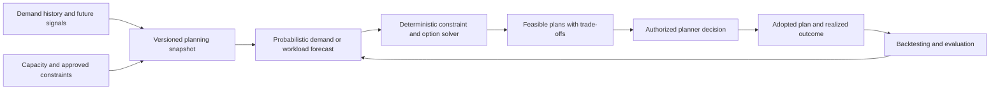

# FAMILY-003 Forecast-driven capacity planning under constraints

## Classification

- **Status:** active
- **Primary architectural spine:** Probabilistic demand or workload forecasts feed a deterministic constraint solver that proposes capacity and scheduling adjustments for manager approval.
- **Primary intelligent mechanism:** Probabilistic demand, workload, cancellation, and hotspot forecasting
- **Execution model:** batch
- **Human authority:** Authorized planners approve queue, slot, staffing, housekeeping, or network-capacity changes.
- **Applied cases:** 3

## Reusable outcome

Convert uncertain future demand into reviewable, constraint-compliant capacity recommendations that improve service levels without delegating resource authority to the model.

## Suitable processes

- Demand and available capacity can be represented over a planning horizon.
- Forecast uncertainty materially changes staffing, slots, queue, or infrastructure decisions.
- Hard policy, fairness, safety, labor, or investment constraints can be encoded separately.
- Managers can compare recommendations with a deterministic or historical baseline.

## Unsuitable processes

- Immediate incident diagnosis and dispatch during an active outage.
- Physical-condition anomaly detection.
- Case-level eligibility or fraud decisions.
- Unconstrained autonomous pricing or resource control.

## Architecture invariants

- A versioned planning snapshot joins demand history, future signals, capacity, service targets, and approved constraints.
- Forecasts are probabilistic and expose uncertainty by horizon and operating segment.
- A deterministic optimization or rules layer converts forecasts into feasible recommendation options.
- Managers approve, modify, or reject the plan; the system records the adopted plan and actual outcome.
- Backtesting compares forecast and recommendation performance with historical and rules-only baselines.

## Variation points

| Variation point | Allowed adaptation | Derivation signal |
| --- | --- | --- |
| Planning unit | Appointment, cell, hotel, shift, room, team, geography, or service adapter | The unit requires real-time incident control |
| Forecast horizon | Intra-day, daily, weekly, or seasonal models | Latency changes to streaming governed action |
| Constraints | Fairness, protocol, labor, skill, coverage, investment, or service-level rule packs | Optimization authority moves into autonomous actuation |
| Recommendation | Slots, queue order, staffing, housekeeping, or capacity investment candidates | The primary task becomes diagnosis rather than planning |
| Feedback | Actual arrivals, utilization, wait, quality, cancellation, workload, or congestion | No comparable realized outcome is observable |

## Logical architecture

## Deterministic layer

- Eligibility, priority protocol, labor, skill, coverage, service-level, fairness, budget, and physical-capacity constraints.
- Planning-snapshot versioning, horizon locking, and manual override.
- Feasibility checks and explicit reasons when no compliant plan exists.
- Fallback to approved baseline schedules or queue rules.

## Intelligent layer

- **Primary mechanism:** Probabilistic demand, workload, cancellation, and hotspot forecasting
- **Inputs:** Historical demand, bookings, arrivals, cancellations, traffic, quality, events, geography, calendar, capacity, and operational context.
- **Outputs:** Probabilistic demand/workload forecasts with uncertainty and scenario features.
- **Training/grounding:** Time-based backtesting, seasonal and event-aware features, segmented calibration, and comparison with simple statistical baselines.
- **Inference:** Scheduled or on-demand forecast generation before each planning cycle.
- **Abstention:** Insufficient history, structural break, missing capacity snapshot, extreme uncertainty, or unsupported planning segment.

## Optional extensions

- No-show or cancellation prediction.
- Scenario simulation and robust optimization.
- Equity or access constraints with explicit policy review.

## Human and safety boundaries

- The model cannot deny access, alter clinical priority, change network configuration, commit capital, or schedule staff outside approved rules.
- Planners see forecast intervals, constraints, trade-offs, and the baseline plan.
- Manual plans remain possible when the model abstains.

## Data and integration contract

- Canonical entities: planning_unit, demand_observation, future_signal, capacity_snapshot, constraint_set, forecast_distribution, recommendation_option, planner_decision, adopted_plan, and realized_outcome.
- Planning snapshots and constraint versions are immutable and reproducible.
- Domain adapters supply demand and capacity; the optimizer consumes only the canonical contract.
- Forecast and decision feedback remain distinct to avoid training on recommendations as if they were natural demand.

## Evaluation contract

- **Model metrics:** Forecast error by horizon, calibration, interval coverage, cancellation/no-show discrimination where used, and performance by segment.
- **Incremental-value metrics:** Plan quality versus historical schedule, deterministic heuristic, and forecast-only baselines.
- **Workflow metrics:** Wait time, utilization, unmet demand, overtime, service-level attainment, congestion, workload variance, and planner override.
- **Failure criteria:** Miscalibrated forecasts, infeasible recommendations, systematic harm to protected or priority groups, unstable planner overrides, or no improvement over simple baselines.

## Azure reference mapping

- Scheduled ingestion and transformation with Data Factory, Fabric, Functions, or equivalent; versioned planning data in relational or lake storage.
- Azure Machine Learning or compatible forecasting, plus a deterministic optimization service implemented in Functions, Container Apps, or another compute layer.
- Secure planner API/UI, Azure Monitor, Application Insights, managed identity, and Key Vault.
- Azure services are replaceable provided forecast distributions, constraint sets, options, and decisions preserve the family contract.

## Reusable building blocks

### Available

- Forecasting, secure API, workflow, data pipeline, observability, and human-review patterns.

### Missing

- Canonical planning snapshot and constraint-set schema.
- Forecast-to-feasible-options interface.
- Backtesting and baseline comparison harness.
- Planner decision and realized-outcome ledger.

## Applied cases

| Opportunity | Actor/process | Disposition | Adapters | Extension | Validation delta | Derivation signal |
| --- | --- | --- | --- | --- | --- | --- |
| [`HEALTH-001`](../segments/healthcare/HEALTH-001-sus-specialist-access-orchestration.md) | SUS regulation-center clinician, scheduler, or access manager — Prioritize specialist access and recover available appointment capacity | `fit-with-extension` | SUS regulation systems, referral protocols, specialty capacity, geography, wait time, cancellations, clinical context, and municipal/state workflows. | No-show prediction and equity-aware queue/slot optimization. | Evaluate the extension separately and prove incremental value over the base family pipeline. | none |
| [`TELCO-002`](../segments/telecommunications/TELCO-002-capacity-hotspot-assurance.md) | Radio network capacity planner or optimization engineer — Forecast cell-level capacity hotspots and prioritize intervention candidates | `direct-fit` | Cell traffic, quality, coverage, topology, events, spectrum, planned work, asset/capacity inventory, and investment workflow. | Spatial hotspot detection and scenario ranking. | Use the family metrics with domain-specific labels, thresholds, and workflow outcomes. | none |
| [`HOSP-001`](../segments/hospitality-tourism/HOSP-001-occupancy-operations-forecasting.md) | Hotel revenue/operations manager, front-office lead, or housekeeping planner — Forecast occupancy and operational workload and prepare staffing/housekeeping capacity | `direct-fit` | PMS/CRS bookings, cancellations, arrivals/departures, local events, room inventory, staffing, housekeeping status, and labor rules. | None beyond hotel planning-unit and workload adapters. | Use the family metrics with domain-specific labels, thresholds, and workflow outcomes. | none |

## Closest families and boundary

Closest to FAMILY-004, but this family prepares capacity plans before demand materializes. FAMILY-004 diagnoses an active incident and prioritizes immediate response.

## Architecture derivation status

- **Current decision:** no derivation
- **Evidence:** Healthcare access, mobile capacity, and hotel operations differ in constraints and planning units, not in the forecast-to-feasible-plan architecture.
