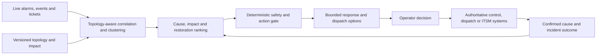

# FAMILY-004 Incident diagnosis and human-controlled response prioritization

## Classification

- **Status:** active
- **Primary architectural spine:** An active operational incident is correlated across events and topology, deterministic safety rules filter actions, and likely causes and responses are ranked for operator control.
- **Primary intelligent mechanism:** Topology-aware event correlation, incident clustering, and root-cause or restoration ranking
- **Execution model:** streaming
- **Human authority:** Operators retain dispatch, switching, runbook, restoration, and field-action authority.
- **Applied cases:** 2

## Reusable outcome

Reduce time spent correlating noisy incident signals and direct scarce response capacity toward the most plausible causes and safe next actions.

## Suitable processes

- A live incident generates many related alarms, events, tickets, and impact signals.
- Topology or dependency context is material to cause and response.
- Only a bounded catalog of safe actions or runbooks may be recommended.
- Operators remain accountable for dispatch and control.

## Unsuitable processes

- Long-horizon capacity planning.
- Condition monitoring without an active incident.
- Evidence-package compliance approval.
- Fully autonomous switching or network control.

## Architecture invariants

- Event intake preserves source, event time, topology version, affected entities, and data quality.
- Deterministic safety, authorization, dependency, and action-eligibility rules gate recommendations.
- The intelligent layer correlates and clusters events, ranks likely causes, impact, restoration horizon, and bounded response options.
- Operators approve, modify, or reject response actions; all write operations use existing governed control systems.
- Confirmed cause, dispatch result, restoration, false correlation, and runbook outcome become feedback.

## Variation points

| Variation point | Allowed adaptation | Derivation signal |
| --- | --- | --- |
| Topology | Power, telecom, IT, transport, or service-dependency graph adapters | No stable dependency representation exists |
| Incident signals | Alarms, telemetry, tickets, calls, weather, vegetation, customer impact | Primary job becomes fraud or individual case scoring |
| Response catalog | Runbooks, dispatches, crew options, switching plans, or communication actions | Model creates unconstrained actions |
| Latency | Seconds to minutes within operator workflow | Autonomous sub-second control is required |
| Impact model | Customer, safety, service, revenue, or regulatory impact adapters | Decision authority leaves the operator |

## Logical architecture

## Deterministic layer

- Event deduplication, topology/version checks, safety interlocks, authorized-action catalog, crew qualifications, and switching/runbook constraints.
- Hard alarms and mandatory escalation independent of model scores.
- Idempotent dispatch/writeback through governed operational systems.
- Fallback to existing incident procedures when topology or data quality is insufficient.

## Intelligent layer

- **Primary mechanism:** Topology-aware event correlation, incident clustering, and root-cause or restoration ranking
- **Inputs:** Alarms, telemetry, topology, tickets, weather, asset state, crew state, customer impact, and historical incidents.
- **Outputs:** Correlated incident cluster, ranked causes, estimated restoration or resolution horizon, impact, bounded response options, and confidence.
- **Training/grounding:** Historical incident timelines, confirmed root causes, dispatch outcomes, runbook results, and topology-aware weak labels.
- **Inference:** Low-latency streaming or micro-batch inference during an active incident.
- **Abstention:** Unknown topology, conflicting authoritative state, unsupported incident type, insufficient signal coverage, or low cause/action confidence.

## Optional extensions

- Restoration-time forecasting.
- Crew travel and constrained dispatch ranking.
- Grounded runbook retrieval restricted to approved procedures.

## Human and safety boundaries

- The model cannot execute switching, configuration, dispatch, isolation, or restoration actions.
- Recommendations must show topology version, contributing events, constraints, and confidence.
- Operators can disable model ranking without suppressing raw alarms or standard runbooks.

## Data and integration contract

- Canonical entities: operational_event, topology_node, topology_edge, incident_cluster, impact_estimate, cause_candidate, action_candidate, deterministic_gate, operator_decision, dispatch_result, and incident_outcome.
- Topology and event versions are retained for replay.
- Adapters normalize source alarms and action catalogs; writeback occurs only after authorized operator action.
- Feedback distinguishes confirmed cause, partial cause, false cluster, useful recommendation, dispatch avoided, and restoration result.

## Evaluation contract

- **Model metrics:** Cluster precision/recall, root-cause top-k accuracy, restoration-time error, action-ranking quality, calibration, and abstention.
- **Incremental-value metrics:** Cause and response accuracy versus alarm rules, static topology correlation, and existing runbooks alone.
- **Workflow metrics:** Mean time to acknowledge/diagnose/restore, unnecessary dispatches, repeat dispatches, operator review time, and customer impact duration.
- **Failure criteria:** Unsafe action suggestion, hidden hard alarm, degraded diagnosis versus deterministic baseline, excessive operator distraction, or unstable performance under peak event storms.

## Azure reference mapping

- Event Hubs or compatible streaming intake, topology and incident stores, stream processing, model serving, and an operator-facing incident API.
- Azure Data Explorer, Functions, Container Apps, Azure Machine Learning, Azure AI Search for approved runbooks, and Azure Maps may fit by case.
- Entra ID, managed identity, Key Vault, Private Link, Azure Monitor, and Application Insights support secure operation.
- Existing SCADA, NMS, OSS, ITSM, and dispatch systems remain authoritative.

## Reusable building blocks

### Available

- Event ingestion, topology, anomaly detection, secure API, workflow, observability, and human-review patterns.

### Missing

- Canonical incident/topology correlation contract.
- Approved action catalog and deterministic safety gate.
- Incident replay and root-cause evaluation harness.
- Operator decision and dispatch outcome ledger.

## Applied cases

| Opportunity | Actor/process | Disposition | Adapters | Extension | Validation delta | Derivation signal |
| --- | --- | --- | --- | --- | --- | --- |
| [`ENERGY-002`](../segments/energy-utilities/ENERGY-002-outage-restoration-prioritization.md) | Electric-distribution control-room operator or restoration coordinator — Diagnose an outage and prioritize restoration and crew actions | `direct-fit` | OMS/SCADA, network topology, weather, vegetation, crew skills/location, customer impact, switching procedures, and dispatch systems. | Restoration-time forecasting and constrained crew/action ranking. | Use the family metrics with domain-specific labels, thresholds, and workflow outcomes. | none |
| [`TELCO-001`](../segments/telecommunications/TELCO-001-ai-assisted-network-incident-correlation.md) | Telecom NOC engineer, incident manager, or dispatch coordinator — Correlate a network incident and decide whether remote action or field dispatch is warranted | `direct-fit` | NMS/OSS alarms, topology, performance, tickets, customer impact, field dispatch, approved runbooks, and change records. | Dispatch-necessity prediction and approved runbook retrieval. | Use the family metrics with domain-specific labels, thresholds, and workflow outcomes. | none |

## Closest families and boundary

Closest to FAMILY-003, but the trigger is an active incident and the intelligent transformation is event correlation and diagnosis, not future demand forecasting.

## Architecture derivation status

- **Current decision:** no derivation
- **Evidence:** Power restoration and telecom dispatch share the same live-event, topology, bounded-action, operator-control, and incident-feedback architecture.
