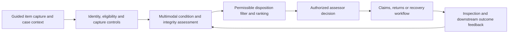

# FAMILY-005 Multimodal item assessment and human disposition routing

## Classification

- **Status:** active
- **Primary architectural spine:** Guided capture and structured case data are deterministically validated, a multimodal model estimates item condition and evidence integrity, and permissible dispositions are ranked for human decision.
- **Primary intelligent mechanism:** Multimodal physical-item condition recognition with evidence-integrity classification
- **Execution model:** synchronous
- **Human authority:** Authorized claims, inspection, or returns personnel decide coverage, fraud, liability, value, and final disposition.
- **Applied cases:** 2

## Reusable outcome

Produce a reviewable condition assessment and route options for a physical item without automating legal, financial, consumer-rights, or fraud conclusions.

## Suitable processes

- A bounded physical item is presented through guided images or video plus structured context.
- Condition, damage, completeness, tampering, or mismatch affects a downstream disposition.
- Deterministic policy limits which routes are legally or operationally available.
- A human must confirm the final assessment and disposition.

## Unsuitable processes

- Continuous condition telemetry.
- Site-progress comparison against a long-lived plan.
- Document-only evidence approval.
- Autonomous valuation, fraud rejection, or payment.

## Architecture invariants

- Guided capture records item identity, views, timestamps, device/source integrity, and case context.
- Deterministic checks validate eligibility, mandatory views, policy state, rights, and prohibited decisions.
- The intelligent layer recognizes condition/damage and evidence-integrity anomalies with confidence and localized evidence.
- A deterministic route catalog filters permissible dispositions before ranking.
- Human assessment, route, repair/resale result, and later dispute become feedback.

## Variation points

| Variation point | Allowed adaptation | Derivation signal |
| --- | --- | --- |
| Item type | Vehicle, electronics, appliance, apparel, parcel, or equipment schemas and capture guides | The object requires continuous telemetry rather than episodic inspection |
| Condition taxonomy | Domain-specific damage, wear, completeness, or contamination labels | The primary mechanism becomes document reconciliation |
| Route catalog | Repair, resale, refurbishment, supplier return, salvage, further inspection, or claim review | Model output directly determines legal or financial outcome |
| Integrity signals | Metadata, duplicate image, manipulation, case-network, or provenance checks | Identity/fraud graph becomes the primary mechanism |
| Latency | Interactive or asynchronous assessment | Streaming monitoring becomes continuous |

## Logical architecture

## Deterministic layer

- Case/item identity, capture completeness, supported format, timestamp, policy/order eligibility, warranty or consumer-right rules, and mandatory escalation.
- Permissible disposition catalog and hard prohibitions.
- Explicit separation of condition evidence from coverage, fraud, liability, and indemnity decisions.
- Manual inspection fallback when capture or model confidence is insufficient.

## Intelligent layer

- **Primary mechanism:** Multimodal physical-item condition recognition with evidence-integrity classification
- **Inputs:** Guided images/video, item identifiers and attributes, case reason, policy/order data, prior condition, and capture metadata.
- **Outputs:** Localized condition/damage findings, severity/quality estimates, evidence-integrity flags, uncertainty, and condition features used by route ranking.
- **Training/grounding:** Labeled inspection images, adjudicated cases, repair/refurbishment outcomes, controlled capture variations, and holdout evaluation by item type and device.
- **Inference:** Interactive or asynchronous case-level multimodal inference.
- **Abstention:** Missing required views, poor image quality, unsupported item/version, identity mismatch, suspected manipulation without corroboration, or low condition confidence.

## Optional extensions

- Case-relationship anomaly detection for coordinated fraud review.
- Expected-value ranking using approved cost and recovery estimates.
- Guided recapture instructions.

## Human and safety boundaries

- The model cannot deny a claim, declare fraud, set indemnity, waive consumer rights, or finalize disposal.
- Reviewers receive original evidence, localized findings, deterministic route constraints, and abstention reasons.
- Final route and legal/financial decisions remain attributable to an authorized human.

## Data and integration contract

- Canonical entities: assessment_case, physical_item, capture_session, media_item, capture_quality, condition_finding, integrity_finding, eligible_route, route_score, reviewer_decision, and downstream_outcome.
- Media retains hashes, source/device metadata, timestamps, view labels, and access classification.
- Adapters map domain taxonomies and route catalogs; model outputs remain evidence, not final decisions.
- Feedback links reviewer corrections and realized repair/recovery outcomes to the exact model and capture version.

## Evaluation contract

- **Model metrics:** Condition/damage precision and recall, localization quality, severity agreement, integrity precision, calibration, and abstention by item type.
- **Incremental-value metrics:** Assessment and routing improvement over guided capture plus deterministic rules alone.
- **Workflow metrics:** Inspection time, recapture rate, review escalation, route accuracy, recovery value, repair cycle, dispute rate, and reviewer override.
- **Failure criteria:** Systematic missed severe damage, discriminatory performance by capture channel, unsafe routing, evidence-integrity overreach, or any automated legal/financial decision.

## Azure reference mapping

- Secure capture API, Blob Storage, metadata and case store, event or request processing, multimodal model serving, and reviewer UI.
- Azure AI Foundry vision models, Azure Machine Learning custom vision models, Functions or Container Apps, and Azure AI Search for approved reference material may fit.
- Entra ID, Key Vault, Private Link, Defender controls, Azure Monitor, and Application Insights support governance.
- The family is defined by the capture, condition, route, human-decision, and feedback contracts rather than model vendor.

## Reusable building blocks

### Available

- Secure upload, document/image processing, human-review, workflow, audit, and observability patterns.

### Missing

- Guided capture session contract.
- Localized condition and evidence-integrity schema.
- Permissible disposition catalog and route scorer.
- Adjudicated multimodal assessment evaluation harness.

## Applied cases

| Opportunity | Actor/process | Disposition | Adapters | Extension | Validation delta | Derivation signal |
| --- | --- | --- | --- | --- | --- | --- |
| [`FIN-002`](../segments/financial-services/FIN-002-motor-claim-evidence-assurance.md) | Motor-claim adjuster, inspection reviewer, or claims specialist — Assess submitted vehicle evidence and route a motor claim for appropriate human review | `fit-with-extension` | Vehicle identity, policy/claim data, guided damage views, repair estimates, prior claims, coverage and regulatory rules. | Claim-relationship anomaly features for specialist fraud review. | Evaluate the extension separately and prove incremental value over the base family pipeline. | none |
| [`RETAIL-002`](../segments/retail-ecommerce/RETAIL-002-return-inspection-value-recovery.md) | Returns inspection, warehouse, customer-service, or reverse-logistics reviewer — Inspect a returned item and select a permissible value-recovery route | `direct-fit` | Order and product master, return reason, consumer-right rules, item taxonomy, resale/refurbishment/supplier/disposal route catalog, and warehouse workflow. | None beyond item and route adapters. | Use the family metrics with domain-specific labels, thresholds, and workflow outcomes. | none |

## Closest families and boundary

Closest to FAMILY-006, but this family assesses one bounded item and chooses among permissible dispositions. FAMILY-006 compares a broader operational or project state with a planned baseline and creates corrective work.

## Architecture derivation status

- **Current decision:** no derivation
- **Evidence:** Motor claims and retail returns differ in policy, taxonomy, and route adapters; the guided capture, condition recognition, route gate, and human authority remain coherent.
