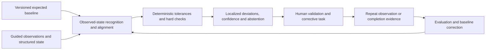

# FAMILY-006 Observed-state conformance and corrective work prioritization

## Classification

- **Status:** active
- **Primary architectural spine:** A planned or expected baseline is aligned with observed multimodal state, deterministic tolerances are applied, and likely deviations are ranked for human corrective work and verification.
- **Primary intelligent mechanism:** Multimodal observed-state recognition and alignment to a versioned expected baseline
- **Execution model:** asynchronous
- **Human authority:** Operational, engineering, or quality personnel validate deviations, create work, certify completion, and approve commercial consequences.
- **Applied cases:** 3

## Reusable outcome

Turn field or operational observations into evidence-backed deviation cases and prioritized corrective work without automating certification, payment, or safety approval.

## Suitable processes

- A versioned plan, schedule, layout, inventory, or expected output exists.
- Images, video, audio, or structured observations can be aligned to that baseline.
- Material deviations require human confirmation and corrective work.
- A later observation can verify completion.

## Unsuitable processes

- Latent condition forecasting from continuous sensors.
- Single-item disposition routing.
- Cross-document compliance approval where physical progress/state is not primary.
- Streaming quality control that cannot tolerate asynchronous case handling without a variant.

## Architecture invariants

- The expected baseline and observed evidence are versioned, spatially/temporally aligned, and provenance-preserving.
- Deterministic tolerances, mandatory checks, and known inventory/schedule rules run separately.
- The intelligent layer recognizes observed state, aligns it to the baseline, estimates deviation, and provides localized evidence.
- Human reviewers confirm deviation and assign bounded corrective work; downstream certification remains external.
- Completion evidence and reviewer corrections feed evaluation.

## Variation points

| Variation point | Allowed adaptation | Derivation signal |
| --- | --- | --- |
| Baseline | BIM, schedule, planogram, inventory, rundown, specification, or expected-state adapter | No stable expected baseline can be versioned |
| Observation | Image, video, audio, sensor snapshot, scan, or structured count | Primary task becomes continuous future-risk prediction |
| Alignment | Spatial, temporal, item, location, or semantic alignment | Continuous stream alignment changes state and latency model |
| Corrective work | Replenishment, loss investigation, construction correction, caption intervention, or inspection | System performs autonomous actuation |
| Verification | Recapture, rescan, supervisor confirmation, or downstream system evidence | No repeatable confirmation is possible |

## Logical architecture

## Deterministic layer

- Baseline/version selection, evidence identity, mandatory coverage, tolerance, schedule, inventory, access, and safety rules.
- Hard deviations that do not require model inference remain visible.
- Corrective task eligibility, ownership, due dates, and completion evidence requirements.
- Manual review fallback when alignment or evidence quality is insufficient.

## Intelligent layer

- **Primary mechanism:** Multimodal observed-state recognition and alignment to a versioned expected baseline
- **Inputs:** Versioned expected baseline, guided observations, structured state, location/time context, and deterministic checks.
- **Outputs:** Recognized observed state, alignment confidence, quantified or categorical deviation, localized evidence, uncertainty, and priority features.
- **Training/grounding:** Labeled state/alignment examples, reviewer-confirmed deviations, completion evidence, and evaluation by site/store/content type and capture conditions.
- **Inference:** Asynchronous or interactive assessment after a bounded observation set is captured.
- **Abstention:** Wrong baseline version, insufficient coverage, ambiguous alignment, poor capture quality, unsupported state, or uncertainty above tolerance.

## Optional extensions

- Loss or cause anomaly scoring from adjacent transactional data.
- Progress estimation and schedule impact calculation.
- Continuous streaming semantic alignment as a candidate variant.

## Human and safety boundaries

- The model cannot certify measurement, approve payment, declare shrinkage responsibility, alter inventory, or execute corrective work.
- Reviewers see baseline version, source evidence, localized comparison, tolerance, and confidence.
- Commercial, safety, and disciplinary decisions remain outside the model.

## Data and integration contract

- Canonical entities: conformance_case, expected_baseline, baseline_element, observation_set, observed_element, alignment, deterministic_check, deviation_finding, corrective_task, reviewer_decision, verification, and outcome.
- Every baseline and observation carries version, scope, time, location, provenance, and content hash.
- Adapters translate BIM, planogram, inventory, schedule, or media structures into canonical elements.
- Findings separate observed fact, model estimate, deterministic rule, and reviewer conclusion.

## Evaluation contract

- **Model metrics:** Recognition and alignment accuracy, deviation precision/recall, progress/count error, localization quality, calibration, and abstention.
- **Incremental-value metrics:** Confirmed deviations and prioritization improvement over manual sampling and deterministic reconciliation alone.
- **Workflow metrics:** Review time, task completion, repeat visit, stock availability, loss, schedule variance, rework, and escaped deviation.
- **Failure criteria:** Incorrect baseline alignment, missed material deviation, excessive false tasks, poor performance by capture condition, or automated certification/commercial action.

## Azure reference mapping

- Secure observation intake, Blob Storage, baseline/case stores, asynchronous processing, multimodal model serving, and corrective-work integration.
- Azure AI Foundry vision models, Azure Machine Learning, Azure AI Search or spatial/vector services, Functions or Container Apps may fit.
- Entra ID, Key Vault, Private Link, Azure Monitor, and Application Insights support access, secrets, and traceability.
- BIM, retail, media, and work-management systems remain adapters and authoritative sources.

## Reusable building blocks

### Available

- Secure upload, vision processing, workflow, human review, audit, and observability patterns.

### Missing

- Canonical expected-baseline and observed-element contract.
- Spatial/temporal alignment service and evaluation harness.
- Deviation-to-corrective-task adapter.
- Verification and repeat-observation ledger.

## Applied cases

| Opportunity | Actor/process | Disposition | Adapters | Extension | Validation delta | Derivation signal |
| --- | --- | --- | --- | --- | --- | --- |
| [`RETAIL-001`](../segments/retail-ecommerce/RETAIL-001-shelf-availability-loss-orchestration.md) | Store operations manager, replenishment lead, or loss-prevention reviewer — Detect shelf availability or shrinkage deviations, assign corrective work, and verify execution | `fit-with-extension` | Planogram, shelf location, SKU/master data, inventory, sales, replenishment, loss events, store tasks, and mobile capture. | Inventory-loss anomaly scoring alongside visual conformance. | Evaluate the extension separately and prove incremental value over the base family pipeline. | none |
| [`CONST-001`](../segments/construction-real-estate/CONST-001-visual-progress-deviation-assurance.md) | Site engineer, planner, project-controls, or measurement reviewer — Compare observed construction state with plan/schedule and prioritize deviation review | `direct-fit` | BIM, schedule/WBS, location hierarchy, guided site imagery, progress records, issue/task systems, and measurement workflow. | Progress estimation and schedule-impact calculation. | Use the family metrics with domain-specific labels, thresholds, and workflow outcomes. | none |
| [`MEDIA-002`](../segments/media-entertainment/MEDIA-002-live-caption-semantic-continuity-assurance.md) | Broadcast accessibility operator, caption supervisor, or master-control operator — Monitor outgoing live captions for semantic continuity and accessibility failure | `candidate-variant` | Live audio, outgoing captions, video cues, rundowns, source changes, broadcast automation, accessibility rules, and operator console. | Continuous low-latency rolling alignment, stateful stream windows, and immediate operator incident generation. | Use a separate prototype track because runtime, authority, or learning metrics are not fully comparable with the base. | Continuous rolling multimodal alignment and immediate operator incidents. |

## Closest families and boundary

Closest to FAMILY-005, but this family compares many observed elements against a versioned operational baseline. FAMILY-005 assesses a single item and ranks its permissible disposition.

## Architecture derivation status

- **Current decision:** review queued
- **Evidence:** MEDIA-002 preserves conformance logic but requires continuous low-latency audio/caption/video alignment, rolling state, and immediate operator incidents. That runtime difference is queued for later derivation review.
