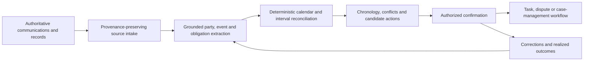

# FAMILY-007 Evidence-grounded timeline and obligation reconstruction

## Classification

- **Status:** active
- **Primary architectural spine:** Unstructured authoritative communications and records are classified and extracted into a provenance-preserving event/obligation graph, deterministic temporal rules reconcile dates, and humans confirm the operational case.
- **Primary intelligent mechanism:** Source-grounded event, party, obligation, and temporal-relation extraction
- **Execution model:** asynchronous
- **Human authority:** Authorized legal or operations staff confirm chronology, responsibility candidates, deadlines, disputes, and task creation.
- **Applied cases:** 2

## Reusable outcome

Reconstruct a reviewable chronology and obligation set from fragmented communications and records so a human can act without losing provenance or relying on model-generated legal conclusions.

## Suitable processes

- Official or operational communications create events, obligations, deadlines, or attributable intervals.
- Evidence is fragmented across documents, email, portals, tickets, and structured records.
- Deterministic calendar or interval rules can validate extracted candidates.
- A human confirms before task, dispute, or legal action.

## Unsuitable processes

- Evidence packages whose main question is cross-source compliance consistency before release.
- Continuous incident correlation.
- Open-ended legal advice or autonomous filing.
- Workflows where dates and obligations are already fully structured and deterministic.

## Architecture invariants

- Every extracted event or obligation retains the exact source span, source identity, publication/receipt time, and version.
- Deterministic calendars, holidays, cutoffs, interval arithmetic, status transitions, and source precedence validate candidates.
- The intelligent layer classifies communications and extracts parties, events, obligations, temporal relations, and ambiguity.
- Humans confirm chronology, deadline, responsibility candidate, and downstream action.
- Corrections and realized case outcomes feed extraction and review evaluation.

## Variation points

| Variation point | Allowed adaptation | Derivation signal |
| --- | --- | --- |
| Source channel | Court portal, email, document, terminal event, carrier record, ticket, or API adapter | Continuous event storm requires incident correlation |
| Temporal rules | Calendar, free-time, suspension, interruption, service-level, or procedural rule packs | Rules themselves require a separate optimization/control loop |
| Output | Deadline candidate, attributable interval, dispute package, task, or case chronology | Model directly files or accepts legal responsibility |
| Entity model | Party, container, process, shipment, obligation, event, or authority schemas | Long-lived knowledge recommendation becomes primary |
| Review | Legal, logistics, compliance, or operations authority | No human confirmation is possible |

## Logical architecture

## Deterministic layer

- Source identity, receipt/publication timestamp, duplicate/version checks, calendar and holiday calculation, interval arithmetic, status-transition validation, and deadline policy.
- Explicit source-precedence rules and conflict preservation.
- No task or dispute submission until human confirmation.
- Manual entry fallback with source attachment.

## Intelligent layer

- **Primary mechanism:** Source-grounded event, party, obligation, and temporal-relation extraction
- **Inputs:** Authoritative communications, documents, emails, portal exports, tickets, operational events, and case context.
- **Outputs:** Typed parties, events, obligations, dates, temporal relations, responsibility candidates, contradictions, source spans, confidence, and ambiguity.
- **Training/grounding:** Grounded extraction with labeled communications and adjudicated chronology/deadline corrections; use domain taxonomies without generating unsupported legal rules.
- **Inference:** Asynchronous ingestion and reconstruction when a new source record arrives or a case is refreshed.
- **Abstention:** Unreadable source, missing authoritative timestamp, ambiguous party/case identity, conflicting source precedence, unsupported communication type, or low extraction confidence.

## Optional extensions

- Responsibility-candidate classification with explicit non-legal status.
- Contradiction detection across carrier, terminal, authority, and user evidence.
- Approved template generation for a human-reviewed task or dispute package.

## Human and safety boundaries

- The model cannot provide final legal interpretation, accept liability, file a dispute, commit a procedural deadline, or assign blame.
- Users see source spans, deterministic calculation steps, uncertainty, and conflicts.
- Confirmed dates and obligations are attributable to an authorized reviewer.

## Data and integration contract

- Canonical entities: source_record, case, party, extracted_event, obligation, temporal_relation, deterministic_calculation, conflict, candidate_action, reviewer_decision, and outcome.
- Sources preserve original content hash, receipt/publication time, channel, version, and access classification.
- Adapters map domain events into canonical types; deterministic temporal calculation is separate from extraction.
- Review feedback links corrected fields and actions to source spans and model version.

## Evaluation contract

- **Model metrics:** Communication classification, entity/event/obligation extraction F1, date normalization accuracy, temporal-relation accuracy, grounding, calibration, and abstention.
- **Incremental-value metrics:** Correct candidate events/deadlines/intervals found beyond deterministic parsing and manual search.
- **Workflow metrics:** Review time, missed or corrected deadline candidates, dispute preparation time, chronology completeness, task rework, and escaped event.
- **Failure criteria:** Ungrounded legal claims, wrong authoritative timestamp, unacceptable missed deadline/event, reviewer overreliance, or autonomous filing/action.

## Azure reference mapping

- Secure source ingestion, Blob Storage, case/event store, asynchronous Functions or Container Apps processing, and human review/task integration.
- Azure AI Document Intelligence, Azure AI Foundry models, Azure AI Search, and deterministic calendar services may fit.
- Entra ID, Key Vault, Private Link, Azure Monitor, and Application Insights support governance.
- Court, carrier, terminal, email, and case-management systems remain adapters.

## Reusable building blocks

### Available

- Document ingestion, extraction, secure API, workflow, audit, and human-review patterns.

### Missing

- Grounded event/obligation extraction contract.
- Versioned temporal-rule and calendar engine.
- Source-span chronology graph.
- Human-confirmed deadline and responsibility feedback ledger.

## Applied cases

| Opportunity | Actor/process | Disposition | Adapters | Extension | Validation delta | Derivation signal |
| --- | --- | --- | --- | --- | --- | --- |
| [`LOG-002`](../segments/logistics-transport/LOG-002-container-overstay-causation-evidence-assurance.md) | Importer logistics, demurrage/detention, legal, or claims reviewer — Reconstruct container-overstay intervals and prepare evidence for dispute or conciliation | `fit-with-extension` | Terminal, carrier, customs, port, transport, email, contract/free-time, invoice, and dispute-system adapters. | Responsibility-candidate classification and cross-party contradiction findings for attributable intervals. | Evaluate the extension separately and prove incremental value over the base family pipeline. | none |
| [`PROF-001`](../segments/professional-services/PROF-001-process-communication-deadline-assurance.md) | Lawyer, paralegal, docketing, or legal-operations reviewer — Process an official communication into confirmed obligations, candidate deadlines, and tasks | `direct-fit` | Court/official portals, email, case-management, party/process records, procedural calendars, holidays, and task workflow. | None beyond legal communication and calendar adapters. | Use the family metrics with domain-specific labels, thresholds, and workflow outcomes. | none |

## Closest families and boundary

Closest to FAMILY-001, but the reusable output here is a chronology and obligation set. FAMILY-001 consumes an already bounded evidence package and decides whether contradictions should hold an approval.

## Architecture derivation status

- **Current decision:** no derivation
- **Evidence:** Legal communication deadlines and container-overstay causation share source-grounded event extraction, deterministic temporal reconciliation, human confirmation, and non-autonomous downstream action.
