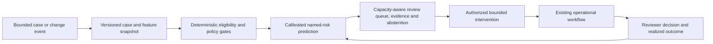

# FAMILY-008 Calibrated case-risk triage for bounded human intervention

## Classification

- **Status:** active
- **Primary architectural spine:** A bounded case or change event passes deterministic eligibility controls, a calibrated model estimates a defined adverse-outcome or intervention-need risk, and authorized staff work a prioritized queue with feedback.
- **Primary intelligent mechanism:** Calibrated case-level adverse-outcome or intervention-need prediction
- **Execution model:** asynchronous
- **Human authority:** Authorized domain staff choose the intervention, approve release, assign work, or accept risk; the base family is advisory.
- **Applied cases:** 8

## Reusable outcome

Focus limited human review or support capacity on bounded cases most likely to benefit from timely intervention while preserving deterministic eligibility and human authority.

## Suitable processes

- A discrete case, entity change, exposure, patient order, student record, or group review can be scored.
- The target outcome or intervention need is explicitly defined and observable.
- Deterministic policy controls eligibility, prohibited features, escalation, and permissible interventions.
- Human reviewers can confirm findings and later outcomes can be evaluated.

## Unsuitable processes

- Continuous real-time transaction blocking or autonomous control without a derived variant.
- Causal treatment-effect selection where risk prediction is not sufficient.
- Durable orchestration that writes a multi-system control plan.
- Evidence reconciliation, physical condition monitoring, or incident diagnosis as the primary model job.

## Architecture invariants

- A canonical case snapshot preserves subject/entity identity, event time, features, provenance, policy version, and review window.
- Deterministic eligibility, authorization, protected-feature, threshold, and mandatory-escalation controls run outside the model.
- The intelligent layer estimates a calibrated, explicitly named risk or intervention-need outcome and exposes contributing evidence.
- Cases are prioritized against bounded review capacity; the model abstains when data or calibration is insufficient.
- Reviewer decisions and realized outcomes support segmented evaluation, drift monitoring, and retraining.

## Variation points

| Variation point | Allowed adaptation | Derivation signal |
| --- | --- | --- |
| Case type | Supplier change, medication review, student support, vulnerability, or group hazard adapter | The case becomes a continuous stream requiring automatic action |
| Feature topology | Tabular, text, graph-derived, or aggregated features | Graph orchestration or entity resolution becomes the primary workflow |
| Intervention catalog | Review, outreach, remediation, escalation, hold, or support options | Model selects treatment by causal uplift rather than risk |
| Authority | Reviewer, clinician, advisor, security engineer, buyer, or safety committee | System performs governed action without human approval |
| Feedback | Confirmed issue, intervention, subsequent outcome, override, and no-action sample | Outcome is unavailable or confounded beyond usable evaluation |

## Logical architecture

## Deterministic layer

- Case eligibility, legal/policy constraints, protected or prohibited attributes, mandatory review, authorization, intervention catalog, and hard safety rules.
- Capacity limits and queue-order tie breakers.
- Manual or rules-only baseline available at all times.
- No model-driven action in the base family.

## Intelligent layer

- **Primary mechanism:** Calibrated case-level adverse-outcome or intervention-need prediction
- **Inputs:** Versioned case snapshot with structured, text, graph-derived, historical, and operational context allowed by policy.
- **Outputs:** Calibrated named-risk score, uncertainty, contributing factors/evidence, abstention, and queue priority.
- **Training/grounding:** Time-aware and leakage-controlled labels, segmented evaluation, calibration, sampling of low-risk/no-action cases, and comparison with rules-only baselines.
- **Inference:** Asynchronous or request-driven scoring before a human review window.
- **Abstention:** Missing critical data, unsupported population, distribution shift, weak calibration, protected-feature concern, or insufficient evidence for a named outcome.

## Optional extensions

- Entity resolution and communication classification for change-assurance cases.
- Group-level aggregation and privacy thresholds.
- Attack-path or relationship-graph feature generation.
- Grounded intervention evidence summaries.

## Human and safety boundaries

- The model cannot make employment, clinical, disciplinary, payment, security acceptance, or protected-class decisions.
- Reviewers receive the named target, calibration context, evidence, policy constraints, and abstention reason.
- Interventions remain bounded by an approved catalog and attributable to a human.

## Data and integration contract

- Canonical entities: triage_case, subject_or_entity, case_event, feature_snapshot, deterministic_gate, risk_prediction, explanation_evidence, queue_entry, reviewer_decision, intervention, realized_outcome, and audit_event.
- Feature snapshots preserve event time, provenance, transformation version, and allowed-use classification.
- Adapters produce the canonical case; the family model does not query arbitrary source systems during decision time.
- Evaluation data distinguishes risk, intervention, selection bias, no-action samples, and delayed outcomes.

## Evaluation contract

- **Model metrics:** Discrimination, calibration, precision/recall at review capacity, subgroup performance, drift, abstention, and explanation evidence quality.
- **Incremental-value metrics:** Additional useful interventions or confirmed findings over deterministic eligibility and queue rules alone.
- **Workflow metrics:** Review yield, time to intervention, queue age, missed high-risk cases, override, workload, and downstream outcome.
- **Failure criteria:** Poor calibration, harmful subgroup disparity, target leakage, intervention overload, no incremental value, or model output used as an autonomous decision.

## Azure reference mapping

- Case ingestion API or events, feature and case store, scheduled/request model inference, ranked review queue, and outcome ledger.
- Azure Machine Learning or compatible predictive models, Azure AI Foundry for grounded summaries where optional, Functions or Container Apps, and a relational/analytical store may fit.
- Entra ID, Key Vault, Private Link, Azure Monitor, Application Insights, and Purview controls support access and governance.
- Domain systems remain authoritative; service selection does not define the family.

## Reusable building blocks

### Available

- Secure API, model serving, workflow, human review, audit, observability, and data pipeline patterns.

### Missing

- Canonical triage case and named-target contract.
- Calibration and capacity-aware ranking harness.
- Intervention/outcome ledger with selection-bias controls.
- Segmented safety and drift evaluation dashboard.

## Applied cases

| Opportunity | Actor/process | Disposition | Adapters | Extension | Validation delta | Derivation signal |
| --- | --- | --- | --- | --- | --- | --- |
| [`CROSS-001`](../segments/cross-industry/CROSS-001-offboarding-control-plane.md) | Offboarding coordinator or security analyst — Close a leaver or mover case across digital access, physical access, assets, and evidence | `candidate-variant` | HR/contractor events; identity, SaaS, badge, device, asset, ITSM, and SCIM connectors; role and legal-hold rules. | Durable policy-derived task orchestration, evidence ledger, connector write actions, and a long-lived identity/access graph. | Use a separate prototype track because runtime, authority, or learning metrics are not fully comparable with the base. | Durable multi-system task orchestration and governed write actions. |
| [`CROSS-002`](../segments/cross-industry/CROSS-002-supplier-payment-change-assurance.md) | Accounts-payable, procurement, supplier-master, or fraud reviewer — Review supplier onboarding or bank-detail change before payment release | `fit-with-extension` | Supplier master, CNPJ and banking evidence, ERP/procurement workflows, communications, approval history, and payment-release rules. | Supplier-entity resolution, communication-risk classification, and payment-change pattern features. | Evaluate the extension separately and prove incremental value over the base family pipeline. | none |
| [`HR-002`](../segments/human-resources/HR-002-psychosocial-risk-prevention-orchestration.md) | Occupational safety, HR, worker-representation, and work-design committee — Review group-level psychosocial hazards and prioritize preventive work-design actions | `fit-with-extension` | Worker consultation, work-design evidence, absence/incidents, organizational units, NR-1/PGR context, privacy thresholds, and action-plan workflow. | Group-level aggregation, minimum cohort thresholds, and privacy-preserving hazard classification. | Evaluate the extension separately and prove incremental value over the base family pipeline. | none |
| [`FIN-001`](../segments/financial-services/FIN-001-app-scam-intervention.md) | Pix fraud operations, transaction-risk engine owner, and MED investigator — Assess an outgoing Pix transaction and subsequent fund-dispersion path for scam or mule risk | `candidate-variant` | Pix transaction stream, device and account context, Banco Central security signals, DICT/MED processes, participant rules, and payment graph. | Sub-second streaming inference, graph propagation, and proportionate governed transaction controls before human MED investigation. | Use a separate prototype track because runtime, authority, or learning metrics are not fully comparable with the base. | Sub-second streaming inference and proportionate automated transaction controls. |
| [`HEALTH-002`](../segments/healthcare/HEALTH-002-antimicrobial-stewardship-review-prioritization.md) | Antimicrobial stewardship pharmacist, infectious-disease clinician, or review team — Prioritize active antimicrobial orders for specialist review | `direct-fit` | Hospital EHR, prescribing, microbiology, laboratory, vital signs, diagnosis, local antimicrobial protocols, pharmacy and infection-control workflow. | None beyond domain feature and protocol adapters. | Use the family metrics with domain-specific labels, thresholds, and workflow outcomes. | none |
| [`EDU-001`](../segments/education/EDU-001-student-persistence-early-warning.md) | Student-success advisor, academic support team, or retention manager — Identify students who may need timely bounded support and prioritize advisor outreach | `direct-fit` | Academic progression, attendance, LMS, financial/service signals, support history, consent/privacy, and student-services workflow. | Risk-factor explanation for advisor review. | Use the family metrics with domain-specific labels, thresholds, and workflow outcomes. | none |
| [`TECH-001`](../segments/technology-software/TECH-001-context-aware-vulnerability-remediation-prioritization.md) | Product security, vulnerability management, platform, or application owner — Prioritize vulnerability remediation across real assets and dependencies | `fit-with-extension` | Vulnerability feeds, SBOM/dependencies, asset inventory, internet/runtime exposure, ownership, business impact, exceptions, and remediation workflow. | Attack-path and dependency-graph feature generation. | Evaluate the extension separately and prove incremental value over the base family pipeline. | none |
| [`NONPROFIT-001`](../segments/nonprofit/NONPROFIT-001-donor-retention-uplift-orchestration.md) | Fundraising, donor-relations, CRM, or campaign manager — Prioritize donors for bounded retention outreach and select approved outreach candidates | `candidate-variant` | Donation history, consent/channel preferences, campaign interactions, relationship history, outreach catalog, and OSC privacy/fundraising rules. | Individual treatment-effect/uplift estimation and experiment-aware policy evaluation. | Use a separate prototype track because runtime, authority, or learning metrics are not fully comparable with the base. | Causal uplift learning and experiment-based policy evaluation. |

## Closest families and boundary

Closest to FAMILY-004, but this family scores discrete cases before a bounded review window. FAMILY-004 correlates a live incident across events and topology to guide immediate response.

## Architecture derivation status

- **Current decision:** review queued
- **Evidence:** FIN-001 changes to real-time governed intervention, NONPROFIT-001 changes to causal uplift and experiment-based evaluation, and CROSS-001 adds durable write-oriented control orchestration. Each is queued rather than forced into the advisory base.
