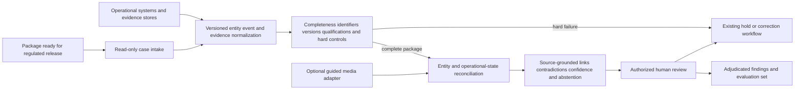

# SF-001 Evidence-package consistency before regulated release

## Classification

- **Status:** proposed
- **Primary architectural spine:** A read-only, asynchronous review layer validates a complete evidence package, reconciles entity, version, time, and state consistency, and presents source-grounded conflicts before an authorized human releases, holds, or returns the case.
- **Primary intelligent mechanism:** Cross-source entity-and-state reconciliation with contradiction classification
- **Execution model:** asynchronous
- **Human authority:** Authorized domain supervisor retains release, hold, correction, escalation, and rejection authority
- **Applied cases:** 3

## Reusable outcome

Identify when individually plausible records describe different assets, revisions, time windows, actors, or operational states before a regulated human release decision.

## Suitable processes

- A bounded case or work package reaches a human release or authorization gate.
- Deterministic completeness and hard-rule validation already exist.
- Evidence spans structured records, documents, events, and optional media.
- The remaining risk is incorrect linkage or semantic inconsistency across otherwise valid artifacts.
- Findings can expose provenance, confidence, and abstention without writing to the controlled operational system.

## Unsuitable processes

- Real-time prediction, dispatch, routing, or optimization where the system recommends an action from streaming state.
- Autonomous control, switching, release, certification, payment, or enforcement.
- Problems solved adequately by required identifiers, schemas, calculations, or a single authoritative source.
- Cases whose primary value is visual recognition, forecasting, causal inference, or constrained optimization rather than package consistency.

## Architecture invariants

- A case trigger identifies one bounded package and its intended operational state.
- Adapters normalize source records into versioned entities, claims, events, and evidence references.
- Deterministic controls reject missing requirements, invalid identifiers, expired qualifications, hard threshold failures, and prohibited states before model use.
- The primary model proposes cross-source links and classifies identity, version, temporal, and state contradictions with source provenance.
- Low-confidence, incomplete, or irreconcilable cases abstain and return to manual verification.
- An authorized human decides release, hold, correction, escalation, or rejection in the existing workflow.
- Reviewer dispositions become an auditable evaluation set; they do not automatically retrain or alter policy.

## Variation points

| Variation point | Allowed adaptation | Derivation signal |
| --- | --- | --- |
| Source systems | ERP, MES, QMS, BIM/CDE, GIS/DMS, PTW/FSM, registries and document stores | A source requires a separate data lifecycle, trust domain, or isolation boundary |
| Domain rules | Allergen, fire-safety, electrical-work, qualification, version and release rules | Rules change human authority or allow system action |
| Evidence modalities | Structured records and documents by default; guided images or video as optional evidence | Media becomes the primary mechanism rather than an extension |
| Runtime | Asynchronous or near-real-time review before a human gate | Edge streaming or sub-second intervention changes the control model |
| Interface | Existing approval queue, evidence viewer, or case-review UI | Durable autonomous execution or operational write-back is introduced |

## Logical architecture

## Deterministic layer

- Required documents, fields, signatures, approvals, tests, and source presence.
- Exact identifiers, authoritative registries, schema checks, timestamps, validity, qualification, and version rules.
- Domain-specific hard blocks and calculations.
- Source hierarchy, immutable provenance, access control, retention, and workflow routing.
- No model result may override a deterministic safety or regulatory block.

## Intelligent layer

- **Primary mechanism:** Cross-source entity linking and operational-state contradiction classification.
- **Inputs:** Normalized entities, events, versions, source spans, timestamps, trust levels, structured evidence, and optional media findings.
- **Outputs:** Proposed links, contradiction type, affected evidence, source references, confidence, insufficient-evidence flag, and abstention reason.
- **Training/grounding:** Begin with grounded extraction and similarity/linking models; calibrate only against expert-adjudicated links and contradiction labels. Synthetic mismatches may test known failure classes but do not replace real review outcomes.
- **Inference:** Read-only asynchronous case review after deterministic validation and before human disposition.
- **Abstention:** Missing authoritative source, unresolved identity, stale version, conflicting timestamps, unsupported claim, low confidence, out-of-distribution evidence, or unavailable required media.

## Optional extensions

- Guided image or video comparison for visible asset, equipment, placement, label, packaging, grounding, or line-clearance evidence.
- Review-priority ranking for large queues, provided it is evaluated separately from contradiction detection and never suppresses hard-rule failures.
- Grounded regulatory-requirement extraction when rules originate in versioned narrative documents.

## Human and safety boundaries

- The family cannot approve, certify, release, energize, switch, start production, declare isolation, interpret laboratory results beyond their validated contract, or submit to an authority.
- Images cannot prove absence of voltage, correct grounding, microscopic cleanliness, legal compliance, or complete physical safety.
- Every finding must expose its source, version, confidence, and reason for abstention.
- Workers, contractors, and operational teams must not be scored for disciplinary use.

## Data and integration contract

- **Canonical entities:** case, intended state, asset/location, actor/crew, source record, evidence item, event, rule result, proposed link, contradiction, finding, disposition.
- **Canonical metadata:** source system, source ID, event time, ingestion time, version, trust level, content hash, access classification, and retention policy.
- **Integration boundary:** Read-only adapters ingest governed exports or APIs; disposition returns through the existing human workflow. No direct operational write permission is required.
- **Provenance:** Extracted claims and model findings retain source coordinates or record identifiers.

## Evaluation contract

- **Model metrics:** Link precision@k, contradiction precision/recall by type, calibration, false-alert rate, abstention quality, and subgroup performance by source/site/equipment type.
- **Incremental-value metrics:** Additional expert-confirmed contradictions beyond deterministic rules, duplicate findings, cases where the model adds no value, and review minutes avoided.
- **Workflow metrics:** Review time, correction-cycle time, queue age, source-inspection rate, and evidence-pack completeness.
- **Failure criteria:** Negligible gain over strengthened rules; unacceptable false alerts; reviewers stop inspecting evidence; poor calibration across sites or contractors; unsupported media claims; provenance loss; or integration cannot preserve versioned state.

## Azure reference mapping

Possible components include Azure Functions or Container Apps for intake, Azure AI Document Intelligence for grounded extraction, Azure AI Search or PostgreSQL/Cosmos DB for versioned evidence retrieval and links, Azure Machine Learning or compatible endpoints for reconciliation models, Blob Storage for governed evidence, Entra ID and managed identity for access, Key Vault for secrets, and Azure Monitor/Purview for audit and governance. Service choice remains an implementation decision.

## Reusable building blocks

- **Available:** Document extraction, multimodal evidence handling, identity and access controls, workflow integration, observability, and human-review patterns already represented in repository opportunities and reference coverage.
- **Missing:** Canonical evidence-package schema, versioned entity/event normalizer, source-grounded link-and-contradiction service, abstention contract, synthetic contradiction suite, and reusable adjudication/evaluation harness.

## Applied cases

| Opportunity | Actor/process | Disposition | Adapters | Extension | Derivation signal |
| --- | --- | --- | --- | --- | --- |
| `MANUF-002` | Quality supervisor releases an allergen-related production changeover | fit-with-extension | ERP/MES/QMS, recipe, label, sanitation, test, line and changeover identifiers | Guided visual line-clearance and package/label comparison | none; media remains optional and authority is unchanged |
| `CONST-002` | Facilities engineer reviews an EV-charging retrofit package before engineer/authority approval | fit-with-extension | BIM/CDE, jurisdiction and effective-date rules, electrical designs, equipment, commissioning and location evidence | Grounded rule-version extraction and plan-to-site visual comparison | none; extensions plug into the same read-only review gate |
| `ENERGY-003` | Safety or switching supervisor reviews a field-work isolation package before authorization | fit-with-extension | PTW/FSM, GIS/DMS topology, switching orders, crew qualifications, grounding and test records | Topology-aware state linking and guided field-media comparison | none; safety hard blocks and human authority remain invariant |

## Closest families and boundary

The closest future family is predictive or optimization-based operational prioritization, where streaming or historical signals estimate future risk and recommend resource actions. SF-001 instead starts with a bounded evidence package, detects whether its records describe the same intended state, and cannot optimize or act. A separate visual-inspection family would be justified only when image recognition becomes the primary outcome rather than an optional source of contradiction evidence.

## Architecture derivation status

- **Current decision:** no derivation
- **Evidence:** The three cases share the same advisory, read-only, asynchronous release-gate architecture. Their regulation, source systems, topology, and media checks are adapters or optional extensions; none changes authority, write semantics, feedback lifecycle, or the primary reconciliation mechanism.
