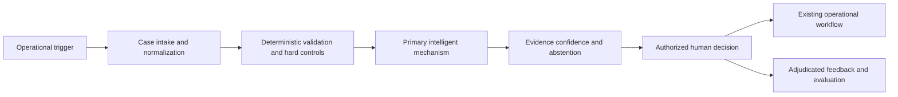

# <FAMILY-ID> <Concrete reusable solution outcome>

## Classification

- **Status:** proposed | active | parked | superseded
- **Primary architectural spine:** <one sentence>
- **Primary intelligent mechanism:** <one mechanism>
- **Execution model:** synchronous | asynchronous | batch | streaming | edge | durable-agent
- **Human authority:** <decision retained by humans>
- **Applied cases:** <count>

## Reusable outcome

Describe the repeated operational outcome delivered across cases.

## Suitable processes

- <process shape>

## Unsuitable processes

- <process shape that needs another family>

## Architecture invariants

- <trigger and intake>
- <deterministic controls>
- <primary intelligent transformation>
- <human decision boundary>
- <feedback and audit loop>

## Variation points

| Variation point | Allowed adaptation | Derivation signal |
| --- | --- | --- |
| Data source | connectors and schemas | different lifecycle or trust model |
| Regulation | rule/config adapter | separate isolation or authority boundary |
| Model | compatible implementation | different primary mechanism |
| Runtime | deployment configuration | materially different topology or latency |
| Interface | channel-specific UI | autonomous action or durable execution |

## Logical architecture

## Deterministic layer

- <rules, schemas, calculations, identifiers, workflow>

## Intelligent layer

- **Primary mechanism:** <one>
- **Inputs:** <inputs>
- **Outputs:** <outputs>
- **Training/grounding:** <assumptions>
- **Inference:** <runtime>
- **Abstention:** <conditions>

## Optional extensions

- <extension only when required by an applied case>

## Human and safety boundaries

- <prohibited automated actions>

## Data and integration contract

- <minimum canonical entities and events>
- <source provenance and versioning>
- <adapter boundaries>

## Evaluation contract

- **Model metrics:** <metrics>
- **Incremental-value metrics:** <comparison with deterministic baseline>
- **Workflow metrics:** <operational measures>
- **Failure criteria:** <stop/redesign conditions>

## Azure reference mapping

List possible Azure components without making specific services the family definition.

## Reusable building blocks

- **Available:** <existing building blocks>
- **Missing:** <candidate reusable blocks>

## Applied cases

| Opportunity | Actor/process | Disposition | Adapters | Extension | Derivation signal |
| --- | --- | --- | --- | --- | --- |
| `<ID>` | <case> | direct-fit | <adapters> | none | none |

## Closest families and boundary

Explain why this family is not merged with its closest neighbor.

## Architecture derivation status

- **Current decision:** no derivation | review queued | variant approved
- **Evidence:** <repeated structural difference or lack of it>
