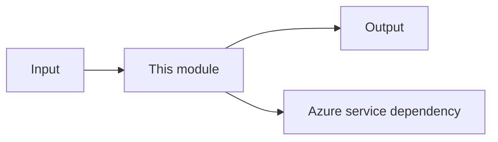
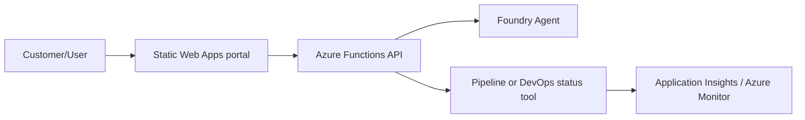

# README Standard

All building blocks and solutions in this repository must follow this README standard to ensure consistency, readability, and ease of use for both humans and AI agents.

## Core Requirements

1. **Microsoft Learn Consultation**: Every Azure-related module must consult current Microsoft documentation. Record materially used Microsoft Learn URLs in the PR body.
2. **Mermaid Diagrams**: Required for all solutions and any building block representing a service, API, agent, pipeline, or integration.
3. **Conciseness**: Prefer operational documentation (commands, diagrams, contracts) over long conceptual explanations.

## Building Block README Structure

Every building block README must include:

- **Purpose**: What the module demonstrates in 1-2 sentences.
- **Architecture Diagram**: A simple service-level Mermaid diagram.
- **Inputs/Outputs**: Clear definition of what the module accepts and produces.
- **Azure Resources**: List of Azure services required.
- **Local Run**: Exact commands to run or simulate the module locally.
- **Deploy**: Instructions or commands for Azure deployment.
- **Tests/Validation**: How to verify the module is working correctly.
- **Known Limits**: Trade-offs or current limitations.

### Building Block Diagram Style

## Solution README Structure

Every solution README must include:

- **Scenario**: The customer or business process scenario being solved.
- **Architecture Diagram**: A service-level Mermaid diagram showing the flow.
- **Composed Blocks**: List of building blocks used in the solution.
- **Entrypoints**: How to trigger the solution (e.g., API endpoint, Blob trigger).
- **Customer Outcome**: What the customer/user gets from this solution.
- **Deployment Assumptions**: Prerequisites or environment requirements.
- **Local/Demo Flow**: How to see a demo or run a subset locally.

### Solution Diagram Style

## Documentation Guidelines

- **Keep it small**: If a README is getting too long, consider splitting the module or moving detailed notes to `docs/`.
- **Fenced Blocks**: Always use proper code fences for commands and Mermaid diagrams.
- **Service-Level Diagrams**: Focus on the flow between services, not internal implementation details or complex sequence diagrams.
