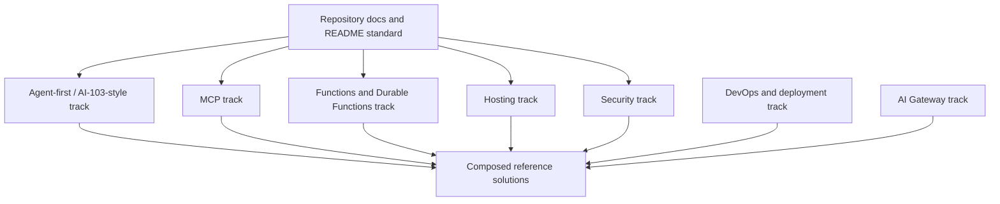

# Azure Reference Kit Roadmap

Last reviewed: 2026-07-03

This roadmap is an architecture decision for the repository. Jules should not redefine it. Jules issues should implement bounded pieces from this roadmap using `AGENTS.md`, `docs/microsoft-reference-map.md`, and the relevant module/solution docs.

## Direction

The project is agent-first.

Initial priority is AI-103-style coverage around Microsoft Foundry Agent Service and the practical ecosystem around agents:

- Foundry agents;
- tools;
- MCP;
- Azure Functions as tool/runtime boundary;
- evaluation and observability;
- DevOps/pipeline integration;
- secure customer-facing status;
- deployment and hosting patterns.

Do not start with a generic portal platform. The portal exists to expose agent/pipeline outcomes, not to become the product core.

## Sequencing model

Use small independent tracks that can run in parallel when they do not touch the same folder, solution, or contract.

Preferred parallelism:

```text
2-3 active Jules issues are acceptable when independent.
```

Do not parallelize work that changes the same module, same solution, same shared contract, or same runtime convention.

## Roadmap overview



## Track 0 — Repository foundation

Purpose: make the repo predictable for humans, Jules, and future schedulers.

Status: started.

Primary files:

```text
AGENTS.md
README.md
docs/microsoft-reference-map.md
docs/minimalism-and-complexity.md
docs/readme-standard.md
docs/roadmap.md
templates/
```

Next issues:

1. `REPO-DOCS-001` — README/Mermaid documentation standard.
2. `REPO-DOCS-002` — Issue and PR workflow examples adapted to Azure Reference Kit, if needed.

P0 expectations:

- every module/solution has a README contract;
- service-level Mermaid diagrams are required when useful;
- Microsoft Learn docs must be checked for Azure/Foundry/DevOps claims;
- Jules issues stay bounded and outcome-oriented.

## Track 1 — Agent-first / AI-103-style coverage

Purpose: build references around the agent lifecycle before building broad infrastructure.

Microsoft docs to re-check before implementation:

```text
https://learn.microsoft.com/en-us/azure/foundry/agents/overview
https://learn.microsoft.com/en-us/azure/foundry/agents/concepts/tool-catalog
```

### 1.1 Foundry agent basic

Folder:

```text
solutions/foundry-agent-basic/
```

Goal:

```text
Minimal Foundry agent reference with README, service-level Mermaid diagram, configuration contract, and local validation notes.
```

P0:

- explain prompt agent vs hosted agent decision;
- define environment variables and auth expectations;
- document how the agent is created/tested using current Microsoft docs;
- no custom tools yet;
- no portal yet.

Can run in parallel with:

- MCP basic server;
- security docs;
- hosting docs.

Should not run in parallel with:

- foundry-agent-with-tools;
- foundry-agent-with-mcp.

### 1.2 Foundry agent with tools

Folder:

```text
solutions/foundry-agent-with-tools/
building-blocks/agents/pipeline-assistant-foundry/
```

Goal:

```text
Agent using a small controlled tool contract.
```

P0:

- one explicit tool contract;
- safe input/output schema;
- no raw Azure/DevOps internals exposed;
- README with Mermaid;
- tests or static validation for the contract.

Depends on:

- Foundry agent basic.

### 1.3 Foundry agent with MCP

Folder:

```text
solutions/foundry-agent-with-mcp/
building-blocks/mcp/fastmcp-basic-server/
```

Goal:

```text
Agent consuming an MCP server through a minimal FastMCP-style reference.
```

P0:

- MCP server is intentionally small;
- one or two safe read-only tools;
- README explains when MCP is better than direct function calling or OpenAPI;
- Mermaid shows agent -> MCP -> tool boundary;
- security notes cover tool scope and auth assumptions.

Depends on:

- MCP basic server;
- Foundry agent basic.

### 1.4 Foundry agent with DevOps status

Folder:

```text
solutions/foundry-devops-agent-basic/
building-blocks/functions/devops-status-tool/
```

Goal:

```text
Agent answers safe questions about build/pipeline status through a controlled tool boundary.
```

P0:

- read-only pipeline/build status contract;
- safe fields only;
- no arbitrary DevOps API passthrough;
- no mutation tools in the first version;
- README with Mermaid and current Microsoft Learn links.

Depends on:

- Foundry agent with tools or MCP foundation;
- DevOps status contract.

### 1.5 Agent evaluation and observability

Folder:

```text
building-blocks/observability/agent-evaluation-observability/
solutions/foundry-agent-evaluation-observability/
```

Goal:

```text
Reference for tracing, evaluation, and monitoring of an agent flow.
```

P0:

- define what gets traced;
- define what must not be logged;
- include Application Insights / Azure Monitor notes where applicable;
- include a minimal evaluation checklist.

Depends on:

- at least one concrete agent solution.

## Track 2 — MCP

Purpose: keep MCP isolated as a reusable integration layer, not mixed into every agent example.

Primary folder:

```text
building-blocks/mcp/
```

Microsoft docs to re-check before implementation:

```text
https://learn.microsoft.com/en-us/azure/foundry/agents/concepts/tool-catalog
https://learn.microsoft.com/en-us/azure/foundry/agents/overview
```

### 2.1 FastMCP basic server

Folder:

```text
building-blocks/mcp/fastmcp-basic-server/
```

Goal:

```text
Minimal local MCP server reference with one safe read-only tool and README/Mermaid.
```

P0:

- use Jules default Python environment unless a dependency proves otherwise;
- no cloud deployment yet;
- one clear command to run locally;
- one safe example tool;
- explicit limitations.

Can run in parallel with:

- repository docs;
- static web portal docs;
- security status-boundary docs.

### 2.2 MCP on Azure Functions

Folder:

```text
building-blocks/mcp/azure-functions-mcp-endpoint/
```

Goal:

```text
Reference pattern for hosting custom MCP tools behind an Azure Functions boundary, when current Microsoft docs support it.
```

P0:

- re-check current Microsoft docs before implementation;
- document supported endpoint pattern;
- define auth assumptions;
- include Mermaid agent -> Foundry -> MCP endpoint -> Function/tool.

Depends on:

- FastMCP basic server or MCP contract docs.

### 2.3 MCP tool contract for DevOps

Folder:

```text
building-blocks/mcp/devops-mcp-tool-contract/
```

Goal:

```text
Read-only tool contract for DevOps status queries.
```

P0:

- no mutation operations;
- safe status response schema;
- no token exposure;
- no arbitrary query passthrough.

## Track 3 — Azure Functions and Durable Functions

Purpose: provide tool and pipeline execution boundaries that agents can call safely.

Primary folders:

```text
building-blocks/functions/
building-blocks/pipelines/
```

Microsoft docs to re-check before implementation:

```text
https://learn.microsoft.com/en-us/azure/azure-functions/functions-overview
https://learn.microsoft.com/en-us/azure/durable-task/durable-functions/durable-functions-overview
https://learn.microsoft.com/en-us/azure/foundry/agents/how-to/tools/azure-functions
```

### 3.1 HTTP function as agent tool

Folder:

```text
building-blocks/functions/agent-tool-http-function/
```

Goal:

```text
Small HTTP Function that exposes a controlled read-only tool boundary.
```

P0:

- explicit request/response schema;
- no secrets in code;
- no broad cloud access;
- README with Mermaid.

### 3.2 Queue function as agent tool

Folder:

```text
building-blocks/functions/agent-tool-queue-function/
```

Goal:

```text
Async tool execution pattern for longer work.
```

P0:

- document queue input/output;
- correlation id/status pattern;
- error/status response model;
- no customer-facing raw logs.

### 3.3 Durable basic pipeline

Folder:

```text
building-blocks/pipelines/durable-basic-pipeline/
```

Goal:

```text
Minimal Durable Functions orchestration for customer-visible pipeline status.
```

P0:

- explicit pipeline run contract;
- step-level status updates;
- retry/failure notes;
- local validation path.

## Track 4 — Hosting and portals

Purpose: document how references can be exposed locally and in Azure without turning every example into a platform.

Primary folders:

```text
building-blocks/hosting/
building-blocks/portals/
```

### 4.1 Static status portal

Folder:

```text
building-blocks/portals/static-status-portal/
```

Goal:

```text
Customer-facing portal shell for pipeline status/results.
```

P0:

- displays business status, not raw Azure logs;
- README with Mermaid;
- API contract documented;
- no auth implementation until security pattern is defined.

### 4.2 Container-hosted agent API

Folder:

```text
building-blocks/hosting/container-agent-api/
```

Goal:

```text
Reference for packaging an agent/API as a container when serverless is not a good fit.
```

P0:

- document when container is justified;
- avoid framework-heavy scaffold;
- include local run command and Azure hosting notes.

### 4.3 Web App hosted API

Folder:

```text
building-blocks/hosting/webapp-agent-api/
```

Goal:

```text
Reference for App Service/Web App hosting of an agent-facing API.
```

P0:

- compare briefly with Functions/container option;
- no duplicate app code if another hosting block already owns it;
- README with Mermaid.

## Track 5 — Security

Purpose: security patterns must exist before examples become customer-facing.

Primary folder:

```text
building-blocks/security/
```

### 5.1 Customer-safe status boundary

Folder:

```text
building-blocks/security/customer-safe-status-boundary/
```

Goal:

```text
Define what customers can see from pipelines, agents, and tools.
```

P0:

- allow business status, summaries, safe artifacts, friendly errors;
- forbid raw logs, prompts, secrets, tokens, stack traces, provider payloads;
- provide example redaction/status contract.

Can run early and in parallel.

### 5.2 Managed identity and RBAC pattern

Folder:

```text
building-blocks/security/managed-identity-rbac/
```

Goal:

```text
Reference pattern for least-privilege service access.
```

P0:

- current Microsoft docs consulted;
- no broad wildcard permissions;
- document local dev credential fallback separately from Azure identity.

### 5.3 Network boundary notes

Folder:

```text
building-blocks/security/network-boundary-notes/
```

Goal:

```text
Practical notes for private endpoints, restricted ingress, and customer-facing/API separation.
```

P0:

- doc-only until concrete module needs infra;
- no production-grade network scaffold without a reference solution.

## Track 6 — DevOps and deployment

Purpose: deployment examples should follow concrete modules, not lead with generic pipeline templates.

Primary folder:

```text
building-blocks/devops/
```

### 6.1 GitHub Actions deploy pattern

Folder:

```text
building-blocks/devops/github-actions-azure-deploy/
```

Goal:

```text
Reference workflow for a concrete module/solution.
```

P0:

- only after a real module exists;
- no secrets committed;
- docs explain required repository/environment secrets.

### 6.2 Azure Pipelines deploy pattern

Folder:

```text
building-blocks/devops/azure-pipelines-azure-deploy/
```

Goal:

```text
Azure Pipelines equivalent for a concrete module/solution.
```

P0:

- service connection/security assumptions documented;
- not created before a deployable module exists.

### 6.3 IaC reference patterns

Folders:

```text
infra/terraform/
infra/azd/
```

Goal:

```text
Keep IaC patterns minimal and tied to actual modules.
```

P0:

- prefer Terraform/OpenTofu for reusable patterns;
- use azd/Bicep when adapting official Microsoft samples or when a solution benefits from azd up.

## Track 7 — AI Gateway

Purpose: implement a minimal APIM-based AI Gateway for controlled model access.

Primary folder:

```text
building-blocks/gateways/
```

Microsoft docs to re-check before implementation:

```text
https://learn.microsoft.com/azure/api-management/genai-gateway-capabilities
https://learn.microsoft.com/azure/api-management/llm-token-limit-policy
```

### 7.1 APIM AI Gateway model-access building block

Folder:

```text
building-blocks/gateways/apim-ai-gateway/
```

Goal:

```text
Minimal APIM gateway that protects one existing model endpoint with explicit caller authentication, managed-identity backend access, and token governance.
```

P0:

- authenticated caller boundary;
- managed-identity auth to backend;
- token-per-minute governance;
- safe telemetry without technical leakage;
- README with Mermaid and local validation.

### 7.2 Foundry agent using APIM AI Gateway for model access

Folder:

```text
solutions/foundry-agent-with-gateway/
```

Goal:

```text
Agent reference that uses the AI Gateway instead of direct model access.
```

P0:

- agent configuration uses gateway endpoint;
- demonstrates token limit enforcement;
- demonstrates observability via gateway metrics.

## First wave of Jules issues

These can run with controlled parallelism after `REPO-DOCS-001` is merged or if they do not touch the same files.

### Wave 1 — foundation and independent samples

1. `REPO-DOCS-001` — README/Mermaid standard.
2. `MCP-001` — FastMCP basic server reference.
3. `SEC-001` — Customer-safe status boundary.
4. `PORTAL-001` — Static status portal contract/readme-only scaffold.

Parallelism:

```text
MCP-001 + SEC-001 + PORTAL-001 can run in parallel if they touch separate folders.
```

### Wave 2 — first agent references

1. `AGENT-001` — Foundry agent basic.
2. `FUNC-001` — HTTP function as controlled agent tool.
3. `MCP-002` — MCP on Azure Functions, if current docs support the chosen pattern.

Parallelism:

```text
AGENT-001 and FUNC-001 can run in parallel only if their contracts do not depend on each other yet.
```

### Wave 3 — composed solution

1. `AGENT-002` — Foundry agent with tools.
2. `AGENT-003` — Foundry agent with MCP.
3. `AGENT-004` — Foundry + DevOps status agent.
4. `OBS-001` — Agent evaluation and observability.

Parallelism:

```text
Do not run AGENT-002, AGENT-003, and AGENT-004 at the same time unless their dependencies are already stable.
```

## Scheduler rules derived from this roadmap

- If no issue is active, pick from the earliest wave with incomplete work.
- If an issue is active but independent capacity remains, add at most 1-2 more `jules` issues from different tracks.
- Do not let Jules decide the next roadmap direction.
- Jules implements bounded issues from this roadmap.
- Every issue that touches Azure/Foundry/DevOps must require current Microsoft Learn verification and PR-body URLs.
- Every module/solution issue must require README and Mermaid when applicable.
- Prefer docs/contracts first, then code, then deployment.
