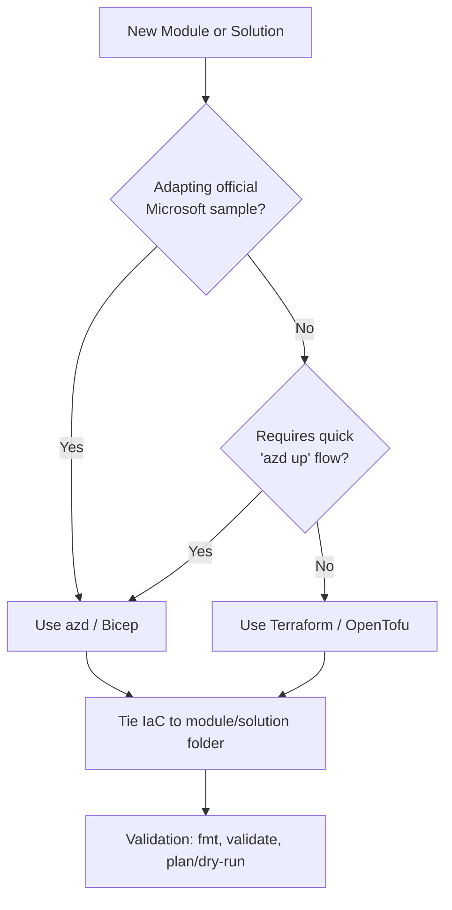

# Infrastructure

This directory contains the reference patterns for Infrastructure as Code (IaC) used in the Azure Reference Kit.

## IaC Reference Pattern Boundaries

To maintain consistency and modularity, the repository follows specific boundaries for choosing and implementing IaC.

### Preference: Terraform / OpenTofu

**Use for:** Reusable building blocks and modular infrastructure patterns.

Terraform (or OpenTofu) is the preferred tool for defining infrastructure in this repository because of its strong support for modularity and its provider ecosystem, which aligns with the modular nature of our building blocks.

- **Tooling:** Terraform CLI or OpenTofu.
- **Provider:** Prefer `azurerm` and `azapi` providers for Azure resources.
- **Scope:** Primarily used for `building-blocks/` and complex `solutions/`.

### Alternative: Azure Developer CLI (azd) / Bicep

**Use for:** Adapting official Microsoft samples or enabling quick end-to-end "azd up" flows for reference solutions.

While Terraform is preferred, `azd` with Bicep is acceptable when:
1. Directly adapting or extending an official Microsoft sample that is already built with `azd`.
2. Providing a highly streamlined "developer-to-cloud" experience for a specific reference solution where `azd up` is the primary entry point.

- **Tooling:** `azd` CLI, Bicep.
- **Scope:** Used for specific `solutions/` or modules that benefit from the `azd` workflow.

### Decision Flow

## Guardrails

1. **Concrete Implementation:** IaC must be tied to a concrete module or solution. Do not create broad, generic scaffolding or empty folder trees in the global `infra/` directory. Reusable patterns should be documented here in `infra/` but implemented where they are used.
2. **Minimalism:** Infrastructure should be minimal and focused on demonstrating the specific reference pattern. Avoid production-grade complexity (e.g., hub-and-spoke networking, multi-region) unless the module explicitly demonstrates that concern.
3. **No Hidden Resources:** Infrastructure should support modules and solutions without hiding required Azure resources.
4. **Documentation:** Every IaC implementation must include a `README.md` (or a section in the module's `README.md`) explaining prerequisites, required environment variables, and estimated cost drivers.
5. **Validation:** Run tool-specific format and validation commands (e.g., `terraform fmt`, `terraform validate`, `bicep lint`) before submitting.

## References

- [Azure Developer CLI (azd) Overview](https://learn.microsoft.com/en-us/azure/developer/azure-developer-cli/overview)
- [Terraform on Azure documentation](https://learn.microsoft.com/en-us/azure/developer/terraform/)
- [Terraform AzureRM Provider](https://registry.terraform.io/providers/hashicorp/azurerm/latest/docs)
