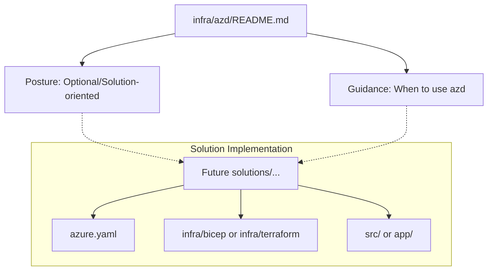

# Azure Developer CLI (azd) Reference Index

This directory serves as the repository-level index for Azure Developer CLI (`azd`) posture and guidance within the Azure Reference Kit.

## Repository Rule: Solution-Oriented azd

In this repository, **`azd` is optional and solution-oriented.**

- **Default Posture**: Terraform/OpenTofu remains the preferred default for reusable, module-local Infrastructure as Code (IaC).
- **azd Scope**: `azd` is used at the **solution level** to provide a streamlined "developer-to-cloud" experience (`azd up`) or when adapting official Microsoft samples designed for the `azd` workflow.
- **Local-IaC Rule**: Reusable module infrastructure stays within the owning module/solution. The root `infra/azd/` directory is a **documentation and pattern guide only**, not a shared template or platform scaffold.

## When to Use azd

- **Official Microsoft Samples**: When adapting or extending a sample that is natively built with `azd` and Bicep.
- **End-to-End Solutions**: When a `solutions/` entry benefits from a single command to provision infrastructure, build the application, and deploy.
- **Quick Demos**: When the primary goal is a fast, reproducible "inner loop" demonstration for developers.

## When NOT to Use azd

- **Reusable Building Blocks**: Do not use `azd` for standalone `building-blocks/` that are meant to be composed into larger systems via Terraform.
- **Platform Scaffolding**: Do not create global `azd` templates that attempt to manage the entire repository or a shared Landing Zone.
- **Internal Tools**: When the infrastructure is purely supporting internal DevOps or runner configurations.

## Comparison: Terraform vs. azd

| Feature | Terraform / OpenTofu | Azure Developer CLI (azd) |
| :--- | :--- | :--- |
| **Primary Focus** | Modular infrastructure state & lifecycle. | App + Infra deployment workflow. |
| **Unit of Reuse** | Module (`building-blocks/`). | Template (`solutions/`). |
| **Language** | HCL | Bicep (Default) or Terraform. |
| **Orchestration** | External (Pipelines/Manual). | Integrated (`azd up`, `azd deploy`). |
| **Best For** | Stable, composable building blocks. | Developer experience and rapid prototyping. |

## Structural Map

The following diagram illustrates the relationship between the root `azd` index and future solution-level implementations.



## Potential azd Candidates

The following solutions are candidates for future `azd` implementation based on their end-to-end nature:

- [`solutions/document-ai-portal/`](../../solutions/document-ai-portal/)
- [`solutions/foundry-agent-basic/`](../../solutions/foundry-agent-basic/)
- [`solutions/foundry-devops-agent-basic/`](../../solutions/foundry-devops-agent-basic/)

## Validation

### Documentation Validation
Ensure all relative links to `solutions/` or `building-blocks/` are valid and the Mermaid diagram renders correctly in standard Markdown viewers.

### Manual azd Validation (for future templates)
When implementing `azd` in a solution, the following commands should be used for validation (where `azd` is installed):

```bash
# From the solution directory containing azure.yaml:
azd config set alpha.terraform on  # If using Terraform with azd
azd template validate
azd provision --dry-run
```

## Deployment / IaC Decision
As of Track 6, item 6.3, `azd` is recognized as a solution-level accelerator. For most reusable components, Terraform remains the source of truth for IaC to ensure maximum composability.

## References

- [Azure Developer CLI overview](https://learn.microsoft.com/en-us/azure/developer/azure-developer-cli/overview)
- [Make your project azd-compatible](https://learn.microsoft.com/en-us/azure/developer/azure-developer-cli/make-azd-compatible)
- [azd CLI reference](https://learn.microsoft.com/en-us/azure/developer/azure-developer-cli/reference)
- [Official azd Templates (Awesome azd)](https://github.com/Azure-Samples/awesome-azd)
