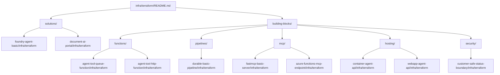

# Terraform / OpenTofu Reference Index

This directory serves as a central index for Terraform and OpenTofu infrastructure patterns used throughout the Azure Reference Kit.

## Repository Rule: Local Infrastructure

In this repository, **Infrastructure as Code (IaC) remains local to the module or solution that owns the Azure resources.**

- Root `infra/terraform/` is an **index and pattern guide**, not a shared platform scaffold or a landing zone.
- Do not create reusable root modules or shared state configurations here.
- For every building block or solution that requires Azure resources, look for an `infra/terraform/` folder within that component's directory.

## Repository Map

The following diagram illustrates how the root index points to concrete, deployable infrastructure folders located within modules and solutions.



## Existing Deployment References

| Category | Reference Path | Description / Key Patterns |
| :--- | :--- | :--- |
| **Solutions** | [`solutions/foundry-agent-basic/infra/terraform`](../../solutions/foundry-agent-basic/infra/terraform) | Foundry Hub, Project, and Model deployment; Platform via TF, Agent via SDK. |
| **Solutions** | [`solutions/document-ai-portal/infra/terraform`](../../solutions/document-ai-portal/infra/terraform) | Comprehensive solution infra: Storage, Functions (Flex Consumption), Static Web Apps, and Observability. |
| **Functions** | [`building-blocks/functions/agent-tool-queue-function/infra/terraform`](../../building-blocks/functions/agent-tool-queue-function/infra/terraform) | Async tool execution using Flex Consumption and identity-based queue access. |
| **Functions** | [`building-blocks/functions/agent-tool-http-function/infra/terraform`](../../building-blocks/functions/agent-tool-http-function/infra/terraform) | Baseline Flex Consumption Function App for HTTP tools. |
| **Pipelines** | [`building-blocks/pipelines/durable-basic-pipeline/infra/terraform`](../../building-blocks/pipelines/durable-basic-pipeline/infra/terraform) | Orchestration infrastructure for Durable Functions with identity-first storage. |
| **MCP** | [`building-blocks/mcp/fastmcp-basic-server/infra/terraform`](../../building-blocks/mcp/fastmcp-basic-server/infra/terraform) | **No-resource reference**: Demonstrates a local-only MCP server pattern. |
| **MCP** | [`building-blocks/mcp/azure-functions-mcp-endpoint/infra/terraform`](../../building-blocks/mcp/azure-functions-mcp-endpoint/infra/terraform) | Hosting MCP tools on Azure Functions (Flex Consumption) with identity-first security. |
| **Hosting** | [`building-blocks/hosting/container-agent-api/infra/terraform`](../../building-blocks/hosting/container-agent-api/infra/terraform) | Deployment patterns for containerized agent APIs. |
| **Hosting** | [`building-blocks/hosting/webapp-agent-api/infra/terraform`](../../building-blocks/hosting/webapp-agent-api/infra/terraform) | Azure App Service (Web App) deployment patterns. |
| **Security** | [`building-blocks/security/customer-safe-status-boundary/infra/terraform`](../../building-blocks/security/customer-safe-status-boundary/infra/terraform) | **No-resource policy**: Encapsulates data boundary rules as pure HCL metadata. |

## Validation Patterns

For any `infra/terraform/` folder in this repository, the following validation commands are expected to pass:

```bash
# From the specific infra/terraform/ folder:
terraform fmt -check -recursive
terraform init -backend=false
terraform validate
```

If the environment lacks the Terraform CLI, manual HCL validation by inspection is required for PR submission.

## References

- [Terraform on Azure documentation](https://learn.microsoft.com/en-us/azure/developer/terraform/)
- [Azure Developer CLI (azd) Overview](https://learn.microsoft.com/en-us/azure/developer/azure-developer-cli/overview)
- [Repository IaC Requirement](../../docs/terraform-deployment-requirement.md)
