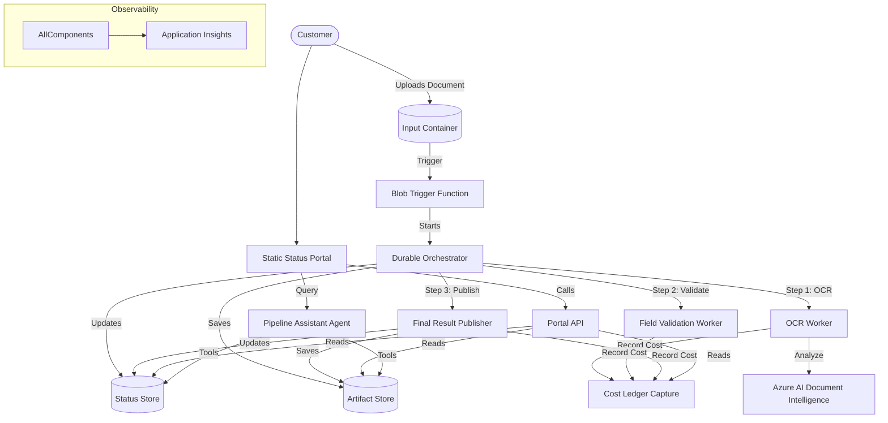

# Document AI Portal Solution

This solution demonstrates a customer-facing portal for monitoring and interacting with an AI-driven document processing pipeline.

## Customer Scenario

A customer needs to upload documents (e.g., invoices, receipts, forms) and track the status of their processing in real-time. Once processed, they want to view the extracted structured data and use an AI assistant to ask questions about the document or the process (e.g., "Why did this fail?", "What is the total amount?").

## Solution Status

This solution is a composition of several building blocks. See the [Composition Status Map](./docs/composition-status-map.md) for a detailed view of which components are implemented, in progress, or scaffolded.

## Process Flow

1. **Upload**: Customer uploads a document to a Blob Storage container.
2. **Trigger**: A Blob-triggered Azure Function detects the upload and initiates the pipeline.
3. **Orchestration**: A Durable Functions orchestrator manages the pipeline steps, updating the customer-safe status at each stage.
4. **OCR/Extraction**: Azure AI Document Intelligence extracts text and fields from the document.
5. **Storage**: Extracted artifacts and metadata are stored in a secure artifact store.
6. **Monitoring**: The customer monitors progress through a Static Web Apps portal.
7. **Assistance**: A Pipeline Assistant (Azure AI Foundry Agent) provides grounded answers to customer queries using the status and artifact data.

## Composition & Runtime Map

This solution is composed of multiple building blocks that are packaged into specific Azure runtime targets.

- **[Runtime Map](./runtime-map.md)**: Detailed breakdown of runtime targets, entrypoints, and required settings.
- **[Package Map](./deploy/package-map.yaml)**: Defines how source building blocks map to deployable artifacts.

### Composed Building Blocks

- [Static Status Portal](../../building-blocks/portals/static-status-portal/): The React-based frontend (Status: Scaffold).
- [Portal API Functions](../../building-blocks/functions/portal-api-functions/): Backend API for the portal (Status: Implemented).
- [Blob Trigger](../../building-blocks/functions/blob-trigger-start-pipeline/): Entrypoint for new documents (Status: Implemented).
- [Blob Artifact Store](../../building-blocks/storage/blob-artifact-store/): Secure storage for documents and results (Status: Scaffold).
- [Durable Basic Pipeline](../../building-blocks/pipelines/durable-basic-pipeline/): Workflow orchestration (Status: Implemented).
- [OCR Document Intelligence](../../building-blocks/functions/ocr-document-intelligence/): Document analysis worker (Status: Implemented).
- [Field Validation Worker](../../building-blocks/functions/field-validation-worker/): Extracted field validation worker (Status: Implemented).
- [Final Result Publisher](../../building-blocks/functions/final-result-publisher/): Finalizes and publishes safe results (Status: Implemented).
- [Pipeline Assistant Foundry](../../building-blocks/agents/pipeline-assistant-foundry/): AI agent for customer interaction (Status: Implemented).
- [AppInsights Observability](../../building-blocks/observability/appinsights-observability/): Technical monitoring and tracing (Status: Scaffold).
- [Cost Ledger Capture](../../building-blocks/observability/cost-ledger-capture/): Internal cost estimate capture (Status: Scaffold).

## Service-Level Diagram



## Entrypoints & Trigger Model

- **Primary Entrypoint**: Blob Storage Upload (async).
- **Interactive Entrypoint**: Static Web App (HTTPS).
- **Trigger**: Event Grid / Blob Trigger on the input container.

## Customer-Facing Outcome

- Real-time visibility into document processing status.
- Access to extracted structured data without technical jargon.
- AI-powered assistance for clarifying results or errors.
- Secure, scoped access to only their own artifacts and status.

## Customer-Safe Status & Artifact Boundary

This solution strictly enforces the [Customer-Safe Status Boundary](../../building-blocks/security/customer-safe-status-boundary/) to prevent exposure of technical internals.

### Allowed Customer-Facing Data
- **Business Status**: `pending`, `running`, `completed`, `failed`.
- **Friendly Step Names**: "Analyzing Document", "Validating Data", "Finalizing Results".
- **Safe Summaries**: "Processing successful", "Document unreadable".
- **Extracted Fields**: Specific business data mapped to `pipeline-step.schema.json`.
- **Friendly Errors**: Non-technical explanations for failures.
- **Aggregated Cost**: Total estimated amount for the run.

### Forbidden Data (Internal-Only)
- **Raw Logs**: No Function logs, stack traces, or internal resource IDs.
- **Prompts**: No system instructions or grounded prompt text.
- **Secrets**: No SAS tokens, API keys, or connection strings.
- **Technical IDs**: No Azure Subscription IDs or raw resource URIs.
- **Provider Payloads**: No raw JSON from Document Intelligence or OpenAI.

Enforcement is performed at the [Portal API Functions](../../building-blocks/functions/portal-api-functions/) layer, which filters all outgoing data against the shared contracts.

## Deployment Assumptions

- Azure subscription with AI Services (Document Intelligence) and AI Foundry enabled.
- Storage accounts for input, artifacts, and Durable Functions state.
- Azure Static Web App for hosting the frontend.
- Azure Functions (Flex Consumption) for APIs and workers.

The solution provides a [Terraform foundation](./infra/terraform/) for provisioning these resources.

## Packaging & Deployment

To package the solution artifacts locally:
```bash
bash solutions/document-ai-portal/deploy/package.sh
```
The packaging script assembles building blocks into a local `dist/` directory, following the `deploy/package-map.yaml` definition. It produces staging directories for each runtime target, including an `artifact-manifest.json` and a global `package-manifest.json`.

To run the deployment preflight:
```bash
bash solutions/document-ai-portal/deploy/deploy.sh
```
The `deploy.sh` script performs a non-destructive local preflight that verifies prerequisites, package artifacts in `dist/`, and validates Terraform files when available. It provides explicit "Next Steps" for manual or CI/CD-driven deployment.

Refer to the [Solution Composition Contract](../../docs/solution-composition-contract.md) for details on the standard packaging and deployment model.

## Local / Demo Flow

1. **Prerequisites**: [Azure Functions Core Tools](https://learn.microsoft.com/en-us/azure/azure-functions/functions-run-local), [Azurite](https://github.com/azure/azurite), and [SWA CLI](https://github.com/Azure/static-web-apps-cli).
2. **Start Services**: Run the `api_function_app` and `pipeline_function_app` using Core Tools.
3. **Run Portal**: Use `swa start` in the `building-blocks/portals/static-status-portal/` directory.
4. **Trigger**: Upload a file to the local `input` container in Azurite to trigger the processing pipeline.

## Validation

To validate the solution contract, referenced building blocks, and customer-safe boundary:

```bash
python3 -m pytest solutions/document-ai-portal/tests/test_solution_contract.py
```

## Known Limits

- The current scaffold does not include real OCR ingestion or Agent runtime code.
- Authentication/Authorization patterns are deferred to the [Security Track](../../docs/roadmap.md#track-5-security).
- Large document processing may require adjustment of Durable Functions timeouts.
