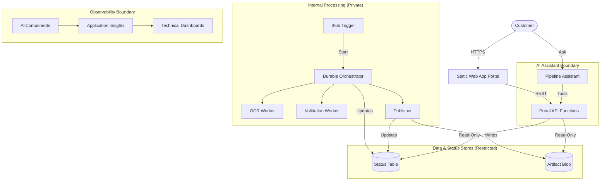

# Composition Status Map - Document AI Portal

This document provides a compact status map of the building blocks composed in the Document AI Portal solution. It distinguishes between implemented, active, and scaffolded components to provide a clear view of the solution's current state.

## Solution Composition Status

| Building Block | Category | Status | Interface/Contract | Description |
|----------------|----------|--------|--------------------|-------------|
| [Static Status Portal](../../../building-blocks/portals/static-status-portal/) | Portal | ✅ Implemented | React / SWA | Customer-safe UI shell and API adapter. |
| [Portal API Functions](../../../building-blocks/functions/portal-api-functions/) | API | ✅ Implemented | HTTPS / JSON | Enforcement boundary and data provider. |
| [Blob Trigger](../../../building-blocks/functions/blob-trigger-start-pipeline/) | Trigger | ✅ Implemented | Blob Event | Entrypoint for document processing. |
| [Blob Artifact Store](../../../building-blocks/storage/blob-artifact-store/) | Storage | ✅ Implemented | Blob Storage | Secure storage and SAS delivery for artifacts. |
| [Durable Basic Pipeline](../../../building-blocks/pipelines/durable-basic-pipeline/) | Pipeline | ✅ Implemented | Durable Functions | Workflow orchestration logic. |
| [OCR Worker](../../../building-blocks/functions/ocr-document-intelligence/) | Worker | ⚡ Active | Activity Interface | OCR extraction using Document Intelligence. |
| [Field Validation Worker](../../../building-blocks/functions/field-validation-worker/) | Worker | ⚡ Active | Activity Interface | Business rule validation for OCR results. |
| [Final Result Publisher](../../../building-blocks/functions/final-result-publisher/) | Worker | ✅ Implemented | Activity Interface | Finalizes and publishes safe results. |
| [Pipeline Assistant](../../../building-blocks/agents/pipeline-assistant-foundry/) | Agent | ✅ Implemented | Foundry Agent | AI assistant for customer queries. |
| [AppInsights Observability](../../../building-blocks/observability/appinsights-observability/) | Obs | 🏗️ Scaffold | AppInsights | Technical telemetry and tracing. |
| [Cost Ledger Capture](../../../building-blocks/observability/cost-ledger-capture/) | Obs | 🏗️ Scaffold | Table Storage | Internal cost estimate tracking. |

**Legend:**
- ✅ **Implemented**: Code and infrastructure references are present and functional.
- ⚡ **Active**: Implementation is in progress or requires specific Azure resource configuration.
- 🏗️ **Scaffold**: Structural placeholder with defined contracts but minimal logic.

## Architecture & Boundaries

The solution is built on a "Secured Status" architecture, ensuring that internal technical details are never exposed to the customer portal.

## Customer-Safe Status Boundary

All customer-facing outputs (Portal UI and Agent answers) are filtered through the **Portal API** to enforce the following boundary:

- **STRICTLY FORBIDDEN**:
    - Raw Azure Function logs or technical stack traces.
    - Azure Subscription IDs, Tenant IDs, or internal resource URIs.
    - Storage account keys, SAS tokens, or connection strings.
    - System prompts or LLM grounding instructions.
    - Raw provider payloads (e.g., JSON from Document Intelligence or OpenAI).
- **ALLOWED**:
    - Business status (e.g., `Processing`, `Completed`, `Action Required`).
    - Friendly step descriptions (e.g., "Extracting invoice data").
    - Curated extraction results and validated business fields.
    - Non-technical error explanations and correlation IDs.

## Deployment & IaC Readiness

The solution uses a consolidated Terraform approach located in `solutions/document-ai-portal/infra/terraform/`.

- **Current State**: The Terraform foundation provisions the core infrastructure (Storage, Functions, App Insights, Static Web App) and sets up the required Managed Identity and RBAC.
- **Reference**: Deployment follows the [Terraform Deployment Requirement](../../../docs/terraform-deployment-requirement.md).
- **Manual Steps**: Azure AI Document Intelligence and Azure AI Foundry Project must be provisioned or configured as variables if they exist outside the local solution scope.

## Validation Basis

The statuses in this map are verified against the following repository evidence:

- **Static Status Portal**: `module.yaml` (implemented), full React codebase in `src/`, and Passing ESLint/Vite configuration.
- **Portal API Functions**: `module.yaml` (implemented), Python `function_app.py`, and defined HTTP entrypoints.
- **Blob Trigger**: `module.yaml` (implemented) and Python `function_app.py` with Blob trigger.
- **Blob Artifact Store**: `module.yaml` (implemented), `src/artifact_store.py` with hardened validation and SAS generation.
- **Durable Basic Pipeline**: `module.yaml` (implemented), Orchestrator/Activity definitions in `function_app.py`.
- **OCR Worker**: `module.yaml` (active), `src/worker.py` integrated with Azure AI Document Intelligence SDK.
- **Field Validation Worker**: `module.yaml` (active), `src/worker.py` with business logic.
- **Final Result Publisher**: `module.yaml` (implemented) and Python activity code.
- **Pipeline Assistant**: `module.yaml` (implemented), `src/agent_definition.py` and tool definitions.
- **Observability & Cost**: `module.yaml` (scaffold), structural placeholders without full implementation logic.
- **Infrastructure**: `solutions/document-ai-portal/infra/terraform/` provisions the core storage, functions, and identity resources.

## How to Read this Solution

1. **Start with `solution.yaml`**: Understand the high-level composition and referenced blocks.
2. **Review the Contracts**: Examine `shared/contracts/` to see the data shapes that flow between components.
3. **Trace the Trigger**: Look at `building-blocks/functions/blob-trigger-start-pipeline/` to see how the process begins.
4. **Follow the Orchestrator**: See `building-blocks/pipelines/durable-basic-pipeline/` for the workflow logic.
5. **Inspect the API**: Review `building-blocks/functions/portal-api-functions/` to understand the security boundary.
