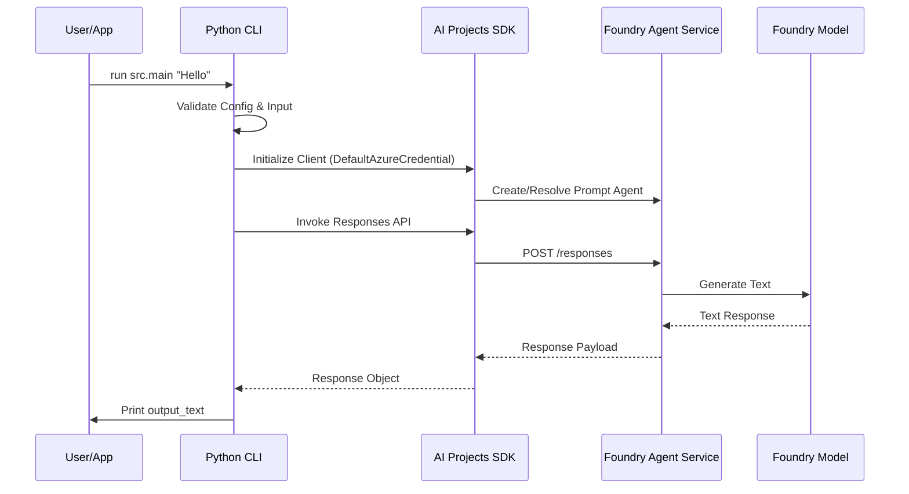

# Foundry Agent Basic

This reference solution demonstrates the minimal configuration and invocation of an Azure AI Foundry agent using the Prompt Agent pattern.

## Scenario

A developer or application needs to interact with an AI agent managed entirely by Azure AI Foundry. The agent is defined by instructions and a model, without requiring custom runtime code or infrastructure management.

## Architecture



## Design Decisions

### Prompt Agent vs. Hosted Agent
For this basic reference, we use the **Prompt Agent** pattern.
- **Prompt Agent**: Author-only configuration (instructions, model, tools). Foundry manages the runtime, scaling, and compute. Best for standard agentic tasks without custom orchestration.
- **Hosted Agent**: Requires custom code (Python/TS) packaged as a container. Best for multi-agent systems or custom protocols.

Choosing Prompt Agent minimizes operational overhead and focuses on the core Agent Service capabilities.

### Unified Responses API
This reference uses the unified Responses API, which is the recommended entry point for both Prompt and Hosted agents, providing a consistent interaction model.

## Configuration

The runtime requires the following environment variables.

| Variable | Description | Example |
|----------|-------------|---------|
| `AZURE_AI_PROJECT_ENDPOINT` | The Foundry project discovery URL. | `https://<res-name>.ai.azure.com/api/projects/<proj-id>` |
| `AZURE_AI_AGENT_NAME` | The name of the agent to create or resolve. | `basic-prompt-agent` |
| `AZURE_AI_MODEL_NAME` | The deployment name of the model to use. | `gpt-4o-mini` |

## Local Run

1. **Prerequisites**:
   - Python 3.10+
   - Logged in via Azure CLI: `az login`
   - Existing Azure AI Foundry project and model deployment.

2. **Setup**:
   ```bash
   pip install -r requirements.txt
   ```

3. **Execution**:
   ```bash
   export AZURE_AI_PROJECT_ENDPOINT="https://<res-name>.ai.azure.com/api/projects/<proj-id>"
   export AZURE_AI_AGENT_NAME="basic-prompt-agent"
   export AZURE_AI_MODEL_NAME="gpt-4o-mini"

   # Run with prompt argument
   PYTHONPATH=. python -m src.main "What can you do?"

   # Or run interactively
   PYTHONPATH=. python -m src.main
   ```

## Security Boundary

- **Authentication**: Uses `DefaultAzureCredential`. No API keys or connection strings are stored or used.
- **Sanitized Failures**: Internal technical details (stack traces, raw provider payloads, internal IDs) are caught and redacted. The CLI returns only safe, high-level error messages.
- **Input Validation**: Rejects empty, overly long, or suspicious input before SDK interaction.
- **Safe Logging**: Logs do not contain user prompts, tokens, or raw Azure identifiers.

## Validation Commands

```bash
python --version
ruff check .
ruff format --check .
PYTHONPATH=. python -m pytest tests/
```

## Known Limits and Trade-offs

- **Managed Only**: Prompt agents cannot execute arbitrary code outside of the Code Interpreter tool (not included in this basic reference).
- **Regional Availability**: Foundry Agent Service is currently available in specific regions.
- **No Persistence**: This basic CLI does not persist conversation history beyond the single invocation.

## References

- [Foundry Agent Service overview](https://learn.microsoft.com/en-us/azure/foundry/agents/overview)
- [Prompt agent quickstart](https://learn.microsoft.com/en-us/azure/foundry/agents/quickstarts/prompt-agent?tabs=python)
- [Azure AI Projects Python SDK reference](https://learn.microsoft.com/en-us/python/api/overview/azure/ai-projects-readme)
- [Customer-Safe Status Boundary](../../building-blocks/security/customer-safe-status-boundary/README.md)
