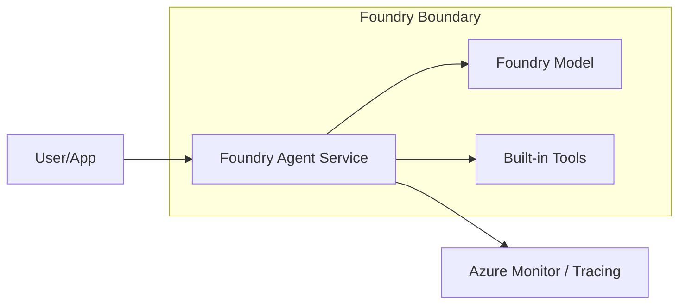

# Foundry Agent Basic

This reference solution demonstrates the minimal configuration and invocation of an Azure AI Foundry agent using the Prompt Agent pattern.

## Scenario

A developer or application needs to interact with an AI agent managed entirely by Azure AI Foundry. The agent is defined by instructions and a model, without requiring custom runtime code or infrastructure management.

## Architecture



## Design Decisions

### Prompt Agent vs. Hosted Agent
For this basic reference, we use the **Prompt Agent** pattern.
- **Prompt Agent**: Author-only configuration (instructions, model, tools). Foundry manages the runtime, scaling, and compute. Best for standard agentic tasks without custom orchestration.
- **Hosted Agent**: Requires custom code (Python/TS) packaged as a container. Best for multi-agent systems or custom protocols.

Choosing Prompt Agent minimizes operational overhead and focuses on the core Agent Service capabilities.

## Configuration Assumptions

- **Model**: Assumes `gpt-4o-mini` or `gpt-4o` is deployed in the Foundry project.
- **SDK**: Uses `azure-ai-projects` and `azure-identity` Python packages.
- **Auth**: Relies on Microsoft Entra ID (`DefaultAzureCredential`).

## Environment Variables

| Variable | Description | Example |
|----------|-------------|---------|
| `AZURE_AI_PROJECT_ENDPOINT` | The Foundry project discovery URL. | `https://<res-name>.ai.azure.com/api/projects/<proj-id>` |

## Local Validation

1. **Prerequisites**:
   - Python 3.10+
   - `pip install azure-ai-projects azure-identity`
   - Logged in via Azure CLI: `az login`

2. **Python Snippet (Responses API)**:
   ```python
   import os
   from azure.identity import DefaultAzureCredential
   from azure.ai.projects import AIProjectClient
   from azure.ai.projects.models import PromptAgentDefinition

   # Initialize project client
   project = AIProjectClient(
       endpoint=os.environ["AZURE_AI_PROJECT_ENDPOINT"],
       credential=DefaultAzureCredential(),
   )

   # Define and create a Prompt Agent version
   # Note: Instructions and model choice are part of the definition
   agent = project.agents.create_version(
       agent_name="basic-prompt-agent",
       definition=PromptAgentDefinition(
           model="gpt-4o-mini",
           instructions="You are a helpful assistant.",
       ),
   )

   # Get the specialized OpenAI client for Responses API
   openai = project.get_openai_client()

   # Invoke the agent using the Responses API
   response = openai.responses.create(
       input="What can you do?",
       extra_body={
           "agent_reference": {
               "name": agent.name,
               "type": "agent_reference"
           }
       },
   )

   print(f"Response: {response.output_text}")
   ```

*Note: This reference uses the unified Responses API, which is the recommended entry point for both Prompt and Hosted agents.*

## Known Limits and Trade-offs

- **Managed Only**: Prompt agents cannot execute arbitrary code outside of the Code Interpreter tool.
- **Regional Availability**: Foundry Agent Service is currently available in specific regions (e.g., East US 2, Sweden Central).
- **No Custom Tools**: This reference does not include custom Functions or MCP servers.

## Follow-ups

- [ ] **Tools**: Add built-in tools like Code Interpreter or File Search.
- [ ] **MCP**: Connect the agent to a Model Context Protocol (MCP) server.
- [ ] **Observability**: Enable end-to-end tracing and evaluation.
- [ ] **DevOps**: Integrate agent definition into a CI/CD pipeline.

## References

- [Microsoft Learn: Foundry Agent Service Overview](https://learn.microsoft.com/en-us/azure/foundry/agents/overview)
- [Microsoft Learn: Foundry Agent Tool Catalog](https://learn.microsoft.com/en-us/azure/foundry/agents/concepts/tool-catalog)
- [Azure Samples: Get Started with AI Agents](https://github.com/Azure-Samples/get-started-with-ai-agents)
