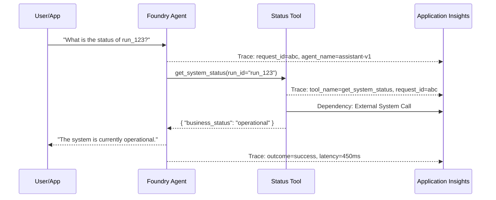

# Foundry Agent Evaluation and Observability

This reference solution demonstrates how to apply the agent-evaluation-observability standards to a concrete Foundry agent flow.

## Scenario

A business has deployed the `foundry-agent-with-tools` solution and needs to ensure that:
1. Every interaction is traced for technical debugging.
2. No sensitive data (prompts, secrets) leaks into technical logs.
3. The agent is regularly evaluated for quality and safety.

## Composition

This solution composes:
- `solutions/foundry-agent-with-tools`: The base agent and tool execution pattern.
- `building-blocks/observability/agent-evaluation-observability`: The tracing and evaluation standards.
- `building-blocks/observability/appinsights-observability`: The technical telemetry host.

## Telemetry Flow



## Redaction Policy Example

Before emitting technical traces, the application or tool boundary applies a redaction policy:

| Pattern | Action | Result |
|---------|--------|--------|
| `AccountKey=[^;]+` | Redact | `AccountKey=REDACTED` |
| `Bearer [^"]+` | Redact | `Bearer REDACTED` |
| `SubscriptionId=[^;]+` | Redact | `SubscriptionId=REDACTED` |
| Internal IP Addresses | Mask | `10.x.x.x` |

## Evaluation Implementation

Using the Azure AI Evaluation SDK, this solution implements a recurring evaluation run:

```python
from azure.ai.evaluation import evaluate, GroundednessEvaluator, SafetyEvaluator

# Define evaluators
groundedness = GroundednessEvaluator(model_config=...)
safety = SafetyEvaluator(model_config=...)

# Run evaluation on test dataset
result = evaluate(
    data="eval_dataset.jsonl",
    evaluators={
        "groundedness": groundedness,
        "safety": safety
    },
    output_path="./eval_results.json"
)

print(f"Evaluation Complete. Results: {result.metrics}")
```

## Security and Boundaries

- **Technical vs. Business**: Traces in Application Insights are for developers. Business outcomes are stored in the `Status Store`.
- **Anonymization**: All telemetry is associated with a `Run ID Alias` rather than internal user IDs or PII.

## Deployment / IaC Decision

**No-IaC: Prompt agent configuration via SDK/CLI.**

This solution focuses on the configuration of tracing and evaluation for existing Azure resources (Foundry Project, Application Insights). Deployment of these resources is covered by the underlying hosting building blocks.

## References

- [Azure AI Foundry Agent Service Tracing](https://learn.microsoft.com/azure/foundry/observability/how-to/trace-agent-setup)
- [Microsoft Learn: Evaluate Generative AI Applications](https://learn.microsoft.com/azure/ai-foundry/how-to/evaluate-generative-ai-app)
