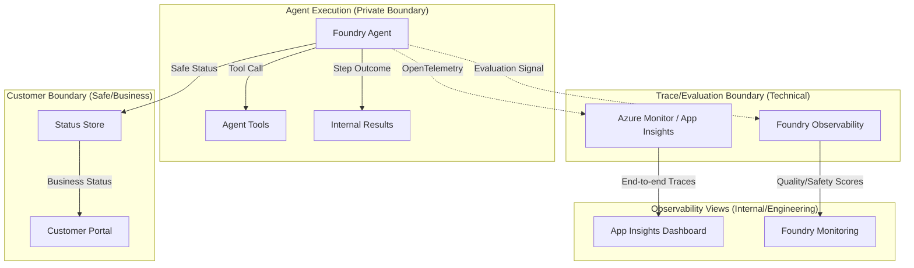

# Foundry Agent Evaluation and Observability

This reference solution demonstrates how to apply the [agent-evaluation-observability](../../building-blocks/observability/agent-evaluation-observability/README.md) building block to a concrete Azure AI Foundry agent flow.

## Purpose

Align agent tracing and evaluation with customer-safe boundaries. This solution ensures that engineering teams have the technical diagnostics needed to maintain the agent without exposing sensitive internals or customer data to unauthorized surfaces.

## Scenario

A business has deployed an agent (e.g., `foundry-agent-with-tools`) and needs to:
1. Capture end-to-end technical traces for debugging and performance tuning.
2. Maintain a strict **customer-safe boundary** where internal reasoning, raw prompts, and secrets are never logged.
3. Quantify agent quality and safety through recurring evaluation.

## Composition

This solution composes:
- `solutions/foundry-agent-with-tools`: The base agent and tool execution pattern.
- `building-blocks/observability/agent-evaluation-observability`: The tracing and evaluation standards.
- `building-blocks/observability/appinsights-observability`: The technical telemetry host.

## Telemetry and Security Boundary

Technical telemetry is strictly separated from customer-facing business status. Tracing focuses on the technical "how", while the Status Store focuses on the business "what".



## Trace and Evaluation Checklist

Technical telemetry in Application Insights should include these fields for diagnostics:

| Field | Description |
|-------|-------------|
| **Request ID** | Correlation ID used to link spans across services. |
| **Agent ID/Name** | Identifier for the specific agent version (e.g., `assistant-v1`). |
| **Agent Step Names** | Names of internal reasoning steps or state transitions. |
| **Tool Call Names** | The specific name of the tool called (e.g., `get_system_status`). |
| **Tool Outcome** | Technical success or failure of the tool call. |
| **Latency** | Duration of agent turns and individual tool executions. |
| **Safety Outcome** | High-level safety result from content filters. |
| **Sanitized Summary** | High-level diagnostic summary (no secrets). |

## Customer-Safe Logging Rules

### What MAY be traced
- **Correlation IDs**: `request_id`, `session_id`.
- **Business Status**: High-level states (e.g., `completed`, `failed`).
- **Timing/Latency**: Performance metrics.
- **Cost Estimate**: Aggregated token usage or cost figures.
- **Friendly Error Category**: Categorized failures (e.g., `upstream_timeout`).

### What MUST NOT be traced/logged
These fields must **never** enter technical telemetry or logs:
- **Secrets & Tokens**: API keys, SAS tokens, Bearer tokens.
- **Connection Strings**: Full URIs containing credentials.
- **Raw Prompts**: System instructions or model grounding text.
- **Raw Customer Documents**: Full text or binary content from processed files.
- **Raw Tool Payloads**: Unfiltered JSON request/response bodies.
- **Stack Traces**: Technical error details revealing code paths.
- **Platform Identifiers**: Real Tenant IDs, Subscription IDs, or Customer IDs.

## Minimal Evaluation Checklist

Every agent iteration must be evaluated against these pillars:

| Pillar | Check | Description |
|--------|-------|-------------|
| **Quality** | Task Completion | Did the agent complete the goal accurately? |
| **Tool-Boundary** | Tool-Call Correctness | Did it call the right tool with valid arguments? |
| **Groundedness** | Groundedness & Relevance | Is the answer based on the provided context? |
| **Safety** | Safety & Refusal Rate | Does it refuse harmful or out-of-scope prompts? |
| **Status Boundary** | Safe Status Wording | Is the status language friendly and non-technical? |

## Evaluation Implementation

Using the Azure AI Evaluation SDK, this solution implements a recurring evaluation run:

```python
from azure.ai.evaluation import evaluate, GroundednessEvaluator, SafetyEvaluator

# Define evaluators
groundedness = GroundednessEvaluator(model_config=...)
safety = SafetyEvaluator(model_config=...)

# Run evaluation on test dataset
result = evaluate(
    data="eval_dataset.jsonl",
    evaluators={
        "groundedness": groundedness,
        "safety": safety
    },
    output_path="./eval_results.json"
)

print(f"Evaluation Complete. Results: {result.metrics}")
```

## Redaction Policy Example

Before emitting traces, the application or tool boundary applies a redaction policy:

| Pattern | Action | Result |
|---------|--------|--------|
| `AccountKey=[^;]+` | Redact | `AccountKey=REDACTED` |
| `Bearer [^"]+` | Redact | `Bearer REDACTED` |
| `SubscriptionId=[^;]+` | Redact | `SubscriptionId=REDACTED` |
| Internal IP Addresses | Mask | `10.x.x.x` |

## Deployment / IaC Decision

**No-IaC: Guidance and SDK-based configuration.**

This solution defines patterns for configuring tracing and evaluation on existing Azure resources (Foundry Project, Application Insights). Infrastructure for these resources is managed by the base hosting building blocks. No new Azure resources are introduced here.

## References

- [Azure AI Foundry Agent Service Overview](https://learn.microsoft.com/en-us/azure/foundry/agents/overview)
- [Observability in Generative AI](https://learn.microsoft.com/en-us/azure/foundry/concepts/observability)
- [Application Insights OpenTelemetry Overview](https://learn.microsoft.com/en-us/azure/azure-monitor/app/app-insights-overview)
- [Foundry Trace Application Guidance](https://learn.microsoft.com/en-us/azure/foundry-classic/how-to/develop/trace-application)
- [Customer-Safe Status Boundary](../../security/customer-safe-status-boundary/README.md)
