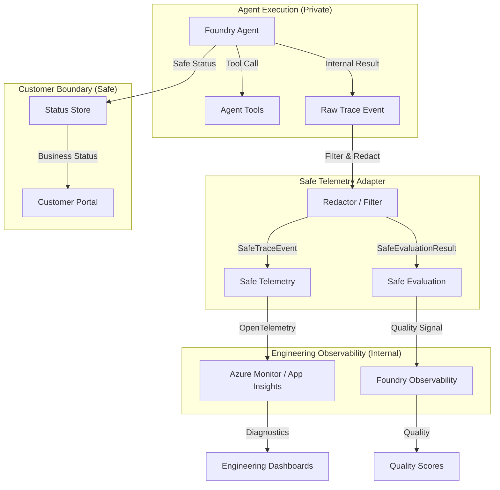

# Foundry Agent Evaluation and Observability

This reference solution demonstrates how to apply the [agent-evaluation-observability](../../building-blocks/observability/agent-evaluation-observability/README.md) building block to a concrete Azure AI Foundry agent flow. It focuses on maintaining a strict boundary between technical diagnostics and customer-facing status.

## Purpose

Align agent tracing and evaluation with customer-safe boundaries. This solution ensures that engineering teams have the technical diagnostics needed to maintain the agent without exposing sensitive internals, raw prompts, or customer data to unauthorized surfaces.

## Scenario

A business has deployed an agent (e.g., `foundry-devops-agent-basic`) and needs to:
1. Capture end-to-end technical traces for debugging and performance tuning.
2. Maintain a strict **customer-safe boundary** where internal reasoning, raw prompts, and secrets are never logged.
3. Quantify agent quality and safety through recurring evaluation.

## Composed Building Blocks

- `solutions/foundry-devops-agent-basic`: The base agent reference for DevOps status queries.
- `building-blocks/observability/agent-evaluation-observability`: The tracing and evaluation standards and redaction logic.

## Architecture

The following diagram illustrates the flow from agent execution to safe telemetry and evaluation, while keeping customer-facing status separate.



## Data Boundary

| Data Category | Engineering Telemetry (Internal) | Customer Portal (Safe) |
|---------------|----------------------------------|------------------------|
| **Core Identifiers** | Request ID, Agent Version | Request ID, Business ID |
| **Execution Path** | Redacted Tool Names, Step Durations | High-level Progress |
| **Input/Output** | **REDACTED** (No prompts/results) | Safe Business Status Only |
| **Error Details** | Friendly Error Categories | User-friendly Messages |
| **Metrics** | Latency, Cost, Token Count | Completion Status |

## Local Demo Flow

The solution includes a deterministic local demo that demonstrates how raw agent outcomes are transformed into safe telemetry and evaluation results.

### Prerequisites
- Python 3.10+
- Dependencies installed: `pip install -r requirements.txt` (including `pydantic`)

### Running the Demo
```bash
python3 src/demo.py
```

The demo will:
1. Simulate a raw agent turn with technical details and a "dirty" payload.
2. Apply the `TelemetryRedactor` to produce a `SafeTraceEvent`.
3. Generate a `SafeEvaluationResult` based on the outcome.
4. Demonstrate a "safe failure" path where an error is categorized without leaking the stack trace.

## Operations and Responsibility

### Sampling and Cost
- **Tracing**: Use adaptive sampling (e.g., 5-10%) in production to balance observability with storage costs.
- **Evaluation**: Run full evaluation on a representative subset of traffic or during CI/CD.

### Retention and Privacy
- **Retention**: Follow organizational policies (e.g., 30-90 days for technical traces).
- **Privacy**: The `TelemetryRedactor` is a primary defense, but developers must ensure no PII/PHI is intentionally added to allowlisted fields.

### Limitations and Scope
- **Non-Production**: This is a reference implementation. Production environments should use robust OpenTelemetry exporters.
- **Redaction**: Regex-based redaction is not exhaustive. Use it as one layer in a defense-in-depth strategy.
- **Static Evaluation**: The local demo uses static fixtures; real-world evaluation requires the Azure AI Evaluation SDK and live model access.

## Deployment / IaC Decision

**No-IaC: Guidance and SDK-based configuration.**

This solution defines patterns for configuring tracing and evaluation. Infrastructure for Application Insights or Foundry Projects is managed by their respective hosting building blocks. No new Azure resources are introduced in this reference.

## References
- [Azure AI Foundry Agent Service Overview](https://learn.microsoft.com/en-us/azure/foundry/agents/overview)
- [Trace applications with Foundry](https://learn.microsoft.com/en-us/azure/foundry/how-to/develop/trace-application)
- [Evaluate generative AI applications](https://learn.microsoft.com/en-us/azure/ai-foundry/concepts/evaluation-approach-gen-ai)
