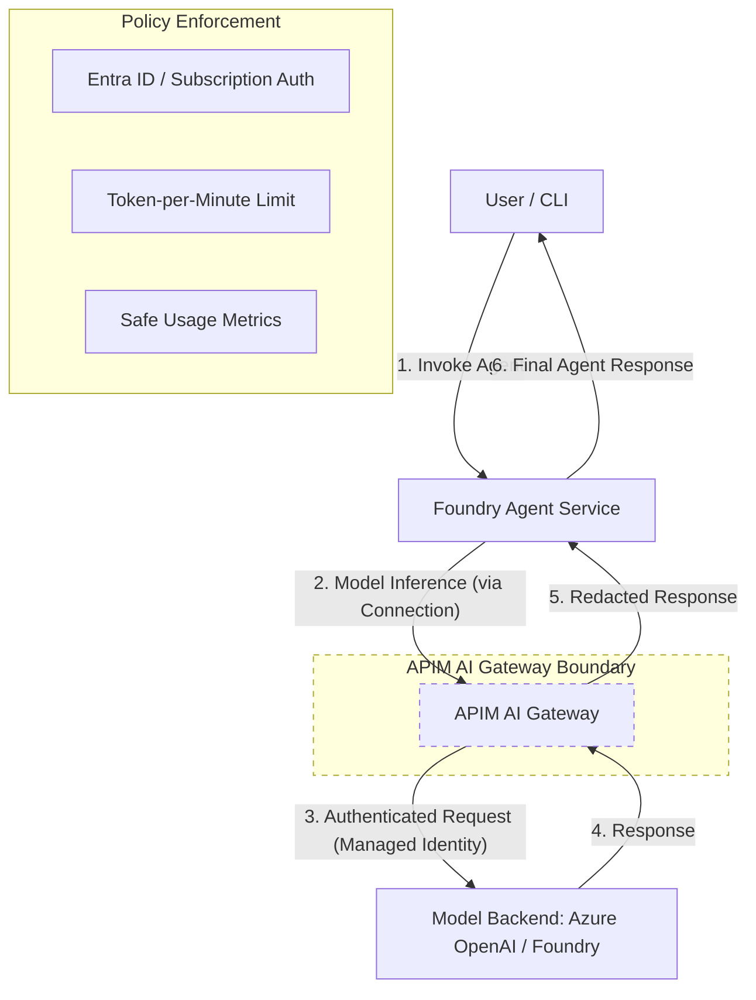

# Foundry Agent with APIM AI Gateway

This reference solution demonstrates how to route a Microsoft Foundry agent's model access through an **Azure API Management (APIM) AI Gateway**.

## Scenario

An organization wants to centralize governance, cost tracking, and security for generative AI models used by multiple agents. By using the AI Gateway, all model inference requests from the Foundry Agent Service are governed by APIM policies (e.g., token rate limiting, usage metrics) before reaching the model backend (e.g., Azure OpenAI).

## Architecture

The following diagram illustrates the supported topology:



**Key Boundaries:**
- **Client to Agent**: Direct interaction with the Foundry Agent Service (not through APIM).
- **Agent to Model**: Governed by APIM via a specific Foundry Connection.
- **Agent to Tools**: (Out of scope for this solution) Direct interaction between the Agent Service and its tools.

## Comparison: Direct vs. APIM-Governed

| Feature | Direct Foundry Access | APIM-Governed Access |
|---|---|---|
| **Use Case** | Local development, simple apps, single team. | Enterprise scale, multi-team, centralized governance. |
| **Governance** | Managed at the model level (TPM/Quota). | Enhanced governance (TPM per subscription, custom metrics). |
| **Security** | Direct backend access. | Redacted headers, centralized Entra ID/Subscription auth. |
| **Observability** | Standard Azure Monitor. | Detailed API-level metrics and safe token tracking. |
| **Complexity** | Minimal. | Higher (requires APIM setup and connection configuration). |

## Prerequisites

- Python 3.10+
- Azure CLI (`az login`)
- An existing Azure Resource Group.
- An existing Azure AI Foundry Hub and Project.
- An existing generative AI model deployment (e.g., GPT-4o-mini).

## Configuration

The runtime requires the following environment variables.

| Variable | Description | Example |
|----------|-------------|---------|
| `AZURE_AI_PROJECT_ENDPOINT` | The Foundry project discovery URL. | `https://<res-name>.ai.azure.com/api/projects/<proj-id>` |
| `AZURE_AI_AGENT_NAME` | The name of the agent to create or resolve. | `gw-prompt-agent` |
| `AZURE_AI_MODEL_NAME` | The deployment name of the model to use. | `gpt-4o-mini` |
| `AZURE_AI_GATEWAY_CONNECTION_NAME` | The name of the Foundry connection targeting APIM. | `ai-gateway-connection` |

## Infrastructure (Terraform)

The solution includes Terraform code to configure a **Foundry Connection** (`ApiManagement` category) targeting an **existing APIM AI Gateway**.

**IaC Design Decisions:**
- **Consumption Model**: This solution consumes an existing gateway contract instead of redeploying the gateway building block.
- **Least Privilege**: The APIM subscription is scoped to the specific model gateway API, and the Foundry connection is scoped to the project level with `isSharedToAll = false`.
- **Modern Provider**: The connection is configured using the `azapi` provider to support the `ApiManagement` category, ensuring all model traffic is routed through the APIM endpoint.

See [infra/terraform/README.md](./infra/terraform/README.md) for details.

## Local Run

1.  **Setup**:
    ```bash
    pip install -r requirements.txt
    ```
2.  **Execution**:
    ```bash
    export AZURE_AI_PROJECT_ENDPOINT="https://<res-name>.ai.azure.com/api/projects/<proj-id>"
    export AZURE_AI_AGENT_NAME="gw-prompt-agent"
    export AZURE_AI_MODEL_NAME="gpt-4o-mini"
    export AZURE_AI_GATEWAY_CONNECTION_NAME="ai-gateway-connection"

    PYTHONPATH=. python -m src.main "How can a gateway help me?"
    ```

## Security & Secrets

- **No Backend Keys**: The solution never uses or stores the model backend API keys. Direct model-backend endpoint access is not the default path.
- **Managed Identity**: APIM authenticates to the model backend using a User-Assigned Managed Identity.
- **APIM Subscription Key**: The Foundry connection uses an APIM subscription key. This key is treated as a secret in Terraform and is never printed or committed.
- **Redacted Responses**: APIM policies redact technical provider headers (e.g., `x-ms-region`, `x-ratelimit-*`) and provide safe error messages.

## Token Governance & Observability

- **Token Limits**: The gateway enforces TPM limits per subscription. If a limit is reached, the gateway returns a `429 Too Many Requests` response, which the agent handles with a customer-safe message.
- **Safe Observability**: The gateway emits status, latency, and throttling signals. It strictly excludes prompts, completions, token contents, credentials, and internal resource IDs from all telemetry.

## Known Limitations

- **Preview Features**: Azure AI Foundry Agent Service and certain APIM GenAI policies may be in preview.
- **Regional Availability**: Ensure all resources are deployed in supported regions.
- **Single Model**: This reference governs access to a single model deployment.

## References

- [Foundry Agent Service overview](https://learn.microsoft.com/en-us/azure/foundry/agents/overview)
- [APIM Generative AI gateway capabilities](https://learn.microsoft.com/azure/api-management/genai-gateway-capabilities)
- [Bring your own model to Foundry Agent Service](https://learn.microsoft.com/azure/foundry/agents/how-to/ai-gateway)
- [Enforce token limits with AI Gateway](https://learn.microsoft.com/azure/ai-foundry/configuration/enable-ai-api-management-gateway-portal)
