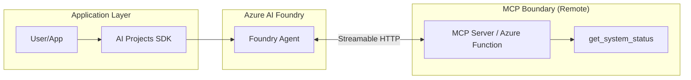

# Foundry Agent with MCP

This reference solution demonstrates how to connect an Azure AI Foundry agent to a Model Context Protocol (MCP) server for secure, composable tool integration.

## Scenario

A company wants to build a "System Status Assistant" that can be used across multiple different AI platforms (Azure AI Foundry, local developer CLI, etc.). They choose **MCP** as the tool integration layer to ensure that the tool logic is written once and can be consumed by any MCP-compatible agent.

This example composes a Foundry Prompt Agent with an MCP server based on the `fastmcp-basic-server` pattern.

## Architecture



## MCP vs. Other Tooling Patterns

| Feature | Direct Function Calling | OpenAPI / REST | MCP |
| :--- | :--- | :--- | :--- |
| **Discovery** | Manual schema in code | OpenAPI Spec (JSON/YAML) | Protocol-level introspection |
| **Portability** | Low (code-dependent) | High (platform-agnostic) | AI-native standard (High) |
| **Auth** | App-managed | Standard Web Auth | Standardized & Managed |
| **Composability**| Hard to share tools | Shared via APIs | Native "Catalog" model |
| **Best For** | Local app logic | Existing web services | Reusable tool ecosystems |

### Why choose MCP for this solution?
MCP is chosen here because it provides a standardized way for the agent to discover and invoke tools without the developer having to manually maintain complex JSON schemas in the agent definition. It also allows the same "System Status" tools to be reused by other agents or client-side tools that support the MCP protocol.

## Security and Customer Safety

- **Redaction Layer**: The MCP server acts as a security boundary, filtering out raw technical data (logs, stack traces, internal IDs) and returning only "customer-safe" business status.
- **Approval Workflow**: This reference uses `require_approval="always"` for the MCP tool. The application hosting the SDK is responsible for reviewing the tool call request before allowing it to proceed.
- **Read-Only**: To minimize risk, the tools exposed in this reference are strictly read-only.
- **Identity-First**: Managed Identity is the preferred authentication method for the Foundry Agent to communicate with the MCP server.

## Local Validation

1. **Prerequisites**:
   - Python 3.10+
   - `pip install azure-ai-projects azure-identity`
   - A running MCP server (see `building-blocks/mcp/fastmcp-basic-server/` for a local example).

2. **Python Snippet (MCP Tool Pattern)**:
   This snippet shows how to define the agent with an `MCPTool` and handle the response flow.

   ```python
   import os
   from azure.identity import DefaultAzureCredential
   from azure.ai.projects import AIProjectClient
   from azure.ai.projects.models import PromptAgentDefinition, MCPTool
   from src.agent_definition import SYSTEM_INSTRUCTIONS

   # Initialize project client
   project = AIProjectClient(
       endpoint=os.environ["AZURE_AI_PROJECT_ENDPOINT"],
       credential=DefaultAzureCredential(),
   )

   # Define the MCP Tool
   mcp_tool = MCPTool(
       server_label="system-status-server",
       server_url="https://your-mcp-server.com/mcp",
       require_approval="always",
       allowed_tools=["get_system_status"]
   )

   # Create the agent
   agent = project.agents.create_version(
       agent_name="mcp-status-assistant",
       definition=PromptAgentDefinition(
           model="gpt-4o",
           instructions=SYSTEM_INSTRUCTIONS,
           tools=[mcp_tool],
       ),
   )

   # Invoke the agent (simplified flow)
   openai = project.get_openai_client()
   response = openai.responses.create(
       input="Is the system healthy?",
       extra_body={"agent_reference": {"name": agent.name, "type": "agent_reference"}}
   )

   # Note: For MCP tools with require_approval="always", you must handle
   # the 'mcp_approval_request' in the output items and submit an approval.
   print(f"Agent Response: {response.output_text}")
   ```

## Complexity / Minimalism Notes

- **Reused existing pattern**: Yes (MCP tool integration as supported by Foundry).
- **New abstraction added**: No.
- **Complexity risk**: Low.
- **Follow-up needed**: No.

## Deployment / IaC Decision

**Status: No-IaC (Reference Pattern)**

This solution demonstrates the integration pattern between Foundry Agents and MCP servers. The infrastructure for hosting the MCP server itself is covered in `building-blocks/mcp/azure-functions-mcp-endpoint/`. The Foundry Agent is managed via SDK/CLI as part of application configuration.

## References

- [Microsoft Learn: Connect agents to MCP servers](https://learn.microsoft.com/en-us/azure/foundry/agents/how-to/tools/model-context-protocol)
- [Microsoft Learn: Foundry Agent Service Overview](https://learn.microsoft.com/en-us/azure/foundry/agents/overview)
- [Model Context Protocol Specification](https://modelcontextprotocol.io/specification)
