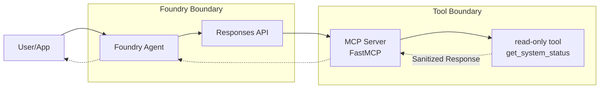

# Foundry Agent with MCP

This reference solution demonstrates how to connect an Azure AI Foundry agent to an external [Model Context Protocol (MCP)](https://modelcontextprotocol.io/) server for standardized, modular tool access.

## Scenario

A business needs to provide its AI agents with access to specialized tools or data sources that are already exposed via MCP. By using MCP, the business can maintain a clean separation between the agent's reasoning logic and the technical implementation of the tools, while reusing the same tools across different agent platforms.

## Architecture



## When to use MCP vs. Other Tool Patterns

| Pattern | Best For | Trade-offs |
|---------|----------|------------|
| **MCP** | Standardized, reusable tool ecosystems. Separating tool hosting from agent logic. | Requires an MCP-compatible host or bridge. |
| **OpenAPI** | Connecting to existing REST APIs with standard specifications. | Requires well-defined Swagger/OpenAPI docs. |
| **Azure Functions** | Enterprise integration, long-running tasks, and custom dependencies. | More infrastructure to manage if not using managed MCP. |
| **Direct Function Calling** | Simple, local, or internal Python functions within the same application. | Harder to reuse across different agent frameworks or languages. |

### Why MCP?
- **Interoperability**: MCP provides a **USB-C like** interface for your tools, allowing you to "plug in" new capabilities to any MCP-capable agent (Foundry, Claude, ChatGPT) without changing the core agent code.
- **Developer Velocity**: Frameworks like [FastMCP](https://github.com/jlowin/fastmcp) make it extremely fast to wrap Python functions into a protocol-compliant server.
- **Decoupling**: Tool updates and scaling can be managed independently from the AI agent's lifecycle.

## Composed Blocks

- `building-blocks/mcp/fastmcp-basic-server`: Provides the minimal MCP server reference.

## Design Decisions

### Remote MCP Server
This reference assumes a **Remote MCP Server** pattern. Azure AI Foundry connects to MCP servers hosted on Azure Functions or other reachable HTTPS endpoints via the `/runtime/webhooks/mcp` endpoint.

### Authentication and Security
- **Least Privilege**: The MCP server should only expose the specific tools needed for the task.
- **Managed Identity**: Use Microsoft Entra ID (System-assigned or User-assigned Managed Identity) for authenticating the agent to the MCP server.
- **No Secrets**: Do not pass API keys or tokens in cleartext. Use Foundry Project Connections to manage credentials securely.
- **Read-Only Boundary**: The example tool (`get_system_status`) is side-effect free and returns only sanitized business-level status. Raw logs or technical internals are never exposed to the model.

## Entrypoints

- **SDK Invocation**: The agent is invoked using the `AIProjectClient` and the unified Responses API.

## Customer-facing Outcome

The agent can answer questions about the system's operational health by calling the `get_system_status` tool on the MCP server, providing a consistent and secure user experience without exposing underlying technical complexity.

## Local Validation

1. **Prerequisites**:
   - Python 3.10+
   - `pip install azure-ai-projects azure-identity`
   - A running MCP server (see `building-blocks/mcp/fastmcp-basic-server`).
   - An Azure AI Foundry project.

2. **Python Snippet**:

   ```python
   import os
   from azure.identity import DefaultAzureCredential
   from azure.ai.projects import AIProjectClient
   from azure.ai.projects.models import PromptAgentDefinition, MCPTool

   # Initialize project client
   project = AIProjectClient(
       endpoint=os.environ["AZURE_AI_PROJECT_ENDPOINT"],
       credential=DefaultAzureCredential(),
   )

   # Define the MCP tool
   # The server_url should point to your hosted MCP endpoint (e.g. on Azure Functions)
   mcp_tool = MCPTool(
       server_label="system-monitor",
       server_url="https://<your-mcp-host>/runtime/webhooks/mcp",
       require_approval="always"
   )

   # Create the agent with the MCP tool
   agent = project.agents.create_version(
       agent_name="mcp-assistant",
       definition=PromptAgentDefinition(
           model="gpt-4o-mini",
           instructions="You are a helpful monitor assistant. Use the available tools to check system status.",
           tools=[mcp_tool],
       ),
   )

   # Invoke the agent using the Responses API
   openai = project.get_openai_client()
   response = openai.responses.create(
       input="What is the current system status?",
       extra_body={"agent_reference": {"name": agent.name, "type": "agent_reference"}}
   )

   print(f"Agent Response: {response.output_text}")
   ```

## Deployment Assumptions

- The MCP server is hosted on a reachable endpoint (e.g., Azure Functions Flex Consumption).
- The Foundry project has the necessary networking (VNet/Private Link) to reach the MCP server endpoint if it is not public.
- Authentication is configured in the Foundry portal using Project Connections or Managed Identity.

## References

- [Microsoft Learn: Foundry Agent Tool Catalog](https://learn.microsoft.com/en-us/azure/foundry/agents/concepts/tool-catalog)
- [Microsoft Learn: Connect to MCP servers](https://learn.microsoft.com/en-us/azure/foundry/agents/how-to/tools/model-context-protocol)
- [Model Context Protocol (MCP) Official Site](https://modelcontextprotocol.io/)
- [FastMCP GitHub Repository](https://github.com/jlowin/fastmcp)
