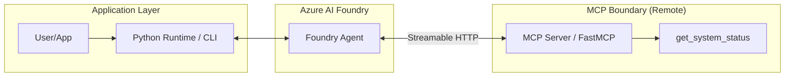

# Foundry Agent with MCP

This reference solution demonstrates how to connect an Azure AI Foundry agent to a Model Context Protocol (MCP) server for secure, composable tool integration.

## Scenario

A company wants to build a "System Status Assistant" that can be used across multiple different AI platforms (Azure AI Foundry, local developer CLI, etc.). They choose **MCP** as the tool integration layer to ensure that the tool logic is written once and can be consumed by any MCP-compatible agent.

This example composes a Foundry Prompt Agent with an MCP server based on the `fastmcp-basic-server` building block.

## Architecture



## Security and Customer Safety Boundary

- **Redaction Layer**: The `FoundryAgentAdapter` acts as a security boundary, filtering out raw technical data (logs, stack traces, internal IDs) and returning only "customer-safe" business status.
- **Approval Workflow**: This implementation uses `require_approval="always"` for the MCP tool. The runtime explicitly handles the `mcp_approval_request` items and validates the tool name and server label against an allowlist before approving.
- **Explicit Allowlist**: Only tools explicitly listed in `ALLOWED_TOOL_NAMES` are approved by the runtime. Unknown or unauthorized tools are denied.
- **Sanitized Errors**: No raw exceptions, Azure resource identifiers, or provider payloads are returned to the user or logged.

## Local Validation

### Prerequisites
- Python 3.10+
- Azure AI Foundry project with a model deployment (e.g., `gpt-4o`).
- A running MCP server (see `building-blocks/mcp/fastmcp-basic-server/`).

### Configuration
Set the following environment variables:

```bash
export AZURE_AI_PROJECT_ENDPOINT="https://<resource>.ai.azure.com/api/projects/<project-id>"
export AZURE_AI_AGENT_NAME="mcp-status-assistant"
export AZURE_AI_MODEL_NAME="gpt-4o"
export MCP_SERVER_URL="https://your-mcp-server.com/mcp"
export MCP_SERVER_LABEL="system-status-server"
export ALLOWED_TOOL_NAMES="get_system_status"
```

### Run Commands

1. **Install Dependencies**:
   ```bash
   pip install -r solutions/foundry-agent-with-mcp/requirements.txt
   ```

2. **Run CLI**:
   ```bash
   PYTHONPATH=. python3 -m solutions.foundry-agent-with-mcp.src.main "Is the system healthy?"
   ```

3. **Run Tests**:
   ```bash
   PYTHONPATH=solutions/foundry-agent-with-mcp pytest solutions/foundry-agent-with-mcp/tests
   ```

## Authorization and Identity
This solution uses `DefaultAzureCredential` for all Azure service interactions.

### Least-Privilege Guidance
To follow Microsoft security best practices, grant the executing identity the **Foundry User** role (Role ID: `53ca6127-db72-4b80-b1b0-d745d6d5456d`) at the **Foundry Project** scope. This provides the necessary data plane permissions to interact with the agent and models without granting broad management access.

**Forbidden Practices:**
- Do not use broad Azure roles such as **Owner** or **Contributor** for the runtime identity.
- Avoid assigning roles at the subscription or resource group level if a project-level scope is sufficient.
- Never use wildcard permissions (`*`) or service-level contributor roles for application identities.

For more information, see [Role-based access control for Microsoft Foundry](https://learn.microsoft.com/en-us/azure/foundry/concepts/rbac-foundry).

## Known Limits and Trade-offs
- **Synchronous Timeout**: MCP tool calls are subject to a 100-second timeout in this implementation.
- **No-IaC**: This solution manages the agent via the SDK as part of application configuration and assumes an existing Foundry project and externally hosted MCP endpoint.

## Complexity / Minimalism Notes
- **Reused existing pattern**: Yes (Follows the documented Foundry MCP tool pattern).
- **New abstraction added**: No.
- **Complexity risk**: Low.
- **Follow-up needed**: No.

## Deployment / IaC Decision
**Status: No-IaC (Reference Pattern)**

This solution focuses on the runtime integration between a Foundry Agent and an MCP server. The infrastructure for hosting MCP servers is covered in separate building blocks. The agent itself is resolved or created dynamically via the SDK.
