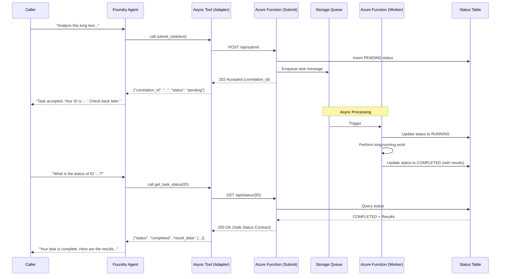

# Foundry Agent with Asynchronous Queue Tool

This solution demonstrates how to compose an Azure AI Foundry agent with a long-running, asynchronous tool using Azure Functions and Storage Queues.

## Scenario

A user asks the agent to perform a task that takes significant time (e.g., text analysis, batch processing). Instead of blocking the agent's response, the agent uses a `submit_task` tool to enqueue the work. The tool returns a correlation ID, which the agent provides to the user. The user can then check the status of their task later using the `get_task_status` tool.

## Architecture

The following Mermaid diagram illustrates the flow:



## Security & Customer-Safe Boundary

- **No Technical Leaks**: The agent and the user only see business-level status and results. Raw logs, stack traces, and internal Azure resource identifiers are never exposed.
- **Controlled Surface**: The tools only expose `submit_task` and `get_task_status`.
- **Identity-Based**: The solution uses Managed Identity for secure access between the Function and Storage.

## Configuration

The following environment variables are used:

| Variable | Description | Default |
|----------|-------------|---------|
| `AZURE_AI_PROJECT_ENDPOINT` | The endpoint for the AI Foundry Project. | |
| `AZURE_AI_MODEL_NAME` | The model deployment name (e.g., gpt-4o). | `gpt-4o` |
| `ASYNC_TOOL_SUBMIT_URL` | The URL for the task submission endpoint. | `http://localhost:7071/api/submit` |
| `ASYNC_TOOL_STATUS_URL_TEMPLATE` | Template for the status lookup URL. | `http://localhost:7071/api/status/{correlation_id}` |

## Local Validation

1.  **Start the Function App**: Run the `agent-tool-queue-function` locally using Azure Functions Core Tools.
2.  **Run Tests**:
    ```bash
    cd solutions/foundry-agent-with-queue-tool
    python3 -m pytest tests
    ```
3.  **Mock SDK**: The solution includes a `mock_sdk.py` to prove the agent interaction logic without requiring a live AI Foundry project.

## Deployment

Infrastructure is defined in `infra/terraform/`. It composes the necessary Azure resources and sets up the required RBAC roles.
