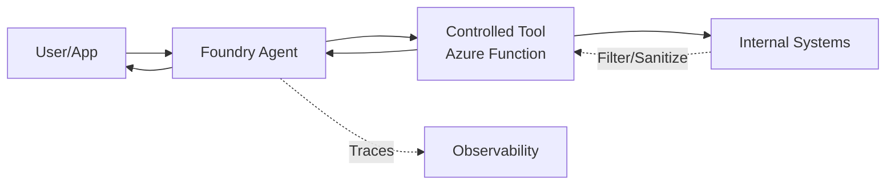

# Foundry Agent with Tools

This reference solution demonstrates how to connect an Azure AI Foundry agent to a controlled, safe tool boundary using an Azure Function.

## Scenario

A business needs an AI assistant that can answer questions about system status without having direct access to technical logs, secrets, or raw infrastructure APIs. The agent uses a "Status Tool" that acts as a sanitized gateway to the underlying environment.

## Architecture



## Design Decisions

### Tool Boundary vs. Direct Access
Instead of giving the agent broad permissions (RBAC) to read Azure resource logs or metrics directly, we expose a specific HTTP endpoint (Azure Function).
- **Safety**: The function code determines exactly what data is returned.
- **Sanitization**: Raw error messages, stack traces, and internal IDs are stripped before reaching the agent.
- **Read-Only**: The tool is designed to be side-effect free, preventing the agent from accidentally changing system state.

### HTTP vs. Queue-based Tools
For this reference, we use an **HTTP-triggered Azure Function**.
- **Synchronous**: Best for quick status checks or data retrieval.
- **Protocol**: Integrated via an OpenAPI specification or as a custom function call in the agent runtime.

## Tool Contract: `system_status`

The agent is trained to call the `get_system_status` tool when asked about the health or state of the environment.

**Request Schema:**
- `None` (Simple GET request)

**Response Schema (`system-status.schema.json`):**
```json
{
  "business_status": "operational",
  "service_health": "Healthy",
  "active_regions": ["eastus", "westus2"],
  "last_updated": "2026-07-03T10:00:00Z",
  "environment": "production"
}
```

## Local Validation

1. **Prerequisites**:
   - `pip install azure-ai-projects azure-identity jsonschema pytest`
   - Access to an Azure AI Foundry project.

2. **Python Snippet (OpenAPI Pattern)**:
   This snippet demonstrates how to define an agent with an OpenAPI tool pointing to the sanitized function.

   ```python
   import os
   from azure.identity import DefaultAzureCredential
   from azure.ai.projects import AIProjectClient
   from azure.ai.projects.models import (
       PromptAgentDefinition,
       OpenApiTool,
       OpenApiFunctionDefinition,
       OpenApiAnonymousAuthDetails
   )

   # Initialize project client
   project = AIProjectClient(
       endpoint=os.environ["AZURE_AI_PROJECT_ENDPOINT"],
       credential=DefaultAzureCredential(),
   )

   # Define the tool using an OpenAPI spec (URL or local string)
   # The spec describes the /api/system_status endpoint
   status_tool = OpenApiTool(
       openapi=OpenApiFunctionDefinition(
           name="get_system_status",
           spec="https://<your-func-app>.azurewebsites.net/api/swagger.json",
           description="Get the current business status and health of the system.",
           auth=OpenApiAnonymousAuthDetails(),
       )
   )

   # Create the agent with the tool
   agent = project.agents.create_version(
       agent_name="status-assistant",
       definition=PromptAgentDefinition(
           model="gpt-4o-mini",
           instructions="You are a status assistant. Use the get_system_status tool to answer health questions.",
           tools=[status_tool],
       ),
   )

   # Invoke
   openai = project.get_openai_client()
   response = openai.responses.create(
       input="How is the system doing today?",
       extra_body={"agent_reference": {"name": agent.name, "type": "agent_reference"}}
   )

   print(f"Agent: {response.output_text}")
   ```

## Security and Boundaries

- **Minimal Scope**: The agent's identity only needs permission to invoke the Function App, not the underlying resources.
- **No Secrets**: Authentication to the function should use Function Keys (stored in Foundry connections) or Microsoft Entra ID.
- **Observability**: Every tool call is traced in Azure AI Foundry, allowing for auditing of the data exchanged between the agent and the tool.

## References

- [Microsoft Learn: Foundry Agent Tool Catalog](https://learn.microsoft.com/en-us/azure/foundry/agents/concepts/tool-catalog)
- [Microsoft Learn: Connect agents to OpenAPI tools](https://learn.microsoft.com/en-us/azure/foundry/agents/how-to/tools/openapi)
- [Microsoft Learn: Azure Functions as Foundry tools](https://learn.microsoft.com/en-us/azure/foundry/agents/how-to/tools/azure-functions)
