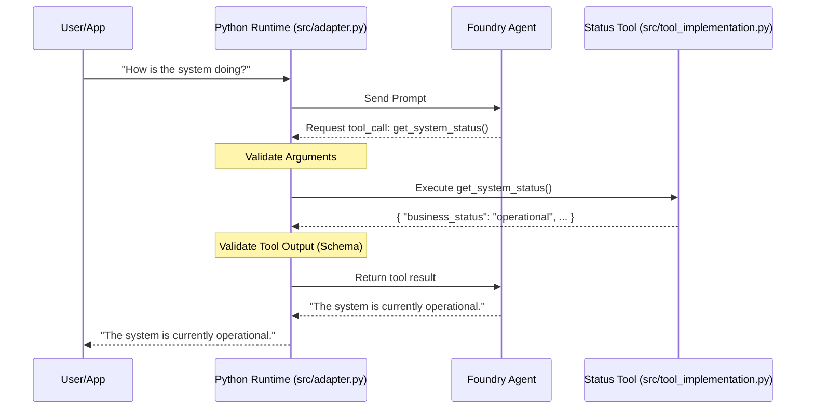

# Foundry Agent with Tools

This reference solution demonstrates how to connect an Azure AI Foundry agent to a controlled, safe tool boundary.

## Scenario

A business needs an AI assistant that can answer questions about system status without having direct access to technical logs, secrets, or raw infrastructure APIs. The agent uses a "Status Tool" that acts as a sanitized gateway to the underlying environment.

This example implements a Foundry Prompt Agent that can invoke one explicit read-only tool contract safely.

## Architecture



## Design Decisions

### Tool Boundary vs. Direct Access
Instead of giving the agent broad permissions (RBAC) to read Azure resource logs or metrics directly, we expose a specific tool logic.
- **Safety**: The implementation determines exactly what data is returned.
- **Sanitization**: Raw error messages, stack traces, and internal IDs are stripped before reaching the agent.
- **Read-Only**: The tool is designed to be side-effect free.

### Function Calling Pattern
For this reference, we use the **Function Tool** pattern (client-side execution).
- **Control**: The application hosting the agent has full control over how the tool is invoked and how the result is returned to the agent.
- **Consistency**: Matches the pattern used in the Azure AI Projects SDK.
- **Minimalism**: Does not require an OpenAPI specification or a complex MCP setup for a single simple tool.

## Tool Contract: `get_system_status`

The agent is trained to call the `get_system_status` tool when asked about the health or state of the environment.

**Request Schema:**
- `None` (Simple call with no parameters)

**Response Schema (`system-status.schema.json`):**
```json
{
  "business_status": "operational",
  "service_health": "Healthy",
  "active_regions": ["eastus", "westus2"],
  "last_updated": "2026-07-03T10:00:00Z",
  "environment": "production"
}
```

## Local Run Instructions

1. **Prerequisites**:
   - Python 3.10+
   - Access to an Azure AI Foundry project.

2. **Configuration**:
   Set the following environment variables:
   ```bash
   export AZURE_AI_PROJECT_ENDPOINT="https://<resource>.ai.azure.com/api/projects/<project-id>"
   export AZURE_AI_AGENT_NAME="status-assistant"
   export AZURE_AI_MODEL_NAME="gpt-4o-mini"
   ```

3. **Install Dependencies**:
   ```bash
   pip install -r requirements.txt
   ```

4. **Run the Agent**:
   ```bash
   python -m src.main "How is the system doing today?"
   ```

## Validation Commands

```bash
python --version
ruff check .
ruff format --check .
PYTHONPATH=. pytest tests/
```

## Security and Boundaries

- **Minimal Scope**: The agent's instructions explicitly forbid revealing internal technical details.
- **Data Redaction**: The runtime logic performs redaction and sanitization of any errors.
- **Deterministic Validation**: Tool inputs and outputs are validated against JSON schemas before being passed to/from the agent.
- **No Secrets**: Uses `DefaultAzureCredential` for all Azure interactions.

## Known Limits

- The tool implementation currently uses mock data for demonstration purposes.
- The runtime handles a maximum of 5 tool call iterations to prevent infinite loops.

## Complexity / Minimalism Notes

- **Reused existing pattern**: Yes (adapted from `foundry-agent-basic`).
- **New abstraction added**: No.
- **Complexity risk**: Low.
- **Follow-up needed**: No.

## Deployment / IaC Decision

This solution is **no-IaC**. It consumes existing Foundry project resources. No new Azure resources are introduced in this implementation.

## References

- [Microsoft Learn: Foundry Agent Service Overview](https://learn.microsoft.com/en-us/azure/foundry/agents/overview)
- [Microsoft Learn: Foundry Agent Tool Catalog](https://learn.microsoft.com/en-us/azure/foundry/agents/concepts/tool-catalog)
- [Microsoft Learn: Use function calling with Foundry agents](https://learn.microsoft.com/en-us/azure/ai-foundry/agents/how-to/tools/function-calling)
- [Azure AI Projects SDK for Python](https://learn.microsoft.com/en-us/python/api/overview/azure/ai-projects-readme)
