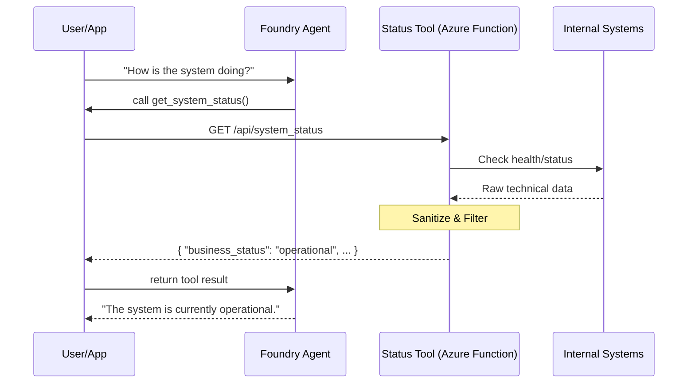

# Foundry Agent with Tools

This reference solution demonstrates how to connect an Azure AI Foundry agent to a controlled, safe tool boundary using an Azure Function.

## Scenario

A business needs an AI assistant that can answer questions about system status without having direct access to technical logs, secrets, or raw infrastructure APIs. The agent uses a "Status Tool" that acts as a sanitized gateway to the underlying environment.

This example composes a Foundry Prompt Agent with the `agent-tool-http-function` building block.

## Architecture



## Design Decisions

### Tool Boundary vs. Direct Access
Instead of giving the agent broad permissions (RBAC) to read Azure resource logs or metrics directly, we expose a specific HTTP endpoint (Azure Function).
- **Safety**: The function code determines exactly what data is returned.
- **Sanitization**: Raw error messages, stack traces, and internal IDs are stripped before reaching the agent.
- **Read-Only**: The tool is designed to be side-effect free, preventing the agent from accidentally changing system state.

### Function Calling Pattern
For this reference, we use the **Function Tool** pattern (client-side execution).
- **Control**: The application hosting the agent has full control over how the tool is invoked and how the result is returned to the agent.
- **Consistency**: Matches the pattern used in `pipeline-assistant-foundry`.
- **Minimalism**: Does not require an OpenAPI specification or a complex MCP setup for a single simple tool.

## Tool Contract: `get_system_status`

The agent is trained to call the `get_system_status` tool when asked about the health or state of the environment.

**Request Schema:**
- `None` (Simple call with no parameters)

**Response Schema (`system-status.schema.json`):**
```json
{
  "business_status": "operational",
  "service_health": "Healthy",
  "active_regions": ["eastus", "westus2"],
  "last_updated": "2026-07-03T10:00:00Z",
  "environment": "production"
}
```

## Local Validation

1. **Prerequisites**:
   - Python 3.10+
   - `pip install azure-ai-projects azure-identity jsonschema pytest`
   - Access to an Azure AI Foundry project.

2. **Python Snippet (Function Tool Pattern)**:
   This snippet demonstrates how to define an agent with a function tool and handle the call.

   ```python
   import os
   from azure.identity import DefaultAzureCredential
   from azure.ai.projects import AIProjectClient
   from azure.ai.projects.models import PromptAgentDefinition
   from src.agent_definition import SYSTEM_INSTRUCTIONS, get_tool_definitions

   # Initialize project client
   project = AIProjectClient(
       endpoint=os.environ["AZURE_AI_PROJECT_ENDPOINT"],
       credential=DefaultAzureCredential(),
   )

   # Create the agent with function tool definitions
   agent = project.agents.create_version(
       agent_name="status-assistant",
       definition=PromptAgentDefinition(
           model="gpt-4o-mini",
           instructions=SYSTEM_INSTRUCTIONS,
           tools=get_tool_definitions(),
       ),
   )

   # Invoke (simplified flow)
   openai = project.get_openai_client()
   response = openai.responses.create(
       input="How is the system doing today?",
       extra_body={"agent_reference": {"name": agent.name, "type": "agent_reference"}}
   )

   # Note: In a real app, you would handle tool_calls here if the agent requests them.
   print(f"Agent Response: {response.output_text}")
   ```

## Security and Boundaries

- **Minimal Scope**: The agent's instructions (System Prompt) explicitly forbid revealing internal technical details.
- **Data Redaction**: The `agent-tool-http-function` performs the primary redaction.
- **Observability**: Every tool call is traced in Azure AI Foundry, allowing for auditing of the data exchanged between the agent and the tool.

## Complexity / Minimalism Notes

- **Reused existing pattern**: Yes (`FunctionTool` pattern from `pipeline-assistant-foundry`).
- **New abstraction added**: No.
- **Complexity risk**: Low.
- **Follow-up needed**: No.

## Deployment / IaC Decision

No new Terraform is added in this solution. It composes existing building blocks:
- `building-blocks/functions/agent-tool-http-function` (contains its own Terraform).
- The Foundry Agent itself is typically managed via SDK/CLI as part of an application deployment or project configuration.

## References

- [Microsoft Learn: Foundry Agent Service Overview](https://learn.microsoft.com/en-us/azure/foundry/agents/overview)
- [Microsoft Learn: Foundry Agent Tool Catalog](https://learn.microsoft.com/en-us/azure/foundry/agents/concepts/tool-catalog)
- [Microsoft Learn: Use function calling with Foundry agents](https://learn.microsoft.com/en-us/azure/foundry/agents/how-to/tools/function-calling)
