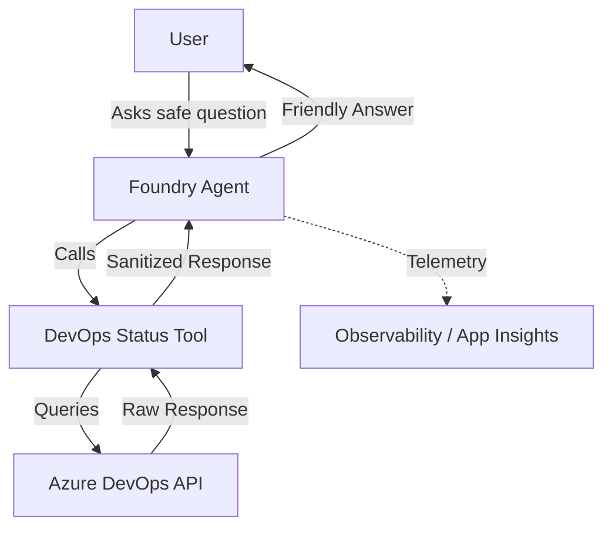

# Foundry DevOps Status Agent Reference

## Scenario

A senior Azure AI Foundry engineer and Python developer needs to implement a bounded reference solution for a Foundry agent. This agent answers safe questions about Azure DevOps pipeline and build status through a controlled, read-only tool boundary.

The agent helps developers and managers get quick status updates without needing to navigate the Azure DevOps UI for every question, while ensuring no sensitive data or mutation capabilities are exposed.

## Composed blocks

- [Pipeline Assistant Foundry](../../building-blocks/agents/pipeline-assistant-foundry/README.md): Foundry agent reference for customer questions about a pipeline execution.
- [DevOps MCP Tool Contract](../../building-blocks/mcp/devops-mcp-tool-contract/README.md): Safe read-only DevOps status tool contracts for AI agents.

## Architecture

## Entrypoints

- **SDK Invocation**: The agent is designed to be invoked using the `AIProjectClient` from the `azure-ai-projects` SDK.

## Customer-facing outcome

- Users can ask natural language questions about pipeline health and get accurate, grounded answers.
- Friendly business-level summaries of successes or failures are provided.
- Direct links to the Azure DevOps portal are included for further investigation.

### Example Safe Questions
- "What is the status of the latest build for the 'Main CI' pipeline?"
- "Did the deployment to production succeed on the 'release/1.2' branch?"
- "List the last 5 runs for the 'Unit Tests' pipeline."
- "Why did the most recent build fail?" (Agent answers using sanitized summary).

## Security and Tool Boundary

To ensure a safe integration, the following boundaries are strictly enforced:

### Sanitized Status Fields (Safe)
- **Status**: `inProgress`, `completed`, `queued`.
- **Result**: `succeeded`, `failed`, `canceled`, `partiallySucceeded`.
- **Metadata**: Pipeline name, branch name, commit short SHA (e.g., `a1b2c3d`).
- **Timing**: Start time, end time, duration.
- **Summaries**: Friendly business-level summaries (e.g., "Step 'Build' failed on agent 'Linux-01'.").
- **Links**: Sanitized URLs to the Azure DevOps portal.

### Forbidden (Boundary)
- **No Mutations**: The agent cannot trigger, cancel, or modify any pipelines or builds.
- **No Secrets**: No access to Azure DevOps variables marked as secret, PATs, or other credentials.
- **No Raw Logs**: Technical logs and full stack traces are withheld to prevent technical internal exposure.
- **No Broad Access**: Access is scoped to specific projects; the agent cannot perform unbounded organization discovery.
- **No Arbitrary API Passthrough**: All DevOps interactions must follow the predefined tool contract.

## Deployment assumptions

- **Azure AI Foundry**: A project is provisioned with a supported model (e.g., `gpt-4o`).
- **Managed Identity**: The agent uses a Managed Identity with scoped permissions to the DevOps status tool.
- **Tool Hosting**: The DevOps status tool is hosted as a remote MCP server or an Azure Function following the `devops-mcp-tool-contract`.

## References

- [Microsoft Foundry Agent Service Overview](https://learn.microsoft.com/en-us/azure/foundry/agents/overview)
- [Foundry Agent Tool Catalog](https://learn.microsoft.com/en-us/azure/foundry/agents/concepts/tool-catalog)
- [Azure DevOps REST API Reference](https://learn.microsoft.com/en-us/rest/api/azure/devops/)
- [Azure Pipelines Documentation](https://learn.microsoft.com/en-us/azure/devops/pipelines/)
