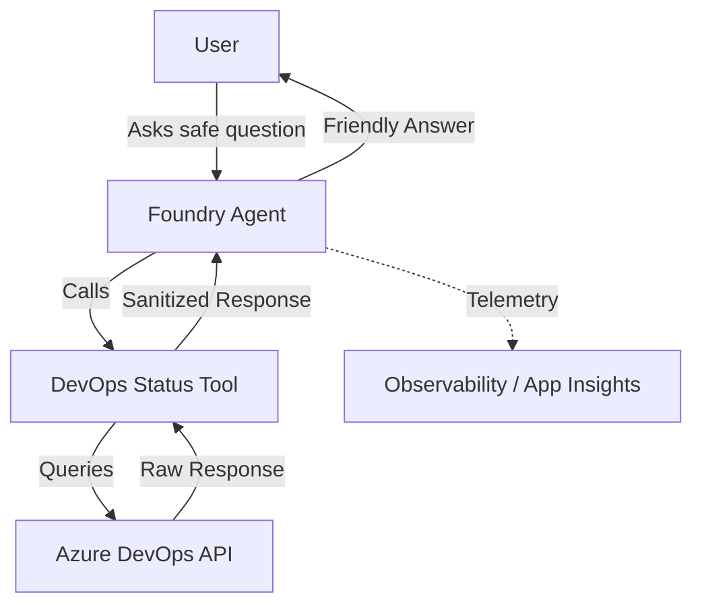
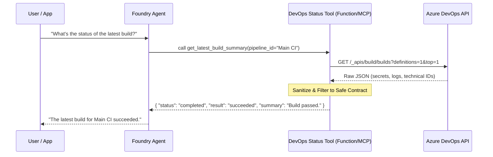

# Foundry DevOps Status Agent Reference

## Scenario

A senior Azure AI Foundry engineer and Python developer needs to implement a bounded reference solution for a Foundry agent. This agent answers safe questions about Azure DevOps pipeline and build status through a controlled, read-only tool boundary.

The agent helps developers and managers get quick status updates without needing to navigate the Azure DevOps UI for every question, while ensuring no sensitive data or mutation capabilities are exposed.

## Composed blocks

- [Pipeline Assistant Foundry](../../building-blocks/agents/pipeline-assistant-foundry/README.md): Foundry agent reference for customer questions about a pipeline execution.
- [DevOps MCP Tool Contract](../../building-blocks/mcp/devops-mcp-tool-contract/README.md): Safe read-only DevOps status tool contracts for AI agents.

## Architecture



## Service-Level Flow



## Tool Patterns: Function vs. MCP vs. Azure Function

In this repository, we demonstrate three patterns for connecting agents to tools:

1.  **Direct Function Calling (src/agent_definition.py)**: Best for simple, stateless tools where the application code handles the integration directly. This solution uses this pattern for its minimal reference.
2.  **Azure Functions Tool Boundary**: Best for long-running tasks or when the tool requires its own independent scaling and security boundary.
3.  **Model Context Protocol (MCP)**: Best for standardized, reusable tools that can be shared across multiple agents or frameworks. This solution aligns with the `devops-mcp-tool-contract`.

## Entrypoints

- **SDK Invocation**: The agent is designed to be invoked using the `AIProjectClient` from the `azure-ai-projects` SDK.

## Customer-facing outcome

- Users can ask natural language questions about pipeline health and get accurate, grounded answers.
- Friendly business-level summaries of successes or failures are provided.
- Direct links to the Azure DevOps portal are included for further investigation.

### Example Safe Questions
- "What is the status of the latest build for the 'Main CI' pipeline?"
- "Did the deployment to production succeed on the 'release/1.2' branch?"
- "List the last 5 runs for the 'Unit Tests' pipeline."
- "Why did the most recent build fail?" (Agent answers using sanitized summary).

## Security and Tool Boundary

To ensure a safe integration, the following boundaries are strictly enforced through exactly one read-only DevOps status contract.

### Sanitized Status Fields (Safe Contract)
- **Status**: `inProgress`, `completed`, `queued`.
- **Result**: `succeeded`, `failed`, `canceled`, `partiallySucceeded`.
- **Metadata**: Pipeline name, branch name, commit short SHA (e.g., `a1b2c3d`).
- **Timing**: Start time, end time, duration.
- **Summaries**: Friendly business-level summaries (e.g., "Step 'Build' failed on agent 'Linux-01'.").
- **Links**: Sanitized URLs to the Azure DevOps portal.

### Forbidden (Boundary)
- **No Mutations**: The agent cannot trigger, cancel, or modify any pipelines or builds.
- **No Secrets**: No access to Azure DevOps variables marked as secret, PATs, or other credentials.
- **No Raw Logs**: Technical logs and full stack traces are withheld to prevent technical internal exposure.
- **No Broad Access**: Access is scoped to specific projects; the agent cannot perform unbounded organization discovery.
- **No Arbitrary API Passthrough**: All DevOps interactions must follow the predefined tool contract.

## Deployment / IaC Decision

**No-IaC Decision**: This reference solution does not include Terraform/OpenTofu.
- The Foundry Agent is a configuration-first resource (Prompt Agent) typically managed via SDK or CLI.
- The underlying Azure DevOps integration assumes an existing DevOps organization and project.
- This solution composes existing building blocks that may have their own infra, but the agent itself is a reference for instruction and tool definition.

## Local Validation

```bash
python --version
ruff check src/
ruff format --check src/
pytest tests/
```

## References

- [Microsoft Learn: Foundry Agent Service Overview](https://learn.microsoft.com/en-us/azure/foundry/agents/overview)
- [Microsoft Learn: Foundry Agent Tool Catalog](https://learn.microsoft.com/en-us/azure/foundry/agents/concepts/tool-catalog)
- [Microsoft Learn: Function calling with Foundry agents](https://learn.microsoft.com/en-us/azure/foundry/agents/how-to/tools/function-calling)
- [Microsoft Learn: Azure DevOps REST API Reference](https://learn.microsoft.com/en-us/rest/api/azure/devops/)
- [Microsoft Learn: Azure Pipelines Documentation](https://learn.microsoft.com/en-us/azure/devops/pipelines/)
