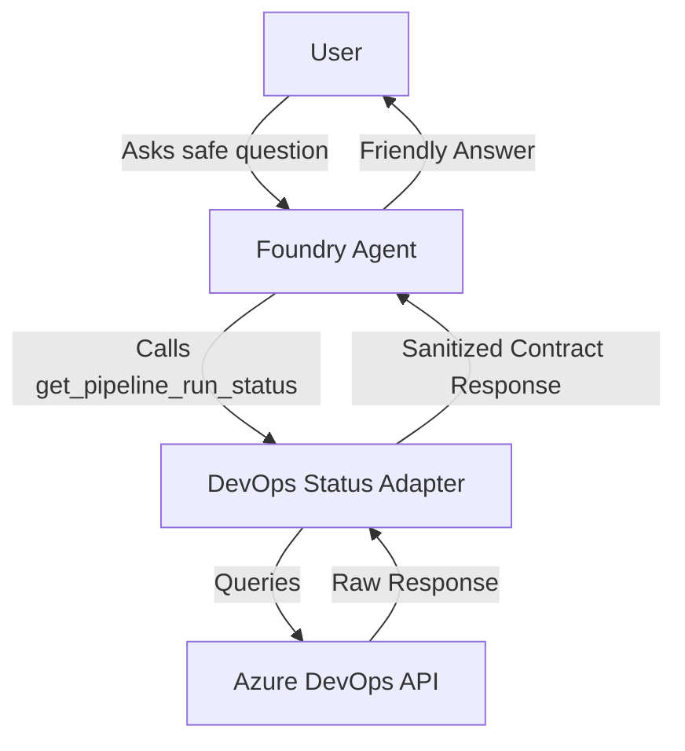
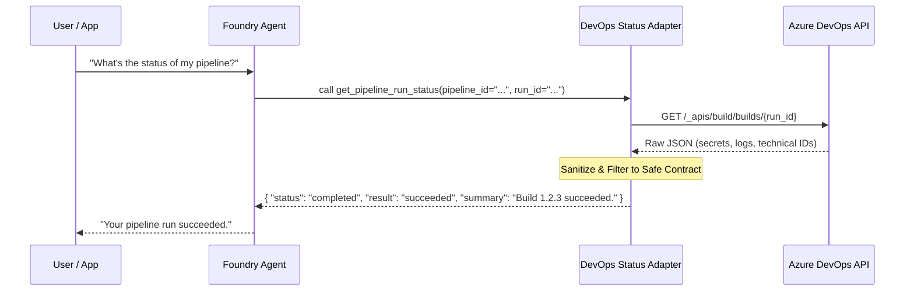

# Foundry DevOps Status Agent Reference

## Scenario

A senior Azure AI Foundry engineer and Python developer needs to implement a bounded reference solution for a Foundry agent. This agent answers safe questions about Azure DevOps pipeline and build status through a controlled, read-only tool boundary.

The agent helps developers and managers get quick status updates without needing to navigate the Azure DevOps UI for every question, while ensuring no sensitive data or mutation capabilities are exposed.

## Composed blocks

- [Foundry Agent with Tools](../foundry-agent-with-tools/README.md): Foundry agent runtime pattern for customer questions.
- [DevOps Status Adapter](../../building-blocks/mcp/devops-status-adapter/README.md): Controlled read-only Azure DevOps adapter.
- [DevOps MCP Tool Contract](../../building-blocks/mcp/devops-mcp-tool-contract/README.md): Shared contract for DevOps status tools.

## Architecture



## Service-Level Flow



## Entrypoints

- **CLI**: `python3 -m solutions.foundry-devops-agent-basic.src.main`
- **SDK Invocation**: `FoundryDevOpsAgentAdapter` in `src/adapter.py`.

## Environment Variables

| Variable | Description | Example |
|----------|-------------|---------|
| `AZURE_AI_PROJECT_ENDPOINT` | Azure AI Project API endpoint | `https://<res>.ai.azure.com/api/projects/<id>` |
| `AZURE_AI_AGENT_NAME` | Name of the Foundry agent | `devops-status-agent` |
| `AZURE_AI_MODEL_NAME` | Model deployment name | `gpt-4o` |
| `AZURE_DEVOPS_PAT` | Personal Access Token | `your-pat` |
| `AZURE_DEVOPS_ORG_URL` | Organization URL | `https://dev.azure.com/my-org` |
| `AZURE_DEVOPS_PROJECT` | Project name or ID | `my-project` |
| `AZURE_DEVOPS_PIPELINE_ID` | Default pipeline ID for scope | `my-pipeline` |
| `AZURE_DEVOPS_RUN_ID` | Default run ID for scope | `12345` |

## Deployment / IaC Decision

**IaC Decision**: This solution includes Terraform for the Azure-side AI Foundry resources.
- See [infra/terraform/README.md](infra/terraform/README.md) for details.
- Azure DevOps resources and tokens are treated as external inputs.

## Local Validation

```bash
# Verify Python version
python --version

# Run linting and formatting checks
ruff check src/
ruff format --check src/

# Run tests
pytest tests/

# Validate Terraform
cd infra/terraform
terraform init -backend=false
terraform validate
```

## Security and Privacy

- **Read-Only**: The agent only uses read-only tools and cannot trigger or modify pipelines.
- **Scope Restriction**: The adapter is hard-coded to a specific scope (organization, project, pipeline, run) to prevent unauthorized discovery.
- **Sanitization**: All raw DevOps responses are mapped to a strict, customer-safe Pydantic model (defined in the MCP contract) before reaching the agent.
- **No Secrets**: Secrets and tokens are never logged, stored in code, or returned to the agent.

## References

- [Microsoft Learn: Foundry Agent Service Overview](https://learn.microsoft.com/en-us/azure/foundry/agents/overview)
- [Microsoft Learn: Foundry Agent Tool Catalog](https://learn.microsoft.com/en-us/azure/foundry/agents/concepts/tool-catalog)
- [Microsoft Learn: Azure DevOps REST API Reference](https://learn.microsoft.com/en-us/rest/api/azure/devops/)
