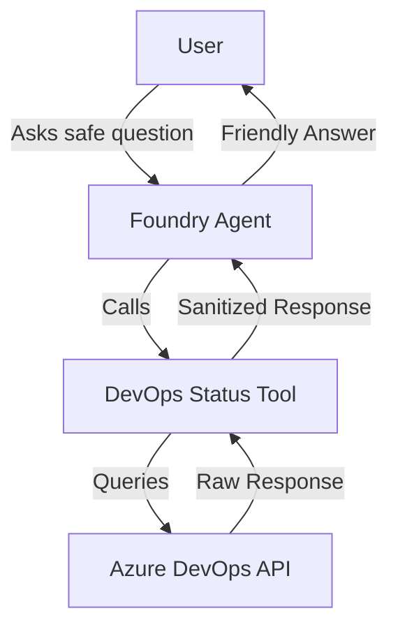
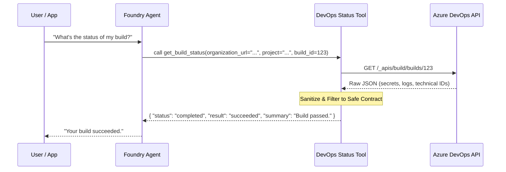

# Foundry DevOps Status Agent Reference

## Scenario

A senior Azure AI Foundry engineer and Python developer needs to implement a bounded reference solution for a Foundry agent. This agent answers safe questions about Azure DevOps pipeline and build status through a controlled, read-only tool boundary.

The agent helps developers and managers get quick status updates without needing to navigate the Azure DevOps UI for every question, while ensuring no sensitive data or mutation capabilities are exposed.

## Composed blocks

- [Foundry Agent with Tools](../foundry-agent-with-tools/README.md): Foundry agent runtime pattern for customer questions.
- [DevOps Status Tool](../../building-blocks/functions/devops-status-tool/README.md): Safe read-only DevOps status tool for Azure DevOps Builds API.

## Architecture



## Service-Level Flow



## Entrypoints

- **CLI**: `python3 -m solutions.foundry-devops-agent-basic.src.main`
- **SDK Invocation**: `FoundryDevOpsAgentAdapter` in `src/adapter.py`.

## Environment Variables

| Variable | Description | Example |
|----------|-------------|---------|
| `AZURE_AI_PROJECT_ENDPOINT` | Azure AI Project API endpoint | `https://<res>.ai.azure.com/api/projects/<id>` |
| `AZURE_AI_AGENT_NAME` | Name of the Foundry agent | `devops-status-agent` |
| `AZURE_AI_MODEL_NAME` | Model deployment name | `gpt-4o` |
| `AZURE_DEVOPS_PAT` | Personal Access Token | `your-pat` |
| `AZURE_DEVOPS_ORG_URL` | Organization URL | `https://dev.azure.com/my-org` |
| `AZURE_DEVOPS_PROJECT` | Project name or ID | `my-project` |
| `AZURE_DEVOPS_BUILD_ID` | Default build ID for test | `12345` |

## Deployment / IaC Decision

**No-IaC Decision**: This reference solution does not include Terraform/OpenTofu.
- The Foundry Agent is a configuration-first resource (Prompt Agent) typically managed via SDK or CLI.
- This solution composes existing runtimes and consumes pre-existing Foundry/Azure DevOps resources; it does not introduce new Azure resources.

## Local Validation

```bash
# Verify Python version
python --version

# Run linting and formatting checks
ruff check src/
ruff format --check src/

# Run tests (requires pytest-mock)
pytest tests/
```

## References

- [Microsoft Learn: Foundry Agent Service Overview](https://learn.microsoft.com/en-us/azure/foundry/agents/overview)
- [Microsoft Learn: Foundry Agent Tool Catalog](https://learn.microsoft.com/en-us/azure/foundry/agents/concepts/tool-catalog)
- [Microsoft Learn: Azure DevOps REST API Reference](https://learn.microsoft.com/en-us/rest/api/azure/devops/)
