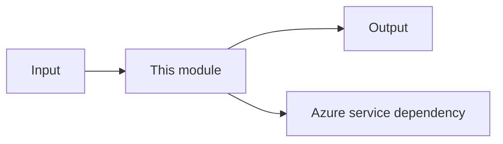

# New Building Block

## Purpose

Describe the reusable Azure module in 1-2 sentences.

## Architecture Diagram



## Inputs/Outputs

- **Inputs**: TBD
- **Outputs**: TBD

## Azure Resources

- TBD

## Local Run

```bash
# TBD: Provide exact commands
```

## Deploy

```bash
# TBD: Provide deployment commands (e.g., azd up, terraform apply)
```

## Tests/Validation

```bash
# TBD: Provide validation commands
```

## Known Limits

- TBD
