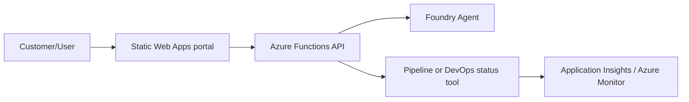

# New Solution

## Scenario

Describe the customer/process scenario.

## Architecture Diagram

## Composed Blocks

- TBD (list from `building-blocks/`)

## Entrypoints

- **Manual**: TBD
- **Automatic**: TBD

## Customer Outcome

- TBD

## Deployment Assumptions

- TBD

## Local/Demo Flow

- TBD
